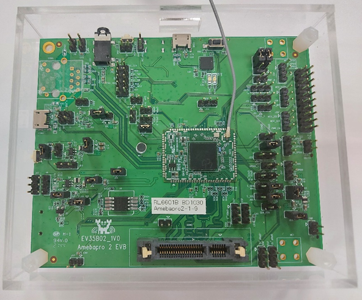

Image Tool
==========

.. contents::
  :local:
  :depth: 2

Introduction
------------

This chapter introduces how to use Image Tool to generate and download
images. The image tool - uartfwburn can be found in tools folder and it
has the following functions:

(1) Download image to an AmebaPro2 device through UART.

Download Environment Setup
--------------------------

Hardware Setup
~~~~~~~~~~~~~~

To download image, the device must to be booted as download mode. Users
need to first set up the UART with PC by connecting J21 with jumpers and
CON8 with PC. Then, connect J27 with a jumper and press reset button to
enter download mode.

Software Setup
~~~~~~~~~~~~~~

-  PC environment requirements: Windows 7 above with FT232 driver.

-  uartfwburn tool

Image Download
--------------

User can download the image to demo board by following steps:

(1) Boot AmebaPro2 into download mode

.. note :: You can check whether your board is in download mode by UART message:

.. code-block:: bash

   == Rtl8735b IoT Platform ==
   Chip VID: 0, Ver: 0
   ROM Version: v3.0
   Test Mode: boot_cfg1=0x0

   [test mode PG]
   test_mode_img_download
   Download Image over UART1[tx=4,rx=3] baud=115200

.. Caution :: Remember to disconnect log UART console before downloading image

(2) Execute uartfwburn tool through command mode

Command line image tool for NOR flash
-------------------------------------

Command line image tool supports Windows, Linux and MacOS platforms:

-  Windows: uartfwburn.exe

-  Linux: uartfwburn.linux

-  MacOS: uartfwburn.darwin

.. note :: boot_recover.bin & flash_loader_nor.bin & flash_control_info.bin needs to be placed in the same folder as uartfwburn tool

Normal PG mode
~~~~~~~~~~~~~~

Write whole image to NOR flash, run command:

.. code-block:: bash

   uartfwburn -p <COM_PORT> -f flash_ntz.bin -b 3000000 -U

.. note :: MacOS: <COM_PORT> use /dev/cu.xxxxx

If success, command will print: nor download success

Partial image PG mode
~~~~~~~~~~~~~~~~~~~~~

To set the offset and write part of the image to NOR flash, run the
command:

.. code-block:: bash

   uartfwburn -p <COM_PORT> -f XXX.bin -b 3000000 –s 0x100000 -U

-s [offset]: image download offset(hex, eg, 0x100000)

.. note :: Offset address needs to be 64K byte aligned.

Command line image tool for NAND flash
--------------------------------------

Command line image tool supports Windows, Linux and MacOS platforms:

-  Windows: uartfwburn.exe

-  Linux: uartfwburn.linux

-  MacOS: uartfwburn.darwin

.. note :: boot_recover.bin & flash_control_info.bin needs to be placed in the same folder as uartfwburn tool

Normal PG mode
~~~~~~~~~~~~~~

Write whole image to NAND flash, run command:

.. code-block:: bash

   uartfwburn -p <COM_PORT> -f flash_ntz.bin -b 3000000 -n pro2

.. note :: MacOS: <COM_PORT> use /dev/cu.xxxxx

If success, command will print: nand download success

Partial image PG mode
~~~~~~~~~~~~~~~~~~~~~

Write partial image to NAND flash, run command:

.. code-block:: bash

   uartfwburn -p <COM_PORT> -f flash_ntz.bin -b 3000000 -n pro2 -t 0x81cf

-t [type_id] : pro2 nand flash partial image download, refer to the table below.

============== ================ ===========
**Short name** **Size (Bytes)** **Type ID**
============== ================ ===========
PT_KEY_CER1    2                0xe9c2
PT_BL_BRI      2                0xd1c5
PT_FW1         2                0xc1c7
PT_FW2         2                0xb9c8
PT_ISP_IQ      2                0x89c1
PT_NN_MDL      2                0x81cf
============== ================ ===========

.. note :: If success, command will print: nand download success

FTL user data PG mode
~~~~~~~~~~~~~~~~~~~~~

Write FTL user data to NAND flash, run command:

.. code-block:: bash

   uartfwburn -p <COM_PORT> -f user.bin -b 3000000 -n pro2 -w 800 950

-w [block_s] [block_bs] : pro2 nand FTL write, block_s is block start, block_bs is block backup start.

.. note :: If success, command will print: nand download success
