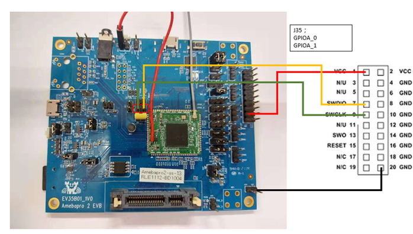
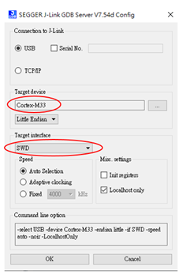
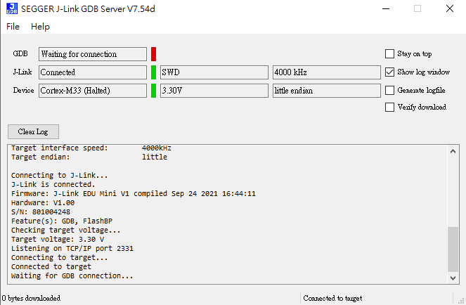
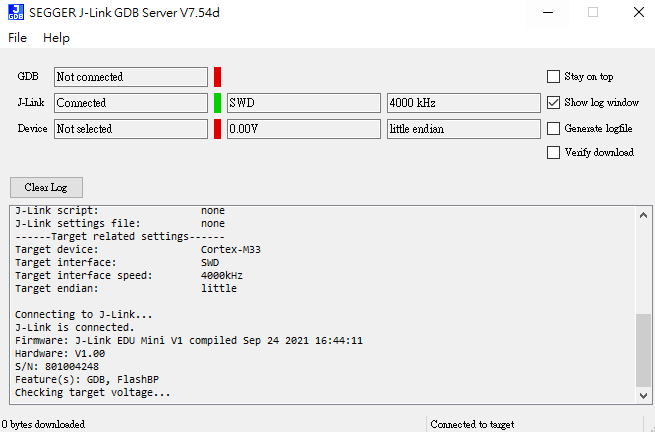

Using JTAG/SWD to debug
=======================

.. contents::
  :local:
  :depth: 2

JTAG/SWD is a universal standard for chip internal test. The external
JTAG interface has four mandatory pins, TCK, TMS, TDI and TDO, and an
optional reset, nTRST, JTAG-DP and SW-DP also require a separate
power-on reset: nPOTRST. The external SWD interface requires two pins:
bidirectional SWDIO signal and a clock, SWCLK, which can be input or
output from the device.

SWD connection
--------------

AmebaPro2 supports J-Link debugger. We need to connect the SWD connector
to J-Link debugger. The SWD connection is shown as below. After finished
these configurations, please connect it to PC side. Note that if you are
using Virtual Machine as your platform, please make sure the USB
connection setting between VM host and client is correct so that the VM
client can detect the device.

.. note ::  -  EVB 1V0 module needs to HW rework, ask FAE for details

.. note ::  -  To be able to debugger AmebaPro2 which is powered by Cortex-M33, user needs a J-Link debugger with the latest hardware version (Check https://wiki.segger.com/Software_and_Hardware_Features_Overview for details). J-Link EDU with hardware version V10 is used to prepare this document

Software installation
---------------------

To be able to use J-Link debugger, user needs install J-Link GDB server
first. For Windows, please check http://www.segger.com and download
"J-Link Software and Documentation Pack"
(https://www.segger.com/downloads/jlink).

Setup environment
-----------------

To check whether the connection works fine, user can go to the location
of SEGGER J-Link tool and run "JLinkGDBServer.exe". Choose target device
Cortex-M33 (for AmebaPro2), and target interface SWD. Click "OK"

If connection succeeds, J-Link GDB server must show as below:

If connection fails, J-Link GDB will show:

