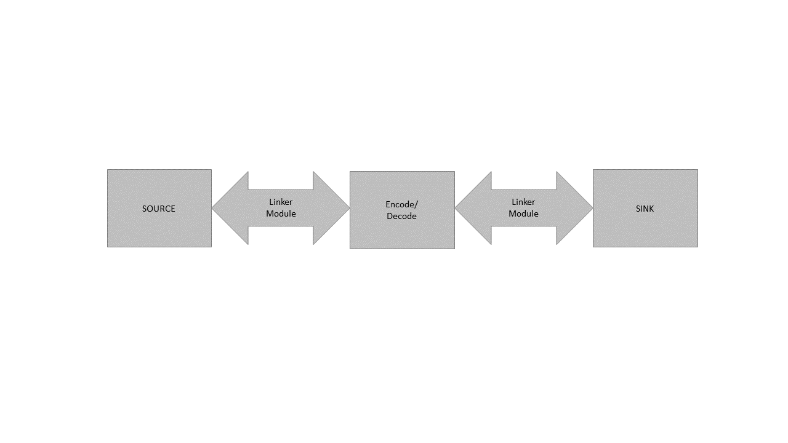

Multimedia Framework Architecture
=================================

.. contents::
  :local:
  :depth: 2

The Multimedia Framework Architecture is responsible
for handling the connection and management of different media resources
on AmebaPro2.

Architecture
------------

The structure of MMF is as shown in the following chart and there are
two important entities in the MMF, **MM_MODULE** and
**LINKER_MODULE**:

**MM_MODULE** includes the media source, sink and the codec modules.

-  Source module: produce resource, it can be the file input,
   microphone, camera, or storage.

-  Codec module: mainly provide the audio codec, AAC, G711 or opus for
   customers to do audio encode or decode before sending streaming to
   sink module. In the mp4 module, it will automatically send the result
   into storage, SD card or ram disk.

-  Sink module: consume resource from the source modules or after
   encoded/decoded by codec modules, like RTSP or other steaming.

.. note :: The video modules uses VOE to contain the process of sensor catching, ISP and video encoding algorithms (jpeg, H264, HEVC (H265)…).

**LINKER_MODULE** connect different type of module and deal with inter
module communication, included siso, simo, miso and mimo.

|

In order to use the MMF, here are some aspects must to be followed.

-  Define valid source

-  Define valid sink

-  Define valid codec (encode/decode) if needed.

-  Define valid linker modules to link the above media modules.

The following picture shows the main usage flow to initialize different
**MM_MODULE**, and connect different **MM_MODULE** through
**LINKER_MODULE**.

MM_Module Prototype 
~~~~~~~~~~~~~~~~~~~~

MMF allows users to define customized source, sink and encoder/decoder
modules depending on the application. Although implementation details
may be different, basic rules of the MMF structure are similar.

The MMF requires users to predefine both source and sink modules
through implementing create, destroy, control, handle, new_item,
del_item and rsz_item function callbacks. The structure mmf_module_t
provides the interface for communication between mmf modules. In order
to maintain the flexibility and convenience between modules, modules
only retain the interface of each type to provide module to access.
Function’s constant of each module is defined by module itself.

.. code-block:: c

   typedef struct mm_module_s {
       void*       (*create)(void *);
       void*       (*destroy)(void *);
       int         (*control)(void *, int, int);
       int         (*handle)(void *, void *, void *);
       void*       (*new_item)(void *);
       void*       (*del_item)(void *, void *);
       void*       (*rsz_item)(void *, void *, int);
       void*       (*vrelease_item)(void *, void *, int);

       uint32_t    output_type;
       uint32_t    module_type;
       char *      name;
   } mm_module_t;

|

Function description
^^^^^^^^^^^^^^^^^^^^

-  create

Pointer to the function that loads and initializes the module that you
wish to add. For example, for Audio source, it points to the function in
which the Audio driver is initialized and the corresponding context is
returned.

-  destroy

Pointer to the function that de-initializes module instance and releases
resource. For example, for Audio source, it points to function in which
Audio driver is initialized and the corresponding context is released.

-  control

Pointer to function that sends the control command to the MMF module
layer (see **mm_module_ctrl**) or a specific module. For example, for
Audio source, it points to function that controls Audio parameters
("sample rate", "word length", "mic gain", etc.) and MMF service task
on or off.

-  handle

Pointer to the function that manipulates media data (how to produce data
in source or how to consume data in sink). Data is transferred from
source to sink and vice versa by means of OS message queue. Please note
that MMF service task reacts differently based on message exchange
buffer status.

-  new_item

Pointer to the function that creates queue item that will be send to
input and output queue, will only be used when setting
MM_CMD_INIT_QUEUE_ITEMS to MMQI_FLAG_STATIC.

-  del_item

Pointer to the function that destroys queue item, will only be used when
setting MM_CMD_INIT_QUEUE_ITEMS to MMQI_FLAG_STATIC.

-  rsz_item

Pointer to the function decreases memory pool size, will only be used
when video (H264, HEVC (H265)…) and AAC module is created.

-  output_type and module_type

Output_type indicates output mode. There are MM_TYPE_NONE, MM_TYPE_VSRC,
MM_TYPE_ASRC, MM_TYPE_VDSP, MM_TYPE_ADSP, MM_TYPE_VSINK, MM_TYPE_ASINK,
and MM_TYPE_AVSINK can be used, corresponding to different module usage
scenarios, let application know which mode the output is. module_type
represents the identity of the module, and there are three options can
be used MM_MASK_SRC, MM_MASK_DSP and MM_MASK_SINK.

-  name

Pointer to the module name.

mm_module_ctrl
^^^^^^^^^^^^^^

Here lists some commands defined in MMF module layer. Call by
mm_module_ctrl (mm_context_t \*ctx, int cmd, int arg) to use them.

-  MM_CMD_INIT_QUEUE_ITEMS: initialize static queue item.

-  MM_CMD_SET_QUEUE_LEN: Set one queue's length.

-  MM_CMD_SET_QUEUE_NUM: Set number of queue, not more than 3.

-  MM_CMD_SELECT_QUEUE: select queue from multi queues.

-  MM_CMD_CLEAR_QUEUE_ITEMS: clear queue item.

Context
~~~~~~~

MMF context supplies message transfer between different modules. It
contains mm_module_t, and queue that used to pass data. There are 6
types of status that mm_context support (MM_STAT_INIT, MM_STAT_READY,
MM_STAT_ERROR, MM_STAT_ERR_MALLOC, MM_STAT_ERR_QUEUE,
MM_STAT_ERR_NEWITEM), these status are responsible for maintaining the
module state to ensure the program runs smoothly.

.. code-block:: c

   typedef struct mm_contex_s {
       union {
           struct {
               xQueueHandle output_ready;
               xQueueHandle output_recycle;
               int32_t item_num;
           };
           mm_conveyor_t port[4];
       };

       mm_module_t* module;

       void* priv; // private data structure for created instance

   // module state
       uint32_t state;
       int32_t queue_num; // number of queue
       int32_t curr_queue;
   } mm_context_t;

The mm_context is responsible for maintaining each module entity. MMF
support these modules (video, AAC_encoder, AAC_decoder, audio, g711,
opus, mp4, rtp, rtsp) by default. Each module is independent and
corresponding to the individual input/ output queue, state and in the
mm_context of the module to update parameters and delivery entities.

Module Inter Connection
~~~~~~~~~~~~~~~~~~~~~~~

This section introduces mm_siso_t, mm_simo_t, mm_miso_t, mm_mimo_t and
its corresponding create, delete, ctrl, start, stop, pause, resume
function, which is responsible for connection and control between
modules in mmf.

SISO module (Single Input Single Output)
^^^^^^^^^^^^^^^^^^^^^^^^^^^^^^^^^^^^^^^^

The SISO module is a unidirectional interface between modules. Input and
output are independent. The status of the SISO module is responsible for
determining the correct process. The stack_size is used to determine the
size of the handler, while xTaskHandle task, task_priority and taskname
are reserved to control the use of the task, task priority and task
name.

.. code-block:: c

   typedef struct mm_siso_s {
       mm_context_t *input;
       mm_context_t *output;
       int input_port_idx; // default is 0, can be set to 1 or 2 or 3 if source module support 2 or more output queue

       uint32_t status;
       uint32_t stack_size;
       uint32_t task_priority;
       char taskname[16];
       xTaskHandle task;
   } mm_siso_t;

There are some functions in the SISO module responsible for the module
inter-connection. By these functions, it will be simple to update the
status of the task and are handed over to the task handler for the main
processing:

-  siso_create

Pointer to the function that siso_create declares the space of mm_siso_t
and returns mm_siso_t entity after initialization.

-  siso_delete

Pointer to the function that stops SISO execution and free space of
mm_siso_t entity.

-  siso_ctrl

Pointer to the function that sends the control command to siso module.

- MMIC_CMD_ADD_INPUT link the input module to the input of the sisomodule.

- MMIC_CMD_ADD_OUTPUT link the output module to the output of the sisomodule.

- MMIC_CMD_SET_TASKPRIORITY set the task priority for the linker task. If setting as 0, it will be configured to tskIDLE_PRIORITY + 1 automatically.

- MMIC_CMD_SET_TASKNANE set the task names for the linker task.

- MMIC_CMD_SET_STACKSIZE add size to the stack_size of siso.

.. note ::  For consistency, the setting task size will be divided by 4. Make sure setting an enough and valid stack_size for the task.

-  siso_start

Pointer to the function that checks whether there is anything in the
input and output module before siso start. If the answer is yes, siso
task will create a task handler to send data from input module to the
output module.

-  siso_stop

Pointer to the function that updates status to MMIC_STAT_SET_EXIT and
wait for task handler to switch status to MMIC_STAT_EXIT.

-  siso_pause

Pointer to the function that updates status to MMIC_STAT_SET_PAUSE and
wait for task handler to switch status to MMIC_STAT_PAUSE.

-  siso_resume

Pointer to the function that updates status to MMIC_STAT_SET_RUN and
wait for the task handler to switch status to MMIC_STAT_RUN.

SIMO module (Single Input Multiple Output)
^^^^^^^^^^^^^^^^^^^^^^^^^^^^^^^^^^^^^^^^^^

The SIMO module is a unidirectional interface between modules. Input and
output are independent, and output_cnt represents the number of
simultaneous output modules. The array – status[4] maintains the state
of the SIMO module to check the process is correct in the middle of the
transfer, stack_size is used to determine the size of the handler task
for intermediate transfers. Similarly, it also provides xTaskHandle
task, task_priority, taskname for xTaskCreate. Note that each output
will be served by one unique task and pause mask will control which
output will be blocked.

.. code-block:: c

   typedef struct mm_simo_s {
       mm_context_t *input;
       int output_cnt;
       mm_context_t *output[4]; 
	   
	   // internal queue to handle reference count and usage log
       mm_simo_queue_t queue;

       uint32_t pause_mask;
       uint32_t status[4];;
       uint32_t stack_size;
       uint32_t task_priority;
       char taskname[4][16];
       xTaskHandle task[4];
   } mm_simo_t;

There are some functions in the SIMO module responsible for the module
inter-connection. By these functions, it will be simple to update the
status of the task and are handed over to the task handler for the main
processing:

-  simo_create

Pointer to the function that simo_create declares the space of mm_simo_t
entity and returns mm_siso_t after initialization, and simo_create crate
a queue head and a queue lock to protect the results of multiple
outputs.

-  simo_delete

Pointer to the function that calls simo_stop() to stop SIMO execution
and free space.

-  simo_ctrl

Pointer to the function that sends the control command to simo module.

MMIC_CMD_ADD_INPUT link the input module to the input of the simo
module.

MMIC_CMD_ADD_OUTPUT0, MMIC_CMD_ADD_OUTPUT1, MMIC_CMD_ADD_OUTPUT2,
MMIC_CMD_ADD_OUTPUT3 link output module to the corresponding output and
increase the output_cnt to record number of output modules.

MMIC_CMD_SET_TASKPRIORITY set the task priority for the linker task. If
setting as 0, it will be configured to tskIDLE_PRIORITY + 1
automatically.

MMIC_CMD_SET_TASKNANEx set the task names for the linker task
corresponding to MMIC_CMD_ADD_OUTPUTx (x = 0~3).

MMIC_CMD_SET_STACKSIZE add size to simo stack_size.

.. note ::  For consistency, the setting task size will be divided by 4 and it means each task will only have task_size/4 for task stack size. Make sure setting an enough and valid stack_size for the task.

-  simo_start

Pointer to the function that simo_start will create corresponding number
of task handlers based on simo -> output_cnt, and each task handler will
be used to send the received data.

-  simo_stop

Pointer to the function that simo_stop sets each simo status to
MMIC_STAT_SET_EXIT,and waits for the task handler to switch each status
to MMIC_STAT_EXIT.

-  simo_pause

Pointer to the function that simo_pause will set each simo -> status to
MMIC_STAT_SET_PAUSE according to pause_mask, and wait for the task
handler to switch each status to MMIC_STAT_PAUSE.

-  simo_resume

Pointer to the function that simo_resume will set each simo -> status to
MMIC_STAT_SET_RUN, and wait for the task handler to switch each status
to MMIC_STAT_RUN.

MISO module (Multiple Input Single Output)
^^^^^^^^^^^^^^^^^^^^^^^^^^^^^^^^^^^^^^^^^^

The MISO module is a unidirectional interface between modules. Input and
output are independent, and input_cnt represents the number of
simultaneous input modules. The status maintains the state of the MISO
module to check the process is correct in the middle of the transfer,
stack_size is used to determine the size of the handler task for
intermediate transfers, and finally the xTaskHandle task, task_priority
and taskname are reserved for xTaskCreate to control the use of the
task. The pause_mask can be controlled to block the inputs or the single
output.

.. code-block:: c

    typedef struct mm_miso_s {
            int          input_cnt;
            mm_context_t *input[4];  // max 4 input
            int          input_port_idx[4];

            mm_context_t *output;

            uint32_t    pause_mask;
            uint32_t    status;
            uint32_t    stack_size;
            uint32_t    task_priority;
            char        taskname[16];
            xTaskHandle task;
    } mm_miso_t;

There are some functions in the MISO module responsible for the module
inter-connection. By these functions, it will be simple to update the
status of the task and are handed over to the task handler for the main
processing:

-  miso_create

Pointer to the function that space of mm_miso_t is declared in
miso_create and initialized to return mm_miso_t entity.

-  miso_delete

Pointer to the function that calls miso_stop() to stop MISO and free
space.

-  miso_ctrl

Pointer to the function that sends the control command to miso module.

MMIC_CMD_ADD_INPUT0, MMIC_CMD_ADD_INPUT1, MMIC_CMD_ADD_INPUT2,
MMIC_CMD_ADD_INPUT3 couple input modules to the corresponding miso input
and increase the value of input_cnt for number of input module.

MMIC_CMD_ADD_OUTPUT links the output module to the output of the miso
module.

MMIC_CMD_SET_TASKPRIORITY set the task priority for the linker task. If
setting as 0, it will be configured to tskIDLE_PRIORITY + 1
automatically.

MMIC_CMD_SET_TASKNANE set the task names for the linker task.

MMIC_CMD_SET_STACKSIZE add size to miso stack_size.

.. note ::  For consistency, the setting task size will be divided by 4. Make sure setting an enough and valid stack_size for the task.

-  miso_start

Pointer to the function that checks whether there is anything in the
input and output module before starting. If the answer is yes, a task
handler will be created, and the data of the input module will be sent
to the output module.

-  miso_stop

Pointer to the function that sets the miso status to MMIC_STAT_SET_EXIT
and wait for the task handler to switch the status to MMIC_STAT_EXIT.

-  miso_pause

Pointer to the function that miso_pause will set miso -> status to
MMIC_STAT_SET_PAUSE according to pause_mask, waiting for the task
handler to switch status to MMIC_STAT_PAUSE.

-  miso_resume

Pointer to the function that miso_resume will set miso -> status to
MMIC_STAT_SET_RUN, waiting for the task handler to switch each status to
MMIC_STAT_RUN.

MIMO module (Multiple Input Multiple Output)
^^^^^^^^^^^^^^^^^^^^^^^^^^^^^^^^^^^^^^^^^^^^

The MIMO module is a unidirectional interface between modules, Input[4]
and output[4] represent input and output modules respectively, and
input_cnt represents the number of simultaneous input modules. Input and
output support up to 4 outputs at the same time, MIMO module also needs
mm_mimo_queue_t queue[4] to maintain the synchronization problem of each
input queue. Each mm_mimo_queue_t has a lock and head to record the
beginning of each queue and whether a program is already in use. The
array, status[4], maintains the state of the MIMO module to determine
the correct process in the middle of the transfer, stack_size is used to
determine the size of the handler task for the intermediate transfer,
and the xTaskHandle task of xTaskCreate is reserved to control the use
of the task. The array, pause_mask[4], is used to control the input or
output streaming for each task.

.. code-block:: c

    typedef struct mm_mimo_s {
            int                 input_cnt;

        // depend on intput count
            mm_context_t*       input[4];
            mm_mimo_queue_t     queue[4];

            int                 output_cnt;

        // depend on output count
            uint32_t            pause_mask[4];
            mm_context_t*       output[4];     // output module context
            uint32_t            output_dep[4]; // output depend on which input, bit mask
            uint32_t            input_mask[4]; // convert from output_dep, input referenced by which output, bit mask
            uint32_t            status[4];
            uint32_t            stack_size;
            uint32_t            task_priority;
            char                taskname[4][16];
            xTaskHandle         task[4];
    } mm_mimo_t;

There are some functions in the MIMO module responsible for the module
inter-connection. By these functions, it will be simple to update the
status of the task and are handed over to the task handler for the main
processing:

-  mimo_create

Pointer to the function mimo_create declares the space of mm_mimo_t
entity and returns mm_mimo_t after initialization.

-  mimo_delete

Pointer to the function that calls mimo_stop() to stop the mimo module
and free space.

-  mimo_ctrl

Pointer to the function that sends the control command to miso module.

MMIC_CMD_ADD_INPUT0, MMIC_CMD_ADD_INPUT1, MMIC_CMD_ADD_INPUT2, and
MMIC_CMD_ADD_INPUT3 link input module to the input corresponding to the
mimo module and increase the value of input_cnt to record the number of
input modules.

MMIC_CMD_ADD_OUTPUT0, MMIC_CMD_ADD_OUTPUT1, MMIC_CMD_ADD_OUTPUT2, and
MMIC_CMD_ADD_OUTPUT3 couple the output module to the output of the mimo
module and increase the value of output_cnt to record the number of
output modules. The inputs corresponding to outputs modules can be set
by arg2 of mimo_ctrl using the union of MMIC_CMD_ADD_INPUTx.

MMIC_CMD_SET_TASKPRIORITY set the task priority for the linker task. If
setting as 0, it will be configured to tskIDLE_PRIORITY + 1
automatically.

MMIC_CMD_SET_TASKNANE set the task names for the linker task.

.. note ::  For consistency, the setting task size will be divided by 4 and it means each task will only have task_size/4 for task stack size. Make sure setting an enough and valid stack_size for the task.

-  mimo_start

Pointer to the function that mimo_start will generate corresponding task
handler according to output_cnt to transfer the received data.

-  mimo_stop

Pointer to the function that mimo_stop will set the mimo status to
MMIC_STAT_SET_EXIT according to output_cnt, and waiting for the task
handler switch the status to MMIC_STAT_EXIT.

-  mimo_pause

Pointer to the function that miso_pause will set each mimo -> status to
MMIC_STAT_SET_PAUSE according to pause_mask, and waiting for the task
handler to switch status to MMIC_STAT_PAUSE.

-  mimo_resume

Pointer to the function that mimo_resume will set mimo -> status in the
task of MMIC_STAT_PAUSE for each status to MMIC_STAT_SET_RUN, and
waiting for the task handler to switch each status to MMIC_STAT_RUN.

MM_Module Type and Module Parameter
-----------------------------------

Video
~~~~~

The video module processes the data from sensor and outputs the video
streaming data for user.

Here shows the context of the video module.

.. code-block:: c

   typedef struct video_ctx_s {
       void *parent;

       hal_video_adapter_t *v_adp;
       void *mem_pool;

       video_params_t params;
       int (*snapshot_cb)(uint32_t, uint32_t);
       void (*change_parm_cb)(void *);
       video_state_t state;
   } video_ctx_t;

-  v_adp: Point to the video adapter which will use in the video
   process.

-  params: Basic parameters for the video module.

-  snapshot_cb: Set the callback function for snapshot, which will be
   called while doing snapshot. It could be set by using
   CMD_VIDEO_SNAPSHOT_CB.

Basic video module parameters setting
^^^^^^^^^^^^^^^^^^^^^^^^^^^^^^^^^^^^^

Presetting the voe_heap_size:

Use **CMD_VIDEO_SET_VOE_HEAP** to set up the heap size that will be used
in the voe process, including the output buffer for ISP (, snapshot) and
Encoder, before setting the video parameters.

Here are some video module parameters provided to set.

.. code-block:: c

   typedef struct video_param_s {
       uint32_t stream_id;
       uint32_t type;
       uint32_t resolution;
       uint32_t width;
       uint32_t height;
       uint32_t bps;
       uint32_t fps;
       uint32_t gop;
       uint32_t rc_mode;
       uint32_t jpeg_qlevel;
       uint32_t rotation;
       uint32_t out_buf_size;
       uint32_t out_rsvd_size;
       uint32_t direct_output;
       uint32_t use_static_addr;
       uint32_t fcs;
       uint32_t use_roi;
       struct video_roi_s {
           uint32_t xmin;
           uint32_t ymin;
           uint32_t xmax;
           uint32_t ymax;
       } roi;

   } video_params_t;

Use **CMD_VIDEO_SET_PARAMS** to set up the VIDEO parameters.

-  stream_id: Select the ISP channel, it can be set from 0~4.

-  type: Select the video encode type. Currently support HEVC
   (VIDEO_HEVC), H264 (VIDEO_H264), JPEG (VIDEO_JPEG), NV12
   (VIDEO_NV12), RGB (VIDEO_RGB), NV16 (VIDEO_NV16), HEVC+JPEG
   (VIDEO_HEVC_JPEG) and H264+JPEG (VIDEO_H264_JPEG).

-  resolution: Set the video frame resolution. Currently support
   VIDEO_QCIF (144*176), VIDEO_CIF (288*352), VIDEO_WVGA (360*640),
   VIDEO_VGA (480*640), VIDEO_D1 (480*720), VIDEO_HD (720*1280),
   VIDEO_FHD (1080*1920), VIDEO_3M (1536*2048), VIDEO_5M (1944*2592).

-  width: Set the video frame resolution’s width.

-  height: Set the video frame resolution’s height.

-  bps: Configure the video encoder’s bit rate (bits per second).

-  fps: Configure the video module output frame rate (frames per
   second).

-  gop: Set the group of the picture which can be seem as the cycle that
   I frame will update.

-  rc_mode: Determine use CBR (1) or VBR (2).

-  direct_output: If set 1, the video module output will not be sent to
   the video module output ready queue.

-  use_static_addr: If setting use_static_addr to 1, the output_item
   data address will directly point to the isp_addr; while setting to 0,
   it will allocate a new space for the output item address.

-  use_roi: If set 1, the video will be cropped according to roi
   parameter settings.

-  roi: If use_roi be set to 1, the original video will be cropped using
   the area defined by the four parameters (xmin, ymin, xmax, ymax), and
   then the cropped image will be resized according to the video frame
   resolution setting (width, height). For example, If set (xmin, ymin,
   xmax, ymax) to (0, 0, 800, 800), it will crop the top left corner of
   the image to a width of 800px and a height of 800px from the origin
   of video frame, and the cropped image will be scaled down to width x
   height according to resolution of video.

.. note ::  In VOE, OSD is applied after the cropped and resized image, so OSD size and offset are not affected by video cropping and resizing.

Video resolution alignment
^^^^^^^^^^^^^^^^^^^^^^^^^^

Encoder input width require 16 alignment and input height require 4
alignment, so video module will do width and height alignment
automatically. For example, if user set (width, height) to (1080,
1080), ISP will give 1088x1080 video frame to encoder. Then, encoder
will encode the data and crop to 1080x1080 as video module output.

ROI region parameters xmin, ymin, xmax, ymax should be 2 aligned and
within the maximum resolution of the sensor. In addition, the
roi_w(a.k.a. xmax-xmin) should no less than 16-aligned video_w
(a.k.a. 16-aligned width) and roi_h (a.k.a. ymax-ymin) should no less
than video_h(a.k.a. height), because the ROI only support scale down.
In other words, if user want a 1080x1080 output of video module and
require the usage of ROI, the ROI region width should >=1088 and ROI
region height should >=1080.

.. note ::  Sensor model and ISP will restrict the video resolution and fps. For the sensor’s max resolution and fps, please check the sensor list in ISP chapter. The ISP supported max resolutions for each channel are as followed:

-  *Ch0: 2704 x 1960*

-  *Ch1: 1920 x 1080*

-  *Ch2: 2592 x 1688*

-  *Ch4: 1280 x 720*

*Please confirm the selected width, height and fps of each video channel
are within the limits.*

*For VOE 1.4.3.0 and its later version, the ISP supported max resolution
for all channel is 2704 x 1960.*

Video scale up function
^^^^^^^^^^^^^^^^^^^^^^^

After VOE1.5.6.0, the scale up function is supported, but there are some
limitations: (1) Only ch0 can scale up. (2) All streams need to be closed
when setting the scale up function. (3) The maximum scale up resolution
cannot exceed twice the ROI resolution. (4) The maximum resolution is 
2688x1944. (5) The scale function supports ROI settings, but the ROI 
settings will be applied to all streams and do not support individual 
stream ROI settings.

Video resolution adjustment
^^^^^^^^^^^^^^^^^^^^^^^^^^^

Amebapro2 ISP support scaling down function with non-aspect ratio window
( it should be less than sensor output size). User can set 「use_roi」to
enable this function. Take example for 1080P sensor below:

.. code-block:: c

   typedef struct video_param_s {
       // …
       uint32_t width; // 640
       uint32_t height; // 480
       // …
       uint32_t use_roi;
       struct video_roi_s {
           uint32_t xmin; // 240
           uint32_t ymin; // 0
           uint32_t xmax; // 1679
           uint32_t ymax; // 1079
       } roi;
   } video_params_t;

Table 1-1 Image aspect ratio example image (full view)

Table 1-2 Image aspect ratio example image (partial view)

.. image:: ../_static/06_MMF/table1-2.png

VOE log show option adjustment 
^^^^^^^^^^^^^^^^^^^^^^^^^^^^^^^

Users can modify VOE log show option between video_init() and
video_deinit(). For normal mode, video_init() is included in opening
video module step. For FCS mode, video_init() is included in bootloader.

After video_init(), user can modify VOE log setting with following
command. Set enable = 0 to disable VOE log. Set enable = 1 to enable VOE
log.

.. code-block:: c

   video_ctrl(0, VIDEO_DEBUG, enable);

For normal booting, the VOE log is default enable in "video_api.c". To
disable VOE log, please set "--dbg 0" according to specific video codec
type

.. code-block:: bash

   int video_open(video_params_t *v_stream, output_callback_t output_cb, void *ctx)
   {
       …
       int ret = 0;
       if ((codec & (CODEC_HEVC | CODEC_H264)) != 0) {
           …
           ret = snprintf(cmd1, sizeof(cmd1), "%s %d %s -w %d -h %d -x %d -X %d -y %d -Y %d -r %d --mode %d --codecFormat %d %s --dbg 0 -i isp" // -x %d -y %d
           …

       }
       if ((codec & CODEC_JPEG) != 0) {
           …
           ret = snprintf(cmd2, sizeof(cmd2), "%s %d %s -w %d -h %d -x %d -X %d -y %d -Y %d -G %d -q %d --mode %d --codecFormat %d %s --dbg 0 -i isp"
           …
       }
       if ((codec & (CODEC_NV12 | CODEC_RGB | CODEC_NV16)) != 0) {
           …
           ret = snprintf(cmd3, sizeof(cmd3), "%s %d %s -w %d -h %d --mode %d --codecFormat %d %s --dbg 0 -i isp"
           …
       }
   }

For FCS booting, the VOE log is disabled by default for better time
measurement quality. To enable log in FCS, there are two places that
need to be modified.

-  To enable VOE log in bootloader, please set voe_dbg = 1 in
   "video_boot.c".

.. code-block:: bash

   int video_boot_open(int ch_index, video_boot_params_t *v_stream)
   {
       …
       v_adp->cmd[ch]->voe_dbg = 1;
   }

.. note :: Note that enabling VOE log in the bootloader will cause some conflicts when ROM log is disabled.

-  To enable VOE log in normal mode, please comment hal_video_print(0)
   in "video_api.c".

.. code-block:: bash

   int video_open(video_params_t *v_stream, output_callback_t output_cb, void *ctx)
   {
       …
       if (isp_boot->fcs_start_time) { //If it enable the fcs mode that it will show the fcs info.
           hal_video_print(1);
           video_time_info_t video_time;
           hal_video_time_info(1, &video_time);
           isp_info.frame_done_time = isp_boot->fcs_voe_time + video_time.frame_done / 1000;
        
           video_dprintf(VIDEO_LOG_MSG, " fcs_start_time %d fcs_voe_time %d frame_done_time %d\r\n", isp_boot->fcs_start_time, isp_boot->fcs_voe_time, isp_info.frame_done_time);

           //hal_video_print(0);
       }
       …
   }

Video module rate control (RC) adjustment 
^^^^^^^^^^^^^^^^^^^^^^^^^^^^^^^^^^^^^^^^^^

Amebapro2 support two bit rate control mode, Variable Bitrate (VBR) and
Constant Bitrate (CBR), all based on frame level rate control.

-  Variable bitrate mode (VBR):

   Taking the set 1/2 bps as the target bitrate, the actual picture
   quality is optimize through the set minQp and maxQp. When the scene
   can be effectively compressed to reduce the bitrate, the compressed
   Qp will go to minQp until minQP is the best picture set. When the
   scene cannot effectively compress the bitrate, the compression Qp
   goes to maxQp until maxQP is the maximum compression rate. At this
   time, if the maxQP setting is larger, the compression efficiency will
   be better. Exceeds the set Max bitrate. QP range default value is
   [20, 45], If there is an adjustment requirement in the [minQp, maxQp]
   control of VIDEO_SET_RCPARAM.

-  Constant bitrate mode (CBR):

   Fixed bit rate, bit rate is control by bps setting, QP range default
   value is [0, 51], If there is an adjustment requirement in the
   [minQp, maxQp] control of VIDEO_SET_RCPARAM.

Amebapro2 provide four parameters for image quality adjustment, Adjust
the deviation of the direct QP of I frame and P frame, and control the
size ratio between I frame and P frame. The smaller the QP of I frame,
the larger I frame, and the clearer the image, which improves the
overall image quality to a certain extent.

However, I frame cannot be adjusted too large. I frame eats up all the
bandwidth, and P frame can only be edited to be more blurred, which
aggravates the breathing effect.

-  intraQpDelta: QP adjustment for intra frames.

-  picQpDeltaRange: QP range of the single frame.

-  smoothPsnrInGOP: Smooth the PSNR for frames in one GOP.

-  chromaQPOffset: Chroma QP index offset.

Framerate Adjustment
^^^^^^^^^^^^^^^^^^^^

There are two limitations of setting framerate for multi-channel video stream.

-  The framerate of the first open video channel must be the maximum
   framerate.

-  When video streaming on, if the maximum framerate is adjusted to new
   value, the framerate of other channel will be scaled at the same
   time. For example, if the maximum framerate of channel 0 is 30, and
   the framerate of channel 2 is 15. Then the framerate of channel 1 is
   adjusted to 20, the framerate of channel is adjusted to 10. So the
   framerate adjustment is used to adjust the maximum framerate and
   scale other framerate.

Video Auto Rate Control Mechanism
^^^^^^^^^^^^^^^^^^^^^^^^^^^^^^^^^

-  Amebapro2 provide video auto rate control mechanism for video stream
   by setting for parameters which are as bellow.

.. code-block:: c

   typedef struct rate_control {
       uint32_t sampling_time;
       uint32_t maximun_bitrate;
       uint32_t minimum_bitrate;
       uint32_t target_bitrate;
   } rate_ctrl_t;

-  sampling_time: It is the unit of the video rate control, and It’s
   based on the setting of the GOP of the video channel which we want to
   do the video auto rate control because I frame is the largest frame.

-  maximun_bitrate: It is the threshold of the high rate control. If the
   bitrates is higher than maximun_bitrate, the system will do the video
   rate control automatically by dropping a half of frames and maintain
   the current bitrate until the low rate control is triggered.

-  minimum_bitrate: It is the threshold of the low rate control. If the
   bitrates is lower than minimum_bitrate, the system will do the video
   rate control automatically by restoring the original framerate and
   maintain the current bitrate until the high rate control is
   triggered.

-  target_birate: It is the expected bitrates of the user. If
   minimum_bitrate is not be set or higher than maximum_bitrate, the
   system will use target_bitrate for the threshold of the low rate
   control.

-  How to enable the mechanism: Please reference the example,
   mmf2_video_example_v1_rate_control_init.c.

Video Initial AE, AWB Settings 
^^^^^^^^^^^^^^^^^^^^^^^^^^^^^^^

This function can help stabilize the image faster by setting the video
initial AE, AWB parameters.

Use **CMD_VIDEO_PRE_INIT_SAVE** to save video initial parameters,
support SAVE_TO_STRUCTURE, SAVE_TO_FLASH, SAVE_TO_RETENTION. If meta
data is enable, It will get current AE, AWB value from meta data;
otherwise, it will get current AE, AWB with ISP control API, and will
take 90ms.

-  SAVE_TO_STRUCTURE: Save video initial AE, AWB settings to video
   pre-initial structure. Data will only be saved in active mode.

-  SAVE_TO_FLASH: Save video initial AE, AWB settings to flash. Data
   will be saved for all mode, but please check the flash write limit.

-  SAVE_TO_RETENTION: Save video initial AE, AWB settings to SRAM
   retention. Please uncomment the USE_ISP_RETENTION_DATA definition in
   video_api.h. Data will be saved in active mode and standby mode.

.. code-block:: c

   //#define USE_ISP_RETENTION_DATA
   #ifdef USE_ISP_RETENTION_DATA
   typedef struct isp_retention_data_s {
       uint32_t checksum;
       uint32_t ae_exposure;
       uint32_t ae_gain;
       uint32_t awb_rgain;
       uint32_t awb_bgain;
       //uint32_t als_value; //user can check als to decide using isp init setting or not
   } isp_retention_data_t;
   #endif

Use **CMD_VIDEO_PRE_INIT_LOAD** to load video initial parameters,
support SAVE_TO_STRUCTURE, SAVE_TO_FLASH, SAVE_TO_RETENTION. For FCS
mode, it will automatically load video initial parameters from flash and
retention.

-  SAVE_TO_STRUCTURE: Load video initial AE, AWB settings from video
   pre-initial structure.

-  SAVE_TO_FLASH: Load video initial AE, AWB settings from flash.

-  SAVE_TO_RETENTION: Load video initial AE, AWB settings from SRAM
   retention

RTSP
~~~~

.. code-block:: c

   typedef struct rtsp2_params_s {
       uint32_t type;
       union {
           struct rtsp_video_param_s {
               uint32_t codec_id;
               uint32_t fps;
               uint32_t bps;
               uint32_t ts_flag;
               char* sps;
               char* pps;
               char* lv;
           } v;
           struct rtsp_audio_param_s {
               uint32_t codec_id;
               uint32_t channel;
               uint32_t samplerate;
           } a;
           struct rtsp_audio_opus_param_s {
               uint32_t codec_id;
               uint32_t channel;
               uint32_t samplerate;
               uint32_t max_average_bitrate;
               uint32_t frame_size;
           } a_opus;
       } u;
   } rtsp2_params_t;

Use **CMD_RTSP2_SELECT_STREAM** to select the RTSP stream index,
currently support 0 and 1.

Use **CMD_RTSP2_SET_PARAMS** to set up the RTSP parameters.

-  type: Media type, available Video (AVMEDIA_TYPE_VIDEO), Audio
   (AVMEDIA_TYPE_AUDIO).

-  codec_id: RTSP supported codec ID, available AV_CODEC_ID_MJPEG,
   AV_CODEC_ID_H264, AV_CODEC_ID_PCMU, AV_CODEC_ID_PCMA,
   AV_CODEC_ID_MP4A_LATM, AV_CODEC_ID_MP4V_ES, AV_CODEC_ID_H265,
   AV_CODEC_ID_OPUS, AV_CODEC_ID_RGB888.

-  fps: Video frame rate.

-  bps: Bit per second

-  ts_flag: H264 rtsp time sync enable switch.

-  sps,pps,lv: Set sps, pps and profile level of H264.

-  channel: Audio channel.

-  samplerate: Audio samplerate.

-  max_average_bitrate: Set the max_average_bitrate for OPUS rtsp.

-  frame_size: Set the using OPUS encode frame size (the unit is msec)
   which will be related to the timestamp increase of opus rtp packet.

**Current codec table:**

.. code-block:: c

   static const struct codec_info av_codec_tables[] = {
       {AV_CODEC_ID_MJPEG, "MJPEG", RTP_PT_JPEG, 90000, 0, 0},
       {AV_CODEC_ID_H264, "H264", RTP_PT_DYN_BASE, 90000, 0, 0},
       {AV_CODEC_ID_PCMU, "PCMU", RTP_PT_PCMU, 8000, 1, 0},
       {AV_CODEC_ID_PCMA, "PCMA", RTP_PT_PCMA, 8000, 1, 0},
       {AV_CODEC_ID_MP4A_LATM, "MP4A", RTP_PT_DYN_BASE, 8000, 2, 0},
       {AV_CODEC_ID_MP4V_ES, "MP4V", RTP_PT_DYN_BASE, 90000, 0, 0},
       {AV_CODEC_ID_H265, "H265", RTP_PT_DYN_BASE, 90000, 0, 0},
       {AV_CODEC_ID_OPUS, "opus", RTP_PT_DYN_BASE, 48000, 2, 0}
   };

AAC Encoder (AAC)
~~~~~~~~~~~~~~~~~

.. code-block:: c

    //AAC header type
    typedef enum {
            AAC_TYPE_RAW    = TT_MP4_RAW,       // For AAC raw pqacket
            AAC_TYPE_ADTS   = TT_MP4_ADTS,      // For AAC with ADTS header
    } AAC_TRANSPORT_TYPE;

    //AAC audio object type
    typedef enum {
            AAC_AOT_LC      = AOT_AAC_LC,       // MP4 Low Complexity
            AAC_AOT_SBR     = AOT_SBR,          // MP4 LC + Spectral Band Replication (HE-AAC v1)
            AAC_AOT_PS      = AOT_PS,           // MP4 LC + SBR + Parametric Stereo (HE-AAC v2)

            AAC_AOT_ER_LD   = AOT_ER_AAC_LD,    // Error Resilient(ER) AAC LowDelay
            AAC_AOT_ER_ELD  = AOT_ER_AAC_ELD,   // Enhanced Low Delay
    } AAC_AOT_TYPE;

    typedef struct aac_param_s {
            AAC_TRANSPORT_TYPE trans_type;      // Transport Type
            AAC_AOT_TYPE object_type;           // Audio Object Type
            uint32_t     sample_rate;           // 8000
            uint32_t     channel;               // 1
            uint32_t     bitrate;

            uint32_t     mem_total_size;
            uint32_t     mem_block_size;
            uint32_t     mem_frame_size;

        //...
    } aac_params_t;

Use **CMD_AAC_SET_PARAMS** to set up the AAC parameters.

-  trans_type: The AAC encoder audio transport type (header type).
   Currently, support raw header (AAC_TYPE_RAW) and adts header
   (AAC_TYPE_ADTS).

-  object_type: The AAC audio object type. Support Low Complexity
   (AAC_AOT_LC), HE-AAC v1 (AAC_AOT_SBR), HE-AAC v2 (AAC_AOT_PS), LD-AAC
   (AAC_AOT_ER_LD) and ELD-AAC (AAC_AOT_ER_ELD).

-  sample_rate: Sample rate for AAC encoder must be the same as the
   Audio codec setting. For instance, if using ASR_8KHZ as the Audio
   codec sample rate, the sample rate of AAC must be configured to 8000
   or the codec result will be unexpected.

-  channel: Set the audio channel number. The mono is set as 1, while
   the stereo is set as 2. This setting is related to the Audio codec.

-  Bitrate: Set bitrate for aac streaming.

-  mem_total_size: Memory pool size of AAC encoder output.

-  mem_block_size: Block size used by Memory pool.

-  mem_frame_size: Set maximum FRAME SIZE capacity.

AAC Decoder (AAD)
~~~~~~~~~~~~~~~~~

.. code-block:: c

    //AAD header type
    typedef enum {
            AAD_TYPE_RAW        = 0,     // For AAC without AU-header (not from AAC rtp packet header)
            AAD_TYPE_ADTS       = 2,     // For AAC with ADTS header
            AAD_TYPE_RTP_RAW    = 3,     // For AAC with AU-header (from AAC rtp packet header)
    } AAD_TRANSPORT_TYPE;

    //AAD audio object type
    typedef enum {
            AAD_AOT_LC      = AOT_AAC_LC,       // MP4 Low Complexity
            AAD_AOT_SBR     = AOT_SBR,          // MP4 LC + Spectral Band Replication (HE-AAC v1)
            AAD_AOT_PS      = AOT_PS,           // MP4 LC + SBR + Parametric Stereo (HE-AAC v2)

            AAD_AOT_ER_LD   = AOT_ER_AAC_LD,    // Error Resilient(ER) AAC LowDelay
            AAD_AOT_ER_ELD  = AOT_ER_AAC_ELD,   // Enhanced Low Delay
    } AAD_AOT_TYPE;

    typedef struct aad_param_s {
            AAD_TRANSPORT_TYPE trans_type;  // Transport Type
            AAD_AOT_TYPE object_type;       // Audio Object Type
            uint32_t sample_rate;           // 8000
            uint32_t channel;               // 1
    } aad_params_t;

Use **CMD_AAD_SET_PARAMS** to set up the AAD parameters.

-  trans_type: The AAC decoder audio transport type (header type).
   Currently, support raw header (AAD_TYPE_RAW), raw header through rtp
   (AAD_TYPE_RTP_RAW) and adts header (AAD_TYPE_ADTS).

-  object_type: The AAC audio object type. Support Low Complexity
   (AAD_AOT_LC), HE-AAC v1 (AAD_AOT_SBR), HE-AAC v2 (AAD_AOT_PS), LD-AAC
   (AAD_AOT_ER_LD) and ELD-AAC (AAD_AOT_ER_ELD).

-  sample_rate: Sample rate for AAC decoder must be the same as the
   Audio codec setting. For instance, if using ASR_8KHZ as the Audio
   codec sample rate, the sample rate of AAC must be configured to 8000
   or the codec result will be unexpected. If the AAC trans_type is
   AAD_TYPE_ADTS, it will parser the sample rate from ADTS header.

-  channel: Set the audio channel number. The mono is set as 1, while
   the stereo is set as 2. This setting is related to the Audio codec.

Audio Codec
~~~~~~~~~~~

The ASP algorithms, AGC (Automatic gain control), ANS (Adaptive noise
suppression), AEC (Acoustic echo cancellation) and VAD (Voice Activity
Detection), are included in this module.

.. code-block:: c

    typedef struct audio_param_s {
        audio_sr            sample_rate;    // ASR_8KHZ
        audio_wl            word_length;    // WL_16BIT
        audio_mic_gain      mic_gain;       // MIC_40DB
        audio_dmic_gain     dmic_l_gain;    // DMIC_BOOST_24DB
        audio_dmic_gain     dmic_r_gain;    // DMIC_BOOST_24DB
        int                 channel;        // 1
        int                 mix_mode;       // 0
        uint8_t             use_mic_type;   // 0: AMIC 1: DMIC
        int                 mic_bias;       // 0:0.9 1:0.86 2:0.75
        int                 hpf_set;        // 0~7
        eq_cof_t            mic_l_eq[5];
        eq_cof_t            mic_r_eq[5];
        eq_cof_t            spk_l_eq[5];
        int                 ADC_gain;
        int                 DAC_gain;
        int                 ADC_mute;
        int                 DAC_mute;

        int                 enable_record;
        uint8_t             avsync_en;
    } audio_params_t;

Use **CMD_AUDIO_SET_PARAMS** to set up the audio parameters.

-  sample_rate: Currently support 8K (ASR_8KHZ), 16K, 32K, 44.1K
   (ASR_44p1KHZ), 48K, 88.2K, 96K HZ.

-  word_length: Currently support 16 bits (WL_16BIT), 24 bits
   (WL_24BIT).

-  mic_gain: Analog microphone gain value. Support 0, 20, 30, 40 DB.

-  dmic_l_gain: Left digital gain value. Support 0, 12, 24, 36 DB.

-  dmic_r_gain: Right digital gain value. Support 0, 12, 24, 36 DB.

-  channel: The number of channel is supported. Currently, support mono
   so set it to 1.

-  use_mic_type: set the mic type, 0 is the analog microphone, 1 is the
   left digital mic, 2 is the right digital mic and 3 is the stereo
   digital mic.

-  mic_bias: set the amic bias, the default value is 0.

-  hpf_set: set the hpf level in mic path.

-  mic_l_eq[5]: five band eq filters for setting in left mic path (amic
   path).

-  mic_r_eq[5]: five band eq filters for setting in right mic path.

-  spk_l_eq[5]: five band eq filters for setting in speaker path.

-  ADC_gain: set the dgain for mic path. Support -17.625dB (0x00) ~ 30dB
   (0x7F).

-  DAC_gain: set the dgain for speaker path. -65.625dB (0x00) ~ 0dB
   (0xAF).

-  ADC_mute: set the mute mic path or not when doing initialization.

-  DAC_mute: set the mute speaker path or not when doing initialization.

-  enable_record: enable the audio recording or not. If enabling, it
   will execute the function set by CMD_AUDIO_SET_MIC_RECORD_FUN.

-  avsync_en: this parameter is for user need to add audio dummy frame
   to sync audio and video.

RTP Input
~~~~~~~~~

.. code-block:: c

   typedef struct rtp_param_s {
       uint32_t valid_pt;
       uint32_t port;
       uint32_t frame_size;
       uint32_t cache_depth;
   } rtp_params_t;

Use **CMD_AUDIO_SET_PARAMS** to set up the audio parameters.

-  valid_pt: Processable RTP payload types. Set 0xFFFFFFFF to handle
   RTP_PT_PCMU (0), RTP_PT_PCMA (8) and RTP_PT_DYN_BASE (dynamic,
   default setting 96).

-  port: The port to receive the RTP packet.

-  frame_size: Maximum RTP packet size.

-  cache_depth: The number of caches for RTP packets. The cache handler
   will send the RTP packet in the cache to the output of the module
   when the number of packets in the cache >= 50% cache depth.

G711 Codec
~~~~~~~~~~

G711 Encode and G711 Decode use the same parameter structure.

.. code-block:: c

   typedef struct g711_param_s {
       uint32_t codec_id; // AV_CODEC_ID_PCMA or AV_CODEC_ID_PCMU
       uint32_t buf_len; // output buffer length
       uint32_t mode; // decode or encode
   } g711_params_t;

Use **CMD_G711_SET_PARAMS** to set up the G711 parameters.

-  codec_id: Set the codec type for G711 encoder/decoder. G711 currently
   supports PCMU (AV_CODEC_ID_PCMA) and PCMA (AV_CODEC_ID_PCMU) codec
   modes.

-  buf_len: Determine the length (byte) of the encode buffer.

-  mode: Determine whether the G711 codec module is an encoder
   (G711_ENCODE) or decoder (G711_DECODE).

OPUS Encoder (OPUSC)
~~~~~~~~~~~~~~~~~~~~

.. code-block:: c

    typedef struct opusc_param_s {
            uint32_t      sample_rate;              // 8000
            uint32_t      channel;                  // 1
            uint32_t      bit_length;               // 16
            uint32_t      complexity;
            uint32_t      use_framesize;

    //VBR CBR setting
            uint32_t      bitrate;                  //default 25000
            uint32_t      enable_vbr;
            uint32_t      vbr_constraint;
            uint32_t      packetLossPercentage;

            uint32_t      opus_application;

            int                samples_input;
            int                max_bytes_output;

    } opusc_params_t;

Use **CMD_OPUSC_SET_PARAMS** to set up the OPUSC parameters.

-  sample_rate: Sample rate for OPUS encoder must be the same as the
   Audio codec setting. For instance, if using ASR_8KHZ as the Audio
   codec sample rate, the sample rate of OPUS must be configured to 8000
   or the codec result will be unexpected.

-  channel: Set the audio channel number. The mono is set as 1, while
   the stereo is set as 2. This setting is related to the Audio codec.

-  bit_length: The bit length use in OPUS encoder. The bit length
   configuration must be identical to the Audio codec, like if audio
   codec word length is equal to WL_16BIT, which must be set to 16.

-  complexity: Set the opus encoder’s complexity, and the value is from
   0 (low complexity) to 10 (high complexity). The higher complexity is
   configured the better quality encoding at a given bitrate but it also
   means more CPU consumption.

-  use_framesize: The frame size contains in one OPUS packet. Since it
   will be related to the opus rtsp timestamp, if using RTSP, this must
   be the same as frame_size in rtsp module. Recommend to be the same or
   larger than AUDIO_DMA_PAGE_SIZE/(sample_rate / 1000)/2 but less than
   60.

-  bitrate: Set the bit rate for the opus encoder, the default value is
   25000.

-  enable_vbr: Enable VBR (variable bit rate) of the opus encoder.

-  vbr_constraint: Makes constrained VBR if setting as 1.

-  packetLossPercentage: Set the percentage of packet loss, the default
   value is 0.

-  opus_application: Set the opus application type,
   broadcast/high-fidelity application (OPUS_APPLICATION_AUDIO),
   VoIP/videoconference applications (OPUS_APPLICATION_VOIP) and
   lowest-achievable latency (OPUS_APPLICATION_RESTRICTED_LOWDELAY). The
   default setting is OPUS_APPLICATION_AUDIO.

-  samples_input: Not need to be set, it will be automatically set in
   the process of opus encoder.

-  max_bytes_output: Not need to be set, it will be automatically set in
   the process of opus encoder.

OPUS Decoder (OPUSD)
~~~~~~~~~~~~~~~~~~~~

.. code-block:: c

    typedef struct opusd_param_s {
        uint32_t      sample_rate;              // 8000
        uint32_t      channel;                  // 1
        uint32_t      bit_length;               // 16
        uint32_t      frame_size_in_msec;
        uint32_t      opus_application;
        uint8_t       with_opus_enc;

        int           samples_input;
        int           max_bytes_output;
    } opusd_params_t;

Use **CMD_OPUSD_SET_PARAMS** to set up the OPUSD parameters.

-  sample_rate: The sample of the opus packet will be decoded, must be
   the same as the audio codec.

-  channel: Need to match source channel to decode correctly.

-  bit_length: The audio bit length will be decoded, suggest to set as
   16.

-  frame_size_in_msec: No need to be set, it will be automatically set
   when using it.

-  opus_application: Set the opus application type,
   broadcast/high-fidelity application (OPUS_APPLICATION_AUDIO),
   VoIP/videoconference applications (OPUS_APPLICATION_VOIP) and
   lowest-achievable latency (OPUS_APPLICATION_RESTRICTED_LOWDELAY). The
   default setting is OPUS_APPLICATION_AUDIO.

-  with_opus_enc: Set to 1, if the application with opus encoder.

-  samples_input: Not need to be set, it will be automatically set in
   the process of opus decoder.

-  max_bytes_output: Not need to be set, it will be automatically set in
   the process of opus decoder.

MP4
~~~

.. code-block:: c

   typedef struct mp4_param_s {
       uint32_t width;
       uint32_t height;
       uint32_t fps;
       uint32_t gop;
    
       uint32_t sample_rate;
       uint32_t channel;

       uint32_t record_length;
       uint32_t record_type;
       uint32_t record_file_num;
       char record_file_name[32];
       uint32_t fatfs_buf_size;
       uint32_t mp4_user_callback;
   } mp4_params_t

Use **CMD_MP4_SET_PARAMS** to set up the MP4 parameters.

-  width: Set the max video frame width.

-  height: Set the max video frame height.

-  fps: Set the frame number per second.

-  gop: Set the group of the picture which can be seemed as the cycle
   that I frame will update.

-  sample_rate: The audio sample rate.

-  channel: The audio channel number.

-  record_length: Set the record file length in second.

-  record_type: Set the record media type, STORAGE_ALL (with bot audio
   and video), STORAGE_VIDEO (video only), STORAGE_AUDIO (audio only).

-  record_file_num: Set the number of file that will be recorded.

-  record_file_name: Set the record file name.

-  fatfs_buf_size: FATFS cache buffer size.

-  mp4_user_callback: Configure the user callback function. If enable
   this, be sure that callback function for open (CMD_MP4_SET_OPEN_CB),
   write (CMD_MP4_SET_WRITE_CB), seek (CMD_MP4_SET_SEEK_CB) and close
   (CMD_MP4_SET_CLOSE_CB) have been set.

I2S
~~~

.. code-block:: c

    typedef struct i2s_param_s {
        int                sample_rate;            // SR_32KHZ
        int                out_sample_rate;        // SR_8KHZ
        int                word_length;            // WL_24b
        int                out_word_length;        // WL_16b
        audio_mic_gain     mic_gain;               // MIC_40DB
        int                channel;                // 1
        int                out_channel;
        int                enable_aec;             // 0
        int                mix_mode;               // 0
    } i2s_params_t;

Use **CMD_I2S_SET_PARAMS** to set up the I2S parameters.

-  sample_rate: Currently support 8K, 16K, 32K, 44.1K, 48K, 88.2K, 96K
   (, 12K, 24K, 64K 192K, 384K, 7.35K, 11.025K, 14.7K, 22.05K, 58.8K,
   176.4K) HZ

-  out_sample_rate: Currently supported sampling rate is the same as the
   sample rate, but less than or equal to sample_rate.

-  word_length: 16 (WL_16b), 24 (WL_24b), 32 (WL_32b) bits.

-  out_word_length: Currently supported bit depth is the same as the
   word_length, but less than or equal to word_length.

-  mic_gain: Microphone gain value. Support 0, 20, 30, 40 DB.

-  channel: Currently supports stereo or mono, please set to 2 or 1, and
   also supports 5.1 channels (but only support tx).

-  out_channel: Currently supported channel is the same as the channel,
   but less than or equal to channel.

-  enable_aec: The switch of enabling AEC.

-  mix_mode: The switch of enabling mix mode.

Httpfs
~~~~~~

The httpfs module to construct a HTTP File Server and send the media
file on it.

.. code-block:: c

    typedef struct httpfs_param_s {
            char         fileext[4];
            char         filedir[32];
            char         request_string[128];
            uint32_t     fatfs_buf_size;
    } httpfs_params_t;

Use **CMD_HTTPFS_SET_PARAMS** to set up the HTTPFS parameters.

-  fileext: Set the file extension, for example "mp4".

-  filedir: Directory where the file is located, for example "VIDEO".

-  request_string: The string of http page, for example "/video_get.mp4".

-  fatfs_buf_size: Buffer size of read file.

Array
~~~~~

The array module is use to play the small size and predefinition media
streaming (like doorbell ring). It can be seemed as a source module.

.. code-block:: c

    typedef struct array_param_s {
        uint32_t     type;
        uint32_t     codec_id;
        uint8_t       mode;
        union {
            struct array_video_param_s {
                uint32_t     fps;
                uint8_t       h264_nal_size;
            } v;
            struct array_audio_param_s {
                uint32_t     channel;
                uint32_t     samplerate;
                uint32_t     sample_bit_length;
                uint32_t     frame_size;
            } a;
        } u;
    } array_params_t;

    typedef struct array_s {
        uint32_t     data_addr;
        uint32_t     data_len;
        uint32_t     data_offset;
    } array_t;

Use the command **CMD_ARRAY_SET_PARAMS** to set up the parameters for
the array module.

-  type: Media type, available Video (AVMEDIA_TYPE_VIDEO), Audio
   (AVMEDIA_TYPE_AUDIO).

-  codec_id: Set the codec ID of the array, like AV_CODEC_ID_MJPEG,
   AV_CODEC_ID_H264, AV_CODEC_ID_PCMU, AV_CODEC_ID_PCMA,
   AV_CODEC_ID_MP4A_LATM, AV_CODEC_ID_MP4V_ES, AV_CODEC_ID_H265,
   AV_CODEC_ID_OPUS, AV_CODEC_ID_RGB888.

-  mode: set the array play mode, once (ARRAY_MODE_ONCE) or repeat
   (ARRAY_MODE_LOOP).

-  h264_nal_size: Set the NALU length of h264 or h265 media array.

-  channel: Set the audio channel.

-  samplerate: Set the audio sample rate.

-  sample_bit_length: bit length for one audio sample.

-  frame_size: Set the using audio frame size (the unit is samples).

Use the command **CMD_ARRAY_SET_ARRAY** to set up the array input.

-  data_addr: Set the media array store address.

-  data_len: Set the media array total size.

-  data_offset: Set the offset that will be started to play and it will
   also be used to keep the play location while the array module
   process.

Using the MMF example
---------------------

Describe how to use the sample program to construct the applicational
data stream .

In this section, there will be an introduction to correctly select the
mmf sample program and adjust the parameters.

Selecting and setting up sample program
~~~~~~~~~~~~~~~~~~~~~~~~~~~~~~~~~~~~~~~

For audio only samples, they are in function example_mmf2_audio_only
while video joined samples are listed in example_mmf2_video_surport.
Pick the example want to open before using it, remove the comment, and
recompile. Opening more than two examples at the same time will result
in unpredictable program execution results.

Requisites and Setup
^^^^^^^^^^^^^^^^^^^^

**Pre-requisites:**

-  AmebaPro2 board

-  Camera sensor board

-  Micro USB cable

-  WIFI (for transferring rtsp stream)

-  MicroSD card (for saving the mp4 data)

**Hardware setup:**

-  Connect the camera sensor board to the AmebaPro2’s camera sensor
   board slot (CON1).

-  Connect the PC with the AmebaPro2 CON8 port by the Micro USB cable.

-  Insert the MicroSD card to the AmebaPro2’s SD card slot.

**Software setup:**

-  In project\realtek_amebapro2_v0_example\inc\platform_opts.h select
   the usage sensor.

-  For audio only example, use "cmake .. -G"Unix Makefiles"
   -DCMAKE_TOOLCHAIN_FILE=../toolchain.cmake -DEXAMPLE=media_framework"
   to build up the project.

-  For video joined example, use "cmake .. -G"Unix Makefiles"
   -DCMAKE_TOOLCHAIN_FILE=../toolchain.cmake -DVIDEO_EXAMPLE=on" to
   build up the project.

-  Uncomment the example you want to execute.

The sample program is located at:

Audio only: \\component\\example\\media_framework\\example_media_framework.c

Video joined: \\project\\realtek_amebapro2_v0_example\\src\\mmfv2_video_example\\video_example_media_framework.c

For example: open mmf2_video_example_joint_test_rtsp_mp4_init

.. code-block:: bash

   // Joint test RTSP MP4
   // H264 -> RTSP (V1)
   // H264 -> MP4 (V2)
   // AUDIO -> AAC -> RTSP and mp4
   // RTP -> AAD -> AUDIO
   //mmf2_video_example_joint_test_rtsp_mp4_init();

Uncomment the example want to execute

.. code-block:: bash

   // Joint test RTSP MP4
   // H264 -> RTSP (V1)
   // H264 -> MP4 (V2)
   // AUDIO -> AAC -> RTSP and mp4
   // RTP -> AAD -> AUDIO
   mmf2_video_example_joint_test_rtsp_mp4_init();

.. note :: Uncomment two media examples in the same time may cause unexpected result.

-  Compile and execute firmware. The compilation and execution can refer
   to the previous chapter.

Currently supported example
^^^^^^^^^^^^^^^^^^^^^^^^^^^

-  Audio only examples:

+--------------------------------------------+------------------------------------------+-------------------------------------------------------------------+
| Example                                    | Description                              | Result                                                            |
+============================================+==========================================+===================================================================+
| mmf2_example_a_init                        | audio -> AAC -> RTSP(A)                  | AmebaPro2's AAC sound stream over the network. The sound received |
|                                            |                                          |                                                                   |
|                                            |                                          | by AmebaPro2 is encoded by AAC and then streamed through the      |
|                                            |                                          |                                                                   |
|                                            |                                          | network (rtsp).                                                   |
+--------------------------------------------+------------------------------------------+-------------------------------------------------------------------+
| mmf2_example_audioloop_init                | PCM audio -> PCM audio , audio loopback  | The sound received by AmebaPro2 can be broadcast from the 3.5     |
|                                            |                                          |                                                                   |
|                                            |                                          | audio channel of AmebaPro2, and the PCM transmission is directly  |
|                                            |                                          |                                                                   |
|                                            |                                          | used in the procedure.                                            |
+--------------------------------------------+------------------------------------------+-------------------------------------------------------------------+
| mmf2_example_g711loop_init                 | audio -> G711E -> G711D -> audio         | The sound received by AmebaPro2 can be broadcast from the 3.5     |
|                                            |                                          |                                                                   |
|                                            |                                          | audio channel of AmebaPro2. PCM is encoded by G711 and transmit,  |
|                                            |                                          |                                                                   |
|                                            |                                          | then decoded by G711 and playback.                                |
+--------------------------------------------+------------------------------------------+-------------------------------------------------------------------+
| mmf2_example_aacloop_init                  | audio -> AAC -> AAD -> audio             | The sound received by AmebaPro2 can be broadcast from the 3.5     |
|                                            |                                          |                                                                   |
|                                            |                                          | audio channel of AmebaPro2. PCM is encoded by AAC and transmit,   |
|                                            |                                          |                                                                   |
|                                            |                                          | then decoded by AAD and playback.                                 |
+--------------------------------------------+------------------------------------------+-------------------------------------------------------------------+
| mmf2_example_rtp_aad_init                  | RTP -> AAD -> audio                      | Stream AAC sound over the network to AmebaPro2 for playback.      |
|                                            |                                          |                                                                   |
|                                            |                                          | Streaming audio is decoded by AAD and played through 3.5 audio    |
|                                            |                                          |                                                                   |
|                                            |                                          | jack.                                                             |
+--------------------------------------------+------------------------------------------+-------------------------------------------------------------------+
| mmf2_example_2way_audio_init               | audio -> AAC -> RTSP                     | Stream AAC sound to AmebaPro2’s audio jack via the network and    | 
|                                            |                                          |                                                                   |
|                                            | RTP -> AAD -> audio                      | transmit the sound received by AmebaPro2 over the network         |
|                                            |                                          |                                                                   |
|                                            |                                          | simultaneously.                                                   |
+--------------------------------------------+------------------------------------------+-------------------------------------------------------------------+
| mmf2_example_pcmu_array_rtsp_init          | ARRAY (PCMU) -> RTSP (A)                 | Transmitting PCMU sound arrays within AmebaPro2 over the network. |
+--------------------------------------------+------------------------------------------+-------------------------------------------------------------------+
| mmf2_example_aac_array_rtsp_init           | ARRAY (AAC) -> RTSP (A)                  | Transfer AAC sound arrays in AmebaPro2 over the network.          |
+--------------------------------------------+------------------------------------------+-------------------------------------------------------------------+
| mmf2_example_opusloop_init                 | audio -> OPUSC -> OPUSD -> audio         | The sound received by AmebaPro2 can be broadcast from the 3.5     |
|                                            |                                          |                                                                   |
|                                            |                                          | audio channel of AmebaPro2. PCM is encoded by OPUS and transmit,  |
|                                            |                                          |                                                                   |
|                                            |                                          | then decoded by OPUS and playback.                                |
+--------------------------------------------+------------------------------------------+-------------------------------------------------------------------+
| mmf2_example_a_opus_init                   | Audio -> OPUSC -> RTSP(A)                | AmebaPro2's OPUS sound stream over the network. The sound received|
|                                            |                                          |                                                                   |
|                                            |                                          | by AmebaPro2 is encoded by OPUSC and then streamed through the    |
|                                            |                                          |                                                                   |
|                                            |                                          | network (rtsp).                                                   |
+--------------------------------------------+------------------------------------------+-------------------------------------------------------------------+
| mmf2_example_rtp_opusd_init                | RTP -> OPUSD -> audio                    | Stream OPUSC sound over the network to AmebaPro2 for playback.    |
|                                            |                                          |                                                                   |
|                                            |                                          | Streaming audio is decoded by OPUSD and played through 3.5 audio  |
|                                            |                                          |                                                                   |
|                                            |                                          | jack.                                                             |
+--------------------------------------------+------------------------------------------+-------------------------------------------------------------------+
| mmf2_example_2way_audio_init               | audio -> OPUSC -> RTSP                   | Stream OPUS sound to AmebaPro2’s audio jack via the network and   | 
|                                            |                                          |                                                                   |
|                                            | RTP -> OPUSD -> audio                    | transmit the sound received by AmebaPro2 over the network         |
|                                            |                                          |                                                                   |
|                                            |                                          | simultaneously.                                                   |
+--------------------------------------------+------------------------------------------+-------------------------------------------------------------------+
| mmf2_example_pcm_array_audio_init          | Array (pcm) -> audio                     | Play the array pcm data through AmebaPro2                         |
+--------------------------------------------+------------------------------------------+-------------------------------------------------------------------+
| mmf2_example_2way_audio_g711_doorbell_init | AUDIO -> G711E -> RTSP                   | (1) PCMU sound stream over the network                            |
|                                            |                                          |                                                                   |
|                                            | RTP -> G711D -> AUDIO                    | (2) PCMU sound can be streamed to AmebaPro2 via the Internet and  |
|                                            |                                          | playback                                                          |
|                                            | ARRAY (PCMU) -> G711D -> AUDIO (doorbell)|                                                                   |
|                                            |                                          |                                                                   |
|                                            |                                          | (3) Play PCMU sound array in AmebaPro2 (default is the doorbell). |
+--------------------------------------------+------------------------------------------+-------------------------------------------------------------------+
| mmf2_example_opus_array_rtsp_init          | Opus array -> opus decoder -> audio      | Decode the opus array and play the array pcm data through         |
|                                            |                                          |                                                                   |
|                                            | RTP -> G711D -> AUDIO                    | AmebaPro2                                                         |
+--------------------------------------------+------------------------------------------+-------------------------------------------------------------------+

-  Video only examples: (the max specification of the sensor is defined
   in project\realtek_amebapro2_v0_example\inc\sensor.h)

+----------------------------------------------+------------------------------------------+-------------------------------------------------------------------+
| Example                                      | Description                              | Result                                                            |
+==============================================+==========================================+===================================================================+
| mmf2_video_example_v1_init                   | CH1 Video -> H264/H265 -> RTSP           | Transfer AmebaPro2's H264/HEVC video stream over the network.     |
|                                              |                                          |                                                                   |
|                                              |                                          | Video default format: max sensor specification.                   |
+----------------------------------------------+------------------------------------------+-------------------------------------------------------------------+
| mmf2_video_example_v2_init                   | CH2 Video -> H264/H265-> RTSP            | Transfer AmebaPro2's H264/HEVC video stream over the network.     |
|                                              |                                          |                                                                   |
|                                              |                                          | Video default format: max sensor specification.                   |
+----------------------------------------------+------------------------------------------+-------------------------------------------------------------------+
| mmf2_video_example_v3_init                   | CH3 Video -> JPEG -> RTSP                | Transfer AmebaPro2's JPEG video stream over the network. Video    |
|                                              |                                          |                                                                   |
|                                              |                                          | default format: the width, height with max sensor specification   |
|                                              |                                          |                                                                   |
|                                              |                                          | and FPS 5. If the width or height of max sensor specification is  |
|                                              |                                          |                                                                   |
|                                              |                                          | large than 2040, it will be limited to 2040.                      |
+----------------------------------------------+------------------------------------------+-------------------------------------------------------------------+
| mmf2_video_example_v1_shapshot_init          | CH1 Video -> H264/H265-> RTSP + SNAPSHOT | Transfer AmebaPro2's H264/HEVC video stream over the network and  |
|                                              |                                          |                                                                   |
|                                              |                                          | snapshot (JPEG) while streaming.                                  |
+----------------------------------------------+------------------------------------------+-------------------------------------------------------------------+
| mmf2_video_example_simo_init                 | 1 Video (H264/H265) -> 2 RTSP (V1, V2)   | Transmitting two H264/HEVC video streams from AmebaPro2 over the  |
|                                              |                                          |                                                                   |
|                                              |                                          | network, the source of the video is the same video stream. Video  |
|                                              |                                          |                                                                   |
|                                              |                                          | default format: max sensor specification.                         |
+----------------------------------------------+------------------------------------------+-------------------------------------------------------------------+
| mmf2_video_example_array_rtsp_init           | ARRAY (H264/H265) -> RTSP (V)            | Transfer H264/HEVC stream array in AmebaPro2 over the network     |
|                                              |                                          |                                                                   |
|                                              |                                          | Video default format: 25FPS.                                      |
+----------------------------------------------+------------------------------------------+-------------------------------------------------------------------+
| mmf2_video_example_v1_param_change_init      | CH1 Video -> H264/H265-> RTSP            | Transfer AmebaPro2's H264/HEVC video over the network and support |
|                                              |                                          |                                                                   |
|                                              | (parameter change)                       | dynamic adjustment of video parameters. The parameters of dynamic |
|                                              |                                          |                                                                   |
|                                              |                                          | adjustment are Resolution, Rate Control Mode, Bit Rate in order.  |
+----------------------------------------------+------------------------------------------+-------------------------------------------------------------------+
| mmf2_video_example_h264_array_mp4_init       | ARRAY (H264/H265) -> MP4 (SD card)       | AmebaPro2 will record H264/HEVC stream array to the SD card for   |
|                                              |                                          |                                                                   |
|                                              |                                          | 30 second. Video default format: 25FPS.                           |
+----------------------------------------------+------------------------------------------+-------------------------------------------------------------------+
| mmf2_video_example_md_rtsp_init              | CH1 Video -> H264/H265-> RTSP            | RTSP video stream over the network.                               |
|                                              |                                          |                                                                   |
|                                              | CH4 Video -> RGB -> MD                   | MD detect motion and draw the motion region to RTSP channel.      |
+----------------------------------------------+------------------------------------------+-------------------------------------------------------------------+
| mmf2_video_example_v12_adjust_framerate_init | CH1 Video -> H264/H265->RTSP             | Transfer AmebaPro2's H264/HEVC video stream over the network.     |
|                                              |                                          |                                                                   |
|                                              | -> adjust framerate                      | Video default format: 1080P 30FPS, and then adjust framerate when |
|                                              |                                          |                                                                   |
|                                              |                                          | streaming on.                                                     |
|                                              | CH2 Video -> H264/H265->RTSP             | Transfer AmebaPro2's H264/HEVC video stream over the network.     |
|                                              |                                          |                                                                   |
|                                              | -> adjust framerate                      | Video default format: 720P 15FPS, and then adjust framerate when  |
|                                              |                                          |                                                                   |
|                                              |                                          | streaming on.                                                     |
+----------------------------------------------+------------------------------------------+-------------------------------------------------------------------+
| mmf2_video_example_jpeg_external_init        | EXTERNAL DATA -> JPEG                    | Use video HW encode any data (NV12, NV16…) to jpeg. The results   |
|                                              |                                          |                                                                   |
|                                              |                                          | will be saved to SD card as test_0001.jpg, test_0002.jpg...       |
+----------------------------------------------+------------------------------------------+-------------------------------------------------------------------+
| mmf2_video_example_bayercap_rtsp_init        | CH1 Video -> Bayer-> SD Card             | Output raw data in bayer format and save to SD Card.              |
|                                              |                                          |                                                                   |
|                                              | CH2 Video -> H264/H265-> RTSP            | Transfer AmebaPro2's H264/HEVC video stream over the network.     |
+----------------------------------------------+------------------------------------------+-------------------------------------------------------------------+
| mmf2_video_example_v1_mask_init              | CH1 Video -> H264/H265-> RTSP            | In normal mode, setup privacy mask before opening video, and the  |
|                                              |                                          |                                                                   |
|                                              |                                          | stream output will include privacy mask.                          |
|                                              |                                          |                                                                   |
|                                              |                                          | Transfer AmebaPro2's H264/HEVC video stream over the network.     |
+----------------------------------------------+------------------------------------------+-------------------------------------------------------------------+
| mmf2_video_example_v1_rate_control_init      | CH1 Video -> H264/H265-> RTSP            | Transfer AmebaPro2's H264/HEVC video stream over the network.     |
|                                              |                                          |                                                                   |
|                                              |                                          | It can auto adjust frame rate based on bit rate which is set by   |
|                                              |                                          |                                                                   |
|                                              |                                          | user.                                                             |
+----------------------------------------------+------------------------------------------+-------------------------------------------------------------------+

-  Video + Audio examples: (the max specification of the sensor is
   defined in project\realtek_amebapro2_v0_example\inc\sensor.h)

+--------------------------------------------------+------------------------------------------+-------------------------------------------------------------------+
| Example                                          | Description                              | Result                                                            |
+==================================================+==========================================+===================================================================+
| mmf2_video_example_av_init                       | 1 Video (H264/H265) and 1 Audio -> AAC   | Transfer AmebaPro2's H264/HEVC video and AAC sound stream over    |
|                                                  |                                          |                                                                   |
|                                                  | -> RTSP                                  | the network. Video default format: max sensor specification.      |
+--------------------------------------------------+------------------------------------------+-------------------------------------------------------------------+
| mmf2_video_example_av2_init                      | 2 Video (H264/H265) and 1 Audio -> AAC   | Transmitting two H264/HEVC videos and AAC audio streams from      |
|                                                  |                                          |                                                                   |
|                                                  | -> 2 RTSP (V1+A, V2+A)                   | AmebaPro2 over the network. The source of the videos is different |
|                                                  |                                          |                                                                   |
|                                                  |                                          | ISP channel. The videos formats are set to the width, height and  |
|                                                  |                                          |                                                                   |
|                                                  |                                          | half of FPS with max sensor specification (V1), 720P and the FPS  |
|                                                  |                                          |                                                                   |
|                                                  |                                          | of max sensor specification (V2) respectively.                    |
+--------------------------------------------------+------------------------------------------+-------------------------------------------------------------------+
| mmf2_video_example_av21_init                     | 1 Video (H264/H265) and 1 Audio          | Transfer two copies of AmebaPro2's H264/HEVC video (1080P 30FPS)  |
|                                                  |                                          |                                                                   |
|                                                  | -> 2 RTSP (V+A)                          | and AAC sound stream through the network, the video source is the |
|                                                  |                                          |                                                                   |
|                                                  |                                          | same ISP channel.                                                 |
+--------------------------------------------------+------------------------------------------+-------------------------------------------------------------------+
| mmf2_video_example_av_mp4_init                   | 1 Video (H264/H265) and 1 Audio          | AmebaPro2 will record three videos (max sensor specification) to  |
|                                                  |                                          |                                                                   |
|                                                  | -> MP4 (SD card)                         | the SD card for 30 seconds each The default storage name is :     |
|                                                  |                                          |                                                                   |
|                                                  |                                          | AmebaPro2_recording_0.mp4                                         |
|                                                  |                                          |                                                                   |
|                                                  |                                          | AmebaPro2_recording_1.mp4                                         |
|                                                  |                                          |                                                                   |
|                                                  |                                          | AmebaPro2_recording_2.mp4                                         |
+--------------------------------------------------+------------------------------------------+-------------------------------------------------------------------+
| mmf2_video_example_av_rtsp_mp4_init              | Video (H264/H265)  -> RTSP and mp4 AUDIO | (1) Transfer AmebaPro2's H264/HEVC video and AAC sound stream over|
|                                                  |                                          |                                                                   |
|                                                  | -> AAC  -> RTSP and MP4                  | the network. Video default format: max sensor specification.      |
|                                                  |                                          |                                                                   |
|                                                  |                                          | (2) AmebaPro2 will record three videos (1080P 30FPS+AAC) to the SD|
|                                                  |                                          |                                                                   |
|                                                  |                                          | card for 30 seconds each. The default storage name is             |
|                                                  |                                          |                                                                   |
|                                                  |                                          | AmebaPro2_recording_0.mp4                                         |
|                                                  |                                          |                                                                   |
|                                                  |                                          | AmebaPro2_recording_1.mp4                                         |
|                                                  |                                          |                                                                   |
|                                                  |                                          | AmebaPro2_recording_2.mp4                                         |
|                                                  |                                          |                                                                   |
|                                                  |                                          | (3) Streaming AAC sounds to AmebaPro2 via the network.            |
|                                                  |                                          |                                                                   |
|                                                  |                                          | Note: (1) video source of (2) is from the same ISP channel.       |
+--------------------------------------------------+------------------------------------------+-------------------------------------------------------------------+
| mmf2_video_example_demuxer_rtsp_init             | Demux a mp4 file in SD card              | Demux a mp4 file (suggest to use a file created by AmebaPro2) and |
|                                                  |                                          |                                                                   |
|                                                  | (based on record file name) to 1 Video   | send the video and audio data through rtsp                        |
|                                                  |                                          |                                                                   |
|                                                  | and 1 Audio -> RTSP                      |                                                                   |
+--------------------------------------------------+------------------------------------------+-------------------------------------------------------------------+

-  Video + NN examples:

+------------------------------------------------------+------------------------------------------+-------------------------------------------------------------------+
| Example                                              | Description                              | Result                                                            |
+======================================================+==========================================+===================================================================+
| mmf2_video_example_vipnn_rtsp_init                   | Video (H264/H265)-> RTSP (V1)            | (1) RTSP video stream over the network.                           |
|                                                      |                                          |                                                                   |
|                                                      | Video (RGB) -> NN (V4)                   | (2) NN do object detection and draw the bounding box to RTSP      |
|                                                      |                                          |                                                                   |
|                                                      |                                          | channel. (Please see NN chapter for more details)                 |
+------------------------------------------------------+------------------------------------------+-------------------------------------------------------------------+
| mmf2_video_example_md_nn_rtsp_init                   | Video (H264/H265)-> RTSP (V1)            | (1) RTSP video stream over the network.                           |
|                                                      |                                          |                                                                   |
|                                                      | Video (RGB) -> MD (V4) -> NN (V4)        | (2) MD module detect motion. If there is motion detected, it will |
|                                                      |                                          |                                                                   |
|                                                      |                                          | trigger NN module to detect object and draw the bounding box to   |
|                                                      |                                          |                                                                   |
|                                                      |                                          | RTSP channel.                                                     |
+------------------------------------------------------+------------------------------------------+-------------------------------------------------------------------+
| mmf2_video_example_vipnn_facedet_init                | Video (H264/H265)-> RTSP (V1)            | (1) RTSP video stream over the network.                           |
|                                                      |                                          |                                                                   |
|                                                      | Video (RGB) -> NN face detect (V4)       | (2) NN do face detection then draw the bounding box and face      |
|                                                      |                                          |                                                                   |
|                                                      |                                          | landmark to RTSP channel. (Please see NN chapter for more details |
|                                                      |                                          |                                                                   |
|                                                      |                                          | about how to load face detection NN model)                        |
+------------------------------------------------------+------------------------------------------+-------------------------------------------------------------------+
| mmf2_video_example_face_rtsp_init                    | Video (H264/H265)-> RTSP (V1)            | (1) RTSP video stream over the network.                           |
|                                                      |                                          |                                                                   |
|                                                      | Video (RGB) -> NN face detect (V4) ->    | (2) NN do face detection then draw the bounding box and face      |
|                                                      |                                          |                                                                   |
|                                                      | NN face recognition                      | landmark to RTSP channel. (Please see NN chapter for more details |
|                                                      |                                          |                                                                   |
|                                                      |                                          | about how to load face detection/recognition NN model)            |
+------------------------------------------------------+------------------------------------------+-------------------------------------------------------------------+
| mmf2_video_example_vipnn_facedet_sync_init           | Video (H264/H265) -> RTSP (V1)           | (1) RTSP video stream over the network.                           |
|                                                      |                                          |                                                                   |
|                                                      | Video (H264/H265) -> RTSP (V2, Sync mode)| (2) NN do face detection then draw the bounding box and face      |
|                                                      |                                          |                                                                   |
|                                                      | Video (RGB) -> NN face detect (V4)       | landmark to RTSP channel. (Please see NN chapter for more details |
|                                                      |                                          |                                                                   |
|                                                      |                                          | about how to load face detection NN model)                        |
+------------------------------------------------------+------------------------------------------+-------------------------------------------------------------------+
| mmf2_video_example_vipnn_facedet_sync_snapshot_init  | CH1 Video -> JPEG (SNAPSHOT, Sync mode)  | NN do face detection then draw the bounding box and face landmark |
|                                                      |                                          |                                                                   |
|                                                      | Video (RGB) -> NN face detect (V4)       | to JPEG. The results will be saved to SD as test_0001.jpg,        |
|                                                      |                                          |                                                                   |
|                                                      |                                          | test_0002.jpg...                                                  |
+------------------------------------------------------+------------------------------------------+-------------------------------------------------------------------+
| mmf2_video_example_fd_lm_mfn_sim_rtsp_init           | Video (H264/H265) -> RTSP (V1)           | (1) RTSP video stream over the network.                           |
|                                                      |                                          |                                                                   |
|                                                      | RGB  -> NN face detect (V4) ->           | (2) 3 models cascading: face detection + face landmark detection  |
|                                                      |                                          |                                                                   |
|                                                      | NN landmark detect -> NN face recognition| + face recognition                                                |
+------------------------------------------------------+------------------------------------------+-------------------------------------------------------------------+

-  Audio + NN examples:

+----------------------------------------------+------------------------------------------+-------------------------------------------------------------------+
| Example                                      | Description                              | Result                                                            |
+==============================================+==========================================+===================================================================+
| mmf2_video_example_audio_vipnn_init.c        | AUDIO -> NN                              | The sound received by AmebaPro2 can be transmitted to NN engine   |
|                                              |                                          |                                                                   |
|                                              |                                          | to do sound classification.                                       |
|                                              |                                          |                                                                   |
|                                              |                                          | Please see NN chapter for more details                            |
+----------------------------------------------+------------------------------------------+-------------------------------------------------------------------+

Execution and testing
^^^^^^^^^^^^^^^^^^^^^

Before executing example, it is necessary to set up console tool first
(Tera Term, MobaXterm or PuTTY……) and configure serial port baud to
115200. Once the setting is completed, AmebaPro2 is also connected with
the PC and booted to get the Log message output of AmebaPro2.

-  For examples with rtsp stream, we must first set up AmebaPro2 to
   connect with the network. Use AT command below to do the connect with
   an AP device:

.. code-block:: bash

   ATW0=<Name of WIFI SSID> => Set the WiFi AP SSID to be connected
   ATW1=<Password>          => Set the WiFi AP password, if needed
   ATWC                     => Initiate the connection

When the "RTSP stream enabled" message shown on console, it indicates that the RSTP server is already running. You can use VLC player to check the rtsp stream. For rtsp usage can refer to `VLC media player settings`_.

MMF AT command
~~~~~~~~~~~~~~

MMF video examples provide commands for user to refer the audio reset
and de-initialize the MMF and linker modules

-  UC=TD: use for de-initialize the whole flow of corresponding examples

-  UC=TSR: reset the whole system

VLC media player settings
~~~~~~~~~~~~~~~~~~~~~~~~~

For RTSP examples, you can use VLC media player to receive or transmit
the stream. Download VLC media player from website
https://www.videolan.org/.

Stream audio/video from AmebaPro2 to VLC player
^^^^^^^^^^^^^^^^^^^^^^^^^^^^^^^^^^^^^^^^^^^^^^^

-  Click "Media" -> "Open Network Stream".

|

-  Enter "rtsp://xxx.xxx.xxx.xxx:yyy/", where xxx.xxx.xxx.xxx is the Ameba IP address and yyy is the RTSP server port (default is 554), and click "Play".

|

Stream audio from VLC player to AmebaPro2
^^^^^^^^^^^^^^^^^^^^^^^^^^^^^^^^^^^^^^^^^

-  Click "Media" -> "Stream".

|

-  Select "File", choose the file by "Add" and finally click the
   "Stream". (If the startup example is RTP -> AAD -> AUDIO please
   select the audio file with the file name .aac (The file format must
   be the same as the AAC decoder setting, the default is mono, sampling
   rate = 8k Hz). If the startup example is RTP -> G711D -> AUDIO,
   please select the audio file with the file extension .wav). If the
   startup example is RTP -> OPUSD -> AUDIO, please select the audio
   file with the file name .opus)

|

-  You will see your select file after push "Stream". Check it and click "Next".

|

-  Select "RTP Audio/Video Profile", and click "Add".

|

-  Enter AmebaPro's IP Address in "Address" field, with "Base port" set to 16384, and click "Next".

|

-  Confirm "Activate Transcoding" is unchecked, and click "Next" -> "Stream". Then the sound can be heard on AmebaPro2 3.5mm audio jack.

|

Adjust latency (buffer) related settings
''''''''''''''''''''''''''''''''''''''''

-  Click "Tools" -> "Preferences" -> "Show settings: All" (lower left
   corner) -> "Input/ Codecs", (1) set "Network caching" to 300ms
   (recommended), (2)set "Clock synchronisation" to Default, (3) set
   "Clock jitter" to 400ms (recommended).

|

-  Click "Tools" -> "Preferences" -> "Show settings: Simple" (lower left
   corner) -> "Input/ Codecs". Enable "Hardware-accelerated decoding" if
   available, and set "Skip H.264 in-loop deblocking filter" to "All".

|

-  VLC have a pts_delay buffer by "network buffer" and "clock jitter".
   The maximum value of this buffer is equal to "network buffer" plus
   "clock jitter". The video display on the VLC side will delay due to
   the increase of pts_delay buffer. By reducing the "network cache" and
   "clock jitter" can achieve the effect of shortening the delay.

Echo Cancellation
~~~~~~~~~~~~~~~~~

Echo cancellation is default provided in the audio part of MMF. To
test whether the echo cancellation function is correct, use VLC media
player to verify it on the computer.

Usage Note (Refer to Audio optimization chapter):

-  Sample rate must be 8K Hz/16K Hz

-  Frame size must be the multiplies of 10ms ( suggest to be 10ms or
   20ms about 160 samples and 320 samples)

-  Two input signals must keep unchanged during AEC_process.

-  Time for executing AEC_process must be under 10ms or 20ms (up on the
   frame size).

-  Please check microphone and speaker signal and make sure there is no
   clipping signal.

The verification method is as follows:

-  Use VLC media player on the PC to stream voice signal to AmebaPro2.

-  Put AmebaPro2 speaker next to AmebaPro2 built-in Mic and speak at the
   same time.

-  Then pass the received sound to the VLC media player on the PC via
   AmebaPro2 to see if the sound in step 1 is small enough or even
   disappear.

AV SYNC
-------

Timestamp
~~~~~~~~~

In all of the mmf modules in SDK, the timestamps is obtained by
functions mm_read_mediatime_ms_fromisr() (using in isr) and
mm_read_mediatime_ms (using in non-isr). If user want to sync the time
with the mmf modules, please use these two functions to obtain the
timestamps.

Sync audio and video first frames by dummy packets
~~~~~~~~~~~~~~~~~~~~~~~~~~~~~~~~~~~~~~~~~~~~~~~~~~

In some situation, user may need to sync the first frames of the audio
and video. In ameba Pro2 SDK, we provide a method by inserting audio
dummy packets to sync the video first frame.

To sync the first frame, user could set the audio ctx by setting mmf
command CMD_AUDIO_SET_AVSYNC_TIMESTAMP to the video first timestamp. The
audio module will insert the enough dummy packets to output queue till
the audio output queue is full. In
mmf2_video_example_joint_test_rtsp_mp4_init_fcs example, it will show
the sample for how to add the audio dummy frames to sync the first video
frame’s timestamp of the fcs process.

The following code shows how to set up the audio dummy frames
parameters.

.. code-block:: c

   //waiting until get the fcs first frame information
   void fcs_avsync(bool enable)
   {
       if (enable) {
           //get the fcs time need to what video first frame
           int fcs_video_starttime = 0;
           int fcs_video_endtime = 0;
           while (!fcs_video_starttime) {
               vTaskDelay(1);
               video_get_fcs_queue_info(&fcs_video_starttime, &fcs_video_endtime);
           }
           mm_module_ctrl(audio_ctx, CMD_AUDIO_SET_AVSYNC_TIMESTAMP, fcs_video_starttime);
       }
   }

Besides the parameters’ setting, user also needs to modify the audio
output queue length. The following code shows the sample about how to
approximate the audio output queue length.

.. code-block:: c

   audio_params.avsync_en = 1;
   uint32_t audio_expected_queue = 800; //set 800 length as the maximum value
   uint32_t audio_apply_time = mm_read_mediatime_ms();
   uint32_t audio_frame_ms;
   mm_module_ctrl(audio_ctx, CMD_AUDIO_GET_FRAMESIZE_MS, (int)&audio_frame_ms);

   if (audio_frame_ms) {
       if (audio_expected_queue > (audio_apply_time - isp_fcs_info->fcs_start_time) / audio_frame_ms) {
           audio_expected_queue = (audio_apply_time - isp_fcs_info->fcs_start_time) / audio_frame_ms;
       }
   }
   printf("audio length = %d\r\n", audio_expected_queue);
   mm_module_ctrl(audio_ctx, MM_CMD_SET_QUEUE_LEN, audio_expected_queue); //Add the queue buffer to avoid to lost data.
