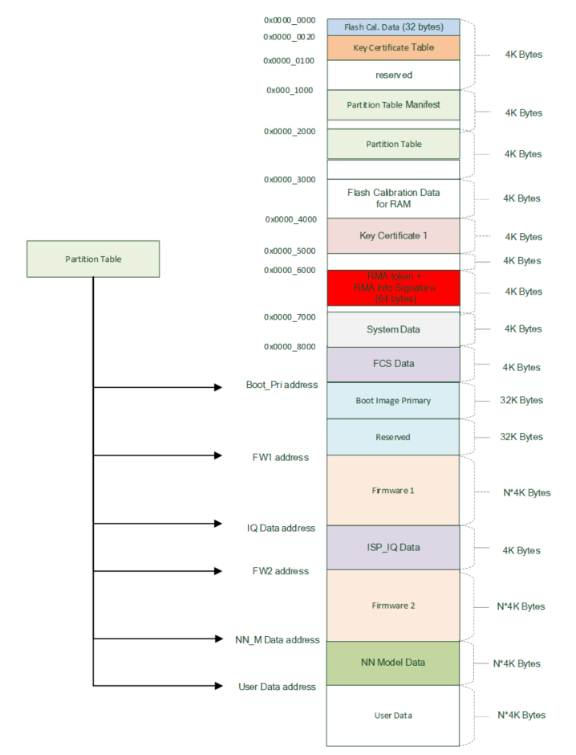
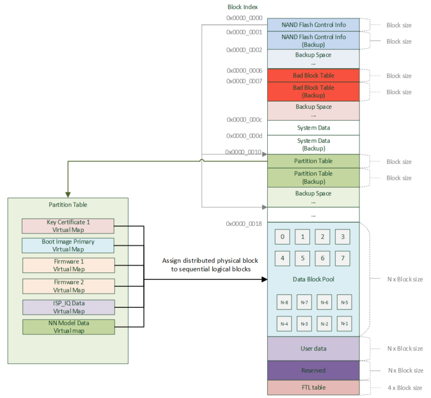
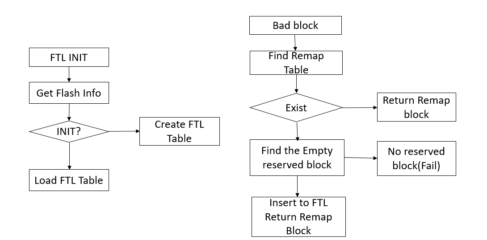

Flash Layout
============

NOR Flash Layout overview
-------------------------

Blocks used in SDK
~~~~~~~~~~~~~~~~~~

-  File System

Place in the NOR flash:0xE00000

Content: The littlefs or the fatfs file system.

-  System Data for BT and Wi-Fi SSID

Content: The following picture shows the flash layout of system data,
signature and version are used to record the status of system data. The
BT parameter size is 4bytes. The actual wifi-ssid(wifi fast connection
data) is placed in 0xf00020-0x1000000.

Place in the NOR flash:

+-----------+-----------------+----------+-------+-------+
|           | 0x00            | 0x04     | 0x08  | 0x0C  |
+===========+=================+==========+=======+=======+
| 0xf00000  | Signature(SYSd) | Version  | RSVD  | RSVD  |
+-----------+-----------------+----------+-------+-------+
| 0xf00010  | BT Para Data    | RSVD     | RSVD  | RSVD  |
+-----------+-----------------+----------+-------+-------+
| 0xf00020  |                                            |
| ~         | Wifi fast connection data                  |
| 0x1000000 |                                            |
+-----------+--------------------------------------------+

-  Secure Storage

Content: The secure_storage example stores/loads an AES GCM encrypted
user data in flash. The plaintext of user data is like the following
structure. The structure can be defined based on the requirement of user
data.

.. code-block:: c

   typedef struct user_data_s {
       char client_key[512];
   } user_data_t;

Place in the NOR flash:

The flash address used by secure storage is defined in platform_opts.h
and can be modified based on requirement.

.. code-block:: c

   #define SECURE_STORAGE_BASS (0xF00000 + 0x4000) // 4KB

NAND Flash Layout overview
--------------------------

Blocks used in SDK
~~~~~~~~~~~~~~~~~~

-  File System

Content: The littlefs file system.

Place in the NAND flash: 0x4000000

-  System Data for BT and Wi-Fi SSID

Content: The following picture shows the flash layout of system data,
signature and version are used to record the status of system data. The
BT parameter size is 4bytes. The actual wifi-ssid(wifi fast connection
data) is placed in 0xf00020 – 0x1000000.

Place in the NAND flash:

+-----------+-----------------+----------+-------+-------+
|           | 0x00            | 0x04     | 0x08  | 0x0C  |
+===========+=================+==========+=======+=======+
| 0xf00000  | Signature(SYSd) | Version  | RSVD  | RSVD  |
+-----------+-----------------+----------+-------+-------+
| 0xf00010  | BT Para Data    | RSVD     | RSVD  | RSVD  |
+-----------+-----------------+----------+-------+-------+
| 0xf00020  |                                            |
| ~         | Wifi fast connection data                  |
| 0x1000000 |                                            |
+-----------+--------------------------------------------+

- Secure Storage

Content: The secure_storage example stores/loads an AES GCM encrypted
user data in flash. The plaintext of user data is like the following
structure. The structure can be defined based on the requirement of user
data.

.. code-block:: c

   typedef struct user_data_s {
       char client_key[512];
   } user_data_t;

Place in the NAND flash:

The flash address used by secure storage is defined in platform_opts.h
and can be modified based on requirement.

.. code-block:: c

   #define SECURE_STORAGE_BASS (0x7A00000 + 0x4000) // 4KB

NAND Flash
----------

The NAND flash 1G-bit memory array is organized into 65,536 programmable
pages of 2,048-bytes each. The entire page can be programmed at one time
using the data from the 2,048-Byte internal buffer. Pages can be erased
in groups of 64 (128KB block erase). The NAND flash has 1,024 erasable
blocks.

1Gb SLC NAND Flash: 1G-bit / 128M-byte

On chip ECC for memory array

+---------------------------------------------------------------+-----------------+
| Page Data Buffer (2048 Byte)                                  | Spare(64 Byte)  |
+===============================================================+=================+
| Block (64 Pages, 64*2048 Byte)                                | 64*64 Byte      |
+---------------------------------------------------------------+-----------------+
| Total flash 1024 Blocks (65536 Pages, 1024 Blocks * 64 Pages) | 1024*64*64 Byte |
+---------------------------------------------------------------+-----------------+

+----------------------------+-----------------------------------------------+-----------------------------------+
|                            |                                               |                                   |
+============================+===============================================+===================================+
| Page Structure (2112 Byte) | Page Data Buffer (2048 Byte) ECC Protected    |           Spare(64 Byte)          |
|                            +-----------+-----------+-----------+-----------+--------+--------+--------+--------+
|                            |  Sector0  |  Sector1  |  Sector2  |  Sector3  | Spare0 | Spare1 | Spare2 | Spare3 |
+----------------------------+-----------+-----------+-----------+-----------+--------+--------+--------+--------+

The first byte of spare0 is bad block marker.

NAND Flash mbed API
~~~~~~~~~~~~~~~~~~~

NAND Flash mbed API is used to access Flash physical location and can be
used in the bootloader.

Please refer to snand_api.h & snand_api.c

.. code-block:: bash

   /**
    * @brief Init Flash
    * @param obj: address of the flash object
    * @retval none
    */
   void snand_init(snand_t \*obj);

   /**
    * @brief Erase flash block, usually 1 block = 64K bytes
      Please refer to flash data sheet to confirm the actual block size.
      The actual address which being erased always aligned with block size.
    * @param address: Specifies the starting address to be erased.
    * @retval SUCCESS, FAIL
    */
   int snand_erase_block(snand_t \*obj, uint32_t address);

   /**
    * @brief Read a stream of data from specified address vai user mode
    * @param obj: Specifies the parameter of flash object.
    * @param address: Specifies the address to be read.
    * @param len: Specifies the length of the data to read.
    * @param data: Specified the address to save the readback data.
    * @retval SUCCESS, FAIL
    */
   int snand_page_read(snand_t \*obj, uint32_t address, uint32_t Length,
   uint8_t \*data);

   /**
    * @brief Write a stream of data to specified address
    * @param obj: Specifies the parameter of flash object.
    * @param address: Specifies the address to be programmed.
    * @param Length: Specifies the length of the data to write.
    * @param data: Specified the pointer of the data to be written.
             If the address is in the flash, full address is required, i.e. SPI_SNAND_BASE + Offset
    * @retval SUCCESS, FAIL
    */
   int snand_page_write(snand_t \*obj, uint32_t address, uint32_t Length, uint8_t \*data);

NAND flash mbed example
^^^^^^^^^^^^^^^^^^^^^^^

This example demonstrates how use mbed API to scan bad block and
read/write a NAND flash.

The example is located in:

“\project\realtek_amebapro2_v0_example\example_sources\nand_flash\”

Copy main.c to src folder, compile project, and the download the binary.

NAND FTL
~~~~~~~~

The flash translation layer (FTL) performs logical-to-physical address.
It is block-mapping method; you do not need to deal with the bad block
operation. It reserved 5% reserved blocks to replace the bad block. The
detail procedure is as below.

FTL must be used after the OS init in main(), because it will be related
to the boot speed.

FTL table

+-------------+-----------------+--------------------+-------------+
| Start Tag   | Bad block Numbe | Remap block Number | End Tag     |
+=============+=================+====================+=============+
|     BB      | Number          | Number             |      bb     |
+------+------+--------+--------+---------+----------+------+------+
| 0xFF | 0xFF | 0xFF   | 0xFF   | 0xFF    | 0xFF     | 0xFF | 0xFF |
+------+------+--------+--------+---------+----------+------+------+
| 0xFF | 0xFF | 0xFF   | 0xFF   | 0xFF    | 0xFF     | 0xFF | 0xFF |
+------+------+--------+--------+---------+----------+------+------+

Bad block is 800 and the remap block is 950 for the example

+-------+-------+-------+-------+-------+-------+-------+-------+
| Byte0 | Byte1 | Byte2 | Byte3 | Byte4 | Byte5 | Byte6 | Byte7 |
+=======+=======+=======+=======+=======+=======+=======+=======+
|      BB       |      800      |      950      |      bb       |
+-------+-------+-------+-------+-------+-------+-------+-------+
| 0xFF  | 0xFF  | 0xFF  | 0xFF  | 0xFF  | 0xFF  | 0xFF  | 0xFF  |
+-------+-------+-------+-------+-------+-------+-------+-------+
| 0xFF  | 0xFF  | 0xFF  | 0xFF  | 0xFF  | 0xFF  | 0xFF  | 0xFF  |
+-------+-------+-------+-------+-------+-------+-------+-------+

+---------------------------+
| User data                 |
+===========================+
| Reserved block            |
+---------------------------+
| FTL Bad block Remap Table |
+---------------------------+

FTL API
^^^^^^^

-  ftl_common_read – Read the data from flash.

-  ftl_common_write – Write the data into flash

-  ftl_common_erase – Erase the sector or block from flash.

-  ftl_erase_sector – Erase the 4k sector from flash.

-  ftl_common_info – Get the flash type, page size, block size and block
   count from flash.

FTL Example
^^^^^^^^^^^

We can use the ATCMD and Littlefs as the example.

About the atcmd, please modify the platform_opts.h to enable the ATCMD
example. We provide the below command to r/w the flash, it is located at
the atcmd_ftl.c.

.. code-block:: bash

   #define CONFIG_FTL 0 //support FTL AT command

-  AFWD – Write the data into flash.

-  AFRD – Read the data from flash.

-  AFTR – Select the block and page to read the Nand flash data.

-  AFTR – Select the sector to read the Nor flash data.

-  AFTW – Select the block and page to write the data into nand flash.

-  AFTW – Select the sector to write the data into nor flash.

-  AFTE – Select the block to erase the Nand flash.

-  AFTE – Select the sector to erase the nor flash.

About the file system, please select the littlefs to execute the
example.

.. code-block:: bash

   $ cmake .. -G"Unix Makefiles" -DCMAKE_TOOLCHAIN_FILE=../toolchain.cmake -DEXAMPLE=std_file

Read FTL flash data in bootloader
^^^^^^^^^^^^^^^^^^^^^^^^^^^^^^^^^

The normal FTL API must be used after OS initialization in main(). To
read FTL flash data in bootloader, please refer to video_user_boot.c.

.. code-block:: c

   int boot_read_flash_data(unsigned int address,unsigned char *buf,int length)

NOR Flash
---------

NOR Flash mbed API
~~~~~~~~~~~~~~~~~~

NOR Flash mbed API is used to access Flash physical location and can be
used in the bootloader.

Please refer to flash_api.h & flash_api.c

.. code-block:: c

    /**
      * @brief  Erase flash sector
      * @param  obj: Flash object define in application software.
      * @param  address: Specifies the starting address to be erased.
      * @retval none
      */
    void flash_erase_sector(flash_t *obj, uint32_t address);

    /**
      * @brief  Erase flash block(64KB)
      * @param  obj: Flash object define in application software.
      * @param  address: Specifies the starting address to be erased.LSB 16bits will be masked.
      * @retval none
      */
    void flash_erase_block(flash_t *obj, uint32_t address);

    /**
      * @brief  Read a word from specified address
      * @param  obj: Flash object define in application software.
      * @param  address: Specifies the address to read from.
      * @param  data: Specified the address to save the readback data.
      * @retval 1: Success
      * @note auto mode read is ok, because we have flash cache
      */
    int flash_read_word(flash_t *obj, uint32_t address, uint32_t *data);

    /**
      * @brief  Write a word to specified address
      * @param  obj: Flash object define in application software.
      * @param  address: Specifies the address to be programmed to.
      * @param  data: Specified the data to be programmed.
      * @retval 1: Success
      * @note user mode write used
      */
    int flash_write_word(flash_t *obj, uint32_t address, uint32_t data);

    /**
      * @brief  Read a stream of data from specified address
      * @param obj: Flash object define in application software.
      * @param  address: Specifies the starting address to read from.
      * @param  len: Specifies the length of the data to read.
      * @param  data: Specified the address to save the readback data.
      * @retval 1: Success
      * @note auto mode is ok, because we have flash cache
      */
    int flash_stream_read(flash_t *obj, uint32_t address, uint32_t len, uint8_t *data);

    /**
      * @brief  Write a stream of data to specified address
      * @param  obj: Flash object define in application software.
      * @param  address: Specifies the starting address to write to.
      * @param  len: Specifies the length of the data to write.
      * @param  data: Pointer to a byte array that is to be written.
      * @retval 1: Success
      */
    int flash_stream_write(flash_t *obj, uint32_t address, uint32_t len, uint8_t *data);

NOR flash mbed example
^^^^^^^^^^^^^^^^^^^^^^

This example demonstrates how use mbed API to read/write a NOR flash.

The example is located in:

“\\project\\realtek_amebapro2_v0_example\\example_sources\\flash\\”

Copy main.c to src folder, compile project, and the download the binary.

