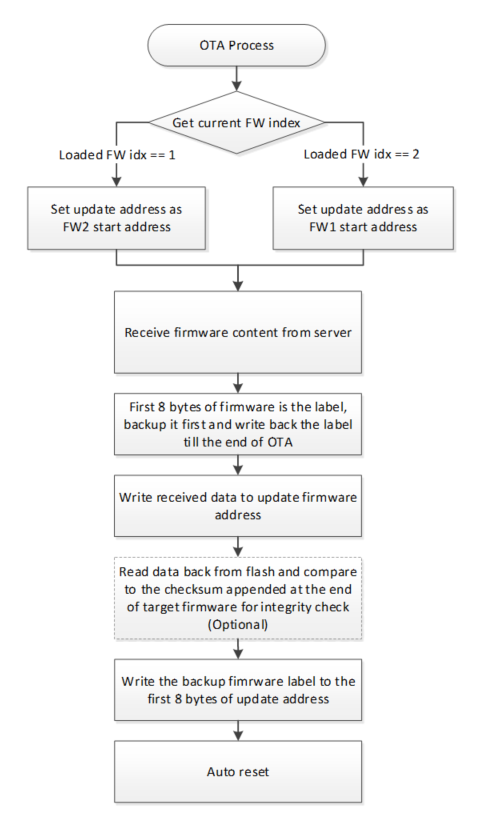
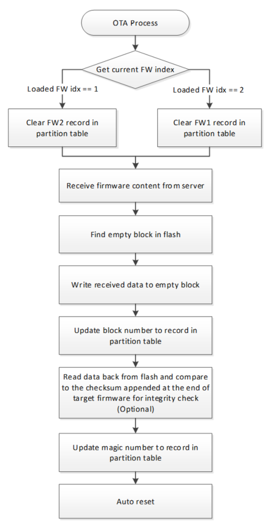
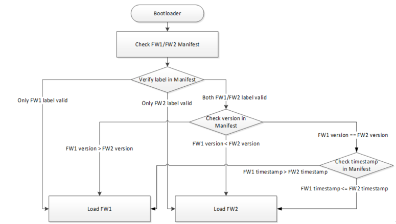
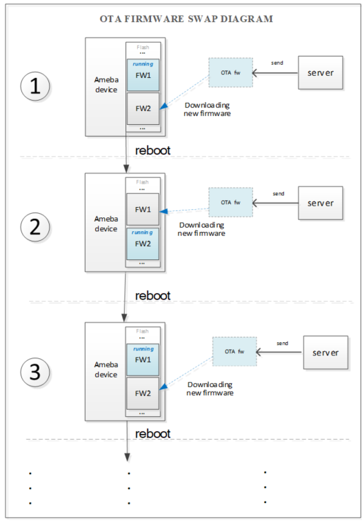
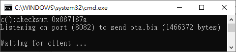
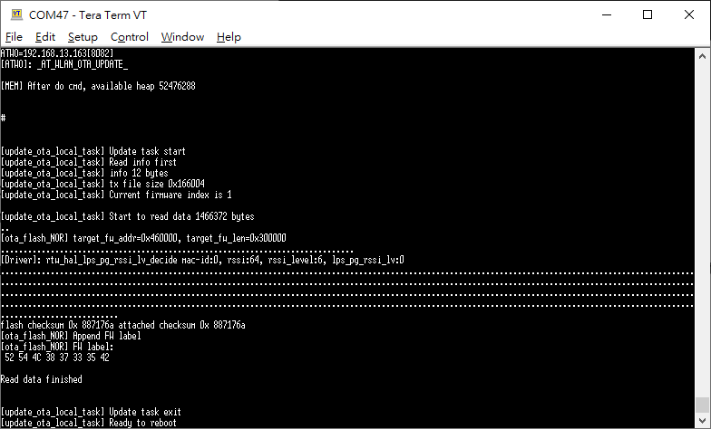
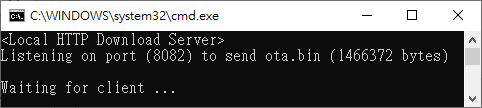
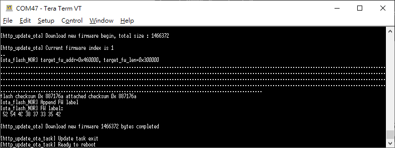

OTA
===

.. contents::
  :local:
  :depth: 2

Over-the-air programming (OTA) provides a methodology to update device
firmware remotely via TCP/IP network connection. OTA only supports
firmware1 and firmware2, OTA does not support updating Key Certificate,
Bootloader and ISP_IQ data.

OTA Operation Flow for NOR Flash
--------------------------------

   Figure OTA Process Flow for NOR Flash

The first 8 bytes of firmware image would be a label. During the step of
"Write received data to update firmware address", the 8 bytes label need
set to 0xffffffffffffffff. That means the label is invalid. The backup
label needs to be written back at the end of OTA process to prevent
device booting from incomplete firmware.

OTA Operation Flow for NAND Flash
---------------------------------

   
   Figure OTA Process Flow for NAND Flash

During the step of "Write received data to empty block", the magic
number of this new record in partition table is invalid. The magic
number is updated at the end of OTA process to make this record valid.

OTA Checksum Mechanism
----------------------

The first 8 bytes firmware label for NOR flash OTA process and the magic
number of record in partition table for NAND flash OTA process are used
to notice the bootloader the overall OTA process is done without any
network disconnection or re-boot during the OTA. However, firmware label
or magic number cannot guarantee the content of firmware image is
correct.

User can design a mechanism to calculate the hash of target OTA firmware
for integrity check during the OTA update process. For the default OTA
example in SDK, there is USE_CHECKSUM option for this integrity check
purpose. During image build, SDK would append 4 bytes checksum at the
end of firmware image to become OTA image (ota.bin). When performing OTA
routine, right after the firmware is downloaded and programmed into
flash, it would read back all the programed data from flash and compare
with the checksum value from target firmware if USE_CHECKSUM enabled. In
such way, it can ensure the downloaded firmware is transferred
completely and correct. For the detail implementation, please refer to
OTA example ota_8735b.c in SDK:

.. code-block:: bash

    #define USE_CHECKSUM 1

Boot Process Flow
-----------------

Boot loader will select latest firmware based on firmware version and
timestamp, and load it.

   Figure Boot Process Flow

Moreover, the default boot process flow can be overwritten by
implementing the user_boot_fw_selection() in
component\soc\8735b\misc\platform\user_boot.c. The
user_boot_fw_selection() should return the index of firmware that will
be loaded by bootloader. If the return value is
USER_LOAD_FW_FOLLOW_DEFAULT(0), booloader will select FW1 or FW2 based
on default boot process flow. If the return value is 1, bootloader will
load FW1. If the return value is 2, bootloader will load FW2. To apply
user_boot_fw_selection(), it is necessary to re-build bootloader.

.. code-block:: c

    #include "fw_img_export.h"

    uint8_t user_boot_fw_selection(fw_img_user_export_info_type_t *pfw_img_user_export_info)
    {
        uint8_t fw_ld_idx = USER_LOAD_FW_FOLLOW_DEFAULT;
        return fw_ld_idx;
    }

Upgraded Partition
------------------

In AmebaPro2 OTA update procedure, Firmware 1 and Firmware 2 are swapped
to each other.

The Firmware 1/Firmware 2 partition addresses and length are stored in
partition records, defined in ‘amebapro2_partitiontable.json’ under
‘project\realtek_amebapro2_v0_example\GCC-RELEASE\mp’. Please adjust it
according to your firmware size.

.. code-block:: bash

    "fw1":{
        "start_addr" : "0x100000",
        "length" : "0x300000",
        "type": "PT_FW1",
        "valid": true
    },
    "fw2":{
        "start_addr" : "0x400000",
        "length" : "0x300000",
        "type": "PT_FW2",
        "valid": true
    },

For NOR flash, OTA firmware is written to the partition start address in
flash, and OTA firmware size is checked with the partition length. For
NAND flash, OTA firmware is written to empty blocks distributed in
flash, and OTA firmware size is checked with the partition length.

Firmware Image Output
---------------------

After building project source files in SDK, it would generate firmware
as ‘firmware.bin’, and OTA firmware as ‘ota.bin’ which is firmware.bin
with 4 bytes checksum appended at the end.

OTA Firmware Swap Behavior
~~~~~~~~~~~~~~~~~~~~~~~~~~

When device executes OTA procedure, it would update another firmware
partition, rather than the current running firmware partition. The OTA
firmware swap behavior should be looked like as below figure if the
updated firmware keeps using newer firmware version and timestamp.

   Figure OTA Firmware SWAP Procedure

Version and Timestamp
~~~~~~~~~~~~~~~~~~~~~

AmebaPro2 bootloader boots to Firmware 1 or Firmware 2 based on firmware
version and timestamp. Please check the version and timestamp of
generated OTA firmware are expected.

At offset 0x2B0 of firmware image, the version is a 32bytes value in
little endian order. The version can be configured in
‘amebapro2_firmware_ntz.json’ under
‘project\realtek_amebapro2_v0_example\GCC-RELEASE\mp’.

.. code-block:: bash

    "MANIFEST":{
    "label":"RTL8735B",
    "vrf_alg": "NA_VRF_CHECK",
    "tlv":[
    …
    {"type":"TYPE_ID", "length":2, "value":"IMG_FWHS_S"},
    {"type":"VERSION", 
     "length":32,   
     "value":"FEFFFFFFFFFFFFFFFFFFFFFFFFFFFFFFFFFFFFFFFFFFFFFFFFFFFFFFFFFFFFFF"},
    {"type":"TIMST", "length":8, "value":"auto"},

The version which higher bit is zero presents higher version. For
example, the version of
‘FEFFFFFFFFFFFFFFFFFFFFFFFFFFFFFFFFFFFFFFFFFFFFFFFFFFFFFFFFFFFFFF’ is
zero in bit 0, version of
‘EFFFFFFFFFFFFFFFFFFFFFFFFFFFFFFFFFFFFFFFFFFFFFFFFFFFFFFFFFFFFFFF’ is
zero in bit 4, and version of
‘FFFEFFFFFFFFFFFFFFFFFFFFFFFFFFFFFFFFFFFFFFFFFFFFFFFFFFFFFFFFFFFF’ is
zero in bit 8. Then, it will be version with bit 8 zero > version with
bit 4 zero > version with bit 0 zero. The version definition in "value"
is customizable, user could apply its own method by implementing
user_boot_fw_selection(). Moreover, the advantage of using "value" field
in MANIFEST instead of maintaining a separate record in NOR/NAND flash
is that, user does not need to handle bad block management for NAND
flash that stores firmware version control information.

At offset 0x2D4 of firmware image, the timestamp is an 8bytes value in
little endian order and is the number of seconds since January 1st, 1970
00:00:00 UTC. The timestamp which presents image build time will be
automatically generated when image build.

In user_boot_fw_selection() of bootloader, developer could get firmware
version and timestamp from the inputted parameter
pfw_img_user_export_info of user_boot_fw_selection(). The
pfw_img_user_export_info-> fw1_ld_sel_info.version and
pfw_img_user_export_info-> fw2_ld_sel_info.version are the raw data of
FW1 and FW2 version. The pfw_img_user_export_info->
fw1_ld_sel_info.timestamp and pfw_img_user_export_info->
fw2_ld_sel_info.timestamp are 4-bytes of FW1 and FW2 timestamp. In
application firmware, developer could get firmware version and timestamp
from hal_sys_get_fw_version_raw() and hal_sys_get_fw_timest().

.. code-block:: c

    // hal_sys_ctrl.h
    void hal_sys_get_fw_version_raw(const uint8_t ld_img_idx, uint8_t *pver_raw_buf);
    uint32_t hal_sys_get_fw_timest(const uint8_t ld_img_idx);

Implement OTA over Wi-Fi
------------------------

OTA Using Local Download Server Base on Socket
~~~~~~~~~~~~~~~~~~~~~~~~~~~~~~~~~~~~~~~~~~~~~~

The example shows how device updates image from a local download server.
The local download server sends image to device based on network socket.

.. note ::  Make sure both device and PC are connecting to the same local network.

Build OTA Application Image
^^^^^^^^^^^^^^^^^^^^^^^^^^^

Enable CONFIG_OTA_UPDATE flag in
‘project\\realtek_amebapro2_v0_example\\inc\\platform_opts.h’ to support
ATWO AT command for OTA with local download server.

.. code-block:: c

    #define CONFIG_OTA_UPDATE 1

Download the firmware to AmebaPro2 board to execute OTA.

Setup Local Download Server
^^^^^^^^^^^^^^^^^^^^^^^^^^^

Step 1: Build new ota.bin and place it to ‘tools\DownloadServer’ folder.

Step 2: Edit ‘tools\DownloadServer\start.bat’ file for server port and
OTA file name

.. code-block:: bash

    @echo off
    DownloadServer 8082 ota.bin
    set /p DUMMY=Press Enter to Continue ...

Step 3: Execute ‘tools\\DownloadServer\\start.bat’.

   Figure Download Server

Execute OTA Procedure
^^^^^^^^^^^^^^^^^^^^^

After device connects to AP, enter command: ATWO=IP[PORT]. Please note
that the device and your PC need under the same AP. The IP in ATWO
command is the IP of your PC.

   Figure ATWO command

After finishing OTA download, device will reboot automatically, and the
bootloader will boot to new firmware according to firmware version and
timestamp.

OTA Using Local Download Server Based on HTTP
~~~~~~~~~~~~~~~~~~~~~~~~~~~~~~~~~~~~~~~~~~~~~

This example shows how device updates image from a local http download
server. The local http download server will send the http response which
data part is ‘ota.bin’ after receiving the http request.

.. note :: Make sure both device and PC are connecting to the same local network.

Build OTA Application Image
^^^^^^^^^^^^^^^^^^^^^^^^^^^

Set server IP, port, and resource in ota_http example (component\\example\\ota_http\\example_ota_http.c).

.. code-block:: bash

    #define PORT 8082
    #define HOST "192.168.1.100"
    #define RESOURCE "ota.bin"

Build firmware with ota_http example.

.. code-block:: bash

    cmake .. -G"Unix Makefiles" -DCMAKE_TOOLCHAIN_FILE=../toolchain.cmake -DEXAMPLE=ota_http

Download the firmware to AmebaPro2 board to execute OTA.

Setup Local HTTP Download Server
^^^^^^^^^^^^^^^^^^^^^^^^^^^^^^^^

Step 1: Build new ota.bin and place it to ‘tools\\DownloadServer(HTTP)’ folder.

Step 2: Edit ‘tools\\DownloadServer\\start.bat’ file for server port and OTA file name

.. code-block:: bash

    @echo off
    DownloadServer 8082 ota.bin
    set /p DUMMY=Press Enter to Continue ...

Step 3: Execute ‘tools\\DownloadServer(HTTP)\\start.bat’.

   Figure HTTP Download Server

Execute OTA Procedure
^^^^^^^^^^^^^^^^^^^^^

Reboot the device and connect to AP, it should execute ota_http example
automatically to start the OTA update through HTTP protocol.

After finishing OTA download, device will reboot automatically, and the
bootloader will boot to new firmware according to firmware version and
timestamp.

   Figure OTA HTTP Example

Verify Signature after OTA
--------------------------

For secure boot enabled devices, ota_verify_flash_signature() and
ota_verify_signature() are provided in ota_8735b.c to verify the public
key and signature in manifest of signed bootloader or firmware after
OTA.

.. code-block:: c

    //ota_8735b.c
    int ota_verify_flash_signature(char *partition_name);
    int ota_verify_signature(char *partition_name, uint8_t *manifest);

ota_verify_signature() can be used to verify the public key and
signature in a manifest buffer. The manifest for partitions of "BL_PRI",
"FW1" or "FW2" can be inputted. In ota_verify_signature(), the public
key in the manifest is verified with the public key hash in Key
Certificate in flash, and the signature in the manifest is verified with
this verified public key. ota_verify_flash_signature() can be used to
verify the public key and signature in the manifest of partitions in
flash. ota_verifiy_flash_signature() reads manifest from the partitions
in flash by using FWFS API, such pfw_open() and pfw_read(), and uses
ota_verify_signature() to verify this manifest. After OTA,
ota_verifiy_flash_signature() can be used to verify the updated firmware
partition before reboot. Should not switch firmware to the updated
firmware if the verification of public key or signature of the updated
firmware is failed.

