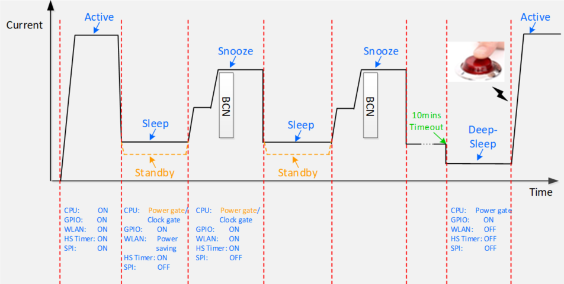
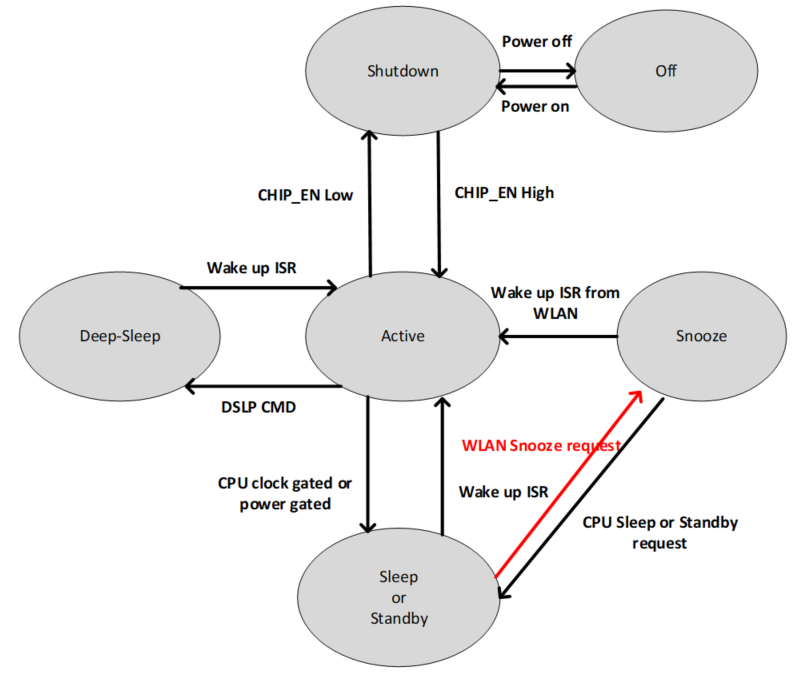
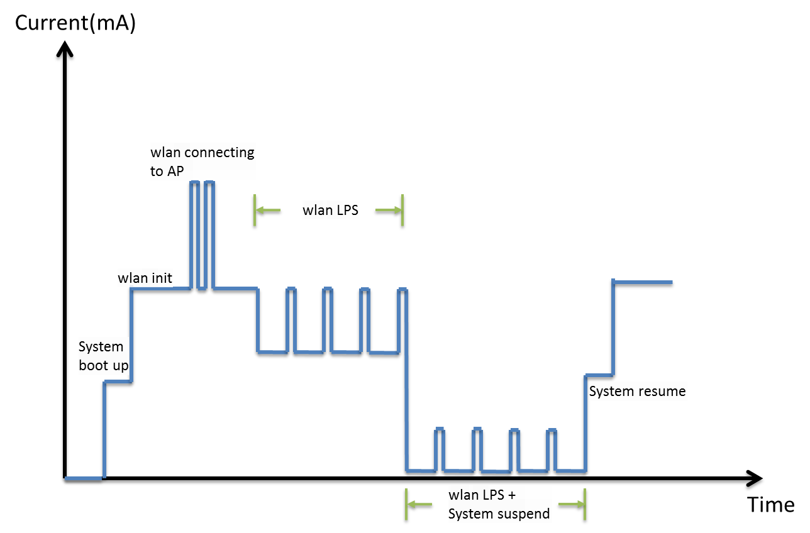
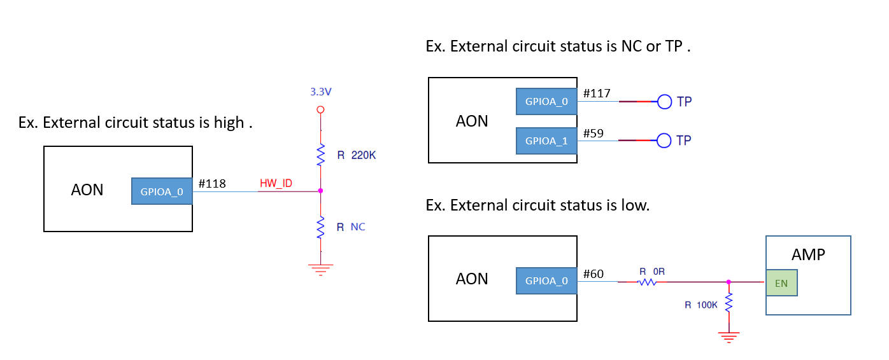

Power Save
==========

.. contents::
  :local:
  :depth: 2

Overview
--------

Application Scenario
~~~~~~~~~~~~~~~~~~~~

AmebaPro2 achieves low power consumption with a combination of several
proprietary technologies. The power-saving architecture features six
reduced power modes of operation: active, sleep, standby, snooze,
deepsleep, shutdown mode. With the elaborate architecture, the battery
life of whole IOT system could be extended.

For reading pen application, it can divide into three-scenario. First,
press the power button to power on reading pen to active mode and then
connect to the cloud to download data. Second, once the reading pen
without any activity for 2 minutes, the system will go to sleep mode
(for system fast resume and keep WIFI connect) or standby mode (for
lower power consumption and keep WIFI connect) and regularly wake up to
receive WLAN beacon while into snooze mode. At last, without using the
reading pen exceeds 10 minutes, the system will into deep sleep mode and
waiting for any button signals to wake up system into active mode. The
application scenario flow was shown in

Features
~~~~~~~~

-  **Active Mode**: The CPU is in active mode and all peripherals are
   available.

-  **Sleep Mode**: The CPU is in clock-gated and can be woken up by most
   of peripherals. The system resume time could be much faster than the
   Standby mode and the WLAN could be ON or power saving mode in this
   state.

-  **Standby Mode**: The CPU is in power-gated and can be woken up by
   most of peripherals. The power consumption could be lower than the
   Sleep mode and the WLAN could be ON or power saving mode in this
   state.

-  **Snooze Mode**: In this mode system can regularly wake up to receive
   WLAN beacon without software intervention. The significant difference
   between Snooze and Sleep/Standby mode is WLAN capability and could be
   receive and transmit beacon in this state.

-  **DeepSleep Mode**: The lowest power consumption than the other power
   mode except for shutdown mode, it can be only woken up by LP Timer or
   GPIO.

-  **Shutdown Mode:** The CPU will be shutdown while CHIP_EN was Low.

Power Mode and Power Consumption
~~~~~~~~~~~~~~~~~~~~~~~~~~~~~~~~

The mode transition diagram is given in.

In Figure, the power mode can be divided into 6 states except for “off”
state and the each power In Figure, the power mode can be divided into 6
states except for “off” state and the each power consumption was shown
in Figure. The introduction of each power mode, clock-gated and
power-gated state will be in the following sections. Clock/power gated
state could be regarded as a status of any hardware.

Deep Sleep Mode
---------------

-  CHIP_EN keeps high. User can invoke Deep Sleep API to force into deep
   sleep mode. By using specified interrupts to wake up system.

-  The following wake flow: Wake up ISR is high -> PMC -> enable CPU ->
   Reboot flow.

Wakeup Source
~~~~~~~~~~~~~

Aon GPIO, RTC, comparator, Aon Timer

Aon GPIO: GPIOA0~GPIOA3

Comparator: GPIOA0~GPIOA3

Standby Mode
------------

-  CHIP_EN keeps high. User can invoke Standby API to force into deep
   sleep mode. By using specified interrupts to wake up system.

-  The following wake flow: Wake up ISR is high -> PMC -> enable CPU ->
   Fast reboot flow.

Wakeup Source
~~~~~~~~~~~~~

Aon GPIO, RTC, comparator, Aon Timer, Gtimer0, PWM, Pon GPIO, Uart0,
Wlan

Aon GPIO: GPIOA0~GPIOA3

Pon GPIO: GPIOF0~GPIOF17

Comparator: GPIOA0~GPIOA3

.. note :: The clock source of gtimer0 and Uart0 only support 4MHz clk.

Sleep Mode
----------

-  CHIP_EN keeps high. User can invoke Sleep API to force system into
   deep sleep mode. By using specified interrupts to wake up system.

-  The following wake flow: Wake up ISR is high -> PMC -> enable CPU ->
   Execution of instructions continues.

Wakeup Source
~~~~~~~~~~~~~

Aon GPIO, RTC, comparator, Aon Timer, Gtimer0, PWM, Pon GPIO, Uart0,
Wlan

Aon GPIO: GPIOA0~GPIOA3

Pon GPIO: GPIOF0~GPIOF17

Comparator: GPIOA0~GPIOA3

Snooze Mode
-----------

-  CHIP_EN keeps high. By using specified interrupts to wake up system.

-  The following wake flow: WLAN power on request-> Receive particular
   beacon-> Wake up ISR is high -> PMC -> enable CPU -> Execution of
   instructions continues or fast reboot flow.

Wakeup Source
~~~~~~~~~~~~~

In snooze mode, the only wake up source is WLAN. The wakeup condition
could be configured by WLAN driver according to system application. Once
the event triggered, WLAN hardware would raise interrupt to PMC that
could change hardware state.

Wakeup from WLAN
~~~~~~~~~~~~~~~~

If user choose wakeup from WLAN in Standby mode, he needs to configure
wlan before invoke Standby.

After user configure wlan and invoke Standby, system would enter suspend
state. In this state, MCU would periodically to check wlan state and
decide if it needs to wakeup. After wlan receive the wakeup packet that
matches the wakeup pattern, then wakeup.

The whole progress is like below diagram:

-  At first system boot up, initialize wlan, connecting to AP.

-  After connected to AP, wlan would enter LPS state if there is no
   heavy data traffic. In LPS state, wlan would listen beacon for every
   100ms (if DTIM is 1). So you could see power consumption rise for
   every 100ms. Power consumption would drop after wlan receive the
   beacon and the TIM field has no packet for this device, then wlan
   would turn off RF and try to keep in low power state.

-  If user try to make system save more power with wlan associate idle,
   he could invoke Standby. You could see the power consumption drops
   more in wlan LSP with system suspend.

Please note that if you want to measure the power consumption when
system suspend with wlan LPS, you have to make sure the voltage
regulator of power supply and current meter could handle the voltage
drop and rise between hundreds of micro amp and dozens of milliamp.

Keep-alive mechanism
~~~~~~~~~~~~~~~~~~~~

Wowlan mode can perform TCP keep alive and MQTT ssl ping request keep
alive by setting a fixed pattern.

TCP keep alive
^^^^^^^^^^^^^^

In first, set 2 parameters: IP & port of TCP server. The setting would
become effective after system enter wake on wlan mode. By default it
sends a TCP packet every 30s, and resend after 10s if STA does not
receive TCP ACK. You can modify the interval in the setting.

In the offload setting, it also adds a wake on wlan pattern that matches
TCP packet with same source port in tcp keep alive, and match TCP flag
with PSH+ACK. These setting would allow TCP server wakeup STA by sending
a packet to STA.

MQTT SSL keep alive
^^^^^^^^^^^^^^^^^^^

Just like tcp keep alive, we only need to set the IP & port of MQTT
server and SSL Key offload after TLS connection, and fill in {0xc0,
0x00} in the tcp payload to send ping request packets at a fixed time
for MQTT keep alive .

Wakeup from pattern
~~~~~~~~~~~~~~~~~~~

When the user needs to use the remote wake-up function, the system can
leave Standby mode when wlan receives a matching data packet. The SDK
has been configured with the ICMP pattern to wake up, and supports
user-set custom patterns.

The part of the Wakeup pattern comparison includes the data of
Destination, BSSID, Source in the MAC Header, and Destination IP Address
from the Protocol Type of the LLC Header to the Destination IP Address
of the IP Header. To set a custom pattern, users need to set (1) Pattern
content and (2) Mask: Pattern content to compare Byte, the above two
items must be set in the wowlan_pattern_t structure:

.. code-block:: c

    typedef struct wowlan_pattern {
        unsigned char eth_da[6];
        unsigned char eth_sa[6];
        unsigned char eth_proto_type[2];
        unsigned char header_len[1];
        unsigned char ip_proto[1];
        unsigned char ip_sa[4];
        unsigned char ip_da[4];
        unsigned char src_port[2];
        unsigned char dest_port[2];
        unsigned char flag2[1];
        unsigned char mask[6]; 

        unsigned char window[2];            //Reserved
        unsigned char checksum[2];          //Reserved
        unsigned char urgent_pointer[2];    //Reserved
        unsigned char payload[64];
        unsigned char payload_mask[9];
    } wowlan_pattern_t;

After setting the pattern and mask, you need to set to wlan using the
wifi_wowlan_set_pattern API.

Take the TCP data packet as an example, assuming the Ameba MAC address
is 00: E0: 4C: 87: 00: 00, the following description sets the TCP
Unicast data packet whose receiver is Ameba as the wake-up packet.
First, the MAC Destination of the comparison packet needs to be Ameba,
so set the eth_da field of wowlan_pattern_t to 00: E0: 4C: 87: 00: 00.
Next, set the Protocol type of the LLC Header to IP Protocol: {0x08,
0x00}, Version + Length: {0x45}, the Protocol Type of the IP Header to
TCP: {0x06}, and set the Destination IP to Ameba's IP.

After the above fields are set, they will be converted into HW
comparison format, as follows:

========= ========== ================== ============== ======= ============ ======= ========= ========= ============ ============= =========
eth_da(6) eth_sa (6) eth_proto_type (2) header_len (1) Rsvd(8) ip_proto (1) Rsvd(2) ip_sa (4) ip_da (4) src_port (2) Dest_port (2) Flag2 (1)
========= ========== ================== ============== ======= ============ ======= ========= ========= ============ ============= =========

Therefore, the HW Pattern after the TCP Pattern conversion in this
example is:

================= ================= ===== == ======================= == ===== =========== =========== ===== ===== ==
00 e0 4c 87 00 00 00 00 00 00 00 00 08 00 45 00 00 00 00 00 00 00 00 06 00 00 00 00 00 00 c0 a8 00 c4 00 64 e1 6c 18
================= ================= ===== == ======================= == ===== =========== =========== ===== ===== ==

Next, the user needs to set the Mask. 1 bit in the Mask corresponds to 1
byte of the HW pattern, and the byte corresponding to the 1 bit in the
Mask will be added for comparison. The following explains how Mask is
composed:

First use the bit sequence mask to identify the bytes to be compared:

====== ====== == = ======== = == ==== ==== == == =
111111 000000 11 1 00000000 1 00 0000 1111 11 11 1
====== ====== == = ======== = == ==== ==== == == =

This bit sequence is composed of 1 byte every 8 bits:

======== ======== ======== ======== ====== =
11111100 00001110 00000001 00000011 111111 1
======== ======== ======== ======== ====== =

HW is compared from bit0 of each byte, so the bit order of each byte
must be reversed.

======== ======== ======== ======== ======== ========
00111111 01110000 10000000 11000000 00111111 10000000
======== ======== ======== ======== ======== ========

Convert from step 3 to Hex: {0x3f, 0x70, 0x80, 0xc0, 0x3f, 0x80} to get
the final Mask.

Wakeup pattern payload
^^^^^^^^^^^^^^^^^^^^^^

Set the payload_mask, 1 bit in the Mask corresponds to 1 byte of the HW
pattern, and the byte corresponding to the bit of Mask 1 will be added
to the comparison. Assuming that a payload of 10 bytes is set, the
following explains how the Mask is composed:

Every 8 bits of the bit sequence form 1 byte, and the first 6 bits are
reserved:

======== ======== ======== ======== ======== ======== ======== ======== ========
00000011 11111111 00000000 00000000 00000000 00000000 00000000 00000000 00000000
======== ======== ======== ======== ======== ======== ======== ======== ========

HW is compared from the bit0 of each byte, so the bit order of each byte
must be reversed

======== ======== ======== ======== ======== ======== ======== ======== ========
11000000 11111111 00000000 00000000 00000000 00000000 00000000 00000000 00000000
======== ======== ======== ======== ======== ======== ======== ======== ========

Convert to Hex from step 2: {0xc0, 0xff, 0x00, 0x00, 0x00, 0x00, 0x00,
0x00, 0x00}, get the final Mask.

Wakeup from SSL pattern
~~~~~~~~~~~~~~~~~~~~~~~

Wake up from ssl mode support tls cipher suite aes256, sha384.

After establishing a TLS connection, you can wake up by setting ssl key
offload and ssl wakeup mode.

When the user needs to use the remote wake-up function, when wlan
receives a matching data packet, the system can exit the Standby mode.

SSL key offload
^^^^^^^^^^^^^^^

The part of the SSL Key offload comparison includes the ssl_ctr, ssl_iv,
ssl_enc_key, ssl_dec_key and ssl hmac key. To set a SSL Key offload,
users need to set wifi_set_ssl_offload() after TLS connection, the above
items must be set in the SSL Key offload structure:

+---------------------------+
| SSL_CTR (8 bytes)         |
+===========================+
| SSL_IV (16 bytes)         |
+---------------------------+
| SSL_ENC_KEY (32 bytes))   |
+---------------------------+
| SSL_DEC_KEY (32 bytes)    |
+---------------------------+
| SSL_HMAC_KEY (48 bytes)   |
+---------------------------+
| SSL_IS_ETM (1 bytes))     |
+---------------------------+

SSL wakeup pattern
^^^^^^^^^^^^^^^^^^

SSL Wakeup pattern support 8 groups, each pattern supports up to 64
Bytes. The user can fill in the patterns used for waking up in sequence
through wifi_wowlan_set_ssl_pattern(). After waking up, the wakeup
reason can know which pattern was awakened.

SSL wakeup pattern
^^^^^^^^^^^^^^^^^^

SSL Wakeup pattern support 8 groups, each pattern supports up to 64
Bytes. The user can fill in the patterns used for waking up in sequence
through wifi_wowlan_set_ssl_pattern(). After waking up, the wakeup
reason can know which pattern was awakened.

Example of Wakeup from WLAN
~~~~~~~~~~~~~~~~~~~~~~~~~~~

The sample program is located at:

project\\realtek_amebapro2_v0_example\\src\\wowlan\\main_wowlan.c

=================== ======================================== =============================================================================================================================================
Example             Description                              Result
=================== ======================================== =============================================================================================================================================
WiFi Keep alive     Use command:                             Enter L2 keep alive mode
                                                            
                    PS=wowlan                               
TCP Keep alive      Send keep alive packet interval setting: A tcp keep alive packet is sent every 60 seconds, if no tcp ack is received, the tcp keep alive packet will be resend 10 seconds later.
                                                            
                    static uint32_t interval_ms = 60000;     Connect to tcp server and enter tcp keep alive mode.
                                                            
                    static uint32_t resend_ms = 10000;      
                                                            
                    Use command:                            
                                                            
                    PS=tcp_keep_alive,[ip],[port]           
                                                            
                    PS=wowlan                               
MQTT SSL Keep alive Send keep alive packet interval setting: A mqtt ping request packet is sent every 60 seconds, if no tcp ack is received, the mqtt ping request packet will be resend 10 seconds later.
                                                            
                    static uint32_t interval_ms = 60000;     Connect to mqtt server and enter tcp keep alive mode
                                                            
                    static uint32_t resend_ms = 10000;      
                                                            
                    Use command:                            
                                                            
                    #define MQTTSSL_KEEPALIVE 1             
                                                            
                    #define AWS_IOT_MQTT 1                  
                                                            
                    PS=mqtt_keep_alive                      
                                                            
                    PS=wowlan                               
=================== ======================================== =============================================================================================================================================

Suspend fail handle
~~~~~~~~~~~~~~~~~~~

When entering wlan suspend, there may be a chance of sleep failure, such
as receiving a wakeup event or wifi disconnection during the suspend
process. At this time, the system needs to do system reset or wakeup
from standby by case.

.. code-block:: c

    ret = rtl8735b_suspend(0);
    if (ret != 0)
    {
        /********************************************
        ret = -3; //wlan enter LPS mode fail
        ret = -4; //wifi not connected when suspend
        ret = -6; //wifi off status check fail
        ret = -7; //wlan get wakeup event
        *********************************************/
        if (ret == -4)
        {
                sys_reset();
        } else {
                wifi_off();
                HAL_WRITE32(0x40009000, 0x18, 0x1 | HAL_READ32(0x40009000, 0x18));
                Standby(SLP_AON_TIMER | SLP_GTIMER, 1000000, 0, 1);
        }

    } 

-  Error code -3: Firmware will sync with AP by sending Null frame to
   confirm that enter LPS mode successfully or not.

-  If the status does not be checked successfully until timeout, the
   maximum waiting time is 10 seconds.

-  Because system has already back up the retention data, user can enter
   standby mode and wakeup quickly for wifi resume.

-  Error code -4: Check device has connected to AP or not.

-  Because of wifi disconnection, user cannot back up retention
   information. User need to do system reset.

-  Error code -6: Driver will read the RF power status to check enter HW
   LPS mode successfully or not.

-  If the status does not be checked successfully until timeout, the
   maximum waiting time is 10 seconds.

-  The RF power status should be off when PRO2 enter HW LPS mode
   successfully. IF the power status is on, Pro2 need to close wifi by
   calling wifi_off() and reset the hardware by waking up from standby
   mode.

-  Because system has already back up the retention data, user can enter
   standby mode and wakeup quickly for wifi resume.

-  Error code -7: Wowlan firmware get the wake-up event during suspend
   process.

-  System has already back up the retention data before enter suspend.

-  If Pro2 receive wake-up pattern (wake-up reason 0x77 and 0x23) in
   suspend process, user can enter standby mode and wakeup quickly for
   wifi resume.

-  If Pro2 receive other wake-up event in suspend process, user need to
   enter standby mode and wakeup quickly for wifi reconnection. Because
   PRO2 be disconnected by AP, system cannot do wifi resume.

-  After Pro2 waking up, user can get wake-up reason by the API,
   rtw_hal_wowlan_get_suspend_wakeup_reason(), and do the corresponding
   wifi flow.

Set AON GPIO pull control before power save mode
------------------------------------------------

Check the AON GPIO external circuit status and set the AON GPIO states
matching the external circuit to prevent leakage.

-  External pull high → internal pull high

-  External pull low or floating → internal pull low

For the detailed definition of AON GPIO control register, please refer
to rtl8735b_aon_type.h.

.. code-block:: c

    #define AON_SHIFT_AON_GPIO1_SLEW_RATE                28
    #define AON_BIT_AON_GPIO1_SLEW_RATE                  ((u32)0x00000001 << 28)    /*!<R/W 0  0:Disable,1:Enable */
    #define AON_SHIFT_AON_GPIO1_DRIVING                  26
    #define AON_MASK_AON_GPIO1_DRIVING                   ((u32)0x00000003 << 26)    /*!<R/W 0  0:4mA, 1:8mA */
    #define AON_SHIFT_AON_GPIO1_SMT_EN                   25
    #define AON_BIT_AON_GPIO1_SMT_EN                     ((u32)0x00000001 << 25)    /*!<R/W 0  Enable AON GPIO1 Schmitt trigger; 1: enable */
    #define AON_SHIFT_AON_GPIO1_PULL_CTRL                22
    #define AON_MASK_AON_GPIO1_PULL_CTRL                 ((u32)0x00000003 << 22)    /*!<R/W 0  2b'00: high impedence; 2b'01: pull low; 2b'10: pull high; 2b'11: reserved */
    #define AON_SHIFT_AON_GPIO1_PINMUX_SEL               16
    #define AON_MASK_AON_GPIO1_PINMUX_SEL                ((u32)0x0000000F << 16)    /*!<R/W 1111  0000: Comparator_ADC 0001: I2C0_SDA 0010: 0011:JTAG_CLK/SWD_CK 0100: 0101: 0110: 0111: 1000: 1001: 1010: 1011: 1100: 1101: 1110: 1111: GPIO */
    #define AON_SHIFT_AON_GPIO0_SLEW_RATE                12
    #define AON_BIT_AON_GPIO0_SLEW_RATE                  ((u32)0x00000001 << 12)    /*!<R/W 0  0:Disable,1:Enable */
    #define AON_SHIFT_AON_GPIO0_DRIVING                  10
    #define AON_MASK_AON_GPIO0_DRIVING                   ((u32)0x00000003 << 10)    /*!<R/W 0  0:4mA, 1:8mA */
    #define AON_SHIFT_AON_GPIO0_SMT_EN                   9
    #define AON_BIT_AON_GPIO0_SMT_EN                     ((u32)0x00000001 << 9)     /*!<R/W 0  Enable AON GPIO0 Schmitt trigger; 1: enable */
    #define AON_SHIFT_AON_GPIO0_PULL_CTRL                6
    #define AON_MASK_AON_GPIO0_PULL_CTRL                 ((u32)0x00000003 << 6)     /*!<R/W 0  2b'00: high impedence; 2b'01: pull low; 2b'10: pull high; 2b'11: reserved */
    #define AON_SHIFT_AON_GPIO0_PINMUX_SEL               0
    #define AON_MASK_AON_GPIO0_PINMUX_SEL                ((u32)0x0000000F << 0)     /*!<R/W 1111  0000: Comparator_ADC 0001: I2C0_SCL 0010: 0011: JTAG_TMS/SWD_IO 0100: 0101: 0110: 0111: 1000: 1001: 1010: 1011: 1100: 1101: 1110: 1111: GPIO */

Set PON GPIO pull control before standby
----------------------------------------

If PON GPIO is set as standby wake up source, please check the PON GPIO
external circuit status first, and set the PON GPIO status matching the
external circuit before standby to prevent leakage.

-  External pull high → internal pull high

-  External pull low or floating → internal pull low

For the detailed definition of PON GPIO control register, please refer
to rtl8735b_pon_type.h.

.. code-block:: c

    #define PON_MASK_PON_GPIO1_DRIVING                   ((u32)0x00000003 << 26)      /*!<R/W 0  0:4mA, 1:8mA */
    #define PON_SHIFT_PON_GPIO1_SMT_EN                   25
    #define PON_BIT_PON_GPIO1_SMT_EN                     ((u32)0x00000001 << 25)      /*!<R/W 0  Enable PON GPIO1 Schmitt trigger; 1: enable */
    #define PON_SHIFT_PON_GPIO1_PULL_CTRL                22
    #define PON_MASK_PON_GPIO1_PULL_CTRL                 ((u32)0x00000003 << 22)      /*!<R/W 0  2b'00: high impedence; 2b'01: pull low; 2b'10: pull high; 2b'11: reserved */
    #define PON_SHIFT_PON_GPIO1_PINMUX_SEL               16
    #define PON_MASK_PON_GPIO1_PINMUX_SEL                ((u32)0x0000000F << 16)      /*!<R/W 1111  0000: ADC1 0001: I2C1_SCL 0010: 0011: RFE_CTRL_0 0100: 0101: 0110:UART1_CTS 0111: 1000: 1001: 1010: 1011: 1100: 1101: 1110: 1111: GPIO */
    #define PON_SHIFT_PON_GPIO0_SLEW_RATE                12
    #define PON_BIT_PON_GPIO0_SLEW_RATE                  ((u32)0x00000001 << 12)      /*!<R/W 0  0:Disable,1:Enable */
    #define PON_SHIFT_PON_GPIO0_DRIVING                  10
    #define PON_MASK_PON_GPIO0_DRIVING                   ((u32)0x00000003 << 10)      /*!<R/W 0  0:4mA, 1:8mA */
    #define PON_SHIFT_PON_GPIO0_SMT_EN                   9
    #define PON_BIT_PON_GPIO0_SMT_EN                     ((u32)0x00000001 << 9)       /*!<R/W 0  Enable PON GPIO0 Schmitt trigger; 1: enable */
    #define PON_SHIFT_PON_GPIO0_PULL_CTRL                6
    #define PON_MASK_PON_GPIO0_PULL_CTRL                 ((u32)0x00000003 << 6)       /*!<R/W 0  2b'00: high impedence; 2b'01: pull low; 2b'10: pull high; 2b'11: reserved */
    #define PON_SHIFT_PON_GPIO0_PINMUX_SEL               0
    #define PON_MASK_PON_GPIO0_PINMUX_SEL                ((u32)0x0000000F << 0)       /*!<R/W 1111  0000: ADC0 0001: 0010: 0011: 0100: 0101: 0110: 0111: 1000: 1001: 1010: 1011: 1100: 1101: 1110: 1111: GPIO */

Default settings for EVB.

.. code-block:: c

    //AON_GPIO
        HAL_WRITE32(0x40009094, 0x0, 0x4f004f); //GPIOA_1/GPIOA_0
        HAL_WRITE32(0x40009098, 0x0, 0x4f004f); //GPIOA_3/GPIOA_2
        HAL_WRITE32(0x4000909c, 0x0, 0x4f004f); //GPIOA_5/GPIOA_4
        
        
    //PON_GPIO
        HAL_WRITE32(0x40009850, 0x0, 0x4f004f); //GPIOF_1/GPIOF_0
        HAL_WRITE32(0x40009854, 0x0, 0x8f004f); //GPIOF_3/GPIOF_2
        HAL_WRITE32(0x40009858, 0x0, 0x4f008f); //GPIOF_5/GPIOF_4
        HAL_WRITE32(0x4000985c, 0x0, 0x4f004f); //GPIOF_7/GPIOF_6
        HAL_WRITE32(0x40009860, 0x0, 0x4f004f); //GPIOF_9/GPIOF_8
        HAL_WRITE32(0x40009864, 0x0, 0x4f004f); //GPIOF_11/GPIOF_10
        HAL_WRITE32(0x40009868, 0x0, 0x4f004f); //GPIOF_13/GPIOF_12
        HAL_WRITE32(0x4000986C, 0x0, 0x4f004f); //GPIOF_15/GPIOF_14
        HAL_WRITE32(0x40009870, 0x0, 0x4f004f); //GPIOF_17/GPIOF_16
    //HAL_WRITE32(0x4000Ae04, 0x0, 0x20000); //GPIOF_17(VDD_DDR_EN) INPUT MODE

Get Wake Reason
---------------

The reason for triggering the wakeup can be obtained through
Get_wake_reason(). Bit[9] ~ Bit[12] are based on the GPIO initialization
sequence and do not directly correspond to GPIOA_0-4

.. code-block:: c

    /**
     *  @brief The function for get wake up reason.
     *  @returns wake up status
     *   wake up status:
     *                - bit[12]: the AON GPIO3 Wake up status.
     *                - bit[11]: the AON GPIO2 Wake up status.
     *                - bit[10]: the AON GPIO1 Wake up status.
     *                - bit[9]: the AON GPIO0 Wake up status.
     *                - bit[8]: the RTC Wake up status.
     *                - bit[7]: the COMP Wake up status.
     *                - bit[6]: the AON TIMER Wake up status.
     *                - bit[5]: the UART Wake up status.
     *                - bit[4]: NA.
     *                - bit[3]: the WLAN Wake up status.
     *                - bit[2]: NA.
     *                - bit[1]: the PON GPIO Wake up status.
     *                - bit[0]: the GTimer0 Wake up status.
     */
    u32 Get_wake_reason(void);

Get Wowlan Wake Reason
----------------------

After getting the wlan wakeup event of 0x08 through Get_wake_reason(),
you can get the wakeup reason of wowlan through
rtl8735b_wowlan_wake_reason() API.

The relevant wowlan wakeup reasons are as follows

.. code-block:: c

    /*
    RX_DISASSOC                         = 0x04, //Received disassoc packet from AP
    RX_DEAUTH                           = 0x08, //Received deauth packet from AP
    FW_DECISION_DISCONNECT              = 0x10, //Decided to wake up after not receiving beacon for a long time
    RX_PATTERN_PKT                      = 0x23, //Wake up through the set RX pattern
    TX_TCP_SEND_LIMIT                   = 0x69, //Wake up by tcp keep alive packet retry timeout
    RX_DHCP_NAK                         = 0x6A, //Wake up after receiving DHCP NAK packet
    DHCP_RETRY_LIMIT                    = 0x6B, //DHCP renew timeout
    RX_MQTT_PATTERN_MATCH               = 0x6C, //Wake up through the set mqtt wakeup pattern
    RX_MQTT_PUBLISH_WAKE                = 0x6D, //Wake up after receiving mqtt publish packet
    RX_MQTT_MTU_LIMIT_PACKET            = 0x6E, //Received mqtt packet larger than MTU
    RX_TCP_FROM_SERVER_TO               = 0x6F, //The keep alive packet was not received after the set server timeout.
    FW_PNO_WAKEUP                       = 0x70, //The PNO detects the AP beacon
    FW_BCN_TO_WAKEUP                    = 0x74, //Beacon recovery cannot receive beacon until the set timeout time
    RX_TCP_RST_FIN_PKT                  = 0x75, //Received tcp fin or reset flag packet
    RX_MQTT_PING_RSP_TO                 = 0x76, //mqtt keep alive timeout
    RX_TCP_WITH_PAYLOAD                 = 0x77, //Wake up after receiving a tcp packet with payload
    GPIO_WDT_TBTT_CHECK_ERROR           = 0x79, //FW wakes up when abnormality is detected through status check
    CSA_WAKE                            = 0x7A, //Channel Switch Announcement
    BCN_DS_MISMATCH_WAKE                = 0x7B,  //Channel mismatch
    RX_TCP_FIN_PKT                  = 0x7C, //Received tcp fin flag packet
    RX_TCP_RST_PKT                  = 0x7D, //Received tcp reset flag packet
    */

    u32 rtl8735b_wowlan_wake_reason (void);
