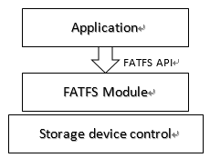
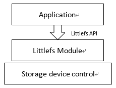

File System
===========

.. contents::
  :local:
  :depth: 2

FATFS File System
-----------------

Storage is a key feature of embedded system. AmebaPro2 provides flexible
method of storage management. In this chapter, three kinds of
application scenarios (SD/RAM/flash) will be mentioned.

FATFS Module
~~~~~~~~~~~~

AmebaPro2 utilizes FAT File system Module to provide access to low level
storage devices. Applications can manage and operate the file system
through FATFS API.

FATFS API
~~~~~~~~~

AmebaPro2 SDK uses open source FATFS module. The application interface
provides various functions for applications to manipulate the file
system.

(1) File Access

-  f_open - Open/Create a file

-  f_close - Close an open file

-  f_read - Read data from the file

-  f_write - Write data to the file

-  f_lseek - Move read/write pointer, Expand size

-  f_truncate - Truncate file size

-  f_sync - Flush cached data

-  f_forward - Forward data to the stream

-  f_expand - Allocate a contiguous block to the file

-  f_gets - Read a string

-  f_putc - Write a character

-  f_puts - Write a string

-  f_printf - Write a formatted string

-  f_tell - Get current read/write pointer

-  f_eof - Test for end-of-file

-  f_size - Get size

-  f_error - Test for an error

(2) Directory Access

-  f_opendir - Open a directory

-  f_closedir - Close an open directory

-  f_readdir - Read an directory item

-  f_findfirst - Open a directory and read the first item matched

-  f_findnext - Read a next item matched

(3) File and Directory Management

-  f_stat - Check existance of a file or sub-directory

-  f_unlink - Remove a file or sub-directory

-  f_rename - Rename/Move a file or sub-directory

-  f_chmod - Change attribute of a file or sub-directory

-  f_utime - Change timestamp of a file or sub-directory

-  f_mkdir - Create a sub-directory

-  f_chdir - Change current directory

-  f_chdrive - Change current drive

-  f_getcwd - Retrieve the current directory and drive

(4) Volume Management and System Configuration

-  f_mount - Register/Unregister the work area of the volume

-  f_mkfs - Create an FAT volume on the logical drive

-  f_fdisk - Create logical drives on the physical drive

-  f_getfree - Get total size and free size on the volume

-  f_getlabel - Get volume label

-  f_setlabel - Set volume label

-  f_setcp - Set active code page

   More details about the usage of FATFS API, please visit http://elm-chan.org/fsw/ff/00index_e.html

FATFS Example
~~~~~~~~~~~~~

The example for NOR flash and RAM file system need to be assigned the
start address to run:

In FLASH_FATFS.c

.. code-block:: c

   #define FLASH_APP_BASE        0x180000
   #define FLASH_BLOCK_SIZE      512
   #define FLASH_SECTOR_COUNT    256
   #define SECTOR_SIZE_FLASH     4096

In FATFS_RAMDISK_API.c

.. code-block:: c

   #define RAM_DISK_SZIE         1024*1024*10
   #define SECTOR_SIZE_RAM       512
   #define SECTOR_COUNT_RAM      (RAM_DISK_SZIE/512)

Please execute the example_fatfs.c to run the example.

FATFS Behavior Description
~~~~~~~~~~~~~~~~~~~~~~~~~~

In this example, we demonstrate how to use FATFS on AmebaPro2 flash
memory and manage files and directories in the file system.

First, we use FATFS API to register flash disk driver and get a drive
number for the flash drive. We use this drive number as its path and
mount to a FATFS object.

Next, the example list files currently exist in the flash memory, clear
all files and directories, and list files again to check if the drive is
all clean and empty.

Next, the example uses f_mkdir API to create a directory named
“ameba_dir” in the root of the filesystem and use f_open to create a
file named “ameba_dir_file” in ameba_dir. Then list files to show the
created directory and file.

Next, we create a file named “ameba_root_file” at the root of the drive,
and use f_write API to try to write some content to the file. Then use
f_read API to read from the file to check if the content written to the
file can be read back correctly.

Finally we list all files and directories in the drive.

Dual Fat File system (File system on both SD Card and Flash)
~~~~~~~~~~~~~~~~~~~~~~~~~~~~~~~~~~~~~~~~~~~~~~~~~~~~~~~~~~~~

Please modify the example_fatfs.h to enable the SD and FLASH function.

.. code-block:: c

   #define CONFIG_FATFS_IF_SD      1
   #define CONFIG_FATFS_IF_FLASH   1

In this example, we demonstrate how to use FATFS on both AmebaPro2 flash
memory and SD card, and manage files and directories in the two
filesystems.

First, we use FATFS API to register flash disk driver and SD disk
driver, and each drive gets a drive number. We use the drive number as
drive path and mount flash drive and SD drive, each with a FATFS object.

Next, the example clears files currently exist in both drives, and list
files again to check if the drives are all clean and empty.

Next, the example tests operations on the SD drive. We create a new
file(“sd_file”) and perform read/write to the file, then create a new
directory(“sd_dir”) and open a new file in the directory(“sd_file2”).

Next, the example tests similar operations on the flash drive. Create a
new file(“flash_file”) and perform read/write to the file. Then we
create a new directory(“flash_dir”) and open a new file in the
directory(“flash_file2”).

Finally we list all files and directories in each drive.

Setup the timestamp
~~~~~~~~~~~~~~~~~~~

FATFS setting time is set through the following API, users can set it
according to the current real time, such as rtc or sntp.

sdk\\component\\file_system\\fatfs\\r0.14\\diskio.c

.. code-block:: c

    DWORD get_fattime(void)
    {
        DWORD time_abs;

        time_abs = ((DWORD)(2016 - 1980) << 25) /* Fixed to Feb. 2, 2016 */
                   | ((DWORD)2 << 21)
                   | ((DWORD)2 << 16)
                   | ((DWORD)0 << 11)
                   | ((DWORD)0 << 5)
                   | ((DWORD)0 >> 1);

        return time_abs;
    }

LITTLEFS File System
--------------------

The little file system (LittleFS) is a fail-safe file system designed
for embedded systems, specifically for microcontrollers that use
external flash storage.

There are three challenges for embedded storage on microcontrollers and
flash storage: power loss, wear and limited RAM and ROM. This file
system provides the solution to these challenges.

-  Bounded RAM/ROM - This file system works with a limited amount of
   memory. It avoids recursion and limits dynamic memory to configurable
   buffers that can be provided statically.

-  Power-loss resilient - We have designed this for operating systems
   that may have random power failures. It has strong copy-on-write
   guarantees and keeps storage on disk in a valid state.

-  Wear leveling - Because the most common form of embedded storage is
   erodible flash memories, the file system provides a form of dynamic
   wear leveling for systems that cannot fit a full flash translation
   layer.

LITTLEFS Module
~~~~~~~~~~~~~~~

AmebaPro2 utilizes Littlefs File system Module to provide access to low
level storage devices. Applications can manage and operate the file
system through Littlefs API.

LITTLEFS API
~~~~~~~~~~~~

(1) File Access

-  lfs_file_open - Open a file.

-  lfs_file_opencfg - Open a file with extra configuration.

-  lfs_file_close - Close a file.

-  lfs_file_sync - Synchronize a file on storage.

-  lfs_file_read - Read data from file.

-  lfs_file_write - Write data to file

-  lfs_file_seek - Change the position of the file.

-  lfs_file_truncate - Truncates the size of the file to the specified
   size

-  lfs_file_tell - Return the position of the file.

-  lfs_file_rewind - Change the position of the file to the beginning of
   the file.

-  lfs_file_size - Return the size of the file.

(2) Directory Access

-  lfs_mkdir - Create a directory.

-  lfs_dir_open - Open a directory.

-  lfs_dir_close - Close a directory

-  lfs_dir_read - Read an entry in the directory.

-  lfs_dir_seek - Change the position of the directory.

-  lfs_dir_tell - Return the position of the directory.

-  lfs_dir_rewind - Change the position of the directory to the
   beginning of the directory.

(3) File and Directory Management

-  lfs_remove - Removes a file or directory.

-  lfs_rename - Rename or move a file or directory.

-  lfs_stat - Find info about a file or directory.

-  lfs_getattr - Get a custom attribute.

-  lfs_setattr - Set custom attributes.

-  lfs_removeattr - Removes a custom attribute

-  lfs_fs_size - Finds the current size of the file system.

-  lfs_fs_traverse - Traverse through all blocks in use by the file
   system.

(4) Volume Management and System Configuration

-  lfs_format - Format a block device with the littlefs.

-  lfs_mount - Mounts a littlefs.

-  lfs_unmount - Unmounts a littlefs.

-  lfs_migrate - Attempts to migrate a previous version of littlefs.

LITTLEFS Example
~~~~~~~~~~~~~~~~

It can support the NOR and NAND flash. It depend on different file
operation.

Please run the example_littlefs to run the example. The behavior is the
same as fatfs example.

Both of them need to assign the start address and block size. Please
reference the lfs_nor_api.c and lfs_nand_api.c to do the setup.
