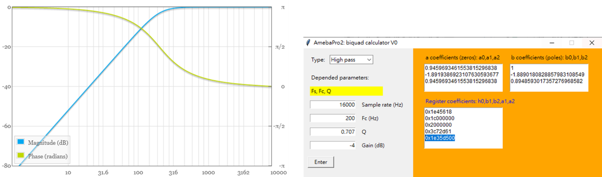

Audio optimization
==================

.. contents::
  :local:
  :depth: 2

The following chapters describe the software and hardware optimization
solutions of AmebaPro2 audio.

Audio setting
-------------

Gain setting
~~~~~~~~~~~~

Analog microphone gain setting
^^^^^^^^^^^^^^^^^^^^^^^^^^^^^^

The audio analog input gain can be namely divided into analog gain and
digital gain.

**Analog mic gain**

It supports 0, 20, 30, 40 dB for the gain optimization.

User can use audio_mic_analog_gain or set the parameter mic_gain for
audio module to set it.

**ADC gain can be used to set the input (analog to) digital gain – ADC Volume.**

The range is -17.625dB (0x00) ~ 30dB (0x7F)

User can use the function audio_adc_digital_vol or use
CMD_AUDIO_SET_ADC_GAIN to control audio module to use the function.

A digital gain configuration is offered to control the audio output
gain. Customers can set a reasonable gain value via DAC Volume to obtain
the appropriate audio output volume according to their needs. Basically
setting the gain to 0dB (0xAF), the output amplitude will meet the board
audio output volume requirements. Note that a sound breakage will happen
when the output gain is setting too large.

If the analog gain is too large, analog gain will affect the sound
effect and noise will be obvious.

Recommend that customers can first configure the digital gain. If the
audio signal gain need to increase but the digital gain achieves the
maximum range, then configure the analog gain.

Digital microphone gain setting
^^^^^^^^^^^^^^^^^^^^^^^^^^^^^^^

**Left mic gain**

Left dmic gain and it supports 0, 12, 24, 36 dB for the gain
optimization.

User can use audio_l_dmic_gain or set the parameter dmic_l_gain for
audio module to set it.

**Right mic gain**

Right dmic gain and it supports 0, 12, 24, 36 dB for the gain
optimization.

User can use audio_r_dmic_gain or set the parameter dmic_r_gain for
audio module to set it.

Speaker gain setting
^^^^^^^^^^^^^^^^^^^^

**DAC gain can be used to set the output digital (to analog) gain – DAC Volume.**

The range is -65.625dB (0x00) ~ 0dB (0xAF)

User can use the function audio_dac_digital_vol or use
CMD_AUDIO_SET_DAC_GAIN to control audio module to use the function.

HPF setting
~~~~~~~~~~~

In AmebaPro2, it provides a high pass filter for user to filter the low
frequency noise. This is use to filter out the noise filter for DC
power, sugget to set default value 0. If user want to use other filter,
please refer to EQ setting.

Here is the function:

.. code-block:: c

   void audio_adc_l_hpf(audio_t *obj, BOOL en, audio_hpf_fc hpf_fc);

The parameters mean:

-  obj: Audio object define in application software.

-  en: enable the high pass frequency or not.

-  hpf_fc: set the cutoff frequency, the value is from 0~7; fc ~= 5e-3 / (hpf_fc + 1) \* fs.

EQ setting
~~~~~~~~~~

In AmebaPro2, it also provides five sets of biquad filters in three
sides for left digital mic (analog mic), right digital mic and audio
output.

One biquad filter can switch to high-pass, low-pass, band-pass, notch,
peak, low shelf, and high shelf filter by register settings.

Here are some tips for user to use the EQ:

**Select the biquad filter**

User can use the following websites to configure the preferred filter
type, sample rate, cutoff frequency, Q value and Gain first:

https://www.earlevel.com/main/2021/09/02/biquad-calculator-v3/

**Get the registers’ value of selecting filter**

User can use AmebaPro2_EQ_tool.exe to generate register settings. For
example, if we choose a high pass filter with cutoff frequency 200Hz and
Q value 0.707, user can type the setting and get the registers’ value
(0x1e45618, 0x1c000000, 0x2000000, 0x3c72d61, 0x1e35d500) for this
setting.

Figure EQ setting

**Set the register value got from AmebaPro2_EQ_tool.exe**

After getting the registers’ value, user can use the following functions
to apply the filter setting on AmebaPro2 on left digital mic (analog
mic), right digital mic and audio output. Note that there are 5 filters
could be set in each side. User could also set the EQ parameters in
audio_params_t when using the MMF setting.

.. code-block:: c

    void audio_input_l_eq(audio_t *obj, audio_eq eq, BOOL en, u32 h0, u32 b0, u32 b1, u32 a0, u32 a1);
    void audio_input_r_eq(audio_t *obj, audio_eq eq, BOOL en, u32 h0, u32 b0, u32 b1, u32 a0, u32 a1);
    void audio_output_l_eq(audio_t *obj, audio_eq eq, BOOL en, u32 h0, u32 b0, u32 b1, u32 a0, u32 a1);

Here are the parameters:

-  obj: Audio object define in application software.

-  eq: Select the EQ number, can be 0~4.

-  en: enable the eq filter or not

-  h0, b0, b1, a0, a1: the registers’ value gotten from
   AmebaPro2_EQ_tool.exe.

Other setting
~~~~~~~~~~~~~

Here are some commands about the module audio setting:

**CMD_AUDIO_SET_RESET**

will be re-initialize the audio setting and also the ASP algorithms. If
you do some changes need to reset the audio configuration, like change
the sample rate, reset the audio to switch the configuration.

**CMD_AUDIO_SET_SAMPLERATE**

can set the sample rate. After using this command, a reset is needed to
apply the sample rate configuration on audio and ASP algorithms.

.. note :: If using audio codec, be sure the sample rate is fitting the sample rate used in audio codec.

**CMD_AUDIO_SET_TRX**

Provide a way to stop and re-start the audio without re-initialize the
audio system and ASP algorithms. Set 0 to stop the tx and rx progresses
or 1 to start them.

**CMD_AUDIO_SET_MIC_ENABLE/CMD_AUDIO_SET_SPK_ENABLE**

Mute or unmute the mic input/speaker output. This command will not open
or close the audio codec, but set the digital data to zero.

Audio ASP algorithm
-------------------

The following table shows some common audio problem with their causes
and also the adjustment using ASP algorithm.

================== =============== ================ ==========================================================
Situation          Algorithm       Influence End    Cases
================== =============== ================ ==========================================================
Distortion         AGC             transmitting end -  The ambient sound is too high
                                                   
                                                    -  Headphone preGain
Low audio volume   AGC             transmitting end -  The original input volume is too low
                                                   
                                                    -  AGC is not working properly
Echo or howling    AEC             transmitting end -  Too close between transmitting and receiving end device
                                                   
                                                    -  Volume too large or mic too sensitive
                                                   
                                                    -  AEC is not turn on
                                                   
                                                    -  AEC parameters is not setting correctly
Intermittent voice AEC、NS         transmitting end -  NS or AEC suppression
Noise floor        NS              transmitting end -  NS mode setting too low
                                                   
                                                    -  Caused by the environment, NS can't do well
Mechanical sound   Network、Device Receiving end    -  Poor network environment
                                                   
                                                    -  Device sampling is unstable or device hardware problem
================== =============== ================ ==========================================================

.. note :: The audio signal processing (ASP) is based on the digital audio signal. If the audio signal has already has the distortion, the ASP has no promise to get the expected result.

Open ASP algorithm
~~~~~~~~~~~~~~~~~~

For using ASP algorithm, user need to turn off the new library by
–DBUILD_CT=off. For example, cmake .. -G"Unix Makefiles"
-DCMAKE_TOOLCHAIN_FILE=../toolchain.cmake –DAUDIO_TEST_TOOL=on.

The codes and functions related to the ASP algorithm are shows in the
table.

Enable ENABLE_ASP in module_audio.h and use the 3A (AGC: Automatic gain
control; ANS: Adaptive noise suppression; AEC: Acoustic echo
cancellation) algorithms to obtain better audio effects.

.. note :: The parameters, sample_rate and mic_gain, and the initialization of
   NS, AEC, AGC and other algorithms will be setting at CMD_AUDIO_APPLY
   and CMD_AUDIO_SET_RESET.

To enable ASP function user can use the following parameters in ASP.h:

.. code-block:: c

    =================== Open ASP algorithm (ASP.h) ================
    typedef struct CTNS_cfg_s {
        int16_t NS_EN;
        int NSLevel;
        int16_t HPFEnable;
        int16_t QuickConvergenceEnable;

        int16_t Reserve1;
    } CTNS_cfg_t;

    typedef struct CTAGC_cfg_s {
        int16_t AGC_EN;
        CT_AGC_MODE AGCMode;
        int16_t ReferenceLvl;
        int16_t RatioFormat;    // Ratio format: 0 => integer, range 1~50, 1 => 8.8 fix point, range 26~50*256 (mapping 26/256~50)
        int16_t AttackTime;
        int16_t ReleaseTime;
        int16_t Ratio[3];
        int16_t Threshold[3];   // Threshold1, Threshold2, NoiseGateLvl
        int16_t KneeWidth;
        int16_t NoiseFloorAdaptEnable;
        int16_t RMSDetectorEnable;
        int16_t MaxGainLimit;
    } CTAGC_cfg_t;

    typedef struct CTAEC_cfg_s {
        int16_t AEC_EN;
        int16_t EchoTailLen;
        int16_t CNGEnable;
        int16_t PPLevel;
        int16_t DTControl;
        int16_t ConvergenceTime;

        int16_t Reserve1;
    } CTAEC_cfg_t;

    typedef struct VQE_SND_STATE_s {
        int16_t DoA;              //in degrees
        int16_t ERLE;             //in dB
        int16_t SinLvldB;         //in dBFs
        int16_t SoutLvldB;        //indBFs after AGC (if AGC is enabled)
        int16_t DTState;          //0 = single talk  or 1 = doulble talk
        int16_t HCDetectState;    //1 = detected, 0 = not detected
        uint8_t AECRun;
        uint8_t AGCRun;
        uint8_t NSRun;
        uint8_t BFRun;

        uint8_t Reserve1;
        uint8_t Reserve2;
        uint8_t Reserve3;
        uint8_t Reserve4;
    } VQE_SND_STATE_t;

    typedef struct VQE_RCV_STATE_s {
        int16_t RinLvldB;
        int16_t RoutLvldB;
        int16_t HCDetectState;    //1 = detected, 0 = not detected
        uint8_t AGCRun;
        uint8_t NSRun;

        uint8_t Reserve1;
        uint8_t Reserve2;
        uint8_t Reserve3;
        uint8_t Reserve4;
    } VQE_RCV_STATE_t;

The following is detail of the parameters in each configuration

============================== =====================================================================================================================================
configuration                  Parameters
============================== =====================================================================================================================================
CTAEC_cfg_t                    -  AEC_EN: enable the AEC module in AEC process
                              
                               -  EchoTailLen: the length of the buffer that the echo cancel process will be rely on, the higher it set, the cpu usage is higher, suggest to use 64 for 16KHz and 128 for 8KHz, support 32/64/128
                              
                               -  CNGEnable: enable the comfortable noise generation, setting 0 or 1
                              
                               -  PPLevel: the fine tune value of AEC , echo cancelled more aggressive for higher level (the local may also be cancelled more in higher level), support 1~50
                              
                               -  DTControl: the coarse tune value of AEC, support 1 (allow some low residual), 2 (may attenuate up to 6dB local), 3 (may attenuate up to 9dB local)
                              
                               -  ConvergenceTime: AEC initialization convergence time in msec, support 100~1000
CTAGC_cfg_t                    -  AGC_EN: enable the AGC module in the AGC process
                              
                               -  AGCMode: set the AGC mode for AGC module in the AGC process, the value is 0 (CT_ALC), 1(CT_LIMITER)
                              
                               -  ReferenceLvl: the output target reference level (dBFS), support 0,1,…,30 (0,-1,…,-30dBFs)
                              
                               -  RatioFormat: adjust the setting format for ratio, 0 => integer, range 1~50, 1 => 8.8 fix point, range 26~50*256 (mapping 26/256~50)
                              
                               -  AttackTime: the transition time of changes to signal amplitude compression, support 1~500
                              
                               -  ReleaseTime: the transition time of changes to signal amplitude boost, support 1~500
                              
                               -  Ratio[3]: support three ratios for adjusting the AGC gain curve
                              
                               -  Threshold[3]: support three thresholds for adjusting the AGC gain curve; First and second item refer to AGC_Threshold1 and AGC_Threshold2 which support 0~81; the last item refer to the AGC_NoiseGateLvl which supports 50~90
                              
                               -  KneeWidth: adjust the soft knee of the AGC gain curve, support 0~10
                              
                               -  NoiseFloorAdaptEnable: Use noise detect on AGC or not, the AGC will ignore some background noise if enabling this configuration, setting 0 or 1
                              
                               -  RMSDetectorEnable: Set 0 for detecting on the peak value while setting 1 for detecting on the RMS value
                              
                               -  MaxGainLimit: The max gain in dB will apply on AGC, support 6,12,18,24,30
CTNS_cfg_t                     -  NS_EN: enable the NS module in the NS process
                              
                               -  NSLevel: set the aggressive level in dB (the larger the more aggressive) for NS module in the NS process, support 3~35
                              
                               -  HPFEnable: enable the HPF before NS or not, setting 0 or 1
                              
                               -  QuickConvergenceEnable: set the NS convergence speed, 1 for immediately suppress(quick), 0 for smooth suppress
CTBF_cfg_t                     -  BF_EN: enable the BF module in the BF process (for stereo mic only)
                              
(plan to support the function) -  DOAEnable: enable direction of angle detection or not
                              
                               -  MM: number of mics (plan to support 1 and 2 in the future)
                              
                               -  mic_spacing: the distance between two mics in mm
                              
                               -  mic_array_type: (keep the column for the future usage)
============================== =====================================================================================================================================

The following is detail of the information structure for the RCV (Mic)
and SND (Speaker) part

=============== ====================================================================================================================================================
configuration   Parameters
=============== ====================================================================================================================================================
VQE_SND_STATE_t -  DoA: direction of angle in degree (will support in the future)
               
                -  ERLE: Echo return loss enhancement in dB (will support in the future)
               
                -  SinLvldB: ASP mic input level in dBFS
               
                -  SoutLvldB: ASP process result level in dBFS (including AEC, NS and AGC)
               
                -  DTState: current process is based on single talk (0) or double talk (1)
               
                -  HCDetectState: detect the howling or not (just keep the column for the future)
               
                   For the following run status, it will indicated the status by bits. 0 bit: current speaker (TX) status; 1 bit: current mic (RX) status; 2 bit: previous speaker (TX) status; 3 bit: previous mic (RX) status
               
                -  AECRun: AEC run status
               
                -  AGCRun: AGC run status
               
                -  NSRun: NS run status
               
                -  BFRun: BF run status (not support yet)
VQE_RCV_STATE_t -  RinLvldB: ASP mic input level in dBFS
               
                -  RoutLvldB: ASP process result level in dBFS (including NS and AGC)
               
                -  HCDetectState: detect the howling or not (just keep the column for the future)
               
                   For the following run status, it will indicated the status by bits. 0 bit: current speaker (TX) status; 1 bit: current mic (RX) status; 2 bit: previous speaker (TX) status; 3 bit: previous mic (RX) status
               
                -  AGCRun: AGC run status
               
                -  NSRun: NS run status
=============== ====================================================================================================================================================

In "ASP.h" it defined some function for the ASP setting. The following
table shows the functions for setting the ASP algorithm:

================================= =============== ===================================================================================================== ============
Function                          Related module  Parameters                                                                                            Note
================================= =============== ===================================================================================================== ============
AEC_init                          NS, AEC, AGC    -  frame_size: setting the frame size for the AEC module, the unit is "sample"                        -  For mono mic side ASP
                                                                                                                                                       
                                                  -  sample_freq: audio sample rate (support 8k and 16k)                                                -  This process also initialed other modules include NS, AEC and AGC.
                                                                                                                                                       
                                                  -  RX_AEC: the pointer for the new library AEC setting in mic path                                   
                                                                                                                                                       
                                                  -  RX_AGC: the pointer for the new library AGC setting in mic path                                   
                                                                                                                                                       
                                                  -  RX_NS: the pointer for the new library NS setting in mic path                                     
                                                                                                                                                       
                                                  -  snd_amplification: set the amplification for the output result                                    
AEC_set_level                     AEC             -  level: the aggressive level (the larger the more aggressive) for AEC module, the level is from 0~4 -  For mono mic side ASP
                                                                                                                                                       
                                                  -  RX_AEC: the pointer for the new library AEC setting                                               
NS_set_level_for_AEC              NS              -  Level: the NS level for RX path                                                                    -  For mono mic side ASP
                                                                                                                                                       
                                                  -  RX_NS: the pointer for the new library NS setting                                                  -  Dynamically set the NS level for the mono mic, if the NS module is initialed
AEC_set_runtime_en                AEC             -  enable: run time switch for the AEC module                                                         -  For mono mic side ASP
                                                                                                                                                       
                                                                                                                                                        -  This is a switch to choose going through the AEC process (if the AEC module is initialed successfully) or bypass
AEC_process                       NS, AEC, AGC    -  farend: the array input for the far-end data                                                       -  For mono mic side ASP
                                                                                                                                                       
                                                  -  nearend: the array input for the far-end data                                                      -  the data in the near end buffer will be processed by the AEC, AGC, NS modules and get the final result in the out buffer
                                                                                                                                                       
                                                  -  out: the space to save the ASP processed data                                                     
AEC_destory                       NS, AEC, AGC                                                                                                          -  For mic side ASP
                                                                                                                                                       
                                                                                                                                                        -  For destroy the modules initialed in AEC_init
AGC_init                          AGC             -  sample_freq: audio sample rate (support 8k and 16k)                                                -  For output (speaker) side ASP
                                                                                                                                                       
                                                  -  TX_AGC: the pointer for the webrtc AGC setting in speaker path                                    
AGC_process                       AGC             -  frame_size: setting the frame size for the AGC module, the unit is "sample" (words)                -  For output (speaker) side ASP
                                                                                                                                                       
                                                  -  out: the data will be used to do AGC process, the data will directly be modified                  
AGC_destory                       AGC                                                                                                                   -  For output (speaker) side ASP
                                                                                                                                                       
                                                                                                                                                        -  For destroy the modules creates in AGC_init
NS_init                           NS              -  sample_freq: audio sample rate (support 8k and 16k)                                                -  For output (speaker) side ASP
                                                                                                                                                       
                                                  -  TX_NS: the pointer for the webrtc NS setting in speaker path                                      
NS_process                        NS              -  frame_size: setting the frame size for the AGC module, the unit is "sample"                        -  For output (speaker) side ASP
                                                                                                                                                       
                                                  -  out: the data will be used to do AGC process, the data will directly be modified                  
NS_destory                        NS                                                                                                                    -  For output (speaker) side ASP
                                                                                                                                                       
                                                                                                                                                        -  For destroy the modules creates in NS_init
VQE_SND_init (not support yet)    NS, AEC, AGC,BF                                                                                                       -  
                                                                                                                                                                                                    
VQE_SND_process (not support yet) NS, AEC, AGC,BF                                                                                                       -  

VQE_SND_destory (not support yet) NS, AEC, AGC,BF                                                                                                       -  
================================= =============== ===================================================================================================== ============

ASP algorithm usage
^^^^^^^^^^^^^^^^^^^

Here are the configurations for ASP algorithm:

-  8K and 16K audio sample rate are supported in the ASP algorithms.

-  The default ASP settings - default_rx_asp_params and
   default_tx_asp_params are defined in module_audio.c.

-  Users can use CMD_AUDIO_GET_RXASP_PARAM and CMD_AUDIO_GET_TXASP_PARAM
   to get the ASP parameters for RX and TX ASP parameters in the audio
   module.

-  Users can use CMD_AUDIO_SET_RXASP_PARAM and CMD_AUDIO_SET_TXASP_PARAM
   to set the ASP parameters for RX and TX ASP parameters.

-  When default_rx_asp_params.agc_cfg.AGC_EN and
   default_tx_asp_params.agc_cfg.AGC_EN set 0 which means disable the
   AGC process in RX and TX direction, while 1 means enabling the AGC
   process. When default_rx_asp_params.ns_cfg.NS_EN and
   default_tx_asp_params.ns_cfg.NS_EN set 0 which means disable the NS
   process in RX and TX direction, while 1 means enabling the NS
   process.

-  When default_rx_asp_params.aec_cfg.AEC_EN set 0 which means disable
   the AEC process in RX direction, while 1 means enabling the AEC
   process.

AEC setting
^^^^^^^^^^^

The AEC algorithm includes three parts: delay adjustment strategy,
linear echo estimation, and nonlinear echo suppression.

-  Use CMD_AUDIO_RUN_AEC to dynamically switch the use of AEC_process().

-  Use CMD_AUDIO_SET_AEC_ENABLE to determine whether AEC_init() is
   enabled during audio reset.

-  CMD_AUDIO_SET_AEC_LEVEL can set the strength of cancellation.

NS setting
^^^^^^^^^^

The NS algorithm is aimed at decrease the noise or environment sound, so
it is recommended to use before other ASP algorithms.

-  Use CMD_AUDIO_SET_NS_ENABLE to determine whether NSx_init() is
   enabled during audio reset.

-  Use CMD_AUDIO_RUN_NS to dynamically switch the use of NSx_process().

AGC setting
^^^^^^^^^^^

The AGC algorithm is used to balance the audio volume of signal
streaming.

-  Use CMD_AUDIO_SET_AGC_ENABLE to determine whether AGC_init() is
   enabled during audio reset.

-  Use CMD_AUDIO_RUN_AGC can dynamically switch the use of
   AGC_process().

Audio test tool
---------------

AmebaPro2 provide an example for audio testing.

User can use the following steps to build up the audio test tool image

-  Step1: cd project\\realtek_amebapro2_v0_example\\GCC-RELEASE

-  Step2: mkdir build

-  Step3: cd build

-  Step4: cmake .. -G"Unix Makefiles"
   -DCMAKE_TOOLCHAIN_FILE=../toolchain.cmake ``–DAUDIO_TEST_TOOL=on``

-  Step5: cmake --build . --target flash

The following shows the command of the test tool

-  Common command

======== ================================================================================= =========================================================================
command  parameters                                                                        description
======== ================================================================================= =========================================================================
AUMMODE  -  [mic_mode]= amic/l_dmic/r_dmic/stereo_dmic                                     Set up the microphone type
AUMG     -  [mic_gain]=0~3                                                                 Set up the analog mic gain (0: 0dB, 1: 20dB, 2: 30dB, 3:40dB)
AUMB     -  [mic_bias]=0~2                                                                 Set up the mic bias (0: 0.9, 1: 0.86, 2: 0.75)
AUMLG    -  [left_dmic_gain]=0~3                                                           Set up the left digital mic (0: 0dB, 1: 12dB, 2: 24dB, 3:36dB)
AUMRG    -  [right_dmic_gain]=0~3                                                          Set up the right digital mic (0: 0dB, 1: 12dB, 2: 24dB, 3:36dB)
AUADC    -  [ADC_gain]=0x00~0x7F                                                           Set up audio input digital gain level, the gain level is up 0.375dB/step. The max and min gains are 30dB and -17.625dB.
AUMICM   -  [enable_mute]=0 or 1                                                           Mute MIC or not
AUSR     -  [sample_rate]=8000, 16000, 32000, 44100, 48000, 88200, 96000                   Set up the audio input and output sample rate.
AUMLEQ   -  [eq num]=0~4                                                                   Set up the EQ for analog or left digital microphone (PDM rising trigger). There are 5 EQs ([eq num]) can be used (the EQ0 is used for a HPF default). The register setting can generate by AmebaPro2_EQ_tool.exe.
                                                                                          
         -  [register h0],[register b1],[register b2],[register a1],[register a2]         
AUMREQ   -  [eq num]=0~4                                                                   Set up the EQ for right digital microphone (PDM falling trigger). There are 5 EQs ([eq num]) can be used (the EQ0 is used for a HPF default). The register setting can generate by AmebaPro2_EQ_tool.exe.
                                                                                          
         -  [register h0],[register b1],[register b2],[register a1],[register a2]         
AUMICEQR                                                                                   Reset the mic EQ without re-initializing the audio module
AUHPF    -  [cutoff num]=0~7                                                               Set HPF cutoff frequency fc ~= 5e-3 / (cutoff num + 1) \* fs, 0 means 40Hz @ fs 8kHz, 80Hz @ fs 16kHz). This is use to filter out the noise filter for DC power, sugget to set default value 0. If users want to use other filter, please refer to AUMLEQ and AUMREQ.
AUSPEQ   -  [eq num]=0~4                                                                   Set up the EQ for audio output. There are 5 EQs ([eq num]) can be used (the EQ0 is used for a HPF default). The register setting can generate by AmebaPro2_EQ_tool.exe.
                                                                                          
         -  [register h0],[register b1],[register b2],[register a1],[register a2]         
AUSPEQR                                                                                    Reset the speaker EQ without re-initializing the audio module
AUDAC    -  [DAC_gain]=0x00~0xAF                                                           Set up the audio output digital gain, the gain level is up 0.375dB/step. The max and min gains are 0dB and -65.625dB.
AUSPM    -  [enable_mute]=0 or 1                                                           Mute the audio output ([enable_mute]=1) or unmute the audio output ([enable_mute]=0).
AUTXMODE -  [tx_mode]= noplay/playback/playtone/playmusic                                  Set up the audio output mode, there are four modes supported now. The noplay mode will stop sending data to audio output .The playmusic mode will start to play the music (support 8k or 16k). The playback mode will audio input will directly send to audio output. The audio tone mode will start playing the audio tone setting by [audio_tone(Hz)].
                                                                                          
         -  [audio_tone(Hz)]                                                              
AUDRST                                                                                     Reset the ram disk table. Enter this command after put external file into the ram disk
AUAMPIN  -  [pin_name]=pin name                                                            Set up or down the audio amplifier pin.
                                                                                          
         -  [on/off]=1/0                                                                  
TONEDBSW [sweep_DB_interval(ms)]                                                           Enable the dB sweep when play tone
AUTRX    -  [enable]=0 or 1                                                                Set down or up the audio input and output.
AUMSGS   -  [MSGLevel]=0,1,2,3                                                             set the audio message show level
                                                                                          
                                                                                           -  0: no message
                                                                                          
                                                                                           -  1: inf, warn and err
                                                                                          
                                                                                           -  2: warn, err
                                                                                          
                                                                                           -  3: err
AURES    -  [reset_enable]                                                                 Reset the audio module to enable the previous audio setting.
AUFFTS   -  [FFT_EN]=0 or 1                                                                Enable print audio input FFT result, but the play back mode is not supported.
AUINFO                                                                                     Get the current setting parameters, libraries’ version and ASP run status
P2PEN    -  [p2p_en]=0 or 1                                                                When enabling this operation, users can use AURXP2P command and AUTXMODE=playstream
AURXP2P  -  [RX_P2P_EN]=0 or 1                                                             Open the audio to APP audio streaming
AUFILE   -  [filename]                                                                     Set up the audio save file name. The legth
AUREC    -  [record_time]                                                                  Start record the audio data for record time. RECORD_TYPE can select to save RX (audio input), TX (audio output before ASP) and ASP (audio input after ASP), TXASP(audio output after ASP).
                                                                                          
         -  [RECORD_TYPE1], [RECORD_TYPE2], [RECORD_TYPE3], [RECORD_TYPE4]=RX,TX,ASP,TXASP
AUCOPY   -  [mode]=NOCOPY, SD, TFTP                                                        Set the audio file will be copied to other storage place after each record.
                                                                                          
         -  [tftp_ip],[tftp_port]: set TFTP server IP and port                             NOCOPY: just save in RAM
                                                                                          
                                                                                           TFTP: copy through tftp server
                                                                                          
                                                                                           SD: copy to the SD cardEnable the save file download to SD card or not. If enabling the SD download, device will copy the save data to SD card after each record.
======== ================================================================================= =========================================================================

-  ASP command using new library

=============== =============================================== ===========================================================================================================
command         parameters                                      description
=============== =============================================== ===========================================================================================================
AUAEC           -  [enable]=0 or 1                              Open the AEC or not.
                                                        
                -  [PPLevel]=1~50                               -  [PPLevel]: the fine tune value of AEC , echo cancelled more aggressive for higher level (the local may also be cancelled more in higher level)
                                                        
                -  [EchoTailLen]=32, 64, 128                    -  [EchoTailLen]: the length of the buffer that the echo cancel process will be rely on, the higher it set, the cpu usage is higher, suggest to use 64 for 16KHz and 128 for 8KHz
                                                        
                -  [CNGEnable]=0 or 1                           -  [CNGEnable]: enable the comfort noise generate or not
                                                        
                -  [DTControl]=1~3                              -  [DTControl]: the coarse tune value of AEC, 1 (allow some low residual), 2 (may attenuate up to 6dB local), 3 (may attenuate up to 9dB local)
                                                        
                -  [ConvergenceTime]=100~1000                   -  [ConvergenceTime]: initializing convergence time in msec
AUAECRUN        -  [AEC_run_status]=0 or 1                      -  [AEC_run_status]: the mic input data will be handled by AEC process by setting 1 or bypass AEC process by setting 0
AUNS/AUSPNS     -  [NS_enable]= 0 or 1                          -  [NS_level]: the attenuation dB of the NS progress and more level means more aggressive
                                                        
                -  [NS_level]=3~35                              -  [NS_HPFEnable]: enable the HPF before NS or not
                                                        
                -  [NS_HPFEnable]=0 or 1                        -  [NS_QuickConvergenceEnable]: the NS convergence speed, 1 for immediately suppress(quick), 0 for smooth suppress
                                                        
                -  [NS_QuickConvergenceEnable]=0 or 1          
AUAGC/AUSPAGC   -  [AGC_enable]=0 or 1                          Set up the auto gain control,
                                                  
                -  [AGC_mode]=0 or 1 (CT_ALC or CT_LIMITER)     -  [AGC_enable] enable the rx path (mic path) AGC
                                                        
                -  [AGC_ReferenceLvl]=0,1,..,30                 -  [AGC_mode] can select the AGC mode. Support three modes, CT_ALC, CT_DRC and CT_LIMITER
                                                        
                -  [AGC_RatioFormat]=0 or 1                     -  [AGC_ReferenceLvl] is output target reference level (dBFS), support 0,1,..,30 (0,-1,…,-30dBFs)
                                                        
                -  [AGC_AttackTime]=1~500                       -  [AGC_RatioFormat], Ratio format: 0 => integer, range 1~50, 1 => 8.8 fix point, range 26~50*256 (mapping 26/256~50)
                                                        
                -  [AGC_ReleaseTime]=1~500                      -  [AGC_AttackTime] is the transition time of changes to signal amplitude compression, 1~500
                                                        
                -  [AGC_Ratio1]=1,2,3…,50 or 26,27,28…,50*256   -  [AGC_ReleaseTime] is the transition time of changes to signal amplitude boost, 1~500
                                                        
                -  [AGC_Ratio2]=1,2,3...,50 or 26,27,28…,50*256 -  AGC_Ratio is now updating the setting to extend the range and support ratio 0.1~50 in 8.8 fixed point format or in integer format 1~50
                                                        
                -  [AGC_Ratio3]=1,2,3….,50 or 26,27,28…,50*256  -  [AGC_Ratio1] is the compression ratio for ReferenceLvl
                                                        
                -  [AGC_Threshold1]=0,1,…,81                    -  [AGC_Ratio2] is the compression ratio for Threshold1
                                                        
                -  [AGC_Threshold2]=0,1,…,81                    -  [AGC_Ratio3] is the compression ratio for Threshold2
                                                        
                -  [AGC_NoiseGateLvl]=50,51,…,90                -  [AGC_Threshold1] is the parameter determines the second knee of the curve, 0,1,…,81 (0,-1,…,-81dBFs)
                                                        
                -  [AGC_KneeWidth]=0,1,2,...,10                 -  [AGC_Threshold2] is the parameter determines the third knee of the curve, 0,1…,81 (0,-1,…,-81dBFs)
                                                        
                -  [AGC_NoiseFloorAdaptEnable]=0 or 1           -  [AGC_NoiseGateLvl] is the noise floor level, 50,51,…,90 (-50,-51,…,-90dBFs)
                                                        
                -  [AGC_RMSDetectorEnable]=0 or 1               -  [AGC_KneeWidth] is the knee width, 0,1,2,...,10 (0,1,2,…,10dBFs)
                                                        
                -  [AGC_MaxGainLimit]=6,12,18,24,30             -  [AGC_NoiseFloorAdaptEnable] is to use noise detect on AGC or not, if enable the AGC will ignore some background noise, 0/1
                                                        
                                                                -  [AGC_RMSDetectorEnable]: 0/1, setting 0 for detecting on the peak value while setting 1 for detecting on the RMS value
                                                        
                                                                -  [AGC_MaxGainLimit]: 6,12,18,24,30, the max gain in dB will apply on AGC
=============== =============================================== ===========================================================================================================
