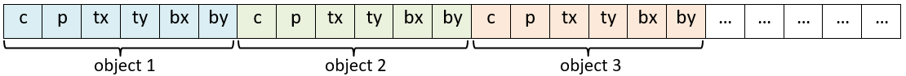
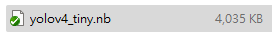
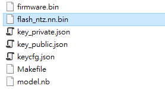
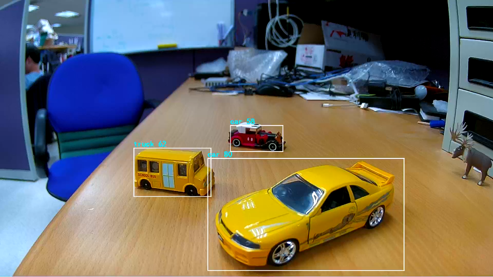
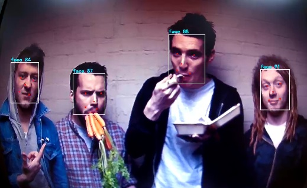
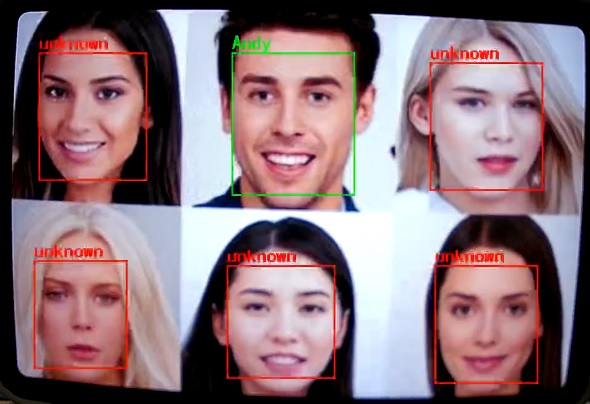

NN
==

.. contents::
  :local:
  :depth: 2

AmebaPro2 has an NN HW engine(NPU) to accelerate the neural network
inference process. NN models obtained from different AI framework, such
as Keras, Tensorflow, Tensorflow Lite, PyTorch, Caffe, ONNX, Darknet and
etc, can be converted to network binary graph file and be deployed on
AmebaPro2 easily.

NN module
---------

The NN mmf module – vipnn is provided to process the input RGB frame
from video module, and do NN inference. Then, NN inference result will
be stored in network output tensor. Since the output tensor format of
each model are different, vipnn module will also do the post-process
work for the NN output tensor to extract the information and convert to
understandable message. The pre-process and post-process function can
also be registered with their customized model.

VIPNN module
~~~~~~~~~~~~

The context of the video module shows as following:

.. code-block:: c

    typedef struct vipnn_ctx_s {
        void *parent;
        vip_network network;
        vip_buffer_create_params_t vip_param_in[MAX_IO_NUM];
        vip_buffer_create_params_t vip_param_out[MAX_IO_NUM];
        vip_buffer input_buffers[MAX_IO_NUM];
        vip_buffer output_buffers[MAX_IO_NUM];
        vipnn_params_t params;
        vipnn_status_t status;
        char network_name[64];
        int input_count;
        int output_count;
        vipnn_preproc_t pre_process;
        vipnn_postproc_t post_process;
        disp_postprcess_t disp_postproc;
        vipnn_cascaded_mode_t cas_mode;
        bool module_out_en;
        vipnn_measure_t measure;
    } vipnn_ctx_t;

Description of parameter in vipnn_ctx_t:

-  network: an opaque handle to the new network object if the request is
   executed successfully.

-  vip_param_in: parameter of network input tensor.

-  vip_param_out: parameter of network output tensor.

-  input_buffers: buffer for model input tensor.

-  output_buffers: buffer for model output tensor.

-  params: basic parameters for the vipnn module.

-  status: record status of vipnn module.

-  network_name: nn network name.

-  input_count: the number of input tensor in the NN network.

-  output_count: the number of output tensor in the NN network.

-  pre_process: pre-process function for processing the data before
   passing to NN inference.

-  post_process: post-process function for decoding the data from NN
   inference.

-  disp_postproc: Set the callback function for display the NN result on
   video frame. It could be set by using CMD_VIPNN_SET_DISPPOST.

-  module_out_en: enable module output.

-  measure: time measurement

Basic vipnn module parameters setting
^^^^^^^^^^^^^^^^^^^^^^^^^^^^^^^^^^^^^

Here are some vipnn module parameters provided to set.

.. code-block:: c
   :emphasize-lines: 10,14

    typedef struct vipnn_param_s {
        int model_type;
        char model_file[64];
        uint8_t *model_mem;
        uint32_t model_size;
        int fps;
        int in_width, in_height;
        rect_t roi;
        int m_width, m_height;        // should read from model, not user setting
        nn_data_param_t *in_param;
        nnmodel_t *model;
    } vipnn_params_t;
    // …
    nn_data_param_t in_param = {
        .img = {
            .width = NN_WIDTH,
            .height = NN_HEIGHT,
            .rgb = 0,
            .roi = {
                .xmin = 0,
                .ymin = 0,
                .xmax = NN_WIDTH,
                .ymax = NN_HEIGHT,
            }
        },
        .codec_type = AV_CODEC_ID_RGB888
    };

Use CMD_VIPNN_SET_IN_PARAMS to set up the NN input parameters.

-  img.width: input frame width.

-  img.height: input frame height.

-  img.rgb: reserved, do not care.

-  img.roi: ROI of input frame. Usually, we set it to (0,0,NN_WIDTH,
   NN_HEIGHT).

-  codec_type: model input type, could be AV_CODEC_ID_RGB888,
   AV_CODEC_ID_NV12, AV_CODEC_ID_NN_RAW.

.. note :: Model input codec type should be matched with media source output codec type.

Set NN model to vipnn module
^^^^^^^^^^^^^^^^^^^^^^^^^^^^

Use **CMD_VIPNN_SET_MODEL** to set up the NN model:

.. code-block:: c
   :emphasize-lines: 4

    vipnn_ctx = mm_module_open(&vipnn_module);
    if (vipnn_ctx) {
        // …
        mm_module_ctrl(vipnn_ctx, CMD_VIPNN_SET_MODEL, (int)&yolov4_tiny);
        // …
    }

Set NN result display callback function
^^^^^^^^^^^^^^^^^^^^^^^^^^^^^^^^^^^^^^^

User can register a call back function to so display the NN result or do
their own customized additional post-processing. Use
**CMD_VIPNN_SET_DISPPOST** to set up callback function for display the NN
result:

.. code-block:: c
   :emphasize-lines: 13

    static void nn_result_display (void *p, void *img_param)
    {
        objdetect_res_t *res = (objdetect_res_t *)p;
        nn_data_param_t *im = (nn_data_param_t *)img_param;

        /* Process or display the result here */
    }
    // …
    // …
    vipnn_ctx = mm_module_open(&vipnn_module);
    if (vipnn_ctx) {
        // …
        mm_module_ctrl(vipnn_ctx, CMD_VIPNN_SET_DISPPOST, (int)nn_result_display);
        // …
    }

Set NN object/face detection threshold
^^^^^^^^^^^^^^^^^^^^^^^^^^^^^^^^^^^^^^

There are two threshold values related to NN post-processing result –
confidence & NMS threshold.

Confidence is the score of the bounding box. Use
CMD_VIPNN_SET_SCORE_THRES to set up confidence score threshold:

.. code-block:: c
   :emphasize-lines: 2

    static float nn_confidence_thresh = 0.5;
    mm_module_ctrl(vipnn_ctx, CMD_VIPNN_SET_CONFIDENCE_THRES, (int)&nn_confidence_thresh);

For the same class, if the IOU (Intersection over union) of two bounding
box larger then NMS threshold, these two objects will be considered the
same object. Use **CMD_VIPNN_SET_NMS_THRES** to set up NMS threshold:

.. code-block:: c
   :emphasize-lines: 2

    static float nn_nms_thresh = 0.3;
    mm_module_ctrl(vipnn_ctx, CMD_VIPNN_SET_NMS_THRES, (int)&nn_nms_thresh);

|

Model Zoo
---------

Currently, the SDK provides several deployed models. They are listed in
following table:

Table Pro2 model list

==================== ============= =========================================================================
Category             Model         Description
==================== ============= =========================================================================
Object detection     | Yolov3-tiny https://github.com/AlexeyAB/darknet
                     | Yolov4-tiny
                     | Yolov7-tiny
Object detection     NanoDet-Plus  https://github.com/RangiLyu/nanodet	 
Face detection       SCRFD         https://github.com/deepinsight/insightface/tree/master/detection/scrfd
Face Recognition     MobileFaceNet https://github.com/deepinsight/insightface/tree/master/recognition
Sound classification YAMNet        https://github.com/tensorflow/models/tree/master/research/audioset/yamnet
==================== ============= =========================================================================

Object detection model
~~~~~~~~~~~~~~~~~~~~~~

SDK provides object detection model for user to evaluate – Yolov3-tiny,
Yolov4-tiny and Yolov7-tiny.

Yolo series model
^^^^^^^^^^^^^^^^^

YOLO (you only look once) is a neural network algorithm for object
detection, implemented with darknet architecture. Yolo is well-known for
its lightweight, less dependent and efficient in algorithms.

For more information, see Yolo’s Github maintain by its authors:
https://github.com/AlexeyAB/darknet

Face detection model
~~~~~~~~~~~~~~~~~~~~

Currently, the SDK provide a face detection model for user to evaluate –
SCRFD.

SCRFD
^^^^^

SCRFD(Sample and Computation Redistribution for Efficient Face
Detection) is an efficient high accuracy face detection approach.

For more information, see InsightFace official Github:
https://github.com/deepinsight/insightface/tree/master/detection/scrfd

Face Recognition model
~~~~~~~~~~~~~~~~~~~~~~

SDK provide a face recognition model for user to evaluate –
MobileFaceNet(ArcFace).

MobileFaceNet with ArcFace
^^^^^^^^^^^^^^^^^^^^^^^^^^

MobileFaceNet is a face recognition model trained with ArcFace (Additive
Angular Margin Loss).

For more information, see InsightFace official Github:
https://github.com/deepinsight/insightface/tree/master/recognition

Sound classification model
~~~~~~~~~~~~~~~~~~~~~~~~~~

A pre-trained sound classification model is provided in SDK – YAMNet.

YAMNet
^^^^^^

YAMNet is a model that can predicts 521 audio event classes based on the
AudioSet.

For more information, see TensorFlow official Github:

https://github.com/tensorflow/models/tree/master/research/audioset/yamnet

-  yamnet_fp16: official model used to predict 521 sounds

-  yamnet_s: RTK self-trained model to predict 2 alarm sounds — CO,
   Smoke

NN result format
~~~~~~~~~~~~~~~~

After NN model inference, the inference result will be store in NN
output tensor. These output tensors should be decoded in
post-processing.

vipnn_res_t structure is used to store the post-processing result:

.. code-block:: c

    typedef struct vipnn_res_s {
        union {
            objdetect_res_t od_res;         // for object detection
            facedetect_res_t fd_res;        // for face detection
            face_feature_res_t frec_res;    // for face recognition
        };
        int type;
    } vipnn_res_t;

**Object detection**

For the object detection result, the post-processing will parse the
object position and probability from the output tensor, and fill the
results to an objdetect_res_t structure:

.. code-block:: c

    #define MAX_DETECT_OBJ_NUM 128
    typedef struct objdetect_res_s {
        int obj_num;
        union {
            float result[MAX_DETECT_OBJ_NUM * 6];
            detobj_t res[MAX_DETECT_OBJ_NUM];
        };
    } objdetect_res_t;

Description of parameter in objdetect_res_t:

-  obj_num: indicate the number of object detected in current frame.

-  result: record the class_index, probability and bounding box position
   for each object as format in following figure.

   -  c: class_index

   -  p: probability

   -  tx, ty, bx, by: bounding box(top_x, top_y, bottom_x, bottom_y)

   object detection format

|

**Face detection**

For the face detection result, the post-processing will parse the face
position, score and landmarks from the output tensor, and fill the
results to facedetect_res_t structure:

.. code-block:: c

    typedef struct facedetect_res_s {
        int obj_num;
        union {
            float result[MAX_DETECT_OBJ_NUM * 6];
            detobj_t res[MAX_DETECT_OBJ_NUM];
        };
        landmark_t landmark[MAX_DETECT_OBJ_NUM];
    } facedetect_res_t;

**Face recognition**

For the face recognition result, the post-processing will decode the
face feature, and fill the results to face_feature_res_t structure:

.. code-block:: c

    #define MAX_FACE_FEATURE_DIM 128
    typedef struct face_feature_res_s {
        float result[MAX_FACE_FEATURE_DIM];
    } face_feature_res_t;

NN model preparation
--------------------

NN model should be prepared before using the NN example

Using existing NN model in SDK
~~~~~~~~~~~~~~~~~~~~~~~~~~~~~~

There are several existing NN model binary files provided in SDK:

-  yolov3_tiny.nb (416x416), yolov4_tiny.nb (416x416), yolov7_tiny.nb
   (416x416), yolov4_tiny_576x320.nb

-  yamnet_fp16.nb, yamnet_s.nb

-  scrfd_500m_bnkps_576x320_u8.nb, scrfd_500m_bnkps_640x640_u8.nb

-  mobilefacenet_int8.nb (112x112), mobilefacenet_int16.nb (112x112)

They are located in
"project/realtek_amebapro2_v0_example/src/test_model".

.. note :: In face recognition application, it would be better to remain the image aspect ratio to get a better accuracy. If user want to run object detection and face detection/recognition at the same time, we can choose scrfd_500m_bnkps_576x320_u8.nb and yolov4_tiny_576x320.nb.

NN memory evaluation
--------------------

This section shows how to evaluate NN model size and DDR usage. The
following table shows the memory information of existing model provided
in SDK:

Table Model memory and size

==================== ================= ========== ========= ============================ ============================
Category             Model             Input size Quantized DDR memory                   File size
==================== ================= ========== ========= ============================ ============================
Object detection     | Yolov3-tiny     | 416x416  | uint8   | 6.9 MB (6,946,128 bytes)|  | 5.6 MB (5,568,384 bytes)
                     | Yolov4-tiny     | 416x416  | uint8   | 7.7 MB (7,712,412 bytes)|  | 4.1 MB (4,131,712 bytes)
                     | Yolov4-tiny     | 576x320  | uint8   | 7.48 MB (7,840,836 bytes)  | 3.85 MB (4,043,136 bytes)
                     | Yolov7-tiny     | 416x416  | uint8   | 8.2 MB (8,597,072 bytes)   | 4.44 MB (4,664,512 bytes)
                     | NanoDet-Plus-m  | 416x416  | uint8   | 4.33 MB (4,542,016 bytes)  | 1.86 MB (1,959,040 bytes)
                     | NanoDet-Plus-m  | 576x320  | uint8   | 4.53 MB (4,746,556 bytes)  | 1.83 MB (1,924,096 bytes)
Face detection       | SCRFD           | 640x640  | uint8   | 4.1 MB (4,291,200 bytes)   | 0.68 MB (715,584 bytes)
                     | SCRFD           | 576x320  | uint8   | 2.6 MB (2,753,864 bytes)   | 0.56 MB (583,232 bytes)
Face Recognition     | MobileFaceNet   | 112x112  | int8    | 1.72 MB (1,799,716 bytes)  | 0.86 MB (904,576 bytes)
                     | MobileFaceNet   | 112x112  | int16   | 5.1 MB (5,343,948 bytes)   | 3.42MB (3,590,656 bytes)
Sound classification | YAMNet          | 15600x1  | fp16    | 9.2 MB (9,172,348 bytes)   | 8.7 MB (8,669,888 bytes)
                     | YAMNet_s        | 96x64    | hybrid  | 0.73 MB (729,608 bytes)    | 0.67 MB (678,336 bytes)
==================== ================= ========== ========= ============================ ============================

Evaluate memory usage of model
~~~~~~~~~~~~~~~~~~~~~~~~~~~~~~

Please refer the above table to evaluate the ddr memory usage of the
model. Take yolov4-tiny for example, it requires at least 8MB ddr
memory. Therefore, we have to make sure the NN ddr region in link script
is enough for this model.

Check and modify in
"project\\realtek_amebapro2_v0_example\\GCC-RELEASE\\application\\rtl8735b_ram.ld

.. code-block:: c
   :emphasize-lines: 5

    /* DDR memory */
                              
    VOE    (rwx)    : ORIGIN = 0x70000000, LENGTH = 0x70100000 - 0x70000000  /*  1MB */
    DDR    (rwx)    : ORIGIN = 0x70100000, LENGTH = 0x73000000 - 0x70100000  /* 49MB */
    NN     (rwx)    : ORIGIN = 0x73000000, LENGTH = 0x74000000 - 0x73000000  /* 16MB */

.. note :: Please also modify project/realtek_amebapro2_v0_example/GCC-RELEASE/bootloader/rtl8735b_boot_mp.ld to make the NN ddr region be consistent with rtl8735b_ram.ld. In addition, if building a TrustZone project, rtl8735b_ram_ns.ld should be modified instead of rtl8735b_ram.ld.

Evaluate model size
~~~~~~~~~~~~~~~~~~~

Please make sure the NN region in partition table is larger than your
model size, so that the model can be downloaded to flash correctly.

Take yolov4-tiny for example, the model size is about 4MB

   model network binary

The nn region length in "project\\realtek_amebapro2_v0_example\\GCC-RELEASE\\mp\\amebapro2_partitiontable.json" should not less than 4MB

.. code-block:: c
   :emphasize-lines: 3

    "nn":{
                "start_addr" : "0x770000",
                "length" : "0x700000",
                "type": "PT_NN_MDL",
                "valid": true
          },

|

Using the NN MMF example with VIPNN module
------------------------------------------

The NN example is a part of mmf video joined example. Please uncomment
the example want to execute.

(project/realtek_amebapro2_v0_example/src/mmfv2_video_example/video_example_media_framework.c)

.. code-block:: c

    mmf2_video_example_vipnn_rtsp_init();
    //mmf2_video_example_vipnn_facedet_init();
    //mmf2_video_example_face_rtsp_init();
    //mmf2_video_example_joint_test_all_nn_rtsp_init();
    //mmf2_video_example_joint_test_vipnn_rtsp_mp4_init;
    //mmf2_video_example_audio_vipnn_init();

**Current supported VIP NN examples**

Table NN examples

================================================= ============================================================ ================================================================================================
Example                                           Description                                                  Result
================================================= ============================================================ ================================================================================================
mmf2_video_example_vipnn_rtsp_init                Video (H264/H265)-> RTSP (V1)                                (1) RTSP video stream over the network.
                                                                                                              
                                                  Video (RGB) -> NN (V4)                                       (2) NN do object detection and draw the bounding box to RTSP channel.
mmf2_video_example_md_nn_rtsp_init                Video (H264/H265) -> RTSP (V1)                               (1) RTSP video stream over the network.
                                                                                                              
                                                  Video (RGB) -> MD (V4)-> NN                                  (2) MD module detect motion. If there is motion detected, it will trigger NN module to detect object and draw the bounding box to RTSP channel.
mmf2_video_example_vipnn_facedet_init             Video (H264/H265) -> RTSP (V1)                               (1) RTSP video stream over the network.
                                                                                                              
                                                  Video (RGB) -> NN face detect (V4)                           (2) NN do face detection then draw the bounding box and face landmark to RTSP channel.
mmf2_video_example_face_rtsp_init                 Video (H264/H265) -> RTSP (V1)                               (1) RTSP video stream over the network.
                                                                                                              
                                                  Video (RGB) -> NN face detect (V4) -> NN face recognition    (2) NN do face detection and face recognition, and then draw the bounding box and face recognition result to RTSP channel.
mmf2_video_example_joint_test_all_nn_rtsp_init    Video (H264/H265) -> RTSP (V1)                               (1) RTSP video stream over the network.
                                                                                                              
                                                  RGB -> NN object detect (V4)                                 (2) NN do object detection, face detection and face recognition, and then draw the bounding box and face recognition result to RTSP channel.
                                                                                                              
                                                  RGB -> NN face detect (V4) -> NN face recognition            NN do audio classification.
                                                                                                              
                                                  AUDIO -> NN audio classification                            
mmf2_video_example_joint_test_vipnn_rtsp_mp4_init H264 -> MP4 (V1)                                             (1) RTSP video stream over the network.
                                                                                                              
                                                  Video (H264/H265) -> RTSP (V2)                               (2) AmebaPro2 will record three videos (720P 30FPS+AAC) to the SD card for 30 seconds each. The default storage name is : AmebaPro2_recording_0.mp4 AmebaPro2_recording_1.mp4 AmebaPro2_recording_2.mp4
                                                                                                              
                                                  RGB -> NN object detect (V4)                                 (3) Streaming AAC sounds to AmebaPro2 via the network.
                                                                                                              
                                                  RGB -> NN face detect (V4) -> NN face recognition (optional) (4) RTP send the audio stream from network to AmebaPro2 and the stream is decoded by AAD and played through 3.5 audio jack.
                                                                                                              
                                                  AUDIO -> AAC -> RTSP and mp4                                 (5) NN do object detection, face detection and face recognition, and then draw the bounding box and face recognition result to RTSP channel.
                                                                                                              
                                                  RTP -> AAD -> AUDIO                                          NN do audio classification.
                                                                                                              
                                                  AUDIO -> NN audio classification                            
mmf2_video_example_audio_vipnn_init.c             AUDIO -> NN                                                  The sound received by AmebaPro2 can be transmitted to NN engine to do sound classification.
================================================= ============================================================ ================================================================================================

Set RGB video resolution as model input size
~~~~~~~~~~~~~~~~~~~~~~~~~~~~~~~~~~~~~~~~~~~~

If setting the RGB resolution according to NN model input tensor shape,
it can avoid image resizing and save pre-processing time.

For example, if you are using yolov4-tiny with input size 416x416, you
should set NN_WIDTH and NN_HEIGHT to 416 in video_v4_params.

.. code-block:: c
   :emphasize-lines: 5,6,17,18

    #define YOLO_MODEL              1
    #define USE_NN_MODEL            YOLO_MODEL
    // …
    #if (USE_NN_MODEL==YOLO_MODEL)
    #define NN_WIDTH    416
    #define NN_HEIGHT   416
    static float nn_confidence_thresh = 0.4;
    static float nn_nms_thresh = 0.3;
    #else
    #error Please set model correctly. (YOLO_MODEL)
    #endif
    // …
    static video_params_t video_v4_params = {
        .stream_id       = NN_CHANNEL,
        .type            = NN_TYPE,
        .resolution      = NN_RESOLUTION,
        .width           = NN_WIDTH,
        .height          = NN_HEIGHT,
        .bps             = NN_BPS,
        .fps             = NN_FPS,
        .gop             = NN_GOP,
        .direct_output   = 0,
        .use_static_addr = 1
    };

.. note :: Please always check the NN model input size and set RGB video output size according to it. Otherwise, software image resizing will be used in pre-process, and it will cost a lot of CPU usage.

Set RGB video output as resized or cropped
~~~~~~~~~~~~~~~~~~~~~~~~~~~~~~~~~~~~~~~~~~

The RGB video parameter can be adjust and make RGB output a resized
image or cropped image.

**Output cropped RGB:**

.. code-block:: c

    static video_params_t video_v4_params = {
        .stream_id      = NN_CHANNEL,
        .type           = NN_TYPE,
        .resolution     = NN_RESOLUTION,
        .width      = NN_WIDTH,
        .height         = NN_HEIGHT,
        .bps            = NN_BPS,
        .fps            = NN_FPS,
        .gop            = NN_GOP,
        .direct_output  = 0,
        .use_static_addr = 1
    };

**Output resized RGB (1920 x 1080 NN_WIDTH x NN_HEIGHT):**

.. code-block:: c
   :emphasize-lines: 12,13,14,15,16,17

    static video_params_t video_v4_params = {
        .stream_id      = NN_CHANNEL,
        .type           = NN_TYPE,
        .resolution     = NN_RESOLUTION,
        .width      = NN_WIDTH,
        .height         = NN_HEIGHT,
        .bps            = NN_BPS,
        .fps            = NN_FPS,
        .gop            = NN_GOP,
        .direct_output  = 0,
        .use_static_addr = 1,
        .use_roi = 1,
        .roi = {
            .xmin = 0,
            .ymin = 0,
            .xmax = 1920, //SENSOR MAX WIDTH
            .ymax = 1080, //SENSOR MAX HEIGHT
        }
    };

|

Choose NN model
~~~~~~~~~~~~~~~

| Please check the desired models are selected in
  amebapro2_fwfs_nn_models.json, so that the model will be packed into
  the final firmware image. For example, if we want to use yolov4_tiny
  and YAMNet_s, go to
  "project/realtek_amebapro2_v0_example/GCC-RELEASE/mp/
| amebapro2_fwfs_nn_models.json" and set model yolov4_tiny - "MODEL0"
  and YAMNet_s - "MODEL2" be used:

.. code-block:: c
   :emphasize-lines: 7,8

    {
        "msg_level":3,

        "PROFILE":["FWFS"],
        "FWFS":{
             "files":[
                "MODEL0",
                "MODEL2"
             ]
        },
        "MODEL0":{
            "name" : "yolov4_tiny.nb",
            "source":"binary",
            "file":"yolov4_tiny.nb"
     
        },
        "MODEL1":{
            "name" : "yamnet_fp16.nb",
            "source":"binary",
            "file":"yamnet_fp16.nb"

        },
        "MODEL2":{
            "name" : "yamnet_s.nb",
            "source":"binary",
            "file":"yamnet_s.nb"

        },
        "MODEL3":{
            "name" : "mobilefacenet_int16.nb",
            "source":"binary",
            "file":"mobilefacenet_int16.nb"

        }
    }

.. note :: After choosing the model, user have to check the ddr memory and flash size usage of models. Please refer 1.5.1 and 1.5.2 to do evaluation.

|

Build NN example
~~~~~~~~~~~~~~~~

Since it’s a part of video mmf example, user should use the following
command to generate the makefile.

Generate the makefile for the NN project:

.. code-block:: bash

    cmake .. -G"Unix Makefiles" -DCMAKE_TOOLCHAIN_FILE=../toolchain.cmake -DVIDEO_EXAMPLE=ON

Then, use the following command to generate an image with NN model
inside:

.. code-block:: bash

    cmake --build . --target flash_nn

After running the command above, you will get the flash_ntz.nn.bin
(including the model) in
"project\\realtek_amebapro2_v0_example\\GCC-RELEASE\\build"

   image with NN model

Then, use the image tool to download it to AmebaPro2.

Update NN model on flash
~~~~~~~~~~~~~~~~~~~~~~~~

If user just want to update the NN model instead of updating whole
firmware, the following command can be used to update NN section on
flash partially:

**Nand flash**

.. code-block:: bash

    $ .\uartfwburn.exe -p COM? -f .\flash_ntz.nn.bin -b 3000000 -n pro2 -t 0x81cf

Validate NN example
~~~~~~~~~~~~~~~~~~~

Refer the following section to validate nn examples.

Object detection example
^^^^^^^^^^^^^^^^^^^^^^^^

While running the example, you may need to configure WiFi connection by
using these commands in uart terminal.

.. code-block:: bash

    ATW0=<WiFi_SSID> : Set the WiFi AP to be connected
    ATW1=<WiFi_Password> : Set the WiFi AP password
    ATWC : Initiate the connection

If everything works fine, you should see the following logs

.. code-block:: bash

    …
    [VOE]RGB3 640x480 1/5
    [VOE]Start Mem Used ISP/ENC:     0 KB/    0 KB Free=  701
    hal_rtl_sys_get_clk 2
    GCChipRev data = 8020
    GCChipDate data = 20190925
    queue 20121bd8 queue mutex 71691380
    npu gck vip_drv_init, video memory heap base: 0x71B00000, size: 0x01300000
    yuv in 0x714cee00
    [VOE][process_rgb_yonly_irq][371]Errrgb ddr frame count overflow : int_status 0x00000008 buf_status 0x00000010 time 15573511 cnt 0
    input 0 dim 416 416 3 1, data format=2, quant_format=2, scale=0.003660, zero_point=0
    ouput 0 dim 13 13 255 1, data format=2, scale=0.092055, zero_point=216
    ouput 1 dim 26 26 255 1, data format=2, scale=0.093103, zero_point=216
    ---------------------------------
    input count 1, output count 2
    input param 0
            data_format  2
            memory_type  0
            num_of_dims  4
            quant_format 2
            quant_data  , scale=0.003660, zero_point=0
            sizes        1a0 1a0 3 1 0 0
    output param 0
            data_format  2
            memory_type  0
            num_of_dims  4
            quant_format 2
            quant_data  , scale=0.092055, zero_point=216
            sizes        d d ff 1 0 0
    output param 1
            data_format  2
            memory_type  0
            num_of_dims  4
            quant_format 2
            quant_data  , scale=0.093103, zero_point=216
            sizes        1a 1a ff 1 0 0
    ---------------------------------
    in 0, size 416 416
    VIPNN opened
    siso_array_vipnn started
    nn tick[0] = 47
    object num = 0
    nn tick[0] = 46
    object num = 0
    …

Then, open VLC and create a network stream with URL: rtsp://192.168.x.xx:554

If everything works fine, you should see the object detection result on
VLC player.

   VLC validation

|

Face detection example
^^^^^^^^^^^^^^^^^^^^^^

While running the example, you may need to configure WiFi connection by
using these commands in uart terminal.

.. code-block:: bash

    ATW0=<WiFi_SSID> : Set the WiFi AP to be connected
    ATW1=<WiFi_Password> : Set the WiFi AP password
    ATWC : Initiate the connection

If everything works fine, you should see the following logs

.. code-block:: bash

    …
    [VOE]RGB3 640x480 1/10
    [VOE]zoom default setting
    [VOE]status == 1718
    [VOE]release s4 isp buffer 0
    [VOE]release s4 isp buffer 1
    hal_rtl_sys_get_clk 0
    GCChipRev data = 8020
    GCChipDate data = 20190925
    queue 20129598 queue mutex 71c17500
    npu gck vip_drv_init, video memory heap base: 0x72800000, size: 0x01800000
    NN IRQ default priority : 0, set to 9
    ---------------------------------
    input count 1, output count 4
    input param 0
            data_format  2
            memory_type  0
            num_of_dims  4
            quant_format 2
            quant_data  , scale=1.000000, zero_point=0
            sizes        280 1e0 3 1 0 0
    output param 0
            data_format  2
            memory_type  0
            num_of_dims  4
            quant_format 2
            quant_data  , scale=0.003550, zero_point=0
            sizes        a0 78 1 1 0 0
    output param 1
            data_format  2
            memory_type  0
            num_of_dims  4
            quant_format 2
            quant_data  , scale=0.019616, zero_point=0
            sizes        a0 78 2 1 0 0
    output param 2
            data_format  2
            memory_type  0
            num_of_dims  4
            quant_format 2
            quant_data  , scale=0.004289, zero_point=130
            sizes        a0 78 2 1 0 0
    output param 3
            data_format  2
            memory_type  0
            num_of_dims  4
            quant_format 2
            quant_data  , scale=0.004716, zero_point=1
            sizes        a0 78 a 1 0 0
    ---------------------------------
    VIPNN opened
    siso_video_vipnn started
    NN OSD Draw start
    nn_rect_ch:0, nn_rect_txt_w:16, nn_rect_txt_h:32.
    font resize new size: 4768.
    font resize new size: 3688.
    font resize from 32 64 to 16 32.
    font resize from 64 64 to 32 32.
    font resize:22.
    object num = 1
    0,c0:928 333 1235 700
    object num = 1
    0,c0:942 325 1237 691
    object num = 1
    0,c0:944 332 1234 684
    object num = 1
    0,c0:933 332 1229 684
    object num = 1
    0,c0:930 332 1232 684
    …

Then, open VLC and create a network stream with URL: rtsp://192.168.x.xx:554

If everything works fine, you should see the face detection result on
VLC player.

   face detection VLC validation (COCO 2017)

|

Face recognition example
^^^^^^^^^^^^^^^^^^^^^^^^

While running the example, you may need to configure WiFi connection by
using these commands in uart terminal.

.. code-block:: bash

    ATW0=<WiFi_SSID> : Set the WiFi AP to be connected
    ATW1=<WiFi_Password> : Set the WiFi AP password
    ATWC : Initiate the connection

If everything works fine, you should see the following logs

.. code-block:: bash

    …
    [VOE]RGB3 640x480 1/10
    [VOE]zoom default setting
    [VOE]status == 1718
    [VOE]release s4 isp buffer 0
    [VOE]release s4 isp buffer 1
    hal_rtl_sys_get_clk 0
    GCChipRev data = 8020
    GCChipDate data = 20190925
    queue 20129d78 queue mutex 71c19aa0
    npu gck vip_drv_init, video memory heap base: 0x72800000, size: 0x01800000
    NN IRQ default priority : 0, set to 9
    Init 1 Queue elements
    ---------------------------------
    input count 1, output count 4
    input param 0
            data_format  2
            memory_type  0
            num_of_dims  4
            quant_format 2
            quant_data  , scale=1.000000, zero_point=0
            sizes        280 1e0 3 1 0 0
    output param 0
            data_format  2
            memory_type  0
            num_of_dims  4
            quant_format 2
            quant_data  , scale=0.003550, zero_point=0
            sizes        a0 78 1 1 0 0
    output param 1
            data_format  2
            memory_type  0
            num_of_dims  4
            quant_format 2
            quant_data  , scale=0.019616, zero_point=0
            sizes        a0 78 2 1 0 0
    output param 2
            data_format  2
            memory_type  0
            num_of_dims  4
            quant_format 2
            quant_data  , scale=0.004289, zero_point=130
            sizes        a0 78 2 1 0 0
    output param 3
            data_format  2
            memory_type  0
            num_of_dims  4
            quant_format 2
            quant_data  , scale=0.004716, zero_point=1
            sizes        a0 78 a 1 0 0
    ---------------------------------
    VIPNN opened
    Init 1 Queue elements
    ---------------------------------
    input count 1, output count 1
    input param 0
            data_format  2
            memory_type  0
            num_of_dims  4
            quant_format 0
            quant_data  , none-quant
            sizes        70 70 3 1 0 0
    output param 0
            data_format  5
            memory_type  0
            num_of_dims  2
            quant_format 1
            quant_data  , dfp=13
            sizes        80 1 0 0 0 0
    ---------------------------------
    VIPNN2 opened
    FACERECOG opened
    siso_facenet_facerecog started
    siso_facedet_facenet started
    siso_array_vipnn started
    NN OSD Draw start
    nn_rect_ch:0, nn_rect_txt_w:16, nn_rect_txt_h:32.
    font resize new size: 4768.
    font resize new size: 3688.
    font resize from 32 64 to 16 32.
    font resize from 64 64 to 32 32.
    font resize:22.
    update ROI 408 0 531 92
    center 437,20 rotate -5.042451
    --------> no data
    object num = 0
    update ROI 406 0 533 95
    center 433,23 rotate -5.194429
    --------> no data
    object num = 0
    update ROI 410 0 529 94
    center 435,25 rotate -6.115504
    --------> no data
    …

User can use console command to register their face with person ID.

Let camera shooting your face and run the following command to register
your face:

.. code-block:: bash

    FREG=My_Name

Then, your ID will be registered and please open VLC to check the result

   face recognition VLC validation (AI generated faces)

You can also register other person with their ID

.. code-block:: bash

    FREG=Person_ID_1
    …
    FREG=Person_ID_2
    …
    FREG=Person_ID_3
    …

If you want to clear and reset all registered person ID, run following
command to reset:

.. code-block:: bash

    FRFR

If you want to save the registered face feature to flash, please run

.. code-block:: bash

    FRFS

After saving the features to flash, you can load the registered face
feature from flash after system reboot

.. code-block:: bash

    FRFL

Audio classification example
^^^^^^^^^^^^^^^^^^^^^^^^^^^^

If everything works fine, you should see the following logs

.. code-block:: bash

    …
    Deploy YAMNET_S
    fci part tbl start   10
    fci part tbl dup cnt 8
    update page size 2048  page per block 64
    type_name NN_MDL, file_name yamnet_s.nb
    open: part_rec 7043d6a0, part_recs_cnt 1, type_id 81cf
    file yamnet_s.nb, len 678336
    network 70431540
    input 0 dim 1 64 96 1, data format=1, quant_format=0, none-quant
    ouput 0 dim 3 1 0 0, data format=1, none-quant
    ---------------------------------
    input count 1, output count 1
    input param 0
            data_format  1
            memory_type  0
            num_of_dims  4
            quant_format 0
            quant_data  , none-quant
            sizes        1 40 60 1 0 0
    output param 0
            data_format  1
            memory_type  0
            num_of_dims  2
            quant_format 0
            quant_data  , none-quant
            sizes        3 1 0 0 0 0
    ---------------------------------
    in 0, size 1 64
    VIPNN opened
    siso_audio_vipnn started
    YAMNET_S tick[0] = 2
    class 1, prob 1.00
    YAMNET_S tick[0] = 2
    class 1, prob 1.00
    YAMNET_S tick[0] = 1
    class 1, prob 1.00
    YAMNET_S tick[0] = 1
    class 1, prob 1.00
    YAMNET_S tick[0] = 1
    class 1, prob 1.00
    …

User can use audio sample to validate the result. Use CO & smoke audio
smaple in
https://research.google.com/audioset/dataset/smoke_detector_smoke_alarm.html
to verify the result.

YAMNet_s can recognize 3 audio classes:

(1) class 0: CO

(2) class 1: Others

(3) class 2: Smoke
