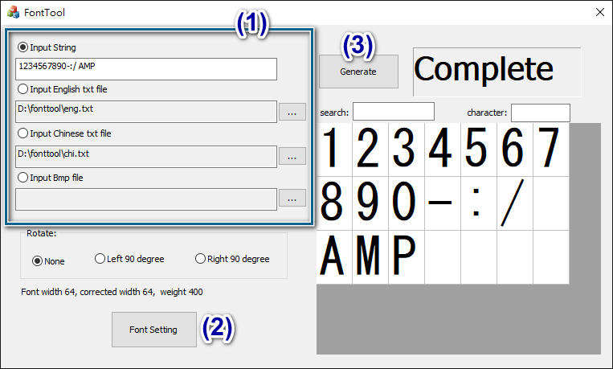
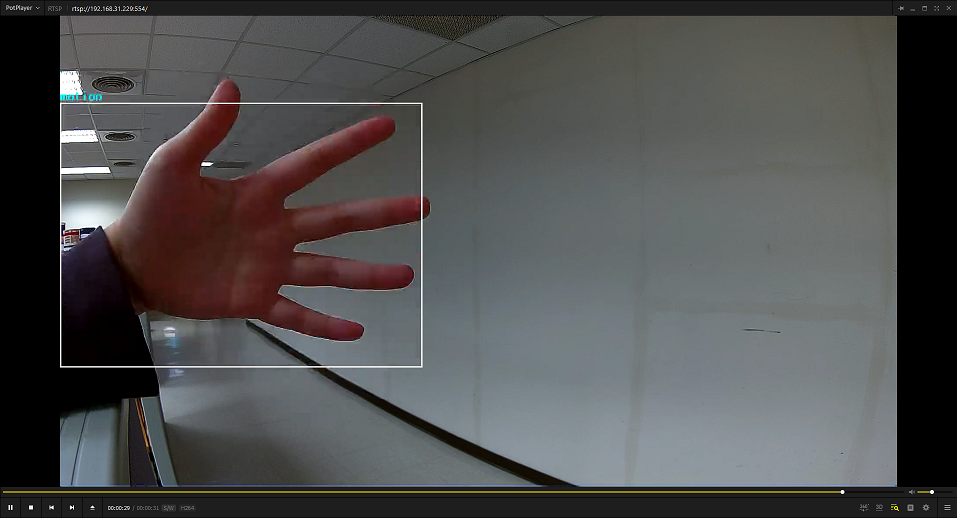

ISP
===

.. contents::
  :local:
  :depth: 2

AmebaPro2 has a video engine integrating following function block:
sensor driver, image signal processor, OSD and motion detection. The
following chapters describe the software flow to setup AmebaPro2 ISP
function.

Sensor Driver
-------------

AmebePro2 supports single sensor input with ISP engine processing and
output up to 4 channel with independent configuration. Based on
AmebaPro2 Spec, ISP can support up to 5m resolution (but fps need to be
calculated by bandwidth limitation). In this chapter, we will introduce
sensor driver information such as sensor list and sensor configuration.

Sensor list
~~~~~~~~~~~

RTK will update support sensor driver regularly. User can contact
RTK-FAE to get newest sensor list. The following table shows support
list with sensor information.

Table 1‑1 Support sensor list on AmebaPro2

=========== ======== ====================== ===========
Vendor      Sensor   Max Resolution and FPS Description
=========== ======== ====================== ===========
Galaxycore  GC2053   1920x1080 * 30       
Galaxycore  GC4653   2560x1440 * 15       
PrimeSensor PS5258   1920x1080 * 30       
PrimeSensor PS5270   1536x1536 * 30       
SmartSens   SC2336   1920x1080 * 30       
SmartSens   SC301IOT 2048x1536 * 20       
SOI         JXF37P   1920x1080 * 30       
SOI         JXF51    1536x1536 * 30       
Sony        IMX307   1920x1080 * 30         With HDR
Sony        IMX327   1920x1080 * 30         With HDR
ImageDesign MIS2008  1920x1080 * 30       
=========== ======== ====================== ===========

Sensor configuration
~~~~~~~~~~~~~~~~~~~~

User can check supported sensor list and sensor settings is in
"project\\realtek_amebapro2_v0_example\\inc\\sensor.h"

Setup
^^^^^

-  Check sensor list

First, check whether your sensor is in the list or not. If not, add your
sensor by below steps.

Take "\ **SENSOR_SC301**\ " as example, add sensor parameters to the
list. (refers to the words in red)

.. code-block:: c
   :linenos:
   :emphasize-lines: 8,18

    #define SENSOR_DUMMY        0x00 //For dummy sensor, no support fast camera start
    #define SENSOR_SC2336       0x01
    #define SENSOR_GC2053       0x02
    // …
    // …
    #define SENSOR_PS5268       0x0F
    #define SENSOR_SC2310       0x10
    #define SENSOR_SC301        0x11

    static const struct sensor_params_t sensor_params[] = {
        {1920, 1080, 30}, //DUMMY
        {1920, 1080, 30}, //SC2336
        {1920, 1080, 30}, //GC2053
    // …
    // …
        {1920, 1080, 30}, //PS5268
        {1920, 1080, 30}, //SC2310
        {2048, 1536, 20}, //SC301
    };

-  Setup max sensor number.

.. code-block:: c

    #define SENSOR_MAX 5

[Description]

**SENSOR_MAX**: If 4 sensors are used, please set the parameter to 5,
because the first column needs to place the dummy data required by
FCS.

-  Fill in sensor pool

.. code-block:: c
   :linenos:
   :emphasize-lines: 3

    static const unsigned char sen_id[SENSOR_MAX] = {
        SENSOR_DUMMY,
        SENSOR_SC301,
        SENSOR_GC4653,
        SENSOR_GC4023,
        SENSOR_SC2333
    };

[Description]

**sen_id[ ]:** Fill the sensors in this array

-  Setup use sensor.

.. code-block:: c

    #define USE_SENSOR SENSOR_SC301

[Description]

**SENSOR_MAX**: If 4 sensors are used, please set the parameter to 5,
because the first column needs to place the dummy data required by
FCS.

-  Fill in manual IQ list (For manual mode, see example in next section)

.. code-block:: c
   :linenos:
   :emphasize-lines: 3,4,5,6

    static const char manual_iq[SENSOR_MAX][64] = {
        "iq",
        "iq_sc301_ver20220101",
        "iq_sc301_ver20230301",
        "iq_sc301_ver20230601",
        "iq_sc301_ver20230717",
    };

[Description]

**manual_iq[ ]:** Fill in the IQ file name.

-  Setup max sensor number (For manual mode, see example in next section)

.. code-block:: c

    #define MANUAL_SENSOR_IQ 0x01

[Description]

**MANUAL_SENSOR_IQ:** The order in "manual_iq".

|

How to apply "sensor.h" file to fit to customized usage
~~~~~~~~~~~~~~~~~~~~~~~~~~~~~~~~~~~~~~~~~~~~~~~~~~~~~~~

One sensor vs. one IQ (auto mode)
^^^^^^^^^^^^^^^^^^^^^^^^^^^^^^^^^

-  Files in
   "component\\soc\\8735b\\fwlib\\rtl8735b\\lib\\source\\ram\\video\\voe_bin"

.. code-block:: bash

    sensor_sc301.bin
    iq_sc301.bin
    fcs_data_sc301.bin

-  Example

.. code-block:: c
   :linenos:
   :emphasize-lines: 8,18,25,31

    #define SENSOR_DUMMY        0x00 //For dummy sensor, no support fast camera start
    #define SENSOR_SC2336       0x01
    #define SENSOR_GC2053       0x02
    // …
    // …
    #define SENSOR_PS5268       0x0F
    #define SENSOR_SC2310       0x10
    #define SENSOR_SC301        0x11

    static const struct sensor_params_t sensor_params[] = {
        {1920, 1080, 30}, //DUMMY
        {1920, 1080, 30}, //SC2336
        {1920, 1080, 30}, //GC2053
    // …
    // …
        {1920, 1080, 30}, //PS5268
        {1920, 1080, 30}, //SC2310
        {2048, 1536, 20}, //SC301
    };

    #define SENSOR_MAX         5

    static const unsigned char sen_id[SENSOR_MAX] = {
        SENSOR_DUMMY,
        SENSOR_SC301,
        SENSOR_GC4653,
        SENSOR_GC4023,
        SENSOR_SC2333
    };

    #define USE_SENSOR          SENSOR_SC301

    static const   char manual_iq[SENSOR_MAX][64] = {
        "iq",
        "iq_gc2053",
        "iq_gc4653",
        "iq_gc4023",
        "iq_sc2333",
    };

    #define MANUAL_SENSOR_IQ    0xFF

..

One sensor vs. multiple IQ (manual mode)
^^^^^^^^^^^^^^^^^^^^^^^^^^^^^^^^^^^^^^^^

-  Confirm files in
   "component\\soc\\8735b\\fwlib\\rtl8735b\\lib\\source\\ram\\video\\voe_bin"

.. code-block:: bash

    sensor_sc301.bin
    iq_sc301_ver20220101.bin
    iq_sc301_ver20230717.bin
    fcs_data_sc301.bin

-  Example

.. code-block:: c
   :linenos:
   :emphasize-lines: 8,18,21,25,26,29,33,34,37
   
    #define SENSOR_DUMMY        0x00 //For dummy sensor, no support fast camera start
    #define SENSOR_SC2336       0x01
    #define SENSOR_GC2053       0x02
    // …
    // …
    #define SENSOR_PS5268       0x0F
    #define SENSOR_SC2310       0x10
    #define SENSOR_SC301        0x11

    static const struct sensor_params_t sensor_params[] = {
        {1920, 1080, 30}, //DUMMY
        {1920, 1080, 30}, //SC2336
        {1920, 1080, 30}, //GC2053
    // …
    // …
        {1920, 1080, 30}, //PS5268
        {1920, 1080, 30}, //SC2310
        {2048, 1536, 20}, //SC301
    };

    #define SENSOR_MAX         3

    static const unsigned char sen_id[SENSOR_MAX] = {
        SENSOR_DUMMY,
        SENSOR_SC301,
        SENSOR_SC301
    };

    #define USE_SENSOR          SENSOR_SC301

    static const      char manual_iq[SENSOR_MAX][64] = {
        "iq",
        "iq_sc301_ver20220101",
        "iq_sc301_ver20230717",
    };

    #define MANUAL_SENSOR_IQ    0x01

Multiple sensor vs. multiple IQ
^^^^^^^^^^^^^^^^^^^^^^^^^^^^^^^

Supposed that we have following complexity set for one project, dual
mode for sensor (HDR / Linear), dual lens(1\ :sup:`st` source /
2\ :sup:`nd` source) with dual mode (production / manufacture). Here is
an example of configuring the **sensor.h** file.

Table 1‑2 Combination cases for SENSOR/IQ/FCS usage.

===== ========================== ================= ============================================
Index Fcs Sensor Bin             Normal Sensor Bin IQ Bin
===== ========================== ================= ============================================
0     fcs_data_sensor_linear.bin sensor_linear.bin iq_sensor_project_1stlens_linear_production
1     fcs_data_sensor_linear.bin sensor_linear.bin iq_sensor_project_1stlens_linear_manufacture
2     fcs_data_sensor_linear.bin sensor_linear.bin iq_sensor_project_2ndlens_linear_production
3     fcs_data_sensor_linear.bin sensor_linear.bin iq_sensor_project_2ndens_linear_manufacture
4     fcs_data_sensor_hdr.bin    sensor_hdr.bin    iq_sensor_project_1stlens_hdr_production
5     fcs_data_sensor_hdr.bin    sensor_hdr.bin    iq_sensor_project_1stlens_hdr_manufacture
6     fcs_data_sensor_hdr.bin    sensor_hdr.bin    iq_sensor_project_2ndlens_hdr_production
7     fcs_data_sensor_hdr.bin    sensor_hdr.bin    iq_sensor_project_2ndens_hdr_manufacture
===== ========================== ================= ============================================

According to the table, first make sure that the sensor/IQ/FCS files has
been placed in the path\ **:component\\soc\\8735b\\fwlib\\rtl8735b\\lib\\source\\ram\\video\\voe_bin**

As follows, then we can implement this example through the configuration
in **sensor.h**

.. code-block:: c
   :linenos:
   :emphasize-lines: 8,9,19,20,23,27,28,29,30,31,32,33,34,37,41,42,43,44,45,46,47,48,51

    #define SENSOR_DUMMY        0x00 //For dummy sensor, no support fast camera start
    #define SENSOR_SC2336       0x01
    #define SENSOR_GC2053       0x02
    // …
    // …
    #define SENSOR_PS5268       0x0F
    #define SENSOR_SC2310       0x10
    #define SENSOR_LINEAR       0x11
    #define SENSOR_HDR          0x12

    static const struct sensor_params_t sensor_params[] = {
        {1920, 1080, 30}, //DUMMY
        {1920, 1080, 30}, //SC2336
        {1920, 1080, 30}, //GC2053
    // …
    // …
        {1920, 1080, 30}, //PS5268
        {1920, 1080, 30}, //SC2310
        {1920, 1080, 30}, //SENSOR_LINEAR
        {1920, 1080, 20}, //SENSOR_HDR
    };

    #define SENSOR_MAX         9

    static const unsigned char sen_id[SENSOR_MAX] = {
        SENSOR_DUMMY,
        SENSOR_LINEAR,
        SENSOR_LINEAR,
        SENSOR_LINEAR,
        SENSOR_LINEAR,
        SENSOR_HDR,
        SENSOR_HDR,
        SENSOR_HDR,
        SENSOR_HDR
    };

    #define USE_SENSOR          SENSOR_LINEAR

    static const      char manual_iq[SENSOR_MAX][64] = {
        "iq_dummy",
        "iq_sensor_project_1stlens_linear_production",
        "iq_sensor_project_1stlens_linear_manufacture",
        "iq_sensor_project_2ndlens_linear_production",
        "iq_sensor_project_2ndens_linear_manufacture",
        "iq_sensor_project_1stlens_hdr_production",
        "iq_sensor_project_1stlens_hdr_manufacture",
        "iq_sensor_project_2ndlens_hdr_production",
        "iq_sensor_project_2ndens_hdr_manufacture",
    };

    #define MANUAL_SENSOR_IQ    0x01

Cleanup and Rebuild
~~~~~~~~~~~~~~~~~~~

After finishing the configuration, please cleanup below path, and
rebuild the project to make sure sensor setting take effect.

.. code-block:: bash

    project\realtek_amebapro2_v0_example\GCC-RELEASE\build

Image Quality
-------------

User can bring up sensor with basic image quality on RTK-EVT or user’s
DUT. Image Quality will vary based on selected lens and optical
structure. For different application, end customer will also have
different image quality criteria. Based on each project, user can check
subjective and objective image quality criteria or compare with target
DUT. For advanced image quality tuning support, user can contact
RTK-FAE.

Use UVC Example
~~~~~~~~~~~~~~~

AmebaPro2 ISP can support compressed (H264 / H265 / JPG) and
uncompressed (NV16 / NV12) image through UVC (wired transmission), and
user can check video on pc with Potplayer, Amcap or RTK-realcam. For
uncompressed format, user need to install RTK decoder to get video on
computer. User can use following flow to build UVC example. Generate the
makefile for the UVC project:

.. code-block:: bash
    
	cmake .. -G"Unix Makefiles" -DCMAKE_TOOLCHAIN_FILE=../toolchain.cmake -DEXAMPLE=media_uvcd

Then, use the following command to generate an image:

.. code-block:: bash

    cmake --build . --target flash

Mode switch through IQ configuration
~~~~~~~~~~~~~~~~~~~~~~~~~~~~~~~~~~~~

AmebaPro2 ISP use iq bin defined at json file to set image quality
parameter. For each iq bin file, it would contain up to 3 iq tables.
User can use ISP API to switch. ( isp_set_day_night() for iq table
switch, isp_set_gray_mode() for color/gray mode switch) For general
usage, suggestion configuration will be defined as follow

Table 1-3 Example for iq mode switch

===== =============================================================================== ==================== ====================
Index Mode                                                                            IQ Table command     Color mode command
===== =============================================================================== ==================== ====================
0     RGB mode (RGB parameter with color)                                             isp_set_day_night(0) isp_set_gray_mode(0)
1     IR mode (IR parameter w/o color)                                                isp_set_day_night(1) isp_set_gray_mode(1)
2     Other mode( like spotlight mode with color or IR mode without IR LED w/o color) isp_set_day_night(2) User define
===== =============================================================================== ==================== ====================

Image Quality Criteria
~~~~~~~~~~~~~~~~~~~~~~

For first draft image quality version, RTK will provide image quality
patch following RTK criteria. User can check table for detailed.

Table 1‑4 Objective image quality on AmebaPro2

================== ============= ===========================
Category           Condition     Criteria
================== ============= ===========================
Lens Shading       D65 & CWF & A Relative illumination > 80%
\                  D65 & CWF & A R/G [0.9~1.1]
\                  D65 & CWF & A B/G [0.9~1.1]
\                  D65 & CWF & A B/G [0.9~1.1]
Color Checker      D65 & CWF & A Saturation [100%~120%]
\                  D65 & CWF & A Mean △C ≦10
\                  D65 & CWF & A Max △C ≦ 30
\                  D65 & CWF & A Mean △E ≦20
\                  D65 & CWF & A Max △E ≦ 30
Auto White Balance D65 & CWF & A #20~#23 Max △S ≦0.1
Resolution (1080P) D65           Center Horizontal: ≧1000
\                                Center Vertical: ≧1000
\                                Corner Horizontal ≧600
\                                Corner Vertical ≧600
Dynamic Range      D65           Max Y ≧ 200
\                                Step ≧ 14
Defect Pixel       Dark & White  None
================== ============= ===========================

For advanced image quality such as customized objective image criteria
or quality benchmark with target DUT, user can contact with RTK-FAE for
tuning support.

OSD2
----

OSD2 introduction
~~~~~~~~~~~~~~~~~

The text image display consists of hardware maps, drivers and provided
Libs. Users use the provided API to create instances, set alphanumeric
and image properties, and place alphanumerics or images on streaming
images. Users can replace different font files, and then provide enough
memory for the OSD to convert alphanumerics into color images according
to the font size and text length. The input and output image buffers
here need to be physically continuous memory.

Configuration
~~~~~~~~~~~~~

-  Display image

-  Display alphanumeric

-  Display date and time

-  Alphanumeric rotation, stroke, transparency

-  Font library capability;

   -  Supports up to 3 sets of different fonts

   -  Each font group supports up to 1 single-character glyph file and 1
      double-character glyph file

-  Each stream can display up to 6 sets of OSD Block

.. note :: The starting address of the image Array must be 16Byte align with the Hardware DMA limit

OSD example
~~~~~~~~~~~

OSD example is included in RTSP (**-DVIDEO_EXAMPLE=ON**) and UVCD
(**-DEXAMPLE=media_uvcd**) examples, and it is located at the path
"component\video\osd2\isp_osd_example.c"

Take UVCD for example, before building the firmware, run below command
to create the makefile.

.. code-block:: bash

    cmake .. -G"Unix Makefiles" -DCMAKE_TOOLCHAIN_FILE=../toolchain.cmake -DCUTVER=B -DEXAMPLE=media_uvcd

-  Execution and testing

   -  Open the ISP AT command in platform_otps.h:

.. code-block:: c

    #define CONFIG_ISP 1

-  Build code and load image.

-  Connect the USB cable to the AmebaPro2 CON port and the other end to
   the PC.

-  Open potplayer, enter atcmd "ATIO=task,0,0,28,56" will show results.

   -  Command
      parameters:"ATIO=task,0,0(channel),28(char_width),56(char_height)"

OSD Enumerations and Data Structures
~~~~~~~~~~~~~~~~~~~~~~~~~~~~~~~~~~~~

In this chapter, we will list OSD API with function parameter
introduction.

OSD Data Structures
^^^^^^^^^^^^^^^^^^^

Table 1‑5 OSD data structure

================== ============================
Data Structures    Introduction
================== ============================
<osd_text_info_st> Text type OSD parameters.
<rt_font_st>       Fonts parameters
<osd_pict_st>      Picture type OSD parameters.
<rt_osd2_info_st>  OSD parameters.
================== ============================

Table 1‑6 OSD data structure: osd_text_info_st

========= ========== ===========================================
Parameter Type       Introduction
========= ========== ===========================================
<chn_id>  int        Channel ID: 0~2
<blk_idx> int        Block index: 0~5
    rt_font_st Please refers to table of rt_font_st
<start_x> uint32_t   x-coordinate of start point
<start_y> uint32_t   y-coordinate of start point
<rotate>  uint32_t   Please refers to enumeration of rt_rotate_t
<str>     char \*    String content
========= ========== ===========================================

Table 1‑7 OSD data structure: rt_font_st

============= ================ ===========================================================================================================================================
Parameter     Type             Introduction
============= ================ ===========================================================================================================================================
<block_alpha> uint8_t          Transparent value: 0~15.
<ch_color>    uint32_t         Character color in RGB.
<bg_enable>   uint8_t          Enable background: 0~1.
<bg_color>    uint32_t         Background color in RGB.
<h_gap>       uint8_t :4       The meaning of the field in the osd structure is shown in below figure. The horizontal interval is h_gap, and the vertical interval is v_gap.
<v_gap>       uint8_t :4      
<time_fmt>    rts_osd_time_fmt Time format, please refer to introduction of rts_osd_time_fmt
<date_fmt>    rts_osd_date_fmt Date format, please refer to introduction of rts_osd_date_fmt
============= ================ ===========================================================================================================================================

Table 1‑8 OSD data structure: osd_pict_st

========= =============== ===============
Parameter Type            Introduction
========= =============== ===============
<chn_id>  int             Channel ID: 0~2
<osd2>    rt_osd2_info_st OSD parameters.
========= =============== ===============

Table 1‑9 OSD data structure: rt_osd2_info_st

============ ================ ===========================================================
Parameter    Type             Introduction
============ ================ ===========================================================
<blk_idx>    int              Block index: 0~5
<blk_fmt>    rts_osd2_blk_fmt Block format: Please refers to enumeration rts_osd2_blk_fmt
<start_x>    uint32_t         x-coordinate of start point
<start_y>    uint32_t         y-coordinate of start point
<end_x>      uint32_t         x-coordinate of end point
<end_y>      uint32_t         y-coordinate of end point
<color_1bpp> uint32_t         Set the RGB color when format is RTS_OSD2_BLK_FMT_1BPP
<buf>        uint8_t \*       Image buffer
<len>        uint32_t         Image buffer length
============ ================ ===========================================================

OSD Enumerations
^^^^^^^^^^^^^^^^

Table 1‑10 OSD Enumerations

================== =========================================
Enumerations       Introduction
================== =========================================
<rt_rotate_t>      Rotation angle, include 0, 90, 180, 270..
<rts_osd_time_fmt> Time format
<rts_osd_date_fmt> Date format
<rts_osd2_blk_fmt> Block format
================== =========================================

Table 1‑11 OSD data structure: rt_rotate_t

================ ==============================
Definition       Introduction
================ ==============================
<RT_ROTATE_0>    None rotation
<RT_ROTATE_90R>  Rotate 90 degree to the right
<RT_ROTATE_180R> Rotate 180 degree to the right
<RT_ROTATE_270R> Rotate 270 degree to the right
<RT_ROTATE_90L>  Rotate 90 degree to the left
<RT_ROTATE_180L> Rotate 180 degree to the left
<RT_ROTATE_270L> Rotate 270 degree to the left
================ ==============================

Table 1‑12 OSD data structure: rts_osd_time_fmt

=================== ================ ================
Definition          Type             Introduction
=================== ================ ================
<osd_time_fmt_no>   Not display time Not display time
<osd_time_fmt_24>   hh:mm:ss         14:32:58
<osd_time_fmt_12>   hh:mm:ss         02:32:58
<osd_time_fmt_12_1> Phh:mm:ss        P02:32:58
<osd_time_fmt_12_2> PMhh:mm:ss       PM02:32:58
<osd_time_fmt_12_3> PM~hh:mm:ss      PM~02:32:58
<osd_time_fmt_12_4> hh:mm:ssPM       02:32:58PM
<osd_time_fmt_12_5> hh:mm:ss~PM      02:32:58~PM
<osd_time_fmt_12_6> hh:mm:ss~~PM     02:32:58~~PM
<osd_time_fmt_12_7> hh:mm:ss~~~PM    02:32:58~~~PM
=================== ================ ================

Table 1‑13 OSD data structure: rts_osd_date_fmt

================= ================ ================
Definition        Type             Example
================= ================ ================
<osd_date_fmt_no> Not display date Not display date
<osd_date_fmt_0>  dd/MM/yyyy       26/05/2015
<osd_date_fmt_1>  dd/MM/yy         26/05/15
<osd_date_fmt_2>  d/M/yy           26/5/15
<osd_date_fmt_3>  M/d/yyyy         5/26/2015
<osd_date_fmt_4>  M/d/yy           5/26/15
<osd_date_fmt_5>  MM/dd/yy         05/26/15
<osd_date_fmt_6>  MM/dd/yyyy       05/26/2015
<osd_date_fmt_7>  yyyy/M/d         2015/5/26
<osd_date_fmt_8>  yyyy-M-d         2015-5-26
<osd_date_fmt_9>  yyyy-MM-dd       2015-05-26
<osd_date_fmt_10> yyyy/MM/dd       2015/05/26
<osd_date_fmt_11> yy-MM-dd         15-05-26
<osd_date_fmt_12> yy/M/d           15/5/26
<osd_date_fmt_13> yy-M-d           15-5-26
<osd_date_fmt_14> yy/MM/dd         15/05/26
<osd_date_fmt_15> yyyy.mm.dd       2015.05.26
<osd_date_fmt_16> dd.mm.yyyy       26.05.2015
<osd_date_fmt_17> mm.dd.yyyy       05.26.2015
<osd_date_fmt_18> mm-dd-yyyy       05-26-2015
<osd_date_fmt_19> dd-mm-yyyy       26-05-2015
<osd_date_fmt_20> dd-mm-yyyy www   26-05-2015 Tue
<osd_date_fmt_21> dd/mm/yyyy www   26/05/2015 Tue
<osd_date_fmt_22> dd.mm.yyyy www   26.05.2015 Tue
================= ================ ================

Table 1‑14 OSD data structure: rts_osd2_blk_fmt

=========================== ========================================
Definition                  Introduction
=========================== ========================================
<RTS_OSD2_BLK_FMT_1BPP>     Format in 1BPP, pixel size: 1 bit.
<RTS_OSD2_BLK_FMT_RGBA1111> Format in RGBA1111, pixel size: 4 bit.
<RTS_OSD2_BLK_FMT_RGBA2222> Format in RGBA2222, pixel size: 1 byte.
<RTS_OSD2_BLK_FMT_RGBA5551> Format in RGBA5551, pixel size: 2 bytes.
<RTS_OSD2_BLK_FMT_RGBA4444> Format in RGBA4444, pixel size: 2 bytes.
<RTS_OSD2_BLK_FMT_RGBA8888> Format in RGBA8888, pixel size: 4bytes.
=========================== ========================================

If the block type is rts_osd2_type_date, rts_osd2_type_time or
rts_osd2_type_text, block format is always RGBA1111.If the block type is
rts_osd2_type_pict, below all block format are supported.

OSD API
~~~~~~~

rts_osd_init
^^^^^^^^^^^^

Initial function is used to create OSD data, font lib and set the
time-zone for the indicated stream.

Table 1‑15 OSD API: rts_osd_init

=============== ==== ===========================
Parameter       Type Introduction
=============== ==== ===========================
<chn_id >       int  Stream channel ID.
<char_resize_w> int  Character size in width.           
<char_resize_h> int  Character size in height.
<timezone_s>    int  Time-zone, unit in seconds.
<chn_id >       int  Stream channel ID.
=============== ==== ===========================

rts_osd_deinit
^^^^^^^^^^^^^^

De-initialize the OSD data of indicated stream.

Table 1‑16 OSD API: rts_osd_deinit

========= ==== ==================
Parameter Type Introduction
========= ==== ==================
<chn_id>  int  Stream channel ID.
========= ==== ==================

rts_osd_set_info
^^^^^^^^^^^^^^^^

It sets OSD data of indicated stream and block. Each video stream has a
separate OSD module. Each OSD module supports up to 6 blocks, a block is
an area in the image for displaying characters or images, which
represented by the structure "osd_text_info_st" or "osd_pict_st".
English and digital width of a word are inconsistent with Chinese in
display. English and array use a single, the width and font files are
saved in the single font lib. The Chinese display takes up double width,
and the font file is saved in the double wide font lib. For the detail
of "osd_text_info_st" and "osd_pict_st", refer to previous instructions

.. note :: When using rts_osd_set_info, the parameters "osd_text_info_st" or "osd_pict_st" must be declared as global variables.

Table 1‑17 OSD API: rts_osd_set_info

========== ======= ==========================================================================================
Parameter  Type    Introduction
========== ======= ==========================================================================================
<osd_type> int     Types include
                  
                   -  rts_osd2_type_date,
                  
                   -  rts_osd2_type_time,
                  
                   -  rts_osd2_type_pict,
                  
                   -  rts_osd2_type_text.
<osd_info> void *  Block detail description, which includes "osd_text_info_st*" and "osd_pict_st*".
                  
                   -  "osd_text_info_st*" includes rts_osd2_type_date, rts_osd2_type_time, rts_osd2_type_text
                  
                   -  "osd_pict_st*" includes rts_osd2_type_pict
========== ======= ==========================================================================================

rts_osd_get_timezone
^^^^^^^^^^^^^^^^^^^^

Get the time-zone.

Parameter: None.

rts_osd_set_timezone
^^^^^^^^^^^^^^^^^^^^

Set the time-zone.

Table 1‑18 OSD API: rts_osd_set_timezone

============ ==== ==================================
Parameter    Type Introduction
============ ==== ==================================
<timezone_s> int  The value of time-zone in seconds.
============ ==== ==================================

rts_osd_isp_refresh_datetime
^^^^^^^^^^^^^^^^^^^^^^^^^^^^

Refresh date-time. All stream use the same date-time information.

Parameter: None.

rts_osd_block_hide
^^^^^^^^^^^^^^^^^^

The function used to hide the indicated block.

Table 1‑19 OSD API: rts_osd_block_hide

========= ==== ================
Parameter Type Introduction
========= ==== ================
<chn_id>  int  Channel ID: 0~2
<idx>     int  Block index: 0~5
========= ==== ================

rts_osd_block_show
^^^^^^^^^^^^^^^^^^

The function used to show the indicated block.

Table 1‑20 OSD API: rts_osd_block_show

========= ==== ================
Parameter Type Introduction
========= ==== ================
<chn_id>  int  Channel ID: 0~2
<idx>     int  Block index: 0~5
========= ==== ================

rts_set_char_size
^^^^^^^^^^^^^^^^^

This function used to change character size dynamically.

Table 1‑21 OSD API: rts_set_char_size

=============== ==== =========================
Parameter       Type Introduction
=============== ==== =========================
<chn_id>        Int  Stream channel ID.
<char_resize_w> Int  Character size in width.
<char_resize_h> int  Character size in height.
=============== ==== =========================

rts_set_font_char_size
^^^^^^^^^^^^^^^^^^^^^^

This function used to change font lib and character size dynamically.

Table 1‑20 OSD API: rts_set_font_char_size

=============== ======= =========================
Parameter       Type    Introduction
=============== ======= =========================
<chn_id>        Int     Stream channel ID.
<char_resize_w> Int     Character size in width.
<char_resize_h> int     Character size in height.
<font_eng>      void *  English font lib.
<font_chi>      void *  Chinese font lib.
=============== ======= =========================

rts_osd_task
^^^^^^^^^^^^

OSD task function.

Parameter: None.

.. note :: Please use xTaskCreate to create the task.

osd_update_custom
^^^^^^^^^^^^^^^^^

This function is more suitable when the user only needs to draw only one
OSD block.

The prototype is in below path: \\component\\soc\\8735b\\fwlib\\rtl8735b\\lib\\source\\ram\\video\\osd\\osd_custom.h

============== =================== ==========================================
Parameter      Type                Introduction
============== =================== ==========================================
<text_info>    osd_text_info_st *  Text OSD configuration.

            osd_pict_st *       Picture OSD configuration
<ready2update> BOOL                Hardware update.
<fast_start>   BOOL                Used for fast start before open streaming.
<fontlib_idx>  Int                 Font-lib index/Stream ID
============== =================== ==========================================

.. note :: When using osd_update_custom, the parameters "osd_text_info_st" or "osd_pict_st" must be declared as global variables.

OSD Render Task
~~~~~~~~~~~~~~~

For MD and NN examples, we provided an osd_render_task to dynamically
render OSD object in real time.

For the usage of osd_render_task, please first initial OSD objects and
font library, and then start the osd_render_task.

.. code-block:: c

    //osd render init
    int ch_enable[3] = {1, 0, 0};
    int char_resize_w[3] = {16, 0, 0}, char_resize_h[3] = {32, 0, 0};
    int ch_width[3] = {RTSP_WIDTH, 0, 0}, ch_height[3] = {RTSP_HEIGHT, 0, 0};
    osd_render_dev_init(ch_enable, char_resize_w, char_resize_h);
    osd_render_task_start(ch_enable, ch_width, ch_height);

When the osd_render_task start properly, user should create a bitmap.
After bitmap created, user can use canvas function, such as
canvas_set_point, canvas_set_line, canvas_set_rect, canvas_set_text to
draw desired object. Then, update the canvas content to the video.

.. code-block:: c

    //update osd object
    canvas_create_bitmap(ch, idx, RTS_OSD2_BLK_FMT_1BPP); 
    canvas_set_point(ch, idx, xmin, ymin, point_width, color);
    canvas_set_line(ch, idx, xmin, ymin, xmax, ymax, line_width, color);
    canvas_set_rect(ch, idx, xmin, ymin, xmax, ymax, line_width, color);
    canvas_set_text(ch, idx, xmin, ymin, text_string, color);
    canvas_update(ch, idx, 1);

Use the following API to stop the osd_render_task and de-initialize OSD
objects and font lib.

.. code-block:: c

    //osd render deinit
    osd_render_task_stop();
    osd_render_dev_deinit_all();

We provided several video examples using OSD render task to show the
detection result.

Table 1‑22 Video Example with OSD Render Task

================================== ============================== =====================================================================
Example                            Description                    Result
================================== ============================== =====================================================================
mmf2_video_example_md_rtsp_init    CH1 Video -> H264/HEVC -> RTSP (1) RTSP video stream over the network.
                                                                 
                                   CH4 Video -> RGB -> MD         (2) MD detect motion and draw the motion region to RTSP channel.
mmf2_video_example_vipnn_rtsp_init CH1 Video -> H264/HEVC -> RTSP (1) RTSP video stream over the network.
                                                                 
                                   CH4 Video -> RGB -> NN         (2) NN do object detection and draw the bounding box to RTSP channel.
================================== ============================== =====================================================================

osd_render_dev_init
^^^^^^^^^^^^^^^^^^^

Initial function to create OSD data and font lib.

=============== ===== =======================================================================================================================================================================================
Parameter       Type  Introduction
=============== ===== =======================================================================================================================================================================================
<ch_enable>     Int*  Select the video channel that desired to draw OSD object. Channel 0~2 are available to draw. For example, if only want to draw on video channel 0, we will set ch_enable[3] = {1, 0, 0}
<char_resize_w> Int*  Font width settings for each video channel. The unit is pixel.
<char_resize_h> Int*  Font height settings for each video channel. The unit is pixel.
=============== ===== =======================================================================================================================================================================================

osd_render_dev_deinit
^^^^^^^^^^^^^^^^^^^^^

De-initialize OSD object and font lib.

========= ==== =================================================================
Parameter Type Introduction
========= ==== =================================================================
<ch>      Int  Select the video channel that desired to de-initialize OSD object
========= ==== =================================================================

osd_render_dev_deinit_all
^^^^^^^^^^^^^^^^^^^^^^^^^

De-initialize OSD object and font lib for all video channel.

osd_render_task_start
^^^^^^^^^^^^^^^^^^^^^

Start OSD render task.

============ ===== ========================================================================================================================================================================================
Parameter    Type  Introduction
============ ===== ========================================================================================================================================================================================
<ch_visible> Int*  Select the video channel that desired to draw OSD object. Channel 0~2 are available to draw. For example, if only want to draw on video channel 0, we will set ch_visible[3] = {1, 0, 0}
<ch_width>   Int*  The resolution width settings for each video channel. The unit is pixel.
<ch_height>  Int*  The resolution height settings for each video channel. The unit is pixel.
============ ===== ========================================================================================================================================================================================

osd_render_task_stop
^^^^^^^^^^^^^^^^^^^^

Stop OSD render task.

canvas_create_bitmap
^^^^^^^^^^^^^^^^^^^^

Create bitmap for OSD render object.

============ ===================== ==========================================================================================================================================================================================
Parameter    Type                  Introduction
============ ===================== ==========================================================================================================================================================================================
<ch>         Int                   Channel index: 0~2
<idx>        Int                   Block index: 0~23
<bmp_format> enum rts_osd2_blk_fmt OSD render task only support RTS_OSD2_BLK_FMT_1BPP and RTS_OSD2_BLK_FMT_RGBA2222. RTS_OSD2_BLK_FMT_1BPP use less storage but can only draw one color. RTS_OSD2_BLK_FMT_RGBA2222 can draw 27 colors with 3 transparency settings with more storage usage.
============ ===================== ==========================================================================================================================================================================================

canvas_update
^^^^^^^^^^^^^

Update OSD render object. Note that the latest update of OSD object with
the same channel id and block id will be shown, so make sure not using
the same channel and id for different object.

============== ==== ===================================================================================
Parameter      Type Introduction
============== ==== ===================================================================================
<ch>           Int  Channel index: 0~2
<idx>          Int  Block index: 0~23
<ready2update> Int  When ready2update is set to 1, all the OSD block at the same channel will be shown.
============== ==== ===================================================================================

canvas_set_point
^^^^^^^^^^^^^^^^

Draw point on bitmap.

============= ======== ============================================
Parameter     Type     Introduction
============= ======== ============================================
<ch>          Int      Channel index: 0~2
<idx>         Int      Block index: 0~23
<x>           Int      Point x coordinate value. The unit is pixel.
<y>           Int      Point y coordinate value. The unit is pixel.
<point_width> Int      Point width. The unit is pixel.
<color>       uint32_t Point color
============= ======== ============================================

canvas_set_line
^^^^^^^^^^^^^^^

Draw line on bitmap.

============ ======== ==================================================================
Parameter    Type     Introduction
============ ======== ==================================================================
<ch>         Int      Channel index: 0~2
<idx>        Int      Block index: 0~23
<xstart >    Int      The start point x-coordinate value of the line. The unit is pixel.
<ystart >    Int      The start point y-coordinate value of the line. The unit is pixel.
<xend>       Int      The end point x-coordinate value of the line. The unit is pixel.
<yend>       Int      The end point y-coordinate value of the line. The unit is pixel.
<line_width> Int      Line width. The unit is pixel.
<color>      uint32_t Line color
============ ======== ==================================================================

canvas_set_rect
^^^^^^^^^^^^^^^

Draw rect on bitmap.

============ ======== ============================================================================
Parameter    Type     Introduction
============ ======== ============================================================================
<ch>         Int      Channel index: 0~2
<idx>        Int      Block index: 0~23
<xmin>       Int      The upper left x-coordinate value of the rectangle. The unit is pixel.
<ymin>       Int      The upper left y-coordinate value of the rectangle. The unit is pixel.
<xmax>       Int      The bottom right x-coordinate value of the rectangle. The unit is pixel.
<ymax>       Int      The bottom right y-coordinate value of the rectangle. The unit is pixel.
<line_width> Int      Line width. The unit is pixel. When set to -1, the rectangle will be filled.
<color>      uint32_t Rectangle color
============ ======== ============================================================================

canvas_set_text
^^^^^^^^^^^^^^^

Draw text on bitmap.

============= ======== =================================================================
Parameter     Type     Introduction
============= ======== =================================================================
<ch>          Int      Channel index: 0~2
<idx>         Int      Block index: 0~23
<xmin>        Int      The upper left x-coordinate value of the text. The unit is pixel.
<ymin>        Int      The upper left y-coordinate value of the text. The unit is pixel.
<text_string> char *   Text string
<color>       uint32_t Text color
============= ======== =================================================================

OSD Tools
~~~~~~~~~

Font Tool
^^^^^^^^^

Introduce the numbers in above image

(1) 3 options to select the input method: input by strings, English text
    files, Chinese text files

    -  Please note the option "Input Bmp file" is not used for
       generating font lib.

(2) Select font: Please avoid the situation when incomplete characters
    in the preview screen

(3) Generate font-lib: test.bin

..

   [Usage]

   Apply test.bin by OSD function: rts_set_font_char_size()

Bitmap Generate Tool
^^^^^^^^^^^^^^^^^^^^

Introduce the numbers in above image

(1) Open the .bmp file.

(2) Select the conversion format.

    -  When you want to output 1BPP(1 bit per pixel) format, the input
       image should be less gray level, and using black/white as much as
       possible.

(3) When 1BPP is checked, select the percentage of you want to preserve
    gray level.

(4) Select the background as black or white

    -  Check: white color maps to foreground; black color maps to
       background.

    -  Uncheck: white color maps to background; black color maps to
       foreground.

(5) Generate a text file

    -  Text file is placed in the same path as the input image file.

    -  File content includes information about length, width/height,
       format and array.

..

   [Usage]

i. Please reference to the OSD example in the path to update data:

.. code-block:: bash

       component\video\osd2\isp_osd_example.c

ii. Paste the generated OSD data to the example code, and rename the
    variables depend on your requirement. For example:

.. code-block:: c

    int logo_w = 142;
    int logo_h = 66;
    enum rts_osd2_blk_fmt logo_fmt = RTS_OSD2_BLK_FMT_1BPP;
    int logo_size = 1584;
    unsigned char logo_custom[] __attribute__((aligned(32))) = {/*…*/};

iii. Replace the variables in below static functions (emphasized in bold):

.. code-block:: c

   osd_pict_st posd2_pic_0;
   init_osd_bitmap_pos(&posd2_pic_0, ch, 150, 200, logo_w, logo_h);
   init_osd_bitmap_blk(&posd2_pic_0, blk_idx, logo_fmt, 0);
   init_osd_bitmap_buf(&posd2_pic_0, logo_custom, logo_size);

(6) **(Isolated Function for FontTool)** Please note it is an isolated
    function to transform font-lib to .txt file, and save font-lib
    characters to .bmp files if "Font to .bmp" is checked. Please follow
    below steps.

    -  Press "…" to open fon-lib (generated by FontTool).

    -  Check "Font to .bmp" if you also want to save those characters in
       the font-lib to .bmp.

    -  Press "Font to .txt" to generate .txt and .bmp files from the
       font-lib.

ISP Control API
---------------

In this chapter, we list all ISP control API at application layer. User
can use these API to do customized image tuning. For all API, we divide
them into 5 category: AE, AWB, image tuning, mode, WDR and dehaze. And
we will also show an example to evaluate lens through ISP API.

ISP Control API (AE)
~~~~~~~~~~~~~~~~~~~~

isp_set_exposure_mode
^^^^^^^^^^^^^^^^^^^^^

Table 1‑23 ISP API: isp_set_exposure_mode

========= ==== ======================================
Parameter Type Introduction
========= ==== ======================================
<val>     int  The mode of exposure, value is 0 or 1.
              
               (0: manual, 1: Auto).
========= ==== ======================================

isp_get_exposure_mode
^^^^^^^^^^^^^^^^^^^^^

Table 1‑24 ISP API: isp_get_exposure_mode

========= ====== ===============================================
Parameter Type   Introduction
========= ====== ===============================================
<pval>    Int *  Retrieve the mode of exposure, value is 0 or 1.
                
                 (0: manual, 1: auto)
========= ====== ===============================================

isp_set_power_line_freq
^^^^^^^^^^^^^^^^^^^^^^^

Table 1‑25 ISP API: isp_set_power_line_freq

========= ==== =============================================================================================================================================================================================
Parameter Type Introduction
========= ==== =============================================================================================================================================================================================
<val>     int  Anti-flicker mode.
              
               Range: 0 ~ 3
              
               0: Disable, 1: 50Hz, 2: 60Hz, 3: Auto
              
               Remark:
              
               1.Auto mode:
              
               (A)Auto mode include flicker detection method, and use 50hz as default configuration to check whether there is flicker. If no-flicker happens, it would keep default configuration. Other, it would use 60 hz. This function will always run when ae enable.
              
               2.50 Hz
              
               (A) The lowest exposure time to stop flicker is 10ms. If lower, flicker might happen.
              
               (B) IQ parameters can hold the flicker off, but side effect is over exposure under high brightness environment.
              
               (C) If IQ parameters cannot stop flicker, some FPS settings, such as 25, 20, or 10 can stop the moving. (Banding still exist.)
              
               3.60 Hz
              
               (A) The lowest exposure time to stop flicker is 8.33ms. If lower, flicker might happen.
              
               (B) IQ parameters can hold the flicker off, but side effect is over exposure under high brightness environment.
              
               (C) If IQ parameters cannot stop flicker, some FPS settings, such as 30, 24, 20, 15, or 12 can stop the moving. (Banding still exist.)
========= ==== =============================================================================================================================================================================================

isp_get_power_line_freq
^^^^^^^^^^^^^^^^^^^^^^^

Table 1‑26 ISP API: isp_get_power_line_freq

========= ==== ======================================================================================================================================
Parameter Type Introduction
========= ==== ======================================================================================================================================
<val>     int  Anti-flicker mode.
              
               Range: 0 ~ 3
              
               0: Disable, 1: 50Hz, 2: 60Hz, 3: Auto
              
               Remark:
              
               1. Auto mode:
              
               (A) Auto mode include the algorithm of flicker detection, the detection fail rate might result in flicker problem.
              
               2. 50 Hz
              
               (A) The lowest exposure time to stop flicker is 10ms. If lower, flicker might happen.
              
               (B) IQ parameters can hold the flicker off, but side effect is over exposure under high brightness environment.
              
               (C) If IQ parameters cannot stop flicker, some FPS settings, such as 25, 20, or 10 can stop the moving. (Banding still exist.)
              
               3. 60 Hz
              
               (A) The lowest exposure time to stop flicker is 8.33ms. If lower, flicker might happen.
              
               (B) IQ parameters can hold the flicker off, but side effect is over exposure under high brightness environment.
              
               (C) If IQ parameters cannot stop flicker, some FPS settings, such as 30, 24, 20, 15, or 12 can stop the moving. (Banding still exist.)
========= ==== ======================================================================================================================================

isp_set_exposure_time
^^^^^^^^^^^^^^^^^^^^^

Table 1‑27 ISP API: isp_set_exposure_time

========= ====== =============================================
Parameter Type   Introduction
========= ====== =============================================
<pval>    Int *  The exposure time, unit is us.
                
                 Range is 1~100,000. (Depend on sensor driver)
                
                 Adjustable precision is +-1.
========= ====== =============================================

isp_get_exposure_time
^^^^^^^^^^^^^^^^^^^^^

Table 1‑28 ISP API: isp_get_exposure_time

========= ==== =============================================
Parameter Type Introduction
========= ==== =============================================
<val>     int  Retrieve the exposure time, unit is us.
              
               Range is 1~100,000. (Depend on sensor driver)
========= ==== =============================================

isp_set_ae_gain
^^^^^^^^^^^^^^^

Table 1‑29 ISP API: isp_set_ae_gain

========= ==== =========================
Parameter Type Introduction
========= ==== =========================
<val>     int  Gain value.
              
               Range: 256~32768
              
               Adjustable precision: +-1
========= ==== =========================

isp_get_ae_gain
^^^^^^^^^^^^^^^

Table 1‑30 ISP API: isp_get_ae_gain

========= ====== ===================
Parameter Type   Introduction
========= ====== ===================
<pval>    Int *  Retrieve gain value
                
                 Range: 256~32768
========= ====== ===================

ISP Control API (AWB)
~~~~~~~~~~~~~~~~~~~~~

isp_set_awb_ctrl
^^^^^^^^^^^^^^^^

Table 1‑31 ISP API: isp_set_awb_ctrl

========= ==== ===============================
Parameter Type Introduction
========= ==== ===============================
<val>     int  Mode of white balance.
              
               0: Manual temperature, 1: Auto.
========= ==== ===============================

.. note :: The API of manual temperature is not supported.

isp_get_awb_ctrl
^^^^^^^^^^^^^^^^

Table 1‑32 ISP API: isp_get_awb_ctrl

========= ====== ===================================
Parameter Type   Introduction
========= ====== ===================================
<pval>    Int *  Retrieve the mode of white balance.
                
                 0: Manual, 1: Auto.
========= ====== ===================================

isp_set_wb_temperature
^^^^^^^^^^^^^^^^^^^^^^

Table 1‑33 ISP API: isp_set_wb_temperature

========= ==== =========================
Parameter Type Introduction
========= ==== =========================
<val>     int  white balance temperature
              
               Range: 1000~10000.
              
               Adjustable precision: +-1
========= ==== =========================

isp_get_wb_temperature
^^^^^^^^^^^^^^^^^^^^^^

Table 1‑34 ISP API: isp_get_wb_temperature

========= ====== ==============================================
Parameter Type   Introduction
========= ====== ==============================================
<pval>    Int *  Retrieve the current white balance temperature
========= ====== ==============================================

isp_set_red_balance
^^^^^^^^^^^^^^^^^^^

Table 1‑35 ISP API: isp_set_red_balance

========= ==== ===============================
Parameter Type Introduction
========= ==== ===============================
<val>     int  Red balance value based on 256.
              
               Range: 256~2047.
              
               Adjustable precision: +-1.
========= ==== ===============================

isp_get_red_balance
^^^^^^^^^^^^^^^^^^^

Table 1‑36 ISP API: isp_get_red_balance

========= ====== ===============================
Parameter Type   Introduction
========= ====== ===============================
<pval>    Int *  Retrieve the red balance value.
========= ====== ===============================

isp_set_green_balance
^^^^^^^^^^^^^^^^^^^^^

Table 1‑37 ISP API: isp_set_green_balance

========= ==== =================================
Parameter Type Introduction
========= ==== =================================
<val>     int  Green balance value based on 256.
              
               Range: 256~2047.
              
               Adjustable precision: +-1
========= ==== =================================

.. note :: Usually this value is set 256 as default.

isp_get_green_balance
^^^^^^^^^^^^^^^^^^^^^

Table 1‑38 ISP API: isp_get_green_balance

========= ====== ================================
Parameter Type   Introduction
========= ====== ================================
<pval>    Int *  Retrieve the green balance value
========= ====== ================================

isp_set_blue_balance
^^^^^^^^^^^^^^^^^^^^

Table 1‑39 ISP API: isp_set_blue_balance

========= ==== ================================
Parameter Type Introduction
========= ==== ================================
<val>     int  Blue balance value based on 256.
              
               Range: 256~2047.
              
               Adjustable precision: +-1.
========= ==== ================================

isp_get_blue_balance
^^^^^^^^^^^^^^^^^^^^

Table 1‑40 ISP API: isp_get_blue_balance

========= ====== ================================
Parameter Type   Introduction
========= ====== ================================
<pval>    Int *  Retrieve the blue balance value.
========= ====== ================================

ISP Control API (Image Tuning)
~~~~~~~~~~~~~~~~~~~~~~~~~~~~~~

isp_set_brightness
^^^^^^^^^^^^^^^^^^

Table 1‑41 ISP API: isp_set_brightness

========= ==== ==================================
Parameter Type Introduction
========= ==== ==================================
<val>     int  The brightness value of the image.
              
               Range: -64 to 64.
              
               Adjustable precision: +-1.
========= ==== ==================================

isp_get_brightness
^^^^^^^^^^^^^^^^^^

Table 1‑42 ISP API: isp_get_brightness

========= ====== =======================================
Parameter Type   Introduction
========= ====== =======================================
<pval >   int *  Retrieves the current brightness value.
                
                 Range: -64 to 64.
========= ====== =======================================

isp_set_contrast
^^^^^^^^^^^^^^^^

Table 1‑43 ISP API: isp_set_contrast

========= ==== ============================
Parameter Type Introduction
========= ==== ============================
<val>     int  image contrast value.
              
               Range: 0~100.
              
               Adjustable precision is +-1.
========= ==== ============================

isp_get_contrast
^^^^^^^^^^^^^^^^

Table 1‑44 ISP API: isp_get_contrast

========= ====== ===============================
Parameter Type   Introduction
========= ====== ===============================
<pval>    Int *  Get the current contrast value.
                
                 Range: 0~100.
========= ====== ===============================

isp_set_saturation
^^^^^^^^^^^^^^^^^^

Table 1‑45 ISP API: isp_set_saturation

========= ==== =========================
Parameter Type Introduction
========= ==== =========================
<val>     int  ISP saturation.
              
               Range: 0 to 100.
              
               Adjustable accuracy: +-1.
========= ==== =========================

isp_get_saturation
^^^^^^^^^^^^^^^^^^

Table 1‑46 ISP API: isp_get_saturation

========= ====== ===========================
Parameter Type   Introduction
========= ====== ===========================
<pval>    Int *  Get the current saturation.
                
                 Range: 0 to 100.
========= ====== ===========================

isp_set_gamma
^^^^^^^^^^^^^

Table 1‑47 ISP API: isp_set_gamma

========= ==== ==========================
Parameter Type Introduction
========= ==== ==========================
<val>     int  Gamma coefficient.
              
               Range: 100~500.
              
               Adjustable precision: +-1.
========= ==== ==========================

isp_get_gamma
^^^^^^^^^^^^^

Table 1‑48 ISP API: isp_get_gamma

========= ====== ====================================================
Parameter Type   Introduction
========= ====== ====================================================
<pval>    Int *  Retrieve the current Gamma coefficient from 100~500.
========= ====== ====================================================

isp_set_sharpness
^^^^^^^^^^^^^^^^^

Table 1‑49 ISP API: isp_set_sharpness

========= ==== =========================
Parameter Type Introduction
========= ==== =========================
<val>     int  Sharpness of isp
              
               Range: 0~100.
              
               Adjustable precision: +-1
========= ==== =========================

isp_get_sharpness
^^^^^^^^^^^^^^^^^

Table 1‑50 ISP API: isp_get_sharpness

========= ====== ==============================================
Parameter Type   Introduction
========= ====== ==============================================
<pval>    Int *  Retrieve the current sharp value from 0 to 100
========= ====== ==============================================

isp_set_denoise_level
^^^^^^^^^^^^^^^^^^^^^

Table 1‑51 ISP API: isp_set_denoise_level

========= ==== =============================
Parameter Type Introduction
========= ==== =============================
<val>     int  The level of noise reduction.
              
               Range: 0~8
              
               Adjustable precision: +-1
========= ==== =============================

isp_get_denoise_level
^^^^^^^^^^^^^^^^^^^^^

Table 1‑52 ISP API: isp_get_denoise_level

========= ====== ======================================
Parameter Type   Introduction
========= ====== ======================================
<pval>    Int *  Retrieve the level of noise reduction.
                
                 Range: 0~8
========= ====== ======================================

ISP Control API (Mode)
~~~~~~~~~~~~~~~~~~~~~~

isp_set_day_night
^^^^^^^^^^^^^^^^^

Table 1‑53 ISP API: isp_set_day_night

========= ==== =======================================================================
Parameter Type Introduction
========= ==== =======================================================================
<val>     int  The value of day/night/other mode. 0: day mode, 1: night mode, 2: other
========= ==== =======================================================================

isp_get_day_night
^^^^^^^^^^^^^^^^^

Table 1‑54 ISP API: isp_get_day_night

========= ====== ===========================================
Parameter Type   Introduction
========= ====== ===========================================
<pval>    Int *  Retrieve the value of day/night/other mode.
                
                 0: day mode, 1: night mode, 2: other
========= ====== ===========================================

isp_set_gray_mode
^^^^^^^^^^^^^^^^^

Table 1‑55 ISP API: isp_set_gray_mode

========= ==== =============================
Parameter Type Introduction
========= ==== =============================
<val>     int  The value of gray/color mode.
              
               0: color mode, 1: gray mode
========= ==== =============================

isp_get_gray_mode
^^^^^^^^^^^^^^^^^

Table 1‑56 ISP API: isp_get_gray_mode

========= ====== ======================================
Parameter Type   Introduction
========= ====== ======================================
<pval>    Int *  Retrieve the value of gray/color mode.
                
                 0: color mode , 1: gray mode
========= ====== ======================================

ISP Control API (WDR)
~~~~~~~~~~~~~~~~~~~~~

isp_set_wdr_mode
^^^^^^^^^^^^^^^^

Table 1‑57 ISP API: isp_set_wdr_mode

========= ==== ==============================
Parameter Type Introduction
========= ==== ==============================
<val>     int  WDR mode.
              
               Range: 0 ~ 2
              
               0: Disable, 1: Manual, 2: Auto
========= ==== ==============================

isp_get_wdr_mode
^^^^^^^^^^^^^^^^

Table 1‑58 ISP API: isp_get_wdr_mode

========= ====== ===============================
Parameter Type   Introduction
========= ====== ===============================
<pval>    Int *  Retrieve the value of WDR mode.
                
                 Range: 0 ~ 2
========= ====== ===============================

isp_set_wdr_level
^^^^^^^^^^^^^^^^^

Table 1‑59 ISP API: isp_set_wdr_level

========= ==== =========================
Parameter Type Introduction
========= ==== =========================
<val>     int  WDR level.
              
               Range: 0~100.
              
               Adjustable precision: +-1
========= ==== =========================

isp_get_wdr_level
^^^^^^^^^^^^^^^^^

Table 1‑60 ISP API: isp_get_wdr_level

========= ====== ================================
Parameter Type   Introduction
========= ====== ================================
<pval>    Int *  Retrieve the value of WDR level.
                
                 Range: 0~100.
========= ====== ================================

ISP Control API (Dehaze)
~~~~~~~~~~~~~~~~~~~~~~~~

isp_set_dehaze
^^^^^^^^^^^^^^

Table 1‑61 ISP API: isp_set_dehaze

========= ==== =================================
Parameter Type Introduction
========= ==== =================================
<val>     int  The value of enable/disable mode.
              
               0: disable, 1: enable
========= ==== =================================

isp_get_dehaze
^^^^^^^^^^^^^^

Table 1‑62 ISP API: isp_get_dehaze

========= ====== ==========================================
Parameter Type   Introduction
========= ====== ==========================================
<pval>    Int *  Retrieve the value of enable/disable mode.
                
                 0: disable , 1: enable
========= ====== ==========================================

isp_set_dehaze_level
^^^^^^^^^^^^^^^^^^^^

Table 1‑63 ISP API: isp_set_dehaze_level

========= ==== =========================
Parameter Type Introduction
========= ==== =========================
<val>     int  The level of dehaze.
              
               Range: 0~255
              
               Adjustable precision: +-1
========= ==== =========================

isp_get_dehaze_level
^^^^^^^^^^^^^^^^^^^^

Table 1‑64 ISP API: isp_get_dehaze_level

========= ====== =============================
Parameter Type   Introduction
========= ====== =============================
<pval>    Int *  Retrieve the level of dehaze.
                
                 Range: 0~255
========= ====== =============================

ISP Control API (FPS)
~~~~~~~~~~~~~~~~~~~~~

isp_set_min_fps
^^^^^^^^^^^^^^^

Table 1‑65 ISP API: isp_set_min_fps

========= ==== =======================================
Parameter Type Introduction
========= ==== =======================================
<val>     int  The value of minimum frame rate.
              
               Range: 1 ~ 30 (depend on sensor driver)
              
               Adjustable precision: +-1
========= ==== =======================================

isp_get_min_fps
^^^^^^^^^^^^^^^

Table 1‑66 ISP API: isp_get_min_fps

========= ====== =========================================
Parameter Type   Introduction
========= ====== =========================================
<pval>    Int *  Retrieve the value of minimum frame rate.
                
                 Range: 1 ~ 30 (depend on sensor driver)
========= ====== =========================================

isp_set_max_fps
^^^^^^^^^^^^^^^

Table 1‑67 ISP API: isp_set_max_fps

========= ==== =======================================
Parameter Type Introduction
========= ==== =======================================
<val>     int  The value of maximum frame rate.
              
               Range: 1 ~ 30 (depend on sensor driver)
              
               Adjustable precision: +-1
========= ==== =======================================

isp_get_max_fps
^^^^^^^^^^^^^^^

Table 1‑68 ISP API: isp_get_max_fps

========= ====== =========================================
Parameter Type   Introduction
========= ====== =========================================
<pval>    Int *  Retrieve the value of maximum frame rate.
                
                 Range: 1 ~ 30 (depend on sensor driver)
========= ====== =========================================

Lens evaluation
~~~~~~~~~~~~~~~

For lens performance evaluation, user may need to configuration isp. And
we have prepared quick start guide.

Table 1‑69 ISP API: Lens evaluation flow

===================== =================== ==================================================================
ISP API               Description         Flow
===================== =================== ==================================================================
isp_set_exposure_mode 0: Manual, 1:Auto   For golden lens, use auto mode to get AE & AWB information.
isp_set_awb_ctrl      0: Manual, 1:Auto  
isp_get_exposure_time Exposure (unit: us)
isp_get_ae_gain       Gain (unit: 256=1x)
isp_get_red_balance   Gain (unit: 256=1x)
isp_get_blue_balance  Gain (unit: 256=1x)
isp_set_exposure_time Exposure (unit: us) For competitor lens, use manual mode and set AE & AWB information.
isp_set_ae_gain       Gain (unit: 256=1x)
isp_set_red_balance   Gain (unit: 256=1x)
isp_set_blue_balance  Gain (unit: 256=1x)
===================== =================== ==================================================================

Privacy Mask
------------

Parameters Description
~~~~~~~~~~~~~~~~~~~~~~

Normal mode
^^^^^^^^^^^

Privacy mask structure in normal mode is private_mask_s, which is
defined in video_api.h

The structure is used for setting all mask blocks (include grid and rect
mode) at the same time.

.. code-block:: c

    typedef struct video_pre_init_params_s {
    // …
    // …
        uint32_t fast_mask_en;
        struct private_mask_s {
            uint32_t enable;
            uint32_t color;
            uint32_t en[MASK_MAX_NUM];
            uint32_t start_x[MASK_MAX_NUM];//2-align
            uint32_t start_y[MASK_MAX_NUM];//2-align
            uint32_t w[MASK_MAX_NUM];//16-align when grid-mode
            uint32_t h[MASK_MAX_NUM];
            uint32_t cols;//8-align
            uint32_t rows;
            uint8_t bitmap[160];
        } fast_mask;
    // …
    } video_pre_init_params_t;

Parameter description:

**.fast_mask_en**: Enable privacy mask before booting up.

**.fast_mask**

   **.enable**: \*Not used in normal mode.

   **.color**: mask color. Format is 0xBBGGRR . **Note: all blocks(grid/rect mode) use the same color.**

   **.en[MASK_MAX_NUM]**: Switch of single mask.

   **.start_x[MASK_MAX_NUM]:** Start point in horizontal. (2-align)

   **.start_y[MASK_MAX_NUM]**: Start point in vertical. (2-align)

   **.w[MASK_MAX_NUM]**: Width. (16-align)

   **.h[MASK_MAX_NUM]**: Height.

   **.cols**: Column number. (8-align)

   **.rows**: Row number.

   **.bitmap**: mask flag, a bit-wise array to control each grid.

FCS mode
^^^^^^^^

For FCS mode, privacy mask structure is video_boot_private_mask_t which
is defined in video_boot.h. The structure is the same as normal mode.

The structure is used for setting all mask blocks (include grid and rect
mode) at the same time.

.. code-block:: c

    typedef struct video_boot_private_mask_s {
        uint32_t enable;
        uint32_t color;
        uint32_t en[PRIVATE_MAX_NUM];
        uint32_t start_x[PRIVATE_MAX_NUM];//2-align
        uint32_t start_y[PRIVATE_MAX_NUM];//2-align
        uint32_t w[PRIVATE_MAX_NUM];//16-align when grid-mode
        uint32_t h[PRIVATE_MAX_NUM];
        uint32_t cols;//8-align
        uint32_t rows;
        uint8_t bitmap[160];
    } video_boot_private_mask_t;

Parameter description:

**.enable**: Enable privacy mask before booting up.

**.color**: mask color. Format is 0xBBGGRR . **(Note: all blocks (grid/rect mode) use the same color.)**

**.en[PRIVATE_MAX_NUM]**: Switch of single mask.

**.start_x[PRIVATE_MAX_NUM]:** Start point in horizontal. (2-align)

**.start_y[PRIVATE_MAX_NUM]**: Start point in vertical. (2-align)

**.w[PRIVATE_MAX_NUM]**: Width. (16-align)

**.h[PRIVATE_MAX_NUM]**: Height.

**.cols**: Column number. (8-align)

**.rows**: Row number.

**.bitmap**: mask flag, a bit-wise array to control each grid.

|

Enable Privacy Mask Examples
~~~~~~~~~~~~~~~~~~~~~~~~~~~~

Normal mode
^^^^^^^^^^^

In "example mmf2_video_example_v1_mask_init.c", it implements grid-mode
and rect-mode privacy mask function.

Below steps are required to enable privacy mask.

Step 1. Declare initial structure.

.. code-block:: c

    int unit_w = 240;
    int unit_h = 135;

    video_pre_init_params_t pre_init_param = {
        .fast_mask_en = 1,
        .fast_mask.en[0] = 1,
        .fast_mask.color = 0xff0000, //BBGGRR
        .fast_mask.start_x[0] = 0,
        .fast_mask.start_y[0] = 0,
        .fast_mask.w[0] = 1920, //video_v1_params.width,
        .fast_mask.h[0] = 1080, //video_v1_params.height,
        .fast_mask.cols = 40, //8 align
        .fast_mask.rows = 30,
        .fast_mask.en[1] = 1,
        .fast_mask.start_x[1] = unit_w,
        .fast_mask.start_y[1] = unit_h,
        .fast_mask.w[1] = 2 * unit_w,
        .fast_mask.h[1] = 2 * unit_h,
        .fast_mask.en[2] = 1,
        .fast_mask.start_x[2] = 5 * unit_w,
        .fast_mask.start_y[2] = 1 * unit_h,
        .fast_mask.w[2] = 2 * unit_w,
        .fast_mask.h[2] = 2 * unit_h,
        .fast_mask.en[3] = 1,
        .fast_mask.start_x[3] = 1 * unit_w,
        .fast_mask.start_y[3] = 5 * unit_h,
        .fast_mask.w[3] = 2 * unit_w,
        .fast_mask.h[3] = 2 * unit_h,
        .fast_mask.en[4] = 1,
        .fast_mask.start_x[4] = 5 * unit_w,
        .fast_mask.start_y[4] = 5 * unit_h,
        .fast_mask.w[4] = 2 * unit_w,
        .fast_mask.h[4] = 2 * unit_h,
    };

Step 2. Call initial function before opening stream.

mm_module_ctrl(video_v1_ctx, CMD_VIDEO_PRE_INIT_PARM, (int)&pre_init_param);

FCS mode
^^^^^^^^

Please find the file in below path. \\component\\video\\driver\\RTL8735B\\video_user_boot.c

Then enable the definition of PRIVATE_TEST.

.. code-block:: c

    #define PRIVATE_TEST

The correspondence setting code is implement in *user_boot_config_init()*

Which is

.. code-block:: c

    #ifdef PRIVATE_TEST

        video_boot_stream.private_mask.enable = 1;
        video_boot_stream.private_mask.color = 0xff0080;
        //Rect 0
        video_boot_stream.private_mask.en[PRIVATE_MASK_RECT_ID_0] = 1;
        video_boot_stream.private_mask.start_x[PRIVATE_MASK_RECT_ID_0] = 0;
        video_boot_stream.private_mask.start_y[PRIVATE_MASK_RECT_ID_0] = 0;
        video_boot_stream.private_mask.w[PRIVATE_MASK_RECT_ID_0] = 320;
        video_boot_stream.private_mask.h[PRIVATE_MASK_RECT_ID_0] = 300;
        //Rect 1
        video_boot_stream.private_mask.en[PRIVATE_MASK_RECT_ID_1] = 1;
        video_boot_stream.private_mask.start_x[PRIVATE_MASK_RECT_ID_1] = 100;
        video_boot_stream.private_mask.start_y[PRIVATE_MASK_RECT_ID_1] = 100;
        video_boot_stream.private_mask.w[PRIVATE_MASK_RECT_ID_1] = 320;
        video_boot_stream.private_mask.h[PRIVATE_MASK_RECT_ID_1] = 300;
        //Grid
        video_boot_stream.private_mask.en[PRIVATE_MASK_GRID] = 1;
        video_boot_stream.private_mask.start_x[PRIVATE_MASK_GRID] = 320;
        video_boot_stream.private_mask.start_y[PRIVATE_MASK_GRID] = 300;
        video_boot_stream.private_mask.w[PRIVATE_MASK_GRID] = 320;
        video_boot_stream.private_mask.h[PRIVATE_MASK_GRID] = 300;
        video_boot_stream.private_mask.cols = 8;
        video_boot_stream.private_mask.rows = 4;
        memset(video_boot_stream.private_mask.bitmap, 0xaa, sizeof(video_boot_stream.private_mask.bitmap));

    #endif

Then the privacy mask is applied before FCS boot-up.

Runtime Enable/Disable Privacy Mask
~~~~~~~~~~~~~~~~~~~~~~~~~~~~~~~~~~~

When structure setting is ready, use the API to enable/disable mask on
stream.

.. code-block:: c

    void video_set_private_mask(int ch, struct private_mask_s *pmask)

Parameter description:

   *[int ch]: VOE requires an initiation channel to apply the privacy
   mask. After application, all channels can see the mask results.*

   *[struct private_mask_s \*pmask]: mask structure.*

External Image Processing
-------------------------

Computing 32x32 luminance information from an RGB or NV12 image and use
that information for image processing.

External Image Processing Architecture
~~~~~~~~~~~~~~~~~~~~~~~~~~~~~~~~~~~~~~

External image processing (EIP) architecture is shown as below figure.
First, it will confirm whether the value of the automatic exposure (AE)
is stable. After stabilization, obtain the statistical brightness value
of 32x32 to provide reference for other image processing algorithms,
such as motion detection (MD) and auto wide dynamic range (WDR).

Figure 1-1 External image processing architecture

|

Luminance 32x32 Data External Image Processing Architecture
^^^^^^^^^^^^^^^^^^^^^^^^^^^^^^^^^^^^^^^^^^^^^^^^^^^^^^^^^^^

The 32x32 luminance value is calculated by averaging the image. Each
value corresponds to the average luminance value for dividing the image
into a 32x32 frame. As shown below figure. Calculating motion with 32x32
luminance data has some advantages, such as (1) saving computation time,
(2) filtering out noise

Figure 1-2 Average Luminance value for each block are calculated

.. image:: ../_static/15_ISP/image6.png
   :align: center

|

Motion Detection
~~~~~~~~~~~~~~~~

Motion detection architecture is shown in 1.6.1. First, we will obtain
first 32x32 luminance data to initialize the background model. After
initialization, calculate the difference between the luminance values
and the background model and the average difference of the entire image.
Use the difference information to determine whether to trigger motion
detection and update the background model immediately. Please refer to
1.6.4.7 ~ 1.6.4.15 for detailed instructions for use.

Figure 1-3 Motion detection architecture

|

Background Model
^^^^^^^^^^^^^^^^

The calculation method of the background model is to calculate the
average value of the current luminance value and the recorded background
model. This method can preserves background features, improve the
sensitivity of motion detection, and update the background model in real
time to avoid the problem of false alarm caused by the background
change.

Motion Detection Matrix Calculation
^^^^^^^^^^^^^^^^^^^^^^^^^^^^^^^^^^^

The motion information is obtained by calculating the difference and
average difference between the luminance value of each frame and the
background model. When the luminance value difference is greater than
the threshold, motion detection is triggered. The threshold is not a
fixed value, but dynamically set with reference to the average
difference value of each frame.

Usually the same difference through whole image is caused by noise or
light change. By calculating the average difference value of a frame,
the area with the difference smaller than the average difference can be
filtered out. Take below figure as an example. Initially, all the
background value are 1. Motion occurred in the black region, and light
change simultaneously. By calculating the average difference change of
the whole image, we get average difference of 1.02. After filtering out
differences less than 1.02, we get a motion detection matrix that shows
where the actual motion occurred, as shown in the black areas as below
figure.

Figure 1-4 MD difference calculation

Motion Detection Matrix Post-Processing 
^^^^^^^^^^^^^^^^^^^^^^^^^^^^^^^^^^^^^^^^

After obtaining the motion detection matrix, the matrix will be
de-noised and diagonally enhanced. Then, we will reconstruct motion
detection matrix into several motion objects. We will filter out motion
objects that do not overlap with any motion objects in the last motion
result. This removes motion objects that move too fast, such as dust
flying. Finally, we will sort the motion detection result according to
the area size of the objects.

Motion Detection Example
^^^^^^^^^^^^^^^^^^^^^^^^

The MD example is a part of mmf video joined example. Please uncomment the example want to execute.
(project/realtek_amebapro2_v0_example/src/mmfv2_video_example/video_example_media_framework.c)

.. code-block:: bash

    mmf2_video_example_md_rtsp_init();
    //mmf2_video_example_md_nn_rtsp_init();

Table 1‑70 MD example

================================== ============================== ===========================================================================================================================================
Example                            Description                    Result
================================== ============================== ===========================================================================================================================================
mmf2_video_example_md_rtsp_init    CH1 Video -> H264/HEVC -> RTSP RTSP video stream over the network.
                                                                 
                                   CH4 Video -> RGB -> MD         MD detect motion and draw the motion region to RTSP channel.
mmf2_video_example_md_nn_rtsp_init CH1 Video -> H264/HEVC -> RTSP RTSP video stream over the network.
                                                                 
                                   CH4 Video -> RGB -> MD -> NN   MD module detect motion. If there is motion detected, it will trigger NN module to detect object and draw the bounding box to RTSP channel.
mmf2_video_example_md_mp4_init     CH1 Video -> H264/HEVC -> MP4  RTSP video stream over the network.
                                                                 
                                   CH2 Video -> H264/HEVC -> RTSP MD module detect motion. If there is motion detected, it will record the motion event.
                                                                 
                                   CH4 Video -> RGB -> MD -> NN  
================================== ============================== ===========================================================================================================================================

Build MD Example
''''''''''''''''

Since it’s a part of video mmf example, user should use the following
command to generate the makefile.

Generate the makefile for the MD project:

.. code-block:: bash

    cmake .. -G"Unix Makefiles" -DCMAKE_TOOLCHAIN_FILE=../toolchain.cmake -DVIDEO_EXAMPLE=ON

Then, use the following command to generate an image:

.. code-block:: bash

    cmake --build . --target flash

After running the command above, you will get the flash_ntz.bin in
"project\\realtek_amebapro2_v0_example\\GCC-RELEASE\\build". Then, use the
image tool to download it to AmebaPro2.

Build MD & NN Example
'''''''''''''''''''''

Since it’s a part of video mmf example, user should use the following
command to generate the makefile.

Generate the makefile for the MD project:

.. code-block:: bash

    cmake .. -G"Unix Makefiles" -DCMAKE_TOOLCHAIN_FILE=../toolchain.cmake -DVIDEO_EXAMPLE=ON

If running mmf2_video_example_md_nn_rtsp_init example, use the following
command to generate an image with NN model inside:

.. code-block:: bash

    cmake --build . --target flash_nn

After running the command above, you will get the flash_ntz.nn.bin in
"project\\realtek_amebapro2_v0_example\\GCC-RELEASE\\build". Then, use the
image tool to download it to AmebaPro2.

Validate MD example
'''''''''''''''''''

While running the example, you may need to configure WiFi connection by
using these commands in uart terminal.

.. code-block:: bash

    ATW0=<WiFi_SSID> : Set the WiFi AP to be connected
    ATW1=<WiFi_Password> : Set the WiFi AP password
    ATWC : Initiate the connection

If everything works fine, you should see the following logs. Motion
detection result will show in logs.

.. code-block:: bash

    [MD] MD_v12.1
    [MD] his params 50, 5
    [MD] time filter interval 3
    Set MD Mask:
    1 1 1 1 1 1 1 1 1 1 1 1 1 1 1 1 1 1 1 1 1 1 1 1 1 1 1 1 1 1 1 1
    1 1 1 1 1 1 1 1 1 1 1 1 1 1 1 1 1 1 1 1 1 1 1 1 1 1 1 1 1 1 1 1
    1 1 1 1 1 1 1 1 1 1 1 1 1 1 1 1 1 1 1 1 1 1 1 1 1 1 1 1 1 1 1 1
    1 1 1 1 1 1 1 1 1 1 1 1 1 1 1 1 1 1 1 1 1 1 1 1 1 1 1 1 1 1 1 1
    1 1 1 1 1 1 1 1 1 1 1 1 1 1 1 1 1 1 1 1 1 1 1 1 1 1 1 1 1 1 1 1
    1 1 1 1 1 1 1 1 1 1 1 1 1 1 1 1 1 1 1 1 1 1 1 1 1 1 1 1 1 1 1 1
    1 1 1 1 1 1 1 1 1 1 1 1 1 1 1 1 1 1 1 1 1 1 1 1 1 1 1 1 1 1 1 1
    1 1 1 1 1 1 1 1 1 1 1 1 1 1 1 1 1 1 1 1 1 1 1 1 1 1 1 1 1 1 1 1
    1 1 1 1 1 1 1 1 1 1 1 1 1 1 1 1 1 1 1 1 1 1 1 1 1 1 1 1 1 1 1 1
    1 1 1 1 1 1 1 1 1 1 1 1 1 1 1 1 1 1 1 1 1 1 1 1 1 1 1 1 1 1 1 1
    1 1 1 1 1 1 1 1 1 1 1 1 1 1 1 1 1 1 1 1 1 1 1 1 1 1 1 1 1 1 1 1
    1 1 1 1 1 1 1 1 1 1 1 1 1 1 1 1 1 1 1 1 1 1 1 1 1 1 1 1 1 1 1 1
    1 1 1 1 1 1 1 1 1 1 1 1 1 1 1 1 1 1 1 1 1 1 1 1 1 1 1 1 1 1 1 1
    1 1 1 1 1 1 1 1 1 1 1 1 1 1 1 1 1 1 1 1 1 1 1 1 1 1 1 1 1 1 1 1
    1 1 1 1 1 1 1 1 1 1 1 1 1 1 1 1 1 1 1 1 1 1 1 1 1 1 1 1 1 1 1 1
    1 1 1 1 1 1 1 1 1 1 1 1 1 1 1 1 1 1 1 1 1 1 1 1 1 1 1 1 1 1 1 1
    1 1 1 1 1 1 1 1 1 1 1 1 1 1 1 1 1 1 1 1 1 1 1 1 1 1 1 1 1 1 1 1
    1 1 1 1 1 1 1 1 1 1 1 1 1 1 1 1 1 1 1 1 1 1 1 1 1 1 1 1 1 1 1 1
    1 1 1 1 1 1 1 1 1 1 1 1 1 1 1 1 1 1 1 1 1 1 1 1 1 1 1 1 1 1 1 1
    1 1 1 1 1 1 1 1 1 1 1 1 1 1 1 1 1 1 1 1 1 1 1 1 1 1 1 1 1 1 1 1
    1 1 1 1 1 1 1 1 1 1 1 1 1 1 1 1 1 1 1 1 1 1 1 1 1 1 1 1 1 1 1 1
    1 1 1 1 1 1 1 1 1 1 1 1 1 1 1 1 1 1 1 1 1 1 1 1 1 1 1 1 1 1 1 1
    1 1 1 1 1 1 1 1 1 1 1 1 1 1 1 1 1 1 1 1 1 1 1 1 1 1 1 1 1 1 1 1
    1 1 1 1 1 1 1 1 1 1 1 1 1 1 1 1 1 1 1 1 1 1 1 1 1 1 1 1 1 1 1 1
    1 1 1 1 1 1 1 1 1 1 1 1 1 1 1 1 1 1 1 1 1 1 1 1 1 1 1 1 1 1 1 1
    1 1 1 1 1 1 1 1 1 1 1 1 1 1 1 1 1 1 1 1 1 1 1 1 1 1 1 1 1 1 1 1
    1 1 1 1 1 1 1 1 1 1 1 1 1 1 1 1 1 1 1 1 1 1 1 1 1 1 1 1 1 1 1 1
    1 1 1 1 1 1 1 1 1 1 1 1 1 1 1 1 1 1 1 1 1 1 1 1 1 1 1 1 1 1 1 1
    1 1 1 1 1 1 1 1 1 1 1 1 1 1 1 1 1 1 1 1 1 1 1 1 1 1 1 1 1 1 1 1
    1 1 1 1 1 1 1 1 1 1 1 1 1 1 1 1 1 1 1 1 1 1 1 1 1 1 1 1 1 1 1 1
    1 1 1 1 1 1 1 1 1 1 1 1 1 1 1 1 1 1 1 1 1 1 1 1 1 1 1 1 1 1 1 1
    1 1 1 1 1 1 1 1 1 1 1 1 1 1 1 1 1 1 1 1 1 1 1 1 1 1 1 1 1 1 1 1
    …
    [VOE]RGB3 320x180 1/10
    [VOE]status == 1718
    [VOE]release s4 isp buffer 0
    [VOE][WARN]useless release s4 slot0 status 0x00000000
    [VOE]release s4 isp buffer 1
    [VOE][WARN]useless release s4 slot1 status 0x00000000
    font resize new size: 4840 byte-w:2 byte-h:32.
    font resize new size: 3688 byte-w:4 byte-h:32.
    font resize from 32 64 to 16 32.
    font resize from 64 64 to 32 32.
    font resize:21.
    osd_update_custom_init Jun 14 2023
    osd ch 0 e1 num 24 (0, 1, 2)
    osd_render_task start
    AE not sable
    [VOE]isp_ctrl 0x00980911 id 17
    [VOE]isp_ctrl 0x00980913 id 19
    [VOE]isp_ctrl 0x00980911 id 17
    [VOE]isp_ctrl 0x00980913 id 19
    AE not sable
    [VOE]isp_ctrl 0x00980911 id 17
    [VOE]isp_ctrl 0x00980913 id 19
    [VOE]isp_ctrl 0x00980911 id 17
    [VOE]isp_ctrl 0x00980913 id 19
    AE not sable
    [VOE]isp_ctrl 0x00980911 id 17
    [VOE]isp_ctrl 0x00980913 id 19
    [VOE]isp_ctrl 0x00980911 id 17
    [VOE]isp_ctrl 0x00980913 id 19
    [MD] FPS = 47.53
    md initial
    [MD] FPS = 10.00
    [MD] FPS = 10.00
    [MD] FPS = 10.00

If desire to see the motion detected region, set MD_DRAW to 1.

.. code-block:: c

    #define MD_DRAW 1

Then, open VLC (or PotPlayer) and create a network stream with URL: rtsp://192.168.x.xx:554

When motion detected, it will draw the motion detected region.

Figure 1-5 Motion Detection Example

|

.. note :: Motion detection frame rate is fix to 10 FPS. Since the motion detection performance will be effected by frame rate, the actual motion detect frame rate will be shown in every 10 second. Please check if the motion detection frame rate is fix to 10 FPS.

Validate MD & NN example
''''''''''''''''''''''''

While running the example, you may need to configure WiFi connection by
using these commands in uart terminal.

.. code-block:: bash

    ATW0=<WiFi_SSID> : Set the WiFi AP to be connected
    ATW1=<WiFi_Password> : Set the WiFi AP password
    ATWC : Initiate the connection

If everything works fine, you should see the following logs. Motion
detection result will show in logs.

.. code-block:: bash

    [VOE]RGB3 416x416 1/10
    [VOE]status == 1718
    [VOE]release s4 isp buffer 0
    [VOE][WARN]useless release s4 slot0 status 0x00000000
    [VOE]release s4 isp buffer 1
    [VOE][WARN]useless release s4 slot1 status 0x00000000
    siso_md_nn started
    font resize new size: 4840 byte-w:2 byte-h:32.
    font resize new size: 3688 byte-w:4 byte-h:32.
    font resize from 32 64 to 16 32.
    font resize from 64 64 to 32 32.
    font resize:21.
    osd_update_custom_init Mar 29 2023
    osd ch 0 e1 num 24 (0, 1, 2)
    osd_render_task start
    AE not sable
    [VOE]isp_ctrl 0x00980911 id 17
    [VOE]isp_ctrl 0x00980913 id 19
    [VOE]isp_ctrl 0x00980911 id 17
    [VOE]isp_ctrl 0x00980913 id 19
    AE not sable
    [VOE]isp_ctrl 0x00980911 id 17
    [VOE]isp_ctrl 0x00980913 id 19
    [VOE]isp_ctrl 0x00980911 id 17
    [VOE]isp_ctrl 0x00980913 id 19
    AE not sable
    [VOE]isp_ctrl 0x00980911 id 17
    [VOE]isp_ctrl 0x00980913 id 19
    [VOE]isp_ctrl 0x00980911 id 17
    [VOE]isp_ctrl 0x00980913 id 19
    AE not sable
    [VOE]isp_ctrl 0x00980911 id 17
    [VOE]isp_ctrl 0x00980913 id 19
    [VOE]isp_ctrl 0x00980911 id 17
    [VOE]isp_ctrl 0x00980913 id 19
    AE not sable
    [VOE]isp_ctrl 0x00980911 id 17
    [VOE]isp_ctrl 0x00980913 id 19
    [VOE]isp_ctrl 0x00980911 id 17
    [VOE]isp_ctrl 0x00980913 id 19
    md initial
    [MD] MD_v10
    Motion Detected
    YOLOv4t tick[0] = 70
    object num = 1
    0,c0:1136 299 1374 1060
    Motion Detected
    YOLOv4t tick[0] = 75
    object num = 2
    0,c0:1132 299 1369 1060
    1,c0:1594 317 1709 1048

Then, open VLC (or PotPlayer) and create a network stream with URL:
rtsp://192.168.x.xx:554

When motion detected, it will trigger object detection, and draw the
detection result

Figure 1-6 MD & NN Example

Motion Detection Evaluation 
^^^^^^^^^^^^^^^^^^^^^^^^^^^^

For the motion detection evaluation method, users can determine the
motion detection distance through sensitivity and MD configurations
settings. However, the performance of motion detection will be affected
by the camera placement angle and image distortion. Users should
evaluate MD effect in actual application scenarios. The following table
shows the MD evaluation results, testing with AmebaPro2 EVB and sensor
GC2053 at 1.4 meter height.

Day mode and Night mode should be tested separately. Night mode is more
difficult to detect motion. It is recommended to set the MD
configuration of night mode to a higher sensitivity. Users can refer to
the tested MD day and night mode configuration, as shown in the
following code.

.. code-block:: c

    static eip_param_t md_param_day = {
        .image_width = MD_WIDTH,
        .image_height = MD_HEIGHT,
        .eip_row = 32,
        .eip_col = 32
    };
    static md_config_t md_config_day = {
        .adapt_mode = 0,
        .adapt_level = 1.1,
        .adapt_step = 30,
        .adapt_thr_max = 10,
        .bg_mode = 0,
        .detect_interval = 1,
        .his_resolution = 5,
        .his_threshold = 50,
        .his_step = 100,
        .md_obj_sensitivity = 85,
        .md_time_filter_interval = 3,
        .md_trigger_block_threshold = 0,
        .block_base_thr = 1,
        .block_lum_thr = 3,
    };

    static eip_param_t md_param_night = {
        .image_width = MD_WIDTH,
        .image_height = MD_HEIGHT,
        .eip_row = 32,
        .eip_col = 64
    };
    static md_config_t md_config_night = {
        .adapt_mode = 0,
        .adapt_level = 1.1,
        .adapt_step = 30,
        .adapt_thr_max = 10,
        .bg_mode = 0,
        .detect_interval = 1,
        .his_resolution = 6,
        .his_threshold = 70,
        .his_step = 100,
        .md_obj_sensitivity = 95,
        .md_time_filter_interval = 3,
        .md_trigger_block_threshold = 0,
        .block_base_thr = 1,
        .block_lum_thr = 3,
    };

Table 1‑71 MD Evaluation

============= ============== =========== ===== ===== =====
RGB / IR Mode MD Sensitivity Moving Ways 3m    5m    7m
============= ============== =========== ===== ===== =====
Day mode      76             Enter scene 10/10 10/10 10/10
Night mode    77             Enter scene 10/10 10/10 10/10
Day mode      69             Enter scene 10/10 10/10 0/10
Night mode    67             Enter scene 10/10 10/10 0/10
Day mode      47             Enter scene 10/10 0/10  0/10
Night mode    52             Enter scene 10/10 0/10  0/10
============= ============== =========== ===== ===== =====

Auto Wide Dynamic Range
~~~~~~~~~~~~~~~~~~~~~~~

Auto Wide Dynamic Range (WDR) automatically adjust the WDR level
according to luminance statistic information. It can improve the
camera's image quality in high-contrast lighting conditions, allowing
both dark and bright areas of the image to be clearly displayed. Please
refer to 1.6.4.16 ~ 1.6.4.18 for detailed instructions for use.

EIP Module
~~~~~~~~~~

The context of the eip module shows as following:

.. code-block:: c

    typedef struct eip_ctx_s {
        void *parent;
        eip_param_t params;
        eip_config_t eip_config;
        eip_statis_infor_t eip_statis_info;
        eip_Y_data_t Y_data;

        eip_ae_stable_t ae_stable;

        md_config_t md_config;
        md_context_t *motion_detect_ctx;
        md_result_t md_result;
        md_disp_postprcess md_disp_postproc;
        unsigned long md_time0; 
        bool md_out_en;

        eip_auto_wdr_t eip_auto_wdr;

        int eip_status;
    } eip_ctx_t;

Description of parameter in eip_ctx_t:

-  params: EIP parameters. image resolution settings. Please refer
   1.6.4.1 for details.

-  eip_config: EIP configurations. Set whether to enable each function.
   Please refer 1.6.4.2 for details.

-  eip_statis_info: EIP statistic information.

-  Y_data: luminance 32x32 value.

-  ae_stable: AE stable settings.

-  md_config: motion detection configuration. Please refer 1.6.4.8 for
   details.

-  motion_detect_ctx: motion detection context.

-  md_result: motion detection result structure.

-  md_disp_postproc: call back function to display the MD result

-  eip_auto_wdr: auto WDR settings.

EIP Set Resolution Parameter
^^^^^^^^^^^^^^^^^^^^^^^^^^^^

EIP support RGB and NV12 image input. Please modify video type to
VIDEO_RGB or VIDEO_NV12. VIDEO_RGB is only available for video channel 4
and VIDEO_NV12 is available for video channel 0~2. User can set EIP
parameters by using CMD_EIP_SET_PARAMS. Please first stop eip handle by
using CMD_EIP_SET_STATUS, then change the resolution.

.. code-block:: c

    #define MD_COL 32
    #define MD_ROW 32
    #define MD_TYPE VIDEO_RGB //VIDEO_NV12

    static video_params_t video_md_params = {
        .stream_id      = MD_CHANNEL,
        .type           = MD_TYPE,
        .width          = MD_WIDTH,
        .height         = MD_HEIGHT,
    // …
    };

    static eip_param_t md_param = {
        .image_width  = MD_WIDTH,
        .image_height = MD_HEIGHT,
        .eip_row      = MD_ROW,
        .eip_col      = MD_COL
    };

    md_ctx  = mm_module_open(&eip_module);
    if (md_ctx) {
        // …
        mm_module_ctrl(md_ctx, CMD_EIP_SET_STATUS, EIP_STATUS_STOP);
        mm_module_ctrl(md_ctx, CMD_EIP_SET_PARAMS, (int)&md_param);
        mm_module_ctrl(md_ctx, CMD_EIP_SET_STATUS, EIP_STATUS_START);

    }

-  image_width: input frame width resolution. Please set to the same
   width resolution of video channel.

-  image_height: input frame height resolution. Please set to the same
   height resolution of video channel.

-  eip_col: EIP width resolution. Supports setting the value to 32 or
   64.

-  eip_row: EIP height resolution. Supports setting the value to 32.

Accelerated computing is supported for input images with specific
resolutions and md resolution 32x32. The input image resolution that
supports acceleration are 640x480, 640x360, 576x320, 416x416, 320x180.
The CPU utilization of motion detection calculation for different
resolution in pure sdk are shows as following. However, the performance
of motion detection CPU utilization will be affected if the system is
busy.

Table 1‑72 MD CPU Utillization

====================== ============= =================== ===============
Input Image Resolution MD Resolution Video Channel 4 FPS CPU Utilization
====================== ============= =================== ===============
640x480                32x32         10                  9%
640x360                32x32         10                  7%
576x320                32x32         10                  8%
416x416                32x32         10                  8%
320x180                32x32         10                  5%
128x128                32x32         10                  4%
128x128                64x32         10                  7%
====================== ============= =================== ===============

EIP Set Configuration
^^^^^^^^^^^^^^^^^^^^^

User can set EIP configuration by using CMD_EIP_SET_CONFIG.

.. code-block:: c

    static eip_config_t eip_config = {
        .en_ae_stable = 1,
        .en_md = 0,
        .en_auto_wdr = 0,
    };

    md_ctx  = mm_module_open(&eip_module);
    if (md_ctx) {
        // …
        mm_module_ctrl(md_ctx, CMD_EIP_SET_CONFIG, (int)&eip_config);

    }

-  en_ae_stable: check if auto explosion is stable, before obtain
   luminance value. set 0: disable , 1: enable.

-  en_md: motion detection. set 0: disable , 1: enable.

-  en_auto_wdr: auto wide dynamic range. set 0: disable , 1: enable.

EIP Get Configuration
^^^^^^^^^^^^^^^^^^^^^

User can get EIP configuration by using CMD_EIP_GET_CONFIG:

.. code-block:: c

    eip_config_t eip_config;

    md_ctx  = mm_module_open(&eip_module);
    if (md_ctx) {
        // …
        mm_module_ctrl(md_ctx, CMD_EIP_GET_CONFIG, (int)&eip_config);
    }

EIP Set Status
^^^^^^^^^^^^^^

User can set EIP status by using CMD_EIP_SET_STATUS:

.. code-block:: c

    if (md_ctx) {
        mm_module_ctrl(md_ctx, CMD_EIP_SET_STATUS, EIP_STATUS_STOP);
        mm_module_ctrl(md_ctx, CMD_EIP_SET_STATUS, EIP_STATUS_START);
    }

EIP status should set to stop before modify parameters and
configurations.

EIP Show Configuration
^^^^^^^^^^^^^^^^^^^^^^

User can set EIP status by using CMD_EIP_SHOW_CONFIG:

.. code-block:: c

    if (md_ctx) {
        mm_module_ctrl(md_ctx, CMD_EIP_SHOW_CONFIG,1);
    }

EIP parameters and configuration will be displayed as the following log.

.. code-block:: bash

    [EIP] 640x480 -> 32x32
    [EIP] ae stable 1
    [MD] MD_v13.1
    [MD] thr 1.0, 3.0
    [MD] bg_mode 0
    [MD] his params 50, 5, 200
    [MD] time filter interval 3
    [MD] sen 90, 5, 5
    [AutoWDR] AutoWDR_v1.1
    <  0< 16< 32< 48< 64< 80< 96<112<128<144<160<176<192<208<224<240
       0  38  95  52  42  51  83  94 116 122 110  79  91  51   0   0
    [AutoWDR] wdr_level=70 sat_level=5 status=3, wdr_weight=301

Enable AE Stable
^^^^^^^^^^^^^^^^

User can enable wait for automatic exposure (AE) is stabilize by using
CMD_EIP_AE_STABLE_EN. Set 1 to enable, and set 0 to disable.

.. code-block:: c

    md_ctx  = mm_module_open(&eip_module);
    if (md_ctx) {
        mm_module_ctrl(md_ctx, CMD_EIP_AE_STABLE_EN,1);
    }

Enable MD
^^^^^^^^^

User can enable motion detection by using CMD_EIP_SET_MD_EN. Set 1 to
enable, and set 0 to disable.

.. code-block:: c

    md_ctx  = mm_module_open(&eip_module);
    if (md_ctx) {
        mm_module_ctrl(md_ctx, CMD_EIP_SET_MD_EN,1);
    }

MD Set Configuration
^^^^^^^^^^^^^^^^^^^^

User can set MD configurations by using CMD_MD_SET_MD_CONFIG. Please
first stop eip handle by using CMD_EIP_SET_STATUS, then change the MD
configurations.

.. code-block:: c

    md_config_t md_config = {
        .adapt_mode = 0, //default close adapt mode
        .adapt_level = 1.1,
        .adapt_step = 30,
        .adapt_thr_max = 10,
        .bg_mode = 0, //normal background update
        .detect_interval = 1, //detect every frame
        .his_resolution = 5,
        .his_threshold = 50,
        .his_step = 200,
        .md_obj_sensitivity = 90,
        .md_time_filter_interval = 3, //filter fast motion that cannot be tract in 3 frames
        .md_trigger_block_threshold = 0, //default trigger if any motion detct
        .block_base_thr = 1,
        .block_lum_thr = 3,
    };

    md_ctx  = mm_module_open(&eip_module);
    if (md_ctx) {
        mm_module_ctrl(md_ctx, CMD_EIP_SET_STATUS, EIP_STATUS_STOP);
        mm_module_ctrl(md_ctx, CMD_EIP_SET_MD_CONFIG, (int)&md_config);
        mm_module_ctrl(md_ctx, CMD_EIP_SET_STATUS, EIP_STATUS_START);
    }

-  adapt_mode: adaptive mode. Adaptive mode will be replaced with
   histogram setting, so it is off by default. Set 0: disable adaptive
   mode, 1: normal adaptive mode, 2: raising adaptive mode. When
   adaptive mode is enable, the block difference threshold will
   gradually increase.

-  adapt_level: adapt level. The target adaptative threshold will be set
   to "adapt_level" times the current difference.

-  adapt_step: adapt step frames. Need "adapt_step" frames to reach the
   target adaptive threshold.

-  adapt_thr_max: maximum adaptive threshold.

-  his_threshold: background histogram filter threshold. It should be
   set between 40 to70. When the frequency of the color of the motion
   trigger block exceeds the background histogram threshold, it will be
   filtered as a dynamic background. Normally used for filtering fan and
   leaves shaving.

-  his_resolution: background histogram resolution settings. Only
   support to set 4 or 5. The value can only be set before running. With
   the higher resolution, motion detection will be more sensitivity to
   color change.

-  his_step: background histogram resolution maximum step. It should be
   set between 100 and 200 frames. This means that each background block
   will be memorized for n frames.

-  bg_mode: background update mode. Set 0: normal update mode, 1:
   de-noise update mode.

-  detect_interval: detect every n frames.

-  md_time_filter_interval: motion detection time filter interval. The
   value should be set to 3~5. Fast motion that cannot be tracked within
   n frames will be filtered out with this setting.

-  md_trigger_block_threshold: motion blocks threshold settings to
   trigger cascaded NN module.

-  block_base_thr: motion blocks base threshold. The smaller the value,
   the higher the sensitivity

-  block_lum_thr: motion blocks luminance threshold. The smaller value,
   the higher sensitive to light change.

-  md_mask: motion detection mask array. set 0: disable MD, 1: enable MD

-  md_obj_sensitivity: motion detection sensitivity settings.

MD Get Configuration
^^^^^^^^^^^^^^^^^^^^

User can get EIP configuration by using CMD_EIP_GET_MD_CONFIG:

.. code-block:: c

    md_config_t md_config;

    md_ctx  = mm_module_open(&eip_module);
    if (md_ctx) {
        mm_module_ctrl(md_ctx, CMD_EIP_GET_MD_CONFIG, (int)&md_config);
    }

MD Set Sensitivity
^^^^^^^^^^^^^^^^^^

User can set MD sensitivity value by using CMD_EIP_SET_MD_SENSITIVITY:

.. code-block:: c

    int md_sensitivity_value = 80;
    md_ctx  = mm_module_open(&md_module);
    if (md_ctx) {
        // …
        mm_module_ctrl(md_ctx, CMD_EIP_SET_MD_SENSITIVITY, md_sensitivity_value);
    }

The sensitivity of motion detection can be set in the range of 0~100.
Each sensitivity value corresponding to md trigger block count, as shown
in below table. It can detect small movements when the sensitivity is
set to a larger value.

Table 1‑73 MD 32x32 Sensitivity Mapping

+-------------------+-----------------------+---+---+---+---+---+---+---+---+---+
| RTK sensitivity   | Trigger Block Count   |                                   |
+===================+=======================+===+===+===+===+===+===+===+===+===+                       
|100-91             | 2                     |2  |2  |2  |2  |2  |2  |2  |3  |4  |
+-------------------+-----------------------+---+---+---+---+---+---+---+---+---+
|90-81              | 5                     |5  |6  |6  |7  |8  |9  |10 |11 |12 |
+-------------------+-----------------------+---+---+---+---+---+---+---+---+---+
|80-71              | 13                    |14 |16 |17 |18 |20 |21 |23 |24 |26 |
+-------------------+-----------------------+---+---+---+---+---+---+---+---+---+
|70-61              | 27                    |29 |31 |32 |34 |36 |38 |40 |42 |44 |
+-------------------+-----------------------+---+---+---+---+---+---+---+---+---+
|60-51              | 46                    |48 |50 |53 |55 |57 |60 |62 |65 |67 |
+-------------------+-----------------------+---+---+---+---+---+---+---+---+---+
|50-41              | 70                    |72 |75 |78 |81 |83 |86 |89 |92 |95 |
+-------------------+-----------------------+---+---+---+---+---+---+---+---+---+
|40-31              | 98                    |101|104|108|111|114|118|121|124|128|
+-------------------+-----------------------+---+---+---+---+---+---+---+---+---+
|30-21              | 131                   |135|139|142|146|150|154|158|162|166|
+-------------------+-----------------------+---+---+---+---+---+---+---+---+---+
|20-11              | 170                   |174|178|182|186|191|195|199|204|208|
+-------------------+-----------------------+---+---+---+---+---+---+---+---+---+
|10-1               | 213                   |217|222|227|231|236|241|246|251|256|
+-------------------+-----------------------+---+---+---+---+---+---+---+---+---+

Table 1‑74 MD 64x32 Sensitivity Mapping

+-------------------+-----------------------+---+---+---+---+---+---+---+---+---+
| RTK sensitivity   | Trigger Block Count   |                                   |
+===================+=======================+===+===+===+===+===+===+===+===+===+                       
|100-91             | 4                     |4  |4  |4  |4  |4  |4  |4  |6  |8  |
+-------------------+-----------------------+---+---+---+---+---+---+---+---+---+
|90-81              | 10                    |10 |12 |12 |14 |16 |18 |20 |22 |24 |
+-------------------+-----------------------+---+---+---+---+---+---+---+---+---+
|80-71              | 26                    |28 |32 |34 |36 |40 |42 |46 |48 |52 |
+-------------------+-----------------------+---+---+---+---+---+---+---+---+---+
|70-61              | 54                    |58 |62 |64 |68 |72 |76 |80 |84 |88 |
+-------------------+-----------------------+---+---+---+---+---+---+---+---+---+
|60-51              | 92                    |96 |100|106|110|114|120|124|130|134|
+-------------------+-----------------------+---+---+---+---+---+---+---+---+---+
|50-41              | 140                   |144|150|156|162|166|172|178|184|190|
+-------------------+-----------------------+---+---+---+---+---+---+---+---+---+
|40-31              | 196                   |202|208|216|222|228|236|242|248|256|
+-------------------+-----------------------+---+---+---+---+---+---+---+---+---+
|30-21              | 262                   |270|278|284|292|300|308|316|324|332|
+-------------------+-----------------------+---+---+---+---+---+---+---+---+---+
|20-11              | 340                   |348|356|364|372|382|390|398|408|416|
+-------------------+-----------------------+---+---+---+---+---+---+---+---+---+
|10-1               | 426                   |434|444|454|462|472|482|492|502|512|
+-------------------+-----------------------+---+---+---+---+---+---+---+---+---+

|

MD Get Sensitivity
^^^^^^^^^^^^^^^^^^

User can get MD sensitivity value by using CMD_EIP_GET_MD_SENSITIVITY:

.. code-block:: c

    int md_sensitivity_value;
    if (md_ctx) {
        mm_module_ctrl(md_ctx, CMD_EIP_GET_MD_SENSITIVITY, (int)&md_sensitivity_value);
    }

MD Set Mask
^^^^^^^^^^^

User can disable motion detect in desired region by setting motion
detection mask array. Setting 0 to disable MD, 1 to enable MD.

Take care lane image as an example. If we want to filter out the car
motion when far from camera, we can disable MD in the upper part of the
image, as shown in below figure.

Figure 1-7 MD Mask

User can set MD mask value by using CMD_MD_SET_MD_MASK.

.. code-block:: c

    char md_mask [MD_MASK_ROW * MD_MASK_COL] = {0};
    for (int i = 0; i < MD_MASK_ROW * MD_MASK_COL; i++) {
        md_mask[i] = 1;
    }
    if (md_ctx) {
        mm_module_ctrl(md_ctx, CMD_EIP_SET_MD_MASK, (int)&md_mask);
    }

MD Get Mask
^^^^^^^^^^^

User can get MD mask value by using CMD_MD_GET_MD_MASK:

.. code-block:: c

    char md_mask [MD_COL * MD_ROW];
    if (md_ctx) {
        mm_module_ctrl(md_ctx, CMD_EIP_GET_MD_MASK, (int)&md_mask);
    }

MD Get Result 
^^^^^^^^^^^^^^

The context of the motion detection result structure shows as following:

.. code-block:: c

    typedef struct md_pos_s {
        float xmin, ymin, xmax, ymax;
    } md_pos_t;

    typedef struct md_result_s {
        int motion_cnt;
        md_pos_t md_pos[MD_MAX_GOBJ];
        int event_cnt;
    } md_result_t;

-  motion_cnt: number of motion detection objects.

-  md_pos: motion detected object position.

-  event_cnt: number of motion detection events in one second.

User can get MD result value by using CMD_EIP_GET_MD_RESULT. It will
return a motion detection result structure.

.. code-block:: c

    md_result_t res;
    if (md_ctx) {
        mm_module_ctrl(md_ctx, CMD_EIP_GET_MD_RESULT, (int)&res);
        for (int i = 0; i < res.count; i++) {
            int xmin = (int)(res.md_pos[i].xmin * RTSP_WIDTH);
            int ymin = (int)(res.md_pos[i].ymin * RTSP_HEIGHT);
            int xmax = (int)(res.md_pos[i].xmax * RTSP_WIDTH);
            int ymax = (int)(res.md_pos[i].ymax * RTSP_HEIGHT);
            printf("%d: x(%d,%d), y(%d,%d)\r\n", i, xmin, xmax, ymin, ymax);
        }
    }

MD Set Display Callback Function
^^^^^^^^^^^^^^^^^^^^^^^^^^^^^^^^

User can register a call back function to display the MD result. Use
CMD_EIP_SET_MD_DISPPOST to set up callback function for display the MD
result:

.. code-block:: c

    static void md_process(void *md_result)
    {
        md_result_t *md_res = (md_result_t *) md_result;
        /* Process or display the result here */
    }
    if (md_ctx) {
        // …
        mm_module_ctrl(md_ctx, CMD_EIP_SET_MD_DISPPOST, (int)md_process);
    }

Enable Auto WDR 
^^^^^^^^^^^^^^^^

User can enable motion detection by using CMD_EIP_SET_AUTO_WDR_EN. Set 1
to enable, and set 0 to disable.

.. code-block:: c

    md_ctx = mm_module_open(&eip_module);
    if (md_ctx) {
        mm_module_ctrl(md_ctx, CMD_EIP_SET_AUTO_WDR_EN,1);
    }

Auto WDR Set Configuration
^^^^^^^^^^^^^^^^^^^^^^^^^^

User can set auto WDR configurations by using CMD_MD_SET_MD_CONFIG:

.. code-block:: c

    eip_auto_wdr_config_t eip_auto_wdr_config = {
        .wdr_weight_thr1 = 240,
        .wdr_weight_thr2 = 160,
        .wdr_weight_thr3 = 60,
        .wdr_max_level = 70,
        .wdr_min_level = 50,
        .wdr_duration = 3000,
    };

    md_ctx  = mm_module_open(&eip_module);
    if (md_ctx) {
        mm_module_ctrl(md_ctx, CMD_EIP_SET_AUTO_WDR_CONFIG, (int)&eip_auto_wdr_config);
    }

-  wdr_weight_thr1: auto WDR threshold 1. When the auto WDR weighting
   higher than threshold1, raise the WDR level.

-  wdr_weight_thr2: auto WDR threshold 2. When the auto WDR weighting
   higher than threshold2, raise the WDR level.

-  wdr_weight_thr3: auto WDR threshold 3. When the auto WDR weighting
   higher than threshold3 and lower than threshold2, remain the WDR
   level. If WDR weighting lower than threshold3, than lower the WDR
   level.

-  wdr_max_level: the maximum WDR level.

-  wdr_min_level: the minimum WDR level.

-  wdr_duration: WDR update duration. The unit is microseconds. Should
   be set to 1 second or more.

Auto WDR Get Configuration
^^^^^^^^^^^^^^^^^^^^^^^^^^

User can get auto WDR configurations by using
CMD_EIP_GET_AUTO_WDR_CONFIG:

.. code-block:: c

    eip_auto_wdr_config_t eip_auto_wdr_config;

    md_ctx  = mm_module_open(&eip_module);
    if (md_ctx) {
        mm_module_ctrl(md_ctx, CMD_EIP_GET_AUTO_WDR_CONFIG, (int)&eip_auto_wdr_config);
    }

Meta Data
---------

This function can insert additional relevant information into each
frame. Currently contains relevant ISP statistics, UUID and USER DATA
parts.

Enable the Meta data
~~~~~~~~~~~~~~~~~~~~

It can reference the below setup procedure to enable the Meta data. The
detail procedure can reference the below setup, the example is at the
mmfv2_video_example_v1_sanpshot_init.c. It needs to enable the META data
before open the video streaming because it is global parameters. Every
channel setup is independent so you can decide which channel need to
open the feature.

.. code-block:: c

    #if defined(ENABLE_META_INFO)
        unsigned char uuid[16] = {0xc7, 0x98, 0x2c, 0x28, 0x0a, 0xfc, 0x49, 0xe6, 0xaa, 0xe4, 0x7f, 0x8f, 0x64, 0xee, 0x65, 0x01};
        video_pre_init_params_t init_params;
        memset(&init_params, 0x00, sizeof(video_pre_init_params_t));//Clean the parameters.
        init_params.meta_enable = 1;//Enable the meta data
        init_params.meta_size = VIDEO_META_USER_SIZE;//Setup the Meta User size that it include the UUID
        memcpy(init_params.video_meta_uuid, uuid, VIDEO_META_UUID_SIZE);//Setup the UUID
        video_pre_init_setup_parameters(&init_params);//Call the initial function
        video_v1_params.meta_enable = 1;//Enable the meta for the channel 1
    #endif

    #if defined(ENABLE_META_INFO)
        mm_module_ctrl(video_v1_ctx, CMD_VIDEO_META_CB, (int)video_meta_cb);//It need to use the callback to insert the meta data
    #endif

About the callback function

.. code-block:: c

    #if defined(ENABLE_META_INFO)
    static void video_meta_cb(void *parm)
    {
        video_meta_t *m_parm = (video_meta_t *)parm;
        m_parm->user_buf = meta_user_buf;//Assign your buffer to here
        m_parm->user_buf_len = sizeof(meta_user_buf);//Fill the length
        video_sei_write(m_parm);//It will write the meta data to your frame.
    }
    #endif

About the fcs mode, it need to setup the below and the other procedure
is the same as the normal mode.

.. code-block:: c

    #ifdef META_DATA_TEST
        video_boot_stream.meta_enable = 1;
        video_boot_stream.meta_size = VIDEO_BOOT_META_USER_SIZE;
    #endif

The meta data layout is below

[ISP][UUID][USER_DATA]

ISP contain as the below

.. code-block:: c

    typedef struct {

        int exposure_h;
        int gain_h;
        int exposure_l;
        int gain_l;

        int wb_r_gain;
        int wb_b_gain;
        int wb_g_gain;
        int colot_temperature;

        int y_average;
         uint32_t white_num;
         uint32_t rg_sum;
         uint32_t bg_sum;

        int hdr_mode;
        int sensor_fps;
        int max_fps;
        int frame_count;

        u32 time_stamp;

        uint32_t wdr_hist_contrast;
        uint32_t wdr_hist_contrast_origin;
        uint32_t reserved;

    } isp_statis_meta_t;

    typedef struct {

        int max_width;
        int max_height;
        int out_width;
        int out_height;

        int crop_x;
        int crop_y;
        int crop_width;
        int crop_height;

        int frame_count;
        u16 skip_m;
        u16 skip_n;

    } isp_meta_t;

    // UUID contains, as below that it is 16 bytes unique data//Define by customer
    unsigned char uuid[16] = {0xc7, 0x98, 0x2c, 0x28, 0x0a, 0xfc, 0x49, 0xe6, 0xaa, 0xe4, 0x7f, 0x8f, 0x64, 0xee, 0x65, 0x01};

Decode the Meta Information
~~~~~~~~~~~~~~~~~~~~~~~~~~~

The decode function is

.. code-block:: c
    
	void video_sei_read (unsigned char /*…*/);

For details of **video_sei_read**, please refers to \\component\\video\\driver\\RTL8735B\\video_api.c.

-  Implementation: (Step 1~4)

Step 1. Please port **video_sei_read,** structures, and related macro
from SDK to your development platform.

Step 2. In order to find the meta-data, please search the UUID in the
stream.

UUID is defined as: (for reference only)

.. code-block:: c

    unsigned char uuid[16] = {0xc7, 0x98, 0x2c, 0x28, 0x0a, 0xfc, 0x49, 0xe6, 0xaa, 0xe4, 0x7f, 0x8f, 0x64, 0xee, 0x65, 0x01};

Note: UUID is a customized unique ID with 16 bytes length. Please
request the number from your firmware provider.

Step 3. Once the UUID is found, please copy the stream data to your
working buffer, starting from the top of the UUID, and length is:

.. code-block:: c

    int iLength = VIDEO_META_UUID_SIZE + sizeof(isp_statis_meta_t) + sizeof(isp_meta_t) + VIDEO_META_USER_SIZE.

Step 4. After the working buffer is ready, set the buffer to
**video_sei_read**\ (unsigned char …).

For ease of understanding, please refer to the example below

.. code-block:: c

    unsigned char aucUUID[16];
    unsigned *pucBuf = malloc(iLength);
    isp_statis_meta_t statis_meta;
    isp_meta_t meta;
    video_sei_read(uuid, pucBuf, &statis_meta, &meta, usr_data, VIDEO_META_USER_SIZE);
    free(m_pucBuf);

In the above example, *m_pucBuf* is the input buffer and the others
are output.

After calling the function **video_sei_read**, meta-info in the frame
is decoded into *static_meta, meta*, and *usr_data*.

