Bluetooth
=========

.. contents::
  :local:
  :depth: 2

BT Example
----------

AmebaPro2 BT examples provide a set of BT functionality, such as BT
Config, BT Peripheral, BT Central and BT Beacon.

BT Config example demonstrates how to transfer SSID profile from Mobile
Phone to device.

For more information, please refer to **UM0201 Ameba Common BT
Application User Manual EN.pdf**.

This section illustrates how to build and run BT examples in our SDK,
including GCC and IAR environment.

GCC Project
~~~~~~~~~~~

(1) Enter SDK path: project\realtek_amebapro2_v0_example\inc and modify
    file platform_opts_bt.h to enable BT.

.. code-block:: c

    #define CONFIG_BT 1 //This define must be enabled. 
    //Enable corresponding define for which example want to be used. 
    //Here using example bt peripheral for instance. 
    #define CONFIG_BT_CONFIG 0 
    #define CONFIG_BT_AIRSYNC_CONFIG 0 
    #define CONFIG_BT_PERIPHERAL 1 
    #define CONFIG_BT_CENTRAL 0 
    #define CONFIG_BT_SCATTERNET 0 
    #define CONFIG_BT_BEACON 0

(2) Build images

(3) Use ImageTool to download images to your board.

.. note :: You can select one BLE example or all the examples at once. If all the examples are selected at once, the integrated image can support all BLE test commands, and the scatternet configuration will display only when both peripheral and central are selected.

Examples List
~~~~~~~~~~~~~

ble_peripheral
^^^^^^^^^^^^^^

This example shows how to create and run GATT service on GATT server.

Image Generation
''''''''''''''''

(1) To run ble_peripheral example, turn on the following flags defined
    in \\project\\realtek_amebapro2_v0_example\\inc\\platform_opts_bt.h

.. code-block:: c

    #define CONFIG_BT 1 
    #if CONFIG_BT 
    #define CONFIG_FTL_ENABLED 
    #define CONFIG_BT_CONFIG 0 
    #define CONFIG_BT_PERIPHERAL 1 
    #define CONFIG_BT_CENTRAL 0 
    #define CONFIG_BT_SCATTERNET 0 
    #define CONFIG_BT_BEACON 0 
    #define CONFIG_BT_MESH_PROVISIONER 0 
    #define CONFIG_BT_MESH_DEVICE 0

(2) Build image and download image to your board.

Test Procedure
''''''''''''''

(1) After download image to your AmebaPro2 board, reset it. The default
    device name is BLE_PERIPHERAL.

(2) Download apps such as "LightBlue" or "nRF Connect" and use as GATT
    Client to connect it.

(3) ATBp is an AT command for BT Peripheral. Using "ATBp=1" to initialize BT Peripheral stack, which can send advertising  package out and scannable by other devices. Below is the BT peripheral example initialization success log.

.. code-block:: bash

    hci_borad_controller_reset:346(info) BT Reset OK! 
    amebapro2_uart_set_bdrate:72(info) 
    Set baudrate to 921600 success! 
    [BLE peripheral] GAP stack ready local bd addr: 0x 
    [MEM] After do cmd, available heap 46760992 
    # 
    89:51:12:36:28:11 
    GAP adv start

(4) Search for BLE_PERIPHERAL device and connect to it.

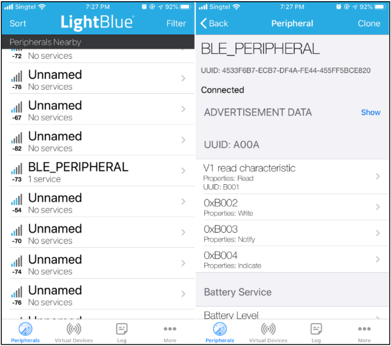

ble_central
^^^^^^^^^^^

This example shows how to discover service on GATT server.

Image Generation
''''''''''''''''

(1) To run ble_central example, turn on the following flags defined in
    \\project\\realtek_amebapro2_v0_example\\inc\\platform_opts_bt.h

.. code-block:: c

    #define CONFIG_BT 1 
    #if CONFIG_BT 
    #define CONFIG_FTL_ENABLED 
    #define CONFIG_BT_CONFIG 0 
    #define CONFIG_BT_PERIPHERAL 0 
    #define CONFIG_BT_CENTRAL 1 
    #define CONFIG_BT_SCATTERNET 0 
    #define CONFIG_BT_BEACON 0 
    #define CONFIG_BT_MESH_PROVISIONER 0 
    #define CONFIG_BT_MESH_DEVICE 0

(2) Build image and download image to your board.

Test Procedure
''''''''''''''

(1) After download image to your AmebaPro2 board, reset it.

(2) Download app "nRF Connect" and use as GATT Server to be connected.

(3) Add new advertising packet and set its additional data.

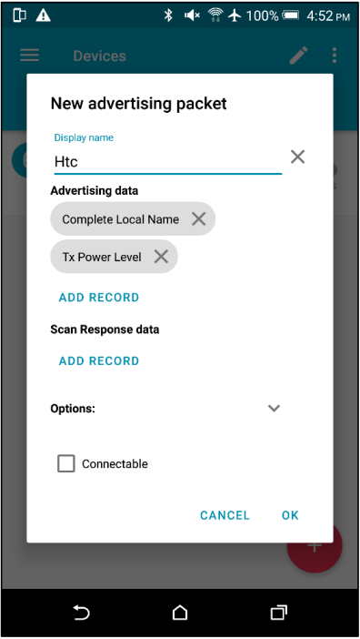

(4) ATBc is an AT command for BT Central. Using "ATBc=1" to turn BT
    Central stack ON.

(5) Using "ATBS=1" to scan available BT devices nearby.

(6) Using "ATBC=P/R, BLE_BD_ADDR" to connect to the device.

BT Central scan and connect log:

.. code-block:: bash

    #ATBS=1 
    Start scan, scan_filter_policy = 0, scan_filter_duplicate = 1 [MEM] After do cmd, available heap 46756320 
    # 
    GAP scan start 
    ADVType | AddrType |BT_Addr |rssi 
    CON_UNDIRECT random 4f:6e:3e:75:56:2e -80 
    GAP_ADTYPE_FLAGS: 0x1a 
    GAP_ADTYPE_MANUFACTURER_SPECIFIC: company_id 0x4c, len 24 
    ADVType | AddrType |BT_Addr |rssi 
    CON_UNDIRECT random 70:20:ca:98:7a:88 -74 
    GAP_ADTYPE_FLAGS: 0x1a 
    GAP_ADTYPE_POWER_LEVEL: 0x18 
    GAP_ADTYPE_MANUFACTURER_SPECIFIC: company_id 0x4c, len 7 
    #ATBS=0 Stop scan 
    [MEM] After do cmd, available heap 46756320 
    # GAP scan stop 
    # ATBC=R, 665544778899 [MEM] After do cmd, available heap 46756320 
    # cmd_con, DestAddr: 0x66:0x55:0x44:0x77:0x88:0x99

For more AT commands used for BT Central, please refer to user manual
**UM0201 Ameba Common BT Application User Manual EN.pdf**.

ble_scatternet
^^^^^^^^^^^^^^

BLE Scatternet is the coexistence of BLE Central mode and BLE Peripheral
mode. Once BLE Scatternet stack initialized, AT command of BLE Central
and BLE Peripheral are available. This example shows how to turn BLE
Scatternet on.

Image Generation
''''''''''''''''

(1) To run ble_central example, turn on the following flags defined in
    \\project\\realtek_amebapro2_v0_example\\inc\\platform_opts_bt.h

.. code-block:: c

    #define CONFIG_BT 1 
    #if CONFIG_BT 
    #define CONFIG_FTL_ENABLED 
    #define CONFIG_BT_CONFIG 0 
    #define CONFIG_BT_PERIPHERAL 0 
    #define CONFIG_BT_CENTRAL 0
    #define CONFIG_BT_SCATTERNET 1
    #define CONFIG_BT_BEACON 0 
    #define CONFIG_BT_MESH_PROVISIONER 0 
    #define CONFIG_BT_MESH_DEVICE 0

(2) Build image and download image to your board.

Test Procedure
''''''''''''''''

(1) After download image to your AmebaPro2 board, reset it.

(2) Using "ATBf=1" to turn BT Scatternet stack ON.

(3) Once see the following message, you can continue input other AT
    command of BT Scatternet mode as well as BT Central mode and BT
    Peripheral mode.

.. code-block:: bash

    hci_borad_controller_reset:346(info) BT Reset OK! 
    amebapro2_uart_set_bdrate:72(info) Set baudrate to 921600 success! 
    local bd addr: 0x89:51:12:36:28:11 
    [MEM] After do cmd, available heap 46754528 
    # 
    GAP adv start 

For other AT commands used for BT Scatternet, please refer to **UM0201
Ameba Common BT Application User Manual EN.pdf**.

bt_beacon
^^^^^^^^^

This example shows how to send BLE Beacons. AmebaPro2 provides two types
of Beacon: Apple iBeacon and Radius Networks AltBeacons.

Image Generation
''''''''''''''''

(1) To run ble_central example, turn on the following flags defined in
    \\project\\realtek_amebapro2_v0_example\\inc\\platform_opts_bt.h

.. code-block:: c

    #define CONFIG_BT 1 
    #if CONFIG_BT 
    #define CONFIG_FTL_ENABLED 
    #define CONFIG_BT_CONFIG 0 
    #define CONFIG_BT_PERIPHERAL 0 
    #define CONFIG_BT_CENTRAL 0
    #define CONFIG_BT_SCATTERNET 0
    #define CONFIG_BT_BEACON 1 
    #define CONFIG_BT_MESH_PROVISIONER 0 
    #define CONFIG_BT_MESH_DEVICE 0

(2) Build image and download image to your board.

Test Procedure
'''''''''''''''

(1) Choose beacon type by using "ATBJ=1,1" or "ATBJ=1,2" command.

.. code-block:: bash

   # ATBJ
   [ATBJ] Start BT I_Beacon: ATBJ=1,1
   [ATBJ] Start BT Alt_Beacon: ATBJ=1,2
   [ATBJ] Stop BT Beacon: ATBJ=0

(2) You can use apps such as "LightBlue" or "nRF Connect" to observe
    beacons. "Locate" observe beacon by it adv UUID. Below screenshot is
    taken using Android "nRF Connect".

bt_config
^^^^^^^^^

BT Config provides a simple way for Wi-Fi device to associate to AP
easily.

Image Generation
''''''''''''''''

(1) To run ble_central example, turn on the following flags defined in
    \\project\\realtek_amebapro2_v0_example\\inc\\platform_opts_bt.h

.. code-block:: c

    #define CONFIG_BT 1 
    #if CONFIG_BT 
    #define CONFIG_FTL_ENABLED 
    #define CONFIG_BT_CONFIG 1 
    #define CONFIG_BT_PERIPHERAL 0 
    #define CONFIG_BT_CENTRAL 0
    #define CONFIG_BT_SCATTERNET 0
    #define CONFIG_BT_BEACON 0 
    #define CONFIG_BT_MESH_PROVISIONER 0 
    #define CONFIG_BT_MESH_DEVICE 0

(2) Build image and download image to your board.

APP Installation
''''''''''''''''

Search "Easy WiFi Config" in the application store. You can install
Android or iOS as your phone OS.

.. image:: ../_static/16_Bluetooth/image4.png
   :align: center

Test Procedure
''''''''''''''

(1) ATBB is an AT command for BT Config. Using "ATBB=1" to enter BT
    Config mode, which allows BT Config APP to discover and connect to
    AmebaPro2. Reset your AmebaPro2 board, and input command "ATBB=1".

(2) Once see the following message, you can open BT Config APP to
    associate AP.

BT Initialize and start adv log:

.. code-block:: bash

   [BT Config Wifi] BT Config Wifi ready
   [BT Config Wifi] ADV started

(3) Click the BT config icon to launch it. Scan and connect with
    AmebaPro2 BT using BT Config app.

Display on BT config app:

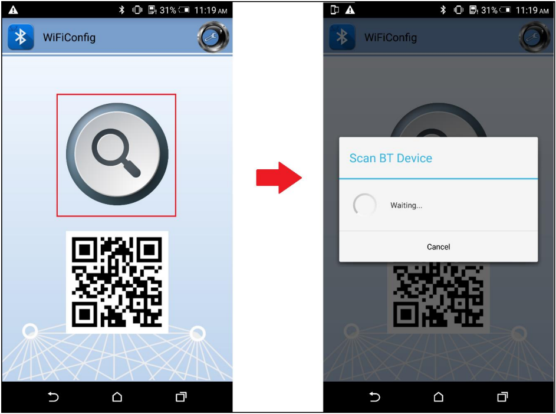

(4) Once BT Config APP connected to AmebaPro2, below log will be show.
    When connection is established AmebaPro2 will start searching for
    AP.

BT Connection log:

.. code-block:: bash

   [BT Config Wifi] Bluetooth Connection Established
   [BT Config Wifi] Band Request
   [BT Config Wifi] Scan Request
   [BT Config Wifi] Scan 2.4G AP
   [BT Config Wifi] Scan 5G AP

Display on BT config app:

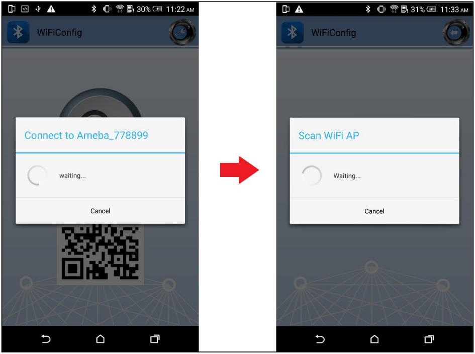

Scanned and reachable APs will be show on BT config app:

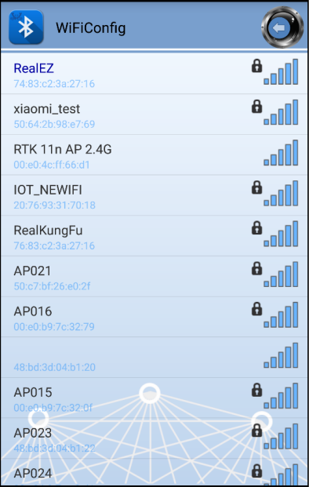

(5) Select an AP to connect to and input password (if any).

AP Connection log:

.. code-block:: bash

   [BT Config Wifi] Connect Request
   [Driver]: set BSSID: 90:94:e4:c5:d3:f0
   [Driver]: set ssid [Test_ap]
   [Driver]: start auth to 90:94:e4:c5:d3:f0
   [Driver]: auth success, start assoc
   [Driver]: association success(res=7)
   [Driver]: set pairwise key to hw: alg:4(WEP40-1 WEP104-5 TKIP-2 AES4)
   [Driver]: set group key to hw: alg:2(WEP40-1 WEP104-5 TKIP-2 AES-4) keyid:1
   [BT Config Wifi] Connected after 3458ms.
   Interface 0 IP address : 192.168.0.102 [BT Config Wifi]
   Got IP after 3500ms.

Display on BT config app:

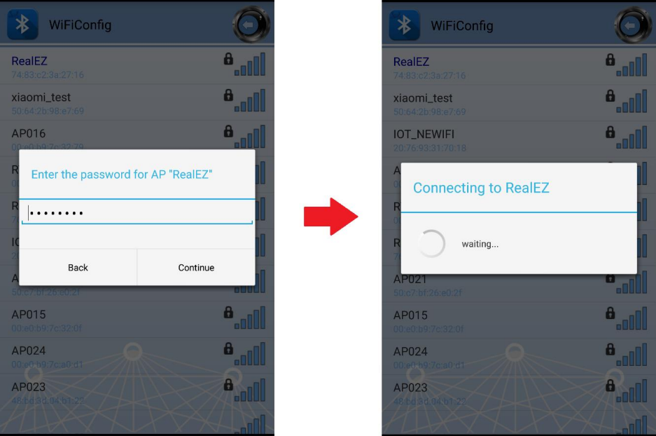

(6) When AmebaPro2 is connected to an AP, user can confirm connection or
    select another AP. Click "Confirm" to confirm AP connection. Click
    "Try another AP" to go back to Wi-Fi scan list page and choose
    another AP to connect to. After confirming BT config result,
    Bluetooth connection is disconnected, AmebaPro2 becomes
    undiscoverable to BT Config APP.

BT Disconnect log:

.. code-block:: bash

   [BT Config Wifi] Bluetooth Connection Disconnected
   [BT Config Wifi] ADV started
   [BT Config Wifi] [BC_status_monitor] wifi connected, delete
   BC_cmd_task and BC_status_monitor
   [BT Config Wifi] ADV stopped

Display on BT config app:

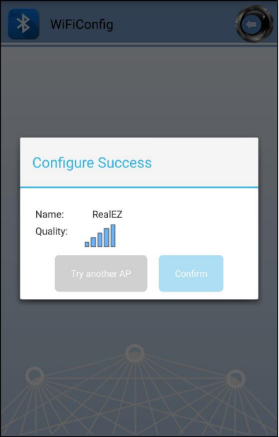

(7) You can use "ATBB=1" to restart BT Config mode again.

=========== ================
**Command** **Introduction**
=========== ================
ATBB=1      Start BT Config
ATBB=0      Stop BT Config
=========== ================

.. note :: Enter BT Config mode will disconnect existing Wi-Fi connection. Please refer to BT Config APP User Guide for more details

BLE Security
------------

If password input is planned to be integrated into the pairing process,
BLE provide secure pairing procedure.

Security features
~~~~~~~~~~~~~~~~~

The security architecture of BLE has five distinct features: pairing,
bonding, device authentication, encryption and message integrity.

-  **Pairing** is the process for creating shared secret keys

-  **Bonding** is to store the keys generated during pairing for use in
   subsequent connections in order to form a trusted device pair.

-  **Device authentication** is to verify the two devices have the same
   keys

-  **Encryption** is the process that provides message confidentiality

-  **Message integrity** protects against message forgeries.

Pairing feature will be introduced in the following chapters.

Pairing
~~~~~~~

In BLE, pairing is used to generate keys and encrypt the connection is
called pairing, and it consists with three phases:

-  Phase 1: Pairing Feature exchange

-  Phase 2 (LE Legacy Pairing): Short Term Key (STK) Generation

-  Phase 2 (LE Secure Connections): Long Term Key (LTK) Generation

-  Phase 3: Transport Specific Key Distribution

Pairing begins after the devices have connected with each other, after
that they exchange information about their I/O capabilities. In the next
phase the user will assist, if possible, for identification of the
device, and based on whether we use LE Legacy Pairing or Secure
Connections, the appropriate scheme will be used to generate the link
key. All subsequent communications will be encrypted with this key. When
the link is encrypted, specific keys will be exchanged that aid in
resolving the private address of the device, or signing and
authenticating the data.

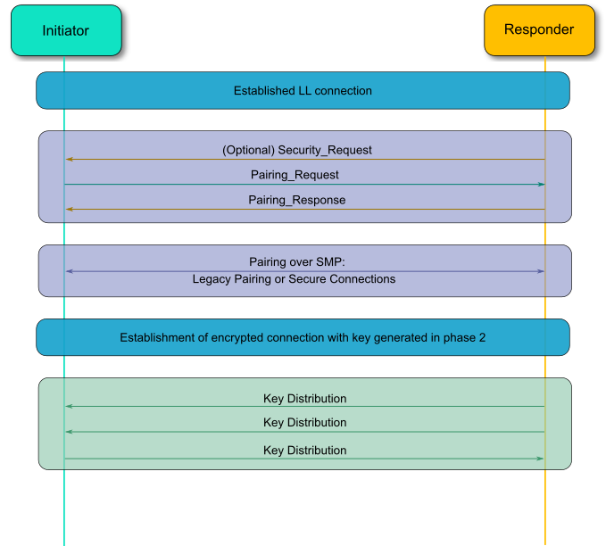

Example
~~~~~~~

In the example, there are several variables related to security
features.

-  GAP_PARAM_BOND_PAIRING_MODE set Ameba Device is pairable or not

.. code-block:: c

    #define GAP_PAIRING_MODE_NO_PAIRING 0x00 //!< Pairing is not allowed.
    #define GAP_PAIRING_MODE_PAIRABLE 0x01 //!< Pairable, Wait for a pairing request from master or security request from slave.

In the example code, the default setting is:

.. code-block:: c

    uint8_t auth_pair_mode = GAP_PAIRING_MODE_PAIRABLE;
    gap_set_param(GAP_PARAM_BOND_PAIRING_MODE, sizeof(auth_pair_mode), &auth_pair_mode);

-  GAP_PARAM_BOND_AUTHEN_REQUIREMENTS_FLAGS sets up pair mode and
   ability, default is **GAP_AUTHEN_BIT_BONDING_FLAG** which enable
   legacy pairing mode and enable bounding feature

.. code-block:: c

    #define GAP_AUTHEN_BIT_NONE 0 //!< No authentication required.
    #define GAP_AUTHEN_BIT_BONDING_FLAG 0x0001 //!< Bonding is required
    #define GAP_AUTHEN_BIT_MITM_FLAG 0x0004 //!< Mitm is preferred
    #if F_BT_LE_4_2_SC_SUPPORT
    #define GAP_AUTHEN_BIT_SC_FLAG 0x0008 //!< Secure connection is preferred
    #define GAP_AUTHEN_BIT_SC_ONLY_FLAG 0x0200 //!< Secure connection only mode for BLE is required
    #endif
    #define GAP_AUTHEN_BIT_FORCE_BONDING_FLAG 0x0100 //!< Force bonding is required

In the example code, the default setting is:

.. code-block:: c

    uint16_t auth_flags = GAP_AUTHEN_BIT_BONDING_FLAG;
    gap_set_param(GAP_PARAM_BOND_AUTHEN_REQUIREMENTS_FLAGS, sizeof(auth_flags), &auth_flags);

If secure connection is prefer, the user can add up auth_flags with
**GAP_AUTHEN_BIT_SC_FLAG**:

.. code-block:: c

    uint16_t auth_flags = GAP_AUTHEN_BIT_BONDING_FLAG | GAP_AUTHEN_BIT_SC_FLAG;
    gap_set_param(GAP_PARAM_BOND_AUTHEN_REQUIREMENTS_FLAGS, sizeof(auth_flags), &auth_flags);

-  GAP_PARAM_BOND_IO_CAPABILITIES sets up I/O capabilities.

.. code-block:: c

    GAP_IO_CAP_DISPLAY_ONLY,        //!< Only a Display present, no Keyboard or Yes/No Keys.
    GAP_IO_CAP_DISPLAY_YES_NO,      //!< Display and Yes/No Keys present.
    GAP_IO_CAP_KEYBOARD_ONLY,       //!< Only a Keyboard present, no Display.
    GAP_IO_CAP_NO_INPUT_NO_OUTPUT,  //!< No input/output capabilities.
    GAP_IO_CAP_KEYBOARD_DISPLAY,    //!< Keyboard and Display present.

In the example code, the default setting is:

.. code-block:: c

    uint8_t auth_io_cap = GAP_IO_CAP_NO_INPUT_NO_OUTPUT;
    gap_set_param(GAP_PARAM_BOND_IO_CAPABILITIES, sizeof(auth_io_cap), &auth_io_cap);

-  GAP_PARAM_BOND_OOB_ENABLED sets up whether using OOB while pairing.

.. code-block:: c

    GAP_PARAM_BOND_OOB_ENABLED = 0x205,//!< OOB data available for pairing algorithm. Read/Write. Size is uint8_t. Default is 0(disabled).

In the example code, the default setting is:

.. code-block:: c

    #if F_BT_LE_SMP_OOB_SUPPORT
        uint8_t auth_oob = false;
    #endif
    #if F_BT_LE_SMP_OOB_SUPPORT
        gap_set_param(GAP_PARAM_BOND_OOB_ENABLED, sizeof(auth_oob), &auth_oob);
    #endif

-  GAP_PARAM_BOND_FIXED_PASSKEY and GAP_PARAM_BOND_FIXED_PASSKEY_ENABLE
   is used to fix pass key.

.. code-block:: c

    GAP_PARAM_BOND_FIXED_PASSKEY = 0x211,//!< The fix passcode for MITM protection. Read/Write. size is uint32_t. Range is 0 - 999,999. Default is 0.
    GAP_PARAM_BOND_FIXED_PASSKEY_ENABLE = 0x212,//!< The fix passcode available for pairing. Read/Write. size is uint8_t. Default is 0(disabled).

In the example code, the default setting is:

.. code-block:: c

    uint8_t auth_use_fix_passkey = false;
    uint32_t auth_fix_passkey = 0;
    le_bond_set_param(GAP_PARAM_BOND_FIXED_PASSKEY, sizeof(auth_fix_passkey), &auth_fix_passkey);
    le_bond_set_param(GAP_PARAM_BOND_FIXED_PASSKEY_ENABLE, sizeof(auth_use_fix_passkey), &auth_use_fix_passkey);

-  GAP_PARAM_BOND_SEC_REQ_ENABLE and GAP_PARAM_BOND_SEC_REQ_REQUIREMENT
   automatically send Security_Request or not.

.. code-block:: c

    GAP_PARAM_BOND_SEC_REQ_ENABLE = 0x213,//!< Send smp security request when connected. Read/Write. size is uint8_t. Default is 0(disabled).
    GAP_PARAM_BOND_SEC_REQ_REQUIREMENT = 0x214,//!< Security request requirements. Read/Write. size is uint8_t. Default is GAP_AUTHEN_BIT_BONDING_FLAG (@ref BOND_MITM_DEFINES)

In the example code, the default setting is:

.. code-block:: c

    uint8_t  auth_sec_req_enable = false;
    uint16_t auth_sec_req_flags = GAP_AUTHEN_BIT_BONDING_FLAG;
    le_bond_set_param(GAP_PARAM_BOND_SEC_REQ_ENABLE, sizeof(auth_sec_req_enable), &auth_sec_req_enable);
    le_bond_set_param(GAP_PARAM_BOND_SEC_REQ_REQUIREMENT, sizeof(auth_sec_req_flags), &auth_sec_req_flags);

If secure connection is prefer, the user can add up auth_flags with **GAP_AUTHEN_BIT_SC_FLAG**:

.. code-block:: c

    uint8_t  auth_sec_req_enable = true;
    uint16_t auth_sec_req_flags = GAP_AUTHEN_BIT_BONDING_FLAG | GAP_AUTHEN_BIT_SC_FLAG;
    le_bond_set_param(GAP_PARAM_BOND_SEC_REQ_ENABLE, sizeof(auth_sec_req_enable), &auth_sec_req_enable);
    le_bond_set_param(GAP_PARAM_BOND_SEC_REQ_REQUIREMENT, sizeof(auth_sec_req_flags),
    &auth_sec_req_flags);

BLE Coexistence
---------------

Introduction
~~~~~~~~~~~~

BLE and WLAN both occupy the 2.4GHz to 2.4835GHz unlicensed ISM
(Industrial Scientific Medical) band. Usually, they are working
concurrently in the same environment, even on the single chip, so the
mutual signal interference between them must be considered. There are
two categories of coexistence mechanism: collaborative and
non-collaborative. Collaborative coexistence mechanism exchanges
information between two wireless networks, while non-collaborative
mechanism does not.

For AmebaPro2 which integrates with both WLAN and BLE, collaborative
coexistence mechanism should be mainly applied. Here two strategies ─
Packet Traffic Arbitration (PTA) mode and Time Division Multiple Access
(TDMA) mode are raised to relieve the interference.

Fig 1‑1 is a diagram of Realtek's BLE coexistence architecture. The key
components of the architecture include a PTA circuit integrated in WLAN
side, and a TDMA scheme that is not shown in the diagram.

When BT and WLAN request to T/RX simultaneously, PTA performs
arbitrations on these requests readily. The configurations of PTA focus
on the coexistence tables, which specify the traffic streaming rules.
For example, we can set the coexistence table to "\ **BT traffic
priority > WL traffic priority**\ " to ensure BT can always preempt
WLAN. The values of coexistence tables come from WLAN driver through
self-defined commands. Specifically, the coexistence algorithms reside
in WLAN driver code, and the actions of sending commands to PTA are
performed by those algorithms.

The successful operating of coexistence algorithms is based on the
proper information from BT and WLAN, which are called BT info and WL
info respectively. WL info is collected through WLAN software in a
straight way, while BT info is acquired through a mailbox signal
indirectly. BT controller is responsible for collecting and transferring
BT info. When BT status is changed, BT controller sends the changed BT
info to BT core stack to trigger operation of coexistence algorithms. In
some implementations, BT info is send periodically in an automatic way.
Besides, the coexistence algorithms can initiate sending request to BT
controller to fetch BT info.

TDMA is a scheme to partition the RF usage into WLAN slot and BT slot.
It should be stressed that PTA is also working when the TDMA function is
enabled. Actually, two coexistence tables are available for WLAN and BT
slot respectively. For instance, we can set the PTA table of WLAN slot
to 'BT high-pri TX > WL > BT others', while BT slot to 'BT > WL'. In
such scenario, BLE ADV traffic which is assigned high priority can be
transmitted during both WLAN slot and BT slot. BLE SCAN traffic which is
assigned low priority is forbidden to transmit during WLAN slot, but
only permitted during BT slot.

Fig BLE coexistence architecture

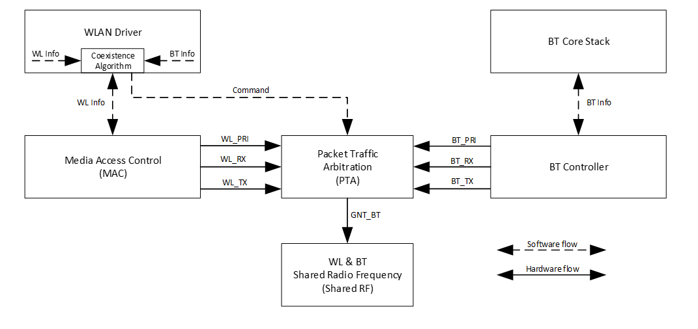

PTA Mode
~~~~~~~~

As stated before, the main idea of PTA is that the PTA circuit gathers
the traffic status information (Tx/Rx, including the corresponding
priority) from both sides to decide which side to use the shared RF. As
depicted in Fig 1‑2, Those Tx/Rx/Priority signals are generated by
hardware from both sides. The judgement strategy is according to
Coex._Table_1 or Coex._Table_2 and Break_Table, which can be configured
by coexistence algorithms. In addition, the priority signal is software
configurable according to different application demands. The input
signal Coex._Table_SEL is used to select which coexistence table to
apply. The outcome of PTA is GNT_BT signal, which is further transferred
to RF circuit to make switches between WLAN and BT.

.. note :: usually only one coexistence table is used in pure PTA mode, while TDMA mode requiring two coexistance tables for the convenience of slot switching between WLAN and BT.

Fig 1-2 PTA module port diagram

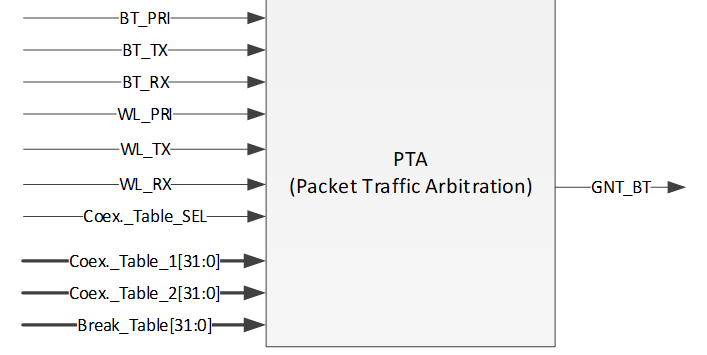

Table PTA module pin definition

==================== =================================================================================================================================================================
**Pin**              **Description**
BT_PRI               Bluetooth high priority traffic indication
                    
                     -  0: Low priority
                    
                     -  1: High priority
BT_TX                Bluetooth Request Tx or is on transmitting
BT_RX                Bluetooth Request Rx or is on receiving
WL_PRI               WLAN high priority traffic indication
                    
                     -  0: Low priority
                    
                     -  1: High priority
WL_TX                WLAN Request Tx or is on transmitting
WL_RX                WLAN Request Rx or is on receiving
Coex._Table_SEL      Used to select Coex._Table_1 and Coex._Table_2
Coex_Table_1[31:0]   The first coexistence table
Coex_Table_2[31:0]   The second coexistence table
Break_Table_1[15:0]  Break table, used to break BT activity. When a new WLAN request is coming and BT is on transmitting or receiving, BT should break its activity if GNT_WL asserts.
Break_Table_1[31:16] Break table, used to break WLAN activity, when a new BT request is coming and WLAN is on transmitting or receiving.
GNT_BT               Grant Bluetooth Request.
                    
                     -  0: RF usage is in WLAN side
                    
                     -  1: RF usage is in BT side
==================== =================================================================================================================================================================

TDMA Mode
~~~~~~~~~

TDMA is actually an enhancement to PTA functions. Since PTA can be
simply regarded as a switch inside the shared RF, WLAN throughput may
degrades due to frequent switching between BT and WLAN. The usual case
is that busy BT traffic leads to frequent BT T/RX requests to PTA and
frequent switching of GNT_BT signals, which results in more WLAN packets
to retry and the transmission rate decrease.

To overcome the shortages of pure PTA arbitrations, the principle of
TDMA is raised. TDMA is working via the following rules: Firstly, RF
should be switched to WLAN side at beacon early time, which is defined
several milliseconds before TBTT (Target Beacon Transmission Time), to
ensure the correct receiving of WLAN beacon. Secondly, the residual time
before next beacon early time is partitioned into slots, some for WLAN
and others for BT. Thirdly, the slot length is configurable by
coexistence algorithms.

In most cases, we use 2-slot TDMA to share the RF usage. As Fig 1‑3
demonstrates TDMA with 2-slot mode. Regardless of the working modes of
AmebaPro2, whether in station(STA) mode or access point(AP) mode, 2-slot
mode TDMA can be applied.

Fig TDMA with 2-slot

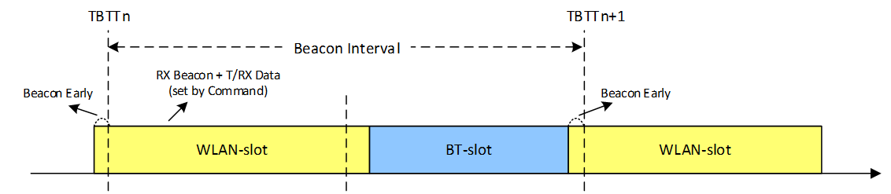

It should be stressed one more time that applying TDMA does not mean
exclusion of PTA. The logic of TDMA setting can be treated as slot time
assignment along with PTA adjusting. Considering some hardware
characteristics of chip’s RF system is not easy to handle, we do not
recommend users to change TDMA parameters by themselves.

How to Configure BLE Coexistence
~~~~~~~~~~~~~~~~~~~~~~~~~~~~~~~~

The BLE coexistence algorithms are developed and strictly tested under
Realtek’s Quality Control (QC).

We strongly recommend users do not configure the coexistence algorithms
by themselves, since the unfamiliar with the chip’s hardware features
may result in hard fault or other serious cases.

If users find the improper working status of the coexistence algorithms,
please contact Realtek’s Field Application Engineer (FAE) in the first
time.

Supplement for coexistence related GPIOs
~~~~~~~~~~~~~~~~~~~~~~~~~~~~~~~~~~~~~~~~

In normal cases, WL and BLE modules inside AmebaPro2 are used in
application development. The developers do not need to care about the
details of how WL and BT traffic indication signals (wl_pri / wl_rx /
wl_tx, bt_pri / bt_rx / bt_tx) are connected to PTA. While under some
conditions, we may need to use external BLE or zigbee chip in the
development.

WLAN and Internal BLE
^^^^^^^^^^^^^^^^^^^^^

Fig 1-4 indicates the normal usage of WLAN and Internal BLE. In such
case, developer need do nothing with the coexistence. All the details of
the PTA are implemented inside AmebaPro2, and no external chip is
needed. This is the most economical efficient choice.

Fig 1-4 Normal usage of WLAN and internal BLE

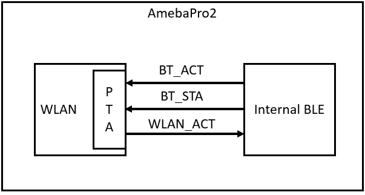

WLAN and External BLE or WLAN and Zigbee
^^^^^^^^^^^^^^^^^^^^^^^^^^^^^^^^^^^^^^^^

Those PTA inputs which come from BLE side, can be configured to use
external BLE signals. As depicted in Fig 1-5, the GPIOs, GPIOD_17,
GPIOD_15 and GPIOD_14 are configured as WLAN_ACT, BT_STATE, BT_PRI
signal respectively, if external BLE is used in development. Those GPIOs
can also be configured as ZB_REQ, ZB_PRI and GNT_ZB signal respectively,
if Zigbee chip is used.

.. note :: GPIOD_17, GPIOD_15 and GPIOD_14 are fixed GPIOs for PTA inputs switching outside. In practice, developers should only use those fixed GPIOs but not others.

While in Fig 1-2, the bt_pri / rx / tx signals are used as PTA input
from BLE side, while here is not those signals but BT_ACT/STA instead.
This is because a circuit which is responsible for translating
BT_ACT/STA into bt_pri/rx/tx is omitted here.

In Fig 1-5 the external wiring zigbee chip having an equivalent role as
external wiring BLE chip can be implied. This is based on the condition
that ZB_REQ signal is the counterpart of BT_ACT while ZB_PRI acting as
the counterpart of BT_STA. The timing rule of BT_ACT/STE and GNT_BT
comply with the typical 3-wire PTA timing. Therefore, the equivalent
conditions between BLE and ZB signals can be met easily if zigbee timing
complies with the typical 3-wire PTA timing.

Fig 1-5 Usage of WLAN and external BLE or WLAN and Zigbee

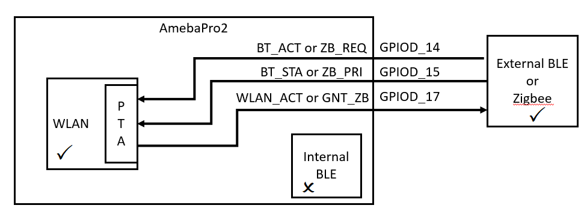
