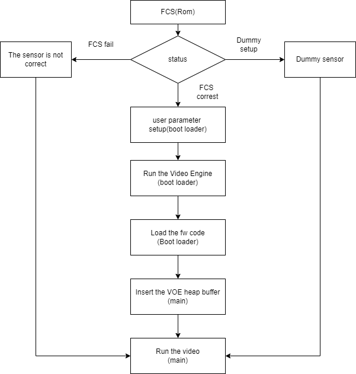
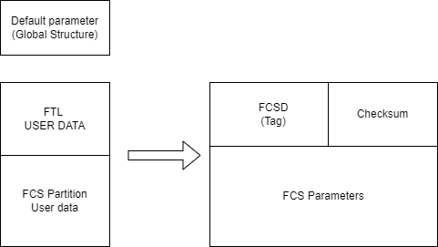
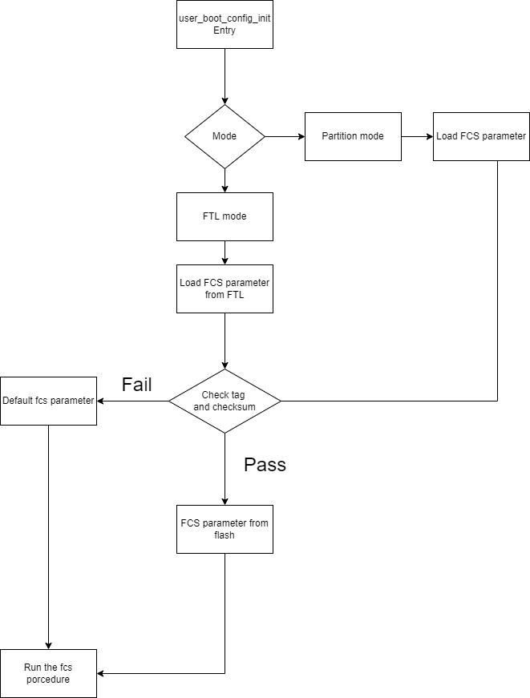
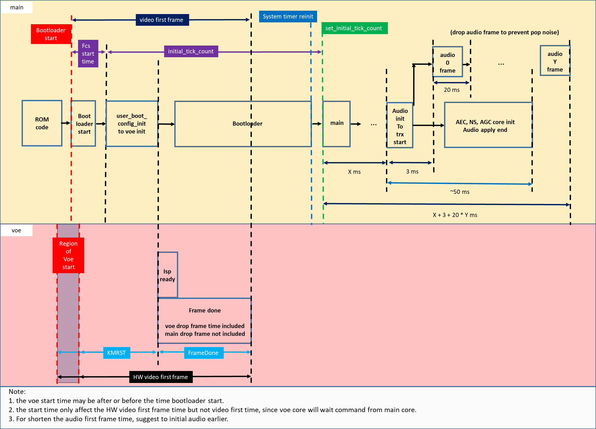
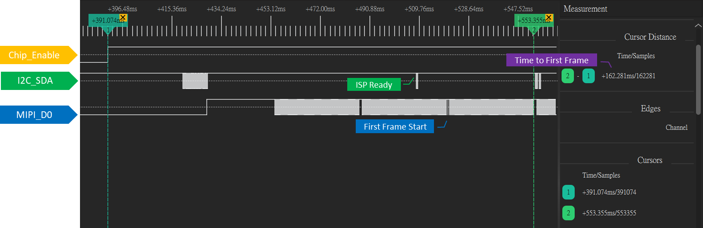
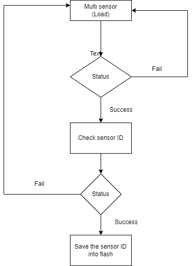

FCS and multi sensor
====================

The fast camera start (FCS) can speed up the sensor bring up time. The
sensor starts from rom code and initial the Video engine from
bootloader. It can speed up the time to get the first frame. The multi
sensor can support auto sensor recognition. The sensor firmware is
located at the flash; it will try the sensor list to get the current
sensor driver. The first time will take time to scan the sensor, and
then the result will be stored at the flash.

FCS Procedure
-------------

According to the following flowchart, Rom code will check whether the
FCS process needs to be executed, load user data after the condition is
established, and execute the VOE startup process in the bootloader, if
the condition is not established, then start in Normal mode. It must be
confirmed that the sesnor power needs to be given at the beginning,
otherwise the fcs will fail

The FCS parameter
~~~~~~~~~~~~~~~~~

The main purpose of the FCS parameter is to set the FCS image
parameters, which will include two types, one is the default parameter,
which is currently defined as GLOBAL STRUCTURE, and the other is to save
the data by storing it in FLASH.

FLASH storage parameters, the content will have a TAG plus Checksum to
ensure that the data is correct, as shown in the figure below, you can
choose one of FTL and FCS Partition, and if you use FTL, it must be the
first PAGE of NAND BLOCK.

FTL stored parameters: Update parameters through FTL API

Parameters stored in FCS Partition: Update parameters through FWFS

In the FCS parameter process, enter the user_boot_config_init weak
function at the beginning, determine whether it is Partition or FTL
mode, load the FCS User Data to check whether the data is correct, load
the data if it succeeds, and load the default global variables if it
fails, please refer to the following flowchart

The following structure is the FCS parameter content.

.. code-block:: c

    typedef struct video_boot_stream_cfg {
        video_params_t video_params[4];//For different channel parameter
        isp_info_t isp_info;//isp_info
        uint32_t voe_heap_addr;//Heap address for VOE
        uint32_t voe_heap_size;//Heap size for VOE
        uint8_t video_enable[4];//Enable channel
        uint8_t video_snapshot[4];//Enable the snapshot, it only support channel 0 now
        isp_multi_fcs_ld_info_t p_fcs_ld_info;//The info to load iq and sensor firmware
        uint32_t fcs_channel;//channel -> //How many channel to use fcs, the default is 1
        uint32_t fcs_status;// status  -> 1:successful 0:fail
        uint32_t fcs_setting_done;// status  -> 1:successful 0:fail
        uint32_t fcs_voe_fw_addr;//
        uint32_t fcs_isp_ae_enable;//Enable the AE init function
        uint32_t fcs_isp_ae_init_exposure;//Setup the exposure parameters.
        uint32_t fcs_isp_ae_init_gain;//Setup the gain parameters.
        uint32_t fcs_isp_awb_enable;//Enable the AWB init function.
        uint32_t fcs_isp_awb_init_rgain;//Setup the AWB rgain parameters.
        uint32_t fcs_isp_awb_init_bgain;//Setup the AWB bgain parameters.
        uint32_t fcs_isp_init_daynight_mode;//0 day mode ; 1 night mode
        uint32_t fcs_lookup_count;//Lookup table count for AE&AWB
        uint32_t fcs_als_thr[11];//Threashold
        uint32_t fcs_isp_ae_table_exposure[11];//AE Exposure time
        uint32_t fcs_isp_ae_table_gain[11];//AE gain
        uint32_t fcs_isp_awb_table_rgain[11];//AWB r-gain
        uint32_t fcs_isp_awb_table_bgain[11];//AWB b-gain
        uint32_t fcs_isp_mode_table[11];//day night mode table
        uint32_t fcs_isp_iq_id;//0:default parameter, other number : IQ table index
        uint8_t  fcs_isp_reserved_buf[FCS_SYSTEM_REV_SIZE];//Reserved for fcs system data
        uint8_t  fcs_user_buffer[FCS_USER_REV_SIZE];//User can use the buffer to transfer to application
        uint32_t fcs_start_time;//bootloader to fcs user boot function
        uint32_t fcs_voe_time;//bootloader to voe init function
        video_boot_private_mask_t private_mask;
        uint32_t meta_enable;//
        uint32_t meta_size;//enalbe the meta size for
        video_boot_isp_initial_items_t init_isp_items;
    } video_boot_stream_t;
    typedef struct  {
        uint32_t enable;
        uint32_t init_flicker;
        uint32_t init_saturation;
        int32_t init_brightness;
        uint32_t init_contrast;
        uint32_t init_hue;
        uint32_t init_wdr_mode;
        uint32_t init_wdr_level;
        uint32_t init_hdr_mode;
        uint32_t init_mirrorflip;
    } video_boot_isp_initial_items_t;
    typedef struct video_param_s {
        uint32_t stream_id; //Channel ID
        uint32_t type; //Codec type
        uint32_t resolution;//Resolution
        uint32_t width;
        uint32_t height;
        uint32_t bps;
        uint32_t fps;
        uint32_t gop;
        uint32_t rc_mode;
        uint32_t jpeg_qlevel;
        uint32_t rotation;//
        uint32_t out_buf_size;//Reserve buf to encode queue
        uint32_t out_rsvd_size;//Don't care
        uint32_t direct_output;//Don’t care
        uint32_t use_static_addr;//Don’t care
        uint32_t fcs;//Enable the FCS mode
    } video_params_t;

For detailed parameter settings, please refer to the following file.

.. code-block:: bash

    component\\video\\driver\\RTL8735B\\video_user_boot.c

Please be careful not to add or remove structure parameters, this may
cause internal data errors.

Configure default parameter for FCS
~~~~~~~~~~~~~~~~~~~~~~~~~~~~~~~~~~~

User can configure FCS default parameter, which is a global struct
variable, in video_user_boot.c before running the FCS example. For
instance, if user want to enable V1 streaming with FCS, the
"video_params[STREAM_V1].fcs" should be set to 1. Then, V1 FCS mode will
be enabled with the specified parameters such as width, height, bps, fps
and Qp. In addition, if a jpeg snapshot is required in FCS, the
"video_snapshot[STREAM_V1]" should also be set to 1. After that, user
can get the jpeg snapshot from the registered callback function.

.. code-block:: c

    video_boot_stream_t video_boot_stream = {
        .video_params[STREAM_V1].stream_id = STREAM_V1,
        .video_params[STREAM_V1].type = CODEC_H264,
        .video_params[STREAM_V1].resolution = 0,
        .video_params[STREAM_V1].width = 1920,
        .video_params[STREAM_V1].height = 1080,
        .video_params[STREAM_V1].bps = 2 * 1024 * 1024,
        .video_params[STREAM_V1].fps = 15,
        .video_params[STREAM_V1].gop = 15,
        .video_params[STREAM_V1].rc_mode = 2,
        .video_params[STREAM_V1].minQp = 25,
        .video_params[STREAM_V1].maxQp = 48,
        .video_params[STREAM_V1].jpeg_qlevel = 0,
        .video_params[STREAM_V1].rotation = 0,
        .video_params[STREAM_V1].out_buf_size = V1_ENC_BUF_SIZE,
        .video_params[STREAM_V1].out_rsvd_size = 0,
        .video_params[STREAM_V1].direct_output = 0,
        .video_params[STREAM_V1].use_static_addr = 0,
        .video_snapshot[STREAM_V1] = 1,
        .video_drop_frame[STREAM_V1] = 0,
        .video_params[STREAM_V1].fcs = 1,//Enable the fcs for channel 1
        // …
        // …
    }

ISP initial parameter setting in FCS
^^^^^^^^^^^^^^^^^^^^^^^^^^^^^^^^^^^^

There are some ISP parameters can be set before video opening in FCS:

.. code-block:: c

    typedef struct  {
        uint32_t enable;
        uint32_t init_flicker;   //DISABLE = 0, 50HZ = 1, 60HZ = 2, AUTO = 3
        uint32_t init_saturation;
        int32_t init_brightness;
        uint32_t init_contrast;
        uint32_t init_hue;
        uint32_t init_wdr_mode;   // 0: DISABLE, 1: MANUAL, 2: AUTO
        uint32_t init_wdr_level;
        uint32_t init_hdr_mode;
        uint32_t init_mirrorflip;   // bit 0: MIRROR, bit 1: Flip
    } video_boot_isp_initial_items_t;

.. note :: For the mirror/flip feature, there is a control timing difference for each sensor. Even though mirror/flip enabled before streaming open, for some sensor model, the mirror/flip will be effective on 2nd or 3rd frame. Therefore, if user want to get the FCS snapshot with mirror/flip, "video_drop_frame" may need to be set to 1 or 2 to achieve this.

Secondary FCS parameter
~~~~~~~~~~~~~~~~~~~~~~~

Default FCS parameters set is loaded in bootloader. It is able load
secondary FCS parameter from user defined data section, and this
secondary FCS parameter could be updated through OTA.

Modify the component\\video\\driver\\RTL8735B\\video_user_boot.c

.. code-block:: c

    #define NAND_FLASH_FCS 0x7080000
    #define NOR_FLASH_FCS (0xF00000 + 0xD000)
    int boot_read_flash_data(unsigned int address, unsigned char *buf, int length);

FCS example
~~~~~~~~~~~

Modify the project\\realtek_amebapro2_v0_example\\inc\\sensor.h

.. code-block:: c

    #define ENABLE_FCS 1

It need to change the value to your sensor id.

Modify the file from component\\video\\driver\\RTL8735B\\video_user_boot.c

.. code-block:: c

    void user_boot_config_init(void *parm)
    {
        //Insert your code into here
        //dbg_printf("user_boot_config_init\r\n");
    }

If you need to execute the operation at boot loader step, you can add
your code at the API.

Modify the file from
sdk\\project\\realtek_amebapro2_v0_example\\inc\\sensor.h

.. code-block:: c

    #define USE_SENSOR SENSOR_GC4653

Modify the media_framework.c and choose the below example. The default
parameter is channel 0.

.. code-block:: c

    mmf2_video_example_joint_test_rtsp_mp4_init_fcs();

Currently, the default update FCS parameter is FTL mode. If you want to
use FCS Partition mode, please open MARCO below. There are two places
that need to be updated, user_boot_confic.c and
mmf2_video_example_joint_test_rtsp_mp4_init_fcs. Build your code and
upgrade your FW.

.. code-block:: c

    //#define FCS_PARTITION

If you want to save FCS parameter to SRAM retention rather than flash,
please modify the MACRO definition below. Build and upgrade your FW.

.. code-block:: c

    #define FCS_SAVE_OPTION SAVE_TO_RETENTION

Use ATCMD to switch the FCS parameter example, currently you can switch
resolution, if you need to switch other parameters, you can modify it
according to this example. If you need to modify the IQ parameters, you
need to maintain two different parameters before you can switch, 0 is
the default value. If users want to use the ISP information measure in
this time for a quick convergence for the ISP result, they can set
video_pre_init to 1.

.. code-block:: c

    FCST=ch,width,height,iq_id,video_pre_init

The example support to streaming, recording and snapshot. If you need to
snapshot for the first frame, it need to enable the video_snapshot
parameter for your video channel. There will have the callback function
to get the picture.

About the fast forward problem, it need to initialize the video first to
reduce the cached images. If it have the cached images that it need to
calculate the length to skip the timestamp, it can get the information
form the priv_data attribute of the MMF module.

Video and Audio first frame time flow
~~~~~~~~~~~~~~~~~~~~~~~~~~~~~~~~~~~~~

The flowing picture shows the time interval when using the fcs. Users
could compare the time information in the SDK.

Measure the time to first frame?
~~~~~~~~~~~~~~~~~~~~~~~~~~~~~~~~

Disable the boot loader log
^^^^^^^^^^^^^^^^^^^^^^^^^^^

At present, the default rom and bootloader will print the message, you
can close the log message by the below API, and speed up the time to
enter the main, please reference the follow API. After the below
procedure that it need to do the power reset procedure.

.. code-block:: c

    #include "otp_api_ext.h" //Include the header
    int otp_rom_log_message_disable(void); //disable the rom log 
    int otp_rom_log_message_enable(void); //enable the rom log

    Note that printf cannot be used to print messages here, please change to dbg_printf

Measure time through gpio pin
^^^^^^^^^^^^^^^^^^^^^^^^^^^^^

Please use the scope to get the signal of Chip_Enable, MIPI_D0, and
I2C_SDA, and the measurement points of these are as follows.

The first frame after the ISP ready is the first output frame of
amebapro2, so user can measure the time between the Chip_Enable and the
first frame to get the time to first frame. The result of measurement is
as bellow.

Here it can measure the time from the bootloader to the first frame done
by software. You can use the following API to get the time. Note that
this does not include the time from power-on to bootloader. It do not
include rom to bootloader time, the stage need to use the gpio to
measure. The frame done period do not include the drop frame. If you
enable the secure boot that it will cost time to boot up.

.. code-block:: c

    isp_boot->fcs_start_time;//From boot loader to user_boot_config_init
    isp_boot->fcs_voe_time;// From boot loader to voe init function
    int video_get_fcs_cost_time(void);//From boot loader to video frame done.(It need to start fcs channel  at application mode and then to call the API)

About the video timestamp is KMRST plus the FrameDone, it can see the
below log.

.. code-block:: bash

    [VOE]load time sensor:183us iq:1951us itcm:559us dtcm:32us ddr:6566us ddr2:6211us
    [VOE]VOELOAD(9291)/FCS(40445)/ISPReady(28201)/FrameDone(72962) KMRST(68798) us

How to get good image quality under FCS mode
~~~~~~~~~~~~~~~~~~~~~~~~~~~~~~~~~~~~~~~~~~~~

AmebaPro2 has designed quick convergence mode for AE and AWB with
information supported by ambient light sensor (ALS). When use the
reference value from ALS, Amebapro2 can set suitable initial value for
exposure (with look up value with white balance gain). Even with the
reference to ALS, there are two more reason that we need isp to do auto
exposure and white balance. Fist item is the detection range is not same
due to the FOV difference between ALS and sensor. Second item is ALS can
only the luminance value but can't get color temperature information. So
when we set initial value for isp , we also need to use quick auto
exposure and auto white balance convergence method to achieve target
luminance and color temperature.

At bootloader stage, amebapro2 can communicate through UART with MCU to
get ALS value without convergence time, and then get initial value
through look up table.

+---------------+-------------------+--------------------------------------------+------------------+-----+------------------+-------+-------+
| Luminance(lux)| ALS value(example)| Mode Scene                                 | Exposure Time(us)| Gain| Color temperature| R Gain| B Gain|
+===============+===================+====+=======================================+==================+=====+==================+=======+=======+
| > 60000       | > 150000          | RGB| Outdoor scene with strong sun light   | 45               | 256 | 7310             | 662   | 446   |
+---------------+-------------------+    +                                       +------------------+-----+------------------+-------+-------+
| > 40000       | > 100000          |    |                                       | 112              | 256 | 7310             | 662   | 446   |
+---------------+-------------------+    +                                       +------------------+-----+------------------+-------+-------+
| > 13000       | > 62905           |    |                                       | 289              | 274 | 7310             | 662   | 446   |
+---------------+-------------------+    +                                       +------------------+-----+------------------+-------+-------+
| > 5000        | > 55000           |    |                                       | 1000             | 256 | 7310             | 662   | 446   |
+---------------+-------------------+    +---------------------------------------+------------------+-----+------------------+-------+-------+
| > 2000        | > 49661           |    |  With strong light                    | 2000             | 256 | 6400             | 585   | 478   |
+---------------+-------------------+    +                                       +------------------+-----+------------------+-------+-------+
| > 1000        | > 30000           |    |                                       | 3112             | 256 | 6400             | 585   | 478   |
+---------------+-------------------+    +                                       +------------------+-----+------------------+-------+-------+
| > 600         | > 15298           |    |                                       | 3534             | 256 | 6400             | 585   | 478   |
+---------------+-------------------+    +---------------------------------------+------------------+-----+------------------+-------+-------+
| > 350         | > 7524            |    |  With suitable light                  | 4734             | 256 | 4980             | 537   | 542   |
+---------------+-------------------+    +                                       +------------------+-----+------------------+-------+-------+
| > 200         | > 3822            |    |                                       | 10000            | 328 | 4980             | 537   | 542   |
+---------------+-------------------+    +                                       +------------------+-----+------------------+-------+-------+
| > 100         | > 2529            |    |                                       | 10000            | 512 | 4980             | 537   | 542   |
+---------------+-------------------+    +---------------------------------------+------------------+-----+------------------+-------+-------+
| > 70          | > 1222            |    |  With low light                       | 20000            | 512 | 4020             | 512   | 600   |
+---------------+-------------------+    +                                       +------------------+-----+------------------+-------+-------+
| > 50          | > 800             |    |                                       | 20000            | 768 | 4020             | 512   | 600   |
+---------------+-------------------+    +---------------------------------------+------------------+-----+------------------+-------+-------+
| > 20          | > 581             |    |  With shimmer                         | 30000            | 768 | 3400             | 377   | 685   |
+---------------+-------------------+    +                                       +------------------+-----+------------------+-------+-------+
| > 10          | > 260             |    |                                       | 30000            | 1024| 3400             | 377   | 685   |
+---------------+-------------------+----+---------------------------------------+------------------+-----+------------------+-------+-------+
| < 5           | < 100             | IR | Extreme low lux and switch to IR Mode | 30000            | 2048| -                |       |       |
+---------------+-------------------+----+---------------------------------------+------------------+-----+------------------+-------+-------+

FCS parameter setting
~~~~~~~~~~~~~~~~~~~~~

The FCS data structure is defined in
component\video\driver\RTL8735B\video_boot.h, and cannot be changed or
re-ordered.

The definition of video_boot_stream_cfg

========================== === === ====== =======================================================================================================================================
Name                       Mim Max Modify Description
========================== === === ====== =======================================================================================================================================
video_params                       Yes    See Bellowing
auto_rate_control                  Yes    See Bellowing
isp_info                           Yes    See Brllowing
voe_heap_addr                      No     Video heap address
voe_heap_size                      No     Video heap size
video_enable                       Yes    Enable the video channel.(0:Disable 1:Enable)
video_snapshot                     Yes    Support snapshot with streaming.(0:Disable 1:Enable)
video_drop_frame                   Yes    Drop video frame count.
                                         
                                          All video channel will share the same drop frame settings. The first FCS channel drop frame settings will be applied. In addition, because the drop frame of ch4 is processed in VOE, its drop frame will follow the FPS setting of ch4.
p_fcs_ld_info                      No     Fcs driver index alignment with index defined at「amebapro2_isp_iq.json」
fcs_channel                        Yes    Enable the video to fcs channel.(0:Disable 1:Enable)
fcs_status                         No     FCS status(0:Disable 1:Enable)
fcs_setting_done                   No     FCS setting status.(0:Setting done 1:Setup procedure)
fcs_voe_fw_addr                    No     VOE firmware address
fcs_isp_ae_enable                  Yes    Enable Auto exposure initial value configuration
fcs_isp_ae_init_exposure           Yes    Initial value for exposure time (active when fcs_isp_ae_enable=1)
fcs_isp_ae_init_gain               Yes    Initial value for exposure gain (active when fcs_isp_ae_enable=1)
fcs_isp_awb_enable                 Yes    Enable Auto white balance initial value configuration
fcs_isp_awb_init_rgain             Yes    Initial value for white balance R-gain (active when fcs_isp_awb_enable=1)
fcs_isp_awb_init_bgain             Yes    Initial value for white balance B-gain (active when fcs_isp_awb_enable=1)
fcs_isp_init_daynight_mode         Yes    Initial value for IQ table index (0=RGB, 1=IR, 2=other)
fcs_isp_gray_mode                  Yes    Initial value for color mode (0=RGB, 1=Gray)
fcs_lookup_count                   Yes    Count for look up table, can refer to 「USE_FCS_LOOKUPTABLE_SAMPLE」
fcs_als_thr                        Yes    Threshold for ALS (lookup table)
fcs_isp_ae_table_exposure          Yes    Initial value for exposure time (lookup table)
fcs_isp_ae_table_gain              Yes    Initial value for exposure gain (lookup table)
fcs_isp_awb_table_rgain            Yes    Initial value for R-Gain (lookup table)
fcs_isp_awb_table_bgain            Yes    Initial value for B-Gain (lookup table)
fcs_isp_mode_table                 Yes    Initial mode (lookup table)
fcs_isp_iq_id                      Yes    IQ index (defined by user, could be non-sync with p_fcs_Id_infor)
fcs_isp_reserved_buf               No     System reserved buffer.
fcs_user_buffer                    Yes    User buffer.
fcs_start_time                     No     Boot loader to video initial time
fcs_voe_time                       No     Boot loader to video start time
private_mask                              See Bellowing
meta_enable                        Yes    Enable the meta data feature (0:Disable 1: Enable)
meta_size                          Yes    User meta size
nit_isp_items                             See bellowing
\                                        
\                                        
========================== === === ====== =======================================================================================================================================

Sub-structure: The definition of video_boot_stream_cfg.video_params

=============== === === ====== =============================================
Name            Mim Max Modify Description
=============== === === ====== =============================================
stream_id       0   3   Yes    Video channel number.
type                    Yes    Video type (CODEC_H264 or CODEC_HEVC)
width           0       Yes    Video width
Height          0       Yes    Vidoe height
bps                     Yes    Target bit rate
fps                     Yes    Frame rate
gop                     Yes    Group of Picture
out_buf_size            No     Video output buffer size
out_rsvd_size           No     Video output reserved size.
jpeg_level      0   9   Yes    Jpeg level
Direct_output           No     Not used
use_static_addr         No     Not used
fcs             0   1   Yes    0:Enable the fcs mode 1:Disable the fcs mode.
Level                   Yes    Encoder level.
Cavlc           0   1   Yes    1:cavlc,0:cabac
MinQP           0   51  Yes    Minimum QP value
MaxQP           0   51  Yes    Maximum QP value
=============== === === ====== =============================================

Sub-structure: The definition of video_boot_stream_cfg.auto_rate_control

=============== === === ====== ====================
Name            Mim Max Modify Description
=============== === === ====== ====================
sampling_time           Yes    Sample interval time
maximum_bitrate         Yes    Maximum bitrate
minimum_bitrate         Yes    Minimun bitrate
target_bitrate          Yes    Target bitrate
\                             
=============== === === ====== ====================

Sub-structure: The definition of video_boot_stream_cfg.isp_info

============= === ==================== ====== ========================================================
Name          Mim Max                  Modify Description
============= === ==================== ====== ========================================================
sensor_width  0   Based on sensor spec Yes    Sensor width
sensor_height 0   Based on sensor spec Yes    Sensor height
sensor_fps    5   30                   Yes    Sensor fps
osd_enable    0   1                    No     Enable bit to control voe heap contains osd usage or not
md_enable     0   1                    No     Enable bit to control voe heap contains md usage or not
hdr_enable    0   1                    No     Enable bit to control voe heap contains hdr usage or not
osd_buf_size  0                        No     Buffer size for osd (no use in fcs)
md_buf_size   0                        No     Buffer size for md (no use in fcs)
============= === ==================== ====== ========================================================

Sub-structure: The definition of video_boot_stream_cfg.private_mask

======= === ========================================= ====== ===========================================================
Name    Mim Max                                       Modify Description
======= === ========================================= ====== ===========================================================
enable  0   1                                         Yes    Enable Privacy Mask initial configuration
color   0                                             Yes    Color for privacy mask, format: 0xRRGGBB (RR/GG/BB = 0~255)
en      0   4                                         Yes    Enable control for rectangle (1~4) and grid (0)
start_x 0   Image width                               Yes    Start position of x axis (should be 2 alignment)
start_y 0   Image height                              Yes    Start position of y axis (should be 2 alignment)
w       0   Can't be over sensor image width / height Yes    Width for ROI window (Rect) or width for each grid
h       0                                             Yes    Width for ROI window (Rect) or height for each grid
cols    0                                             Yes    Number of grid columns (should be 2 alignment)
rows    0                                             Yes    Number of grid rows (should be 2 alignment)
bitmap                                                Yes    Enable bit for each grid (start from left top grid)
======= === ========================================= ====== ===========================================================

Sub-structure: The definition of video_boot_stream_cfg. init_isp_items

=============== ==== ==== ======= ====== ==========================================
Name            Mim  Max  Default Modify Description
=============== ==== ==== ======= ====== ==========================================
enable          0    1    0       Yes    Enable isp initial configuration
init_flicker    0    3    1       Yes    Refer to isp_set_power_line_freq()
init_saturation 0    100  50      Yes    Refer to isp_set_saturation()
init_brightness -64  64   0       Yes    Refer to isp_set_brightness()
init_contrast   0    100  50      Yes    Refer to isp_set_contrast()
init_wdr_mode   0    2    0       Yes    Refer to isp_set_wdr_mode()
init_wdr_level  0    100  50      Yes    Refer to isp_set_wdr_level()
init_hdr_mode   0    1    0       Yes    Enable HDR mode (should support by sensor)
init_mirrorflip 0xf0 0xf3 0xf0    Yes    Modify sensor output orientation
=============== ==== ==== ======= ====== ==========================================

Disable the fcs at weak function
~~~~~~~~~~~~~~~~~~~~~~~~~~~~~~~~

If you have started fcs, but want to close it under certain
circumstances, you can close it through the following weak function

.. code-block:: c

    //video_user_boot.c
    int user_disable_fcs(void)
    {
        return 0;//1:disable fcs, 0:Don't care
    }

Multi sensor
------------

Configure multi sensor
~~~~~~~~~~~~~~~~~~~~~~

We use the GC2053 for the example, it need to assign the sensor, FCS and
IQ data.

Modify the
sdk\\project\\realtek_amebapro2_v0_example\\GCC-RELEASE\\mp\\amebapro2_isp_iq.json

.. code-block:: bash

    "VARIABLE":{
            "*type*":"0x00 (INVALID) is reserved for invalid type, 0x01 (SENSOR_ID) is reserved for senesor id. default offset is 2048 from manifest start",
            "tlv":[
                {"type":"SENSOR_ID", "length":1, "value":"0"}
            ]
        },

The value need to setup as zero. The non-zero value is for FCS mode.

Modify the sdk\\project\\realtek_amebapro2_v0_example\\GCC-RELEASE\\mp\\amebapro2_sensor_set.json

We support five sensors. The default 0 is not used.

.. code-block:: bash

    "ISP_SENSOR_SETS":{
        "multi_fcs_hdr": "MULTI_FCS_HDR",
        "multi_fcs_info": "MULTI_FCS_INFO",
        "sensor_sets":[
            "SENSOR_SET0",//Dummy setup
            "SENSOR_SET1",//GC2336
            "SENSOR_SET2",//GC2053
            "SENSOR_SET3",//GC4653
            "SENSOR_SET4",//MIS2008
            "SENSOR_SET5"//PS5258
        ]
    },

Add your sensor into to the below structure. The ID is two for gc2053.
The maximum support sensor size is nine.

.. code-block:: bash

    "SENSOR_SET2":{
            "merge_en": true,
            "fcs_data": {
                "source":"binary",
                "file":"fcs_data_gc2053.bin"
            },
            "iq_data": {
                "source":"binary",
                "file":"iq.bin"        
            },
            "sensor_data": {
                "source":"binary",
                "file":"sensor_gc2053.bin"        
            }   
        },

Modify the file from
sdk\\project\\realtek_amebapro2_v0_example\\inc\\sensor.h

.. code-block:: c

    #define SENSOR_DUMMY        0x00 //For dummy sensor, no support fast camera start
    #define SENSOR_SC2336       0x01
    #define SENSOR_GC2053       0x02
    #define SENSOR_GC4653       0x03
    #define SENSOR_MIS2008      0x04
    #define SENSOR_PS5258       0x05 //It don't support the multi sensor for PS5258 now.If you want to use the sensor,please remove it.

    #define MULTI_DISABLE       0x00
    #define MULTI_ENABLE        0x01

    #define MULTI_SENSOR        MULTI_ENABLE
    #define USE_SENSOR          SENSOR_GC2053
