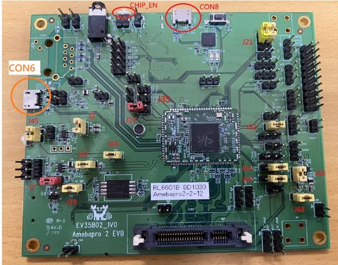
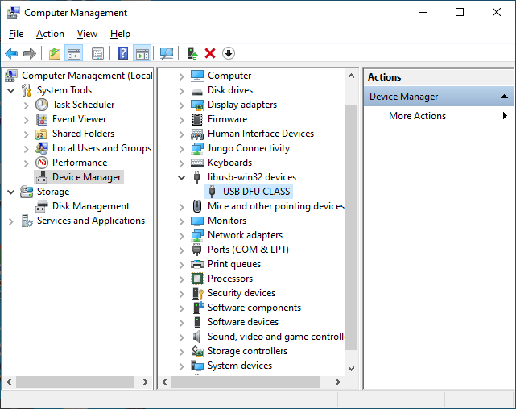
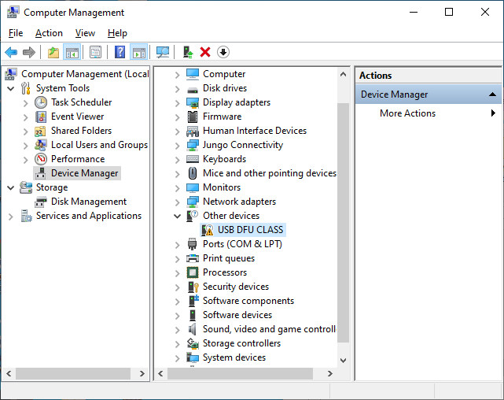
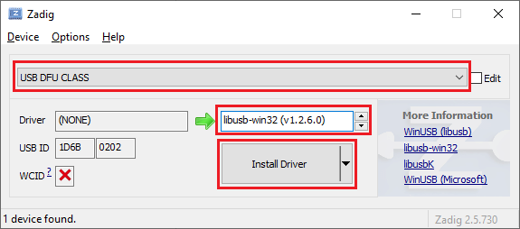
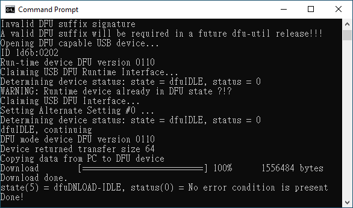
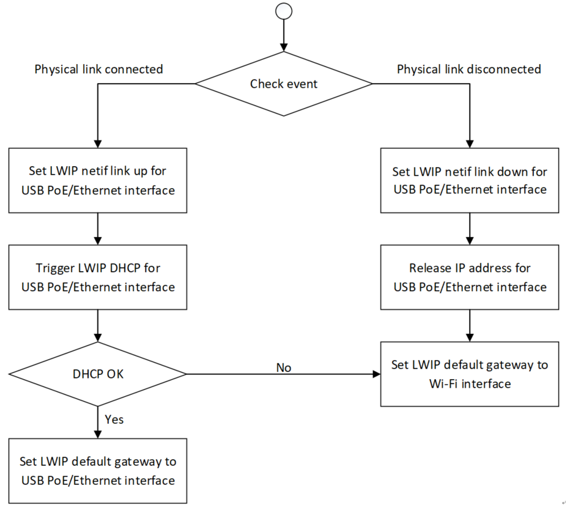

USB
===

.. contents::
  :local:
  :depth: 2

AmebaPro2 provides USB stack features as below:

-  Compatible with USB 2.0 specification

-  Device-specified API for class and application development

-  UVC, CDC and DFU support

UVC
---

UVC device example
~~~~~~~~~~~~~~~~~~

AmebaPro2 ISP can support compressed (H264 / H265 / JPG) and
uncompressed (NV16 / NV12) image through UVC (wired transmission), and
user can check video on pc with Potplayer, Amcap or RTK-realcam. For
uncompressed format, user need to install RTK decoder to get video on
computer. User can use following flow to build UVC example. Generate the
makefile for the UVC project:

.. code-block:: bash

   cmake .. -G"Unix Makefiles" -DCMAKE_TOOLCHAIN_FILE=../toolchain.cmake -DEXAMPLE=media_uvcd

Then, use the following command to generate an image:

.. code-block:: bash

   cmake --build . --target flash

USB CDC
-------

CDC device example
~~~~~~~~~~~~~~~~~~

AmebaPro2 supports USB cdc device mode that can be used to emulate a
serial port providing a virtual COM port UART interface. A CDC loopback
example to provided, user can use following flow to build CDC example.
Generate the makefile for the CDC project:

.. code-block:: bash

   cmake .. -G"Unix Makefiles" -DCMAKE_TOOLCHAIN_FILE=../toolchain.cmake -DEXAMPLE=usb_cdc

Then, use the following command to generate an image:

.. code-block:: bash

   cmake --build . --target flash

CDC Class API
~~~~~~~~~~~~~

API for Application
^^^^^^^^^^^^^^^^^^^

===================== ============================================================================================
**API**               **Description**
===================== ============================================================================================
usbd_cdc_acm_init     Initialize the class with parameters:
                     
                      -  RX buffer length (rx_buf_len): BULK OUT buffer length
                     
                      -  TX buffer length (tx_buf_len): BULK IN buffer length
                     
                      -  Application callback (cb)
usbd_cdc_acm_deinit   De-initialize the class
usbd_cdc_acm_transmit Transmit BULK IN data to host, the data length shall not be larger than the TX buffer length
usbd_cdc_acm_receive  Prepare to receive BULK OUT data, the data length will be limited to RX buffer length
===================== ============================================================================================

Application Callback
^^^^^^^^^^^^^^^^^^^^

CDC ACM class provides callbacks for user application, the callbacks are
defined:

.. code-block:: c

    typedef struct {
        u8(* init)(void);
        u8(* deinit)(void);
        u8(* setup)(u8 cmd, u8 *buf, u16 len, u16 value);
        u8(* receive)(u8 *buf, u32 len);
    } usbd_cdc_acm_cb_t;

Description of the callbacks:

======= ==========================================================================================================
**API** **Description**
======= ==========================================================================================================
init    Called at the end of class initialization flow, for application-specific initialization
deinit  Called at the beginning of class de-initialization flow, for application-specific de-initialization
setup   Called at setup phase or data out phase of class-specific control requests, for application-specific setup
receive Called at data out phase of BULK OUT transfer, for application to handle the received data
======= ==========================================================================================================

USB DFU
-------

AmebaPro2 supports DFU (Device Firmware Upgrade), with DFU user can
download firmware to AmebaPro2 over USB, user can use following flow to
build DFU example. Generate the makefile for the DFU project:

.. code-block:: bash

   cmake .. -G"Unix Makefiles" -DCMAKE_TOOLCHAIN_FILE=../toolchain.cmake -DEXAMPLE=usb_dfu_ota

Then, use the following command to generate an image:

.. code-block:: bash

   cmake --build . --target flash

How to download firmware over USB DFU
~~~~~~~~~~~~~~~~~~~~~~~~~~~~~~~~~~~~~

Install driver for USB DFU
^^^^^^^^^^^^^^^^^^^^^^^^^^

After the DFU example code is started, and you have USB (CON6) connected
to your windows computer, you can see DFU device in Device Manager as
below:

If your DFU device is unable to work (driver is not installed), you will
see:

In this case, please follow these steps to install the driver:

(1) Open “Zadig.exe”

(2) Select “USB DFU CLASS”

(3) Select “libusb-win32”

(4) Click “Install Driver”

Burn DFU firmware to AmebaPro2
^^^^^^^^^^^^^^^^^^^^^^^^^^^^^^

(1) Copy “ota.bin” from image build folder

(2) Run dfu-util tool:

.. code-block:: bash

   dfu-util -d 1d6b:0202 -a 0 -D ota.bin

(3) If DFU is successfully, you will see the result as shown:

|

USB PoE and Wi-Fi Network Connection Detection
----------------------------------------------

USB PoE or Ethernet should be able to handle the events for physical
link connected and disconnected. For the events about physical link,
Ethernet may be related to Ethernet cable plugin/unplug, and USB PoE may
be related to USB device attach/detach. The following is the flow to
switch network between Wi-Fi and USB PoE/Ethernet. The event callbacks
set LWIP netif link status and handle IP address for USB Poe/Ethernet
interfaces. Finally, the LWIP default gateway is also set to specify the
interface used to transmit the packets to external network.

