Wi-Fi
=====

.. contents::
  :local:
  :depth: 2

Wi-Fi Data Structures
---------------------

============================= ==========================================================================================================================================================================
**Data Structures**           **Introduction**
============================= ==========================================================================================================================================================================
<_cus_ie>                     The structure is used to set Wi-Fi custom IE list, and type match CUSTOM_IE_TYPE.
                             
                              The IE will be transmitted according to the type.
<rtw_ssid_t>                  The structure is used to describe the SSID.
<rtw_mac_t>                   The structure is used to describe the unique 6-byte MAC address.
<rtw_softap_info_t>           The structure is used to describe the setting about SSID, security type, password and default channel, used to start AP mode.
<rtw_network_info_t>          The structure is used to describe the station mode setting about SSID, security type and password, etc., used when connecting to an AP.
<rtw_scan_param_t>            The structure is used to describe the scan parameters used for scan, including SSID, channel, user callback, etc.
<rtw_scan_result_t>           The structure is used to describe the scan result of the AP.
<rtw_wifi_setting_t>          The structure is used to store the Wi-Fi setting gotten from Wi-Fi driver.
<rtw_wifi_config_t>           The structure is used to describe the setting when configure the network.
<rtw_maclist_t>               The structure is used to describe the maclist.
<rtw_bss_info_t>              The structure is used to describe the bss info of the network. It include the version, BSSID, beacon_period, capability, SSID, channel, atm_window, dtim_period, RSSI e.g.
<rtw_packet_filter_pattern_t> The structure is used to set WIFI packet filter pattern.
<ieee80211_frame_info_t>      The structure is used to describe the 802.11 frame info.
<rtw_packet_filter_info_t>    The structure is used to describe the packet filter info.
<rtw_mac_filter_list_t>       The structure is used to describe the mac filter list.
<wowlan_pattern_t>            The structure is used to describe the wowlan pattern.
<psk_info>                    The structure is used to describe the psk info.
<rtw_sw_statistics_t>         The structure is used to describe the sw statistics.
<rtw_phy_statistics_t>        The structure is used to describe the phy statistics.
<raw_data_desc_t>             The structure is used to describe the data description.
<wifi_user_conf>              The structure is used to describe the wifi user configuration.
============================= ==========================================================================================================================================================================

Wi-Fi APIs
----------

System APIs
~~~~~~~~~~~

================= ===========================================
**API**           **Introduction**
================= ===========================================
<wifi_on>         Enable Wi-Fi.
<wifi_off>        Disable Wi-Fi.
<wifi_is_running> Check if the specified wlan_idx is running.
<wifi_set_mode>   Switch Wi-Fi Mode.
================= ===========================================

wifi_on
^^^^^^^

Enable Wi-Fi: Bring the Wireless interface "Up".

============= ========== =====================================================================================================
**Parameter** **Type**   **Introduction**
============= ========== =====================================================================================================
<mode>        rtw_mode_t Decide to enable WiFi in which mode.
                        
                         The optional modes are RTW_MODE_STA, RTW_MODE_AP, RTW_MODE_STA_AP, RTW_MODE_PROMISC and RTW_MODE_P2P.
============= ========== =====================================================================================================

Return:

-  RTW_SUCCESS: If the WiFi chip initialized successfully.

-  RTW_ERROR: If the WiFi chip initialization failed.

wifi_off
^^^^^^^^

Disable Wi-Fi.

Parameter: None.

Return:

-  RTW_SUCCESS: Deinit success, wifi mode is changed to RTW_MODE_NONE.

-  RTW_ERROR: Failed

wifi_is_running
^^^^^^^^^^^^^^^

Check if the specified wlan_idx is running.

============= ============= =====================================
**Parameter** **Type**      **Introduction**
============= ============= =====================================
<wlan_idx>    unsigned char Can be set as WLAN0_IDX or WLAN1_IDX.
============= ============= =====================================

Return:

-  1: Success

-  0: Failed

wifi_set_mode
^^^^^^^^^^^^^

Switch Wifi Mode

============= ========== ====================================================================================
**Parameter** **Type**   **Introduction**
============= ========== ====================================================================================
<mode>        rtw_mode_t Decide to switch WiFi to which mode.
                        
                         The optional modes are RTW_MODE_STA, RTW_MODE_AP, RTW_MODE_STA_AP, RTW_MODE_PROMISC.
============= ========== ====================================================================================

Return:

-  RTW_SUCCESS: WiFi switch mode success.

-  RTW_ERROR: WiFi switch mode failed.

Scan APIs
~~~~~~~~~

======================= ==============================================
**API**                 **Introduction**
======================= ==============================================
<wifi_scan_networks>    Initiate a scan to search for 802.11 networks.
<wifi_get_scan_records> Get scan results.
<wifi_scan_abort>       Abort ongoing wifi scan.
======================= ==============================================

wifi_scan_networks
^^^^^^^^^^^^^^^^^^

Initiate a scan to search for 802.11 networks.

============= =================== ================================================================================================================================================================================================
**Parameter** **Type**            **Introduction**
============= =================== ================================================================================================================================================================================================
<scan_param>  rtw_scan_param_t *  Specifies the scan parameters, including scan type, specific SSID, specific channel list, channel scan time, and scan callback.
                                 
                                  There are two types of scan callback:
                                 
                                  -  scan_user_callback
                                 
                                  -  scan_report_each_mode_user_callback
                                 
                                     If registered, scan_user_callback will be executed when the scan is finished and report the total number of scanned APs, and the detailed scanned AP info can be got by calling wifi_get_scan_records. This callback is suitable for a normal asynchronous scan.
                                 
                                     If registered, scan_report_each_mode_user_callback is used when configuring RTW_SCAN_REPORT_EACH in options of rtw_scan_param, and it will be executed every time a AP is scanned, and the AP info will be directly reported by this callback.
<block>       unsigned char       If set to 1, it's synchronized scan and this API will return after scan is done. If set to 0, it's asynchronized scan and this API will return immediately.
============= =================== ================================================================================================================================================================================================

Return:

-  RTW_SUCCESS: Success for asynchronized scan.

-  RTW_ERROR: Failed.

-  Otherwise: Scanned AP number for synchronized scan.

-  If this API is called, the scanned APs are stored in Wi-Fi driver
   dynamic allocated memory, for a synchronous scan or asynchronous scan
   which does not use RTW_SCAN_REPORT_EACH, these memories will be freed
   when wifi_get_scan_records is called.

-  When configuring TW_SCAN_REPORT_EACH,
   scan_report_each_mode_user_callback will report NULL to indicate that
   the scan is done.

-  Only one callback function can be chosen to register. Both
   scan_user_callback and scan_report_each_mode_user_callback are not
   supported to be registered in one scan.

-  The scan callback function will be executed in the context of the RTW
   thread.

-  When scanning specific channels, devices with strong signal strength
   on nearby channels may be detected.

wifi_get_scan_records
^^^^^^^^^^^^^^^^^^^^^

Get scan results.

============= =============== =======================================================================================================================================
**Parameter** **Type**        **Introduction**
============= =============== =======================================================================================================================================
<AP_num>      unsigned int \* Input the pointer to the number of scanned ap info which want to get, output the number of scanned ap info which can actually get.
<scan_buf>    char \*         Pointer to the buf where scan result will be stored, the scanned AP info will be stored one by one in form of struct rtw_scan_result_t.
============= =============== =======================================================================================================================================

Return:

-  RTW_SUCCESS: Success.

-  RTW_ERROR: Failed

.. note :: For an asynchronous scan configuring RTW_SCAN_REPORT_EACH, every time an AP is scanned, the AP info will be directly reported through scan_report_each_mode_user_callback and freed after user callback is executed, thus there is no need to use this function to get the scan result.

wifi_scan_abort
^^^^^^^^^^^^^^^

Abort ongoing scan.

Parameter: None.

Return:

-  RTW_SUCCESS: Success.

-  RTW_ERROR: Failed

.. note :: This is an asynchronous function and will return immediately. Return value only indicates whether the scan abort command is successfully notified to the driver or not. When the scan is actually aborted, the user callback registered in wifi_scan_networks will be executed. If there is no Wi-Fi scan in progress, this function will just return RTW_SUCCESS and user callback won't be executed.

Connection APIs
~~~~~~~~~~~~~~~

============================== ==============================================================
**API**                        **Introduction**
============================== ==============================================================
<wifi_connect>                 Join a Wi-Fi network with a specified SSID or BSSID.
<wifi_disconnect>              Disassociates from current Wi-Fi network.
<wifi_is_connected_to_ap>      Check if Wi-Fi has connected to AP before DHCP.
<wifi_get_join_status>         Get latest Wi-Fi join status.
<wifi_get_disconn_reason_code> Get reason code of latest disassociation or de-authentication.
<wifi_config_autoreconnect>    Set reconnection mode with configuration.
<wifi_get_autoreconnect>       Get the result of setting reconnection mode.
============================== ==============================================================

wifi_connect
^^^^^^^^^^^^

Join a Wi-Fi network with a specified SSID or BSSID. Scan for,
associate, and authenticate with a Wi-Fi network. On successful return,
the system is ready to send data packets.

=============== ===================== ==========================================================================================================================================================================================
**Parameter**   **Type**              **Introduction**
=============== ===================== ==========================================================================================================================================================================================
<connect_param> rtw_network_info_t *  The pointer of a struct which store the connection info, including ssid, bssid, password, etc, for details, please refer to struct rtw_network_info_t in wifi_structures.h.
<block>         unsigned char         If block is set to 1, it means synchronized wifi connect, and this API will return until connect is finished; if block is set to 0, it means asynchronized wifi connect, and this API will return immediately.
=============== ===================== ==========================================================================================================================================================================================

Return:

-  RTW_SUCCESS: When the system is joined for synchronized wifi connect,
   when connect cmd is set successfully for asynchronized wifi connect.

-  RTW_ERROR: If an error occurred.

-  Make sure the Wi-Fi is enabled before invoking this function
   (wifi_on()).

-  The parameter channel and pscan_option in connect_param can be used
   to perform fast survey on the specified channel during Wi-Fi
   connection. **Default setting null and scan full channel.**

-  When the channel is set to a specified channel and pscan_option is
   set to PSCAN_FAST_SURVEY, during Wi-Fi connection, an active scan
   will be only performed on the specified channel, the active scan will
   retry at most 8 times with each round interval 25ms.
   **Default setting 0 and scan full channel.**

-  joinstatus_user_callback in connect_param can be registered to get
   the real-time join status changes since this callback will be
   executed every time join status is changed.

-  *Wifi_connection api will scan the supported channels to search for
   all candidate ssids, and finally compares the AP RSSI and selects the
   AP with the strongest signal as the target ssid for connection.*

wifi_disconnect
^^^^^^^^^^^^^^^

Disassociates from current Wi-Fi network.

Parameter: None.

Return:

-  RTW_SUCCESS: On successful disassociation from the AP.

-  RTW_ERROR: If an error occurred.

wifi_is_connected_to_ap
^^^^^^^^^^^^^^^^^^^^^^^

Check if Wi-Fi has connected to AP before DHCP.

Parameter: None.

Return:

-  RTW_SUCCESS: If connected.

-  RTW_ERROR: If not connected.

wifi_get_join_status
^^^^^^^^^^^^^^^^^^^^

Get the latest Wi-Fi join status.

Parameter: None.

Return:

-  RTW_JOINSTATUS_UNKNOWN: Unknown join status.

-  RTW_JOINSTATUS_STARTING: Join is starting.

-  RTW_JOINSTATUS_SCANNING: Scan is in progress.

-  RTW_JOINSTATUS_AUTHENTICATING: Authentication is in progress.

-  RTW_JOINSTATUS_AUTHENTICATED: Already authenticated.

-  RTW_JOINSTATUS_ASSOCIATING: Association is in progress.

-  RTW_JOINSTATUS_ASSOCIATED: Already associated.

-  RTW_JOINSTATUS_4WAY_HANDSHAKING: 4-way handshake is in progress.

-  RTW_JOINSTATUS_4WAY_HANDSHAKE_DONE: 4-way handshake is done.

-  RTW_JOINSTATUS_SUCCESS: Join is success.

-  RTW_JOINSTATUS_FAIL: Join is failed.

-  RTW_JOINSTATUS_DISCONNECT: Disconnected.

.. note :: Wi-Fi join status will be set during Wi-Fi connection and Wi-Fi disconnection.

wifi_get_disconn_reason_code
^^^^^^^^^^^^^^^^^^^^^^^^^^^^

Present the reason code of the latest disassociation or
de-authentication.

============= ================= ================================================================
**Parameter** **Type**          **Introduction**
============= ================= ================================================================
<reason_code> unsigned short *  A pointer to the variable where the reason code will be written.
============= ================= ================================================================

Return:

-  RTW_SUCCESS: Success.

-  RTW_ERROR: Failed.

wifi_config_autoreconnect
^^^^^^^^^^^^^^^^^^^^^^^^^

Set reconnection mode with configuration.

============= ======== ================================================
**Parameter** **Type** **Introduction**
============= ======== ================================================
<mode>        \__u8    Set 1/0 to enalbe/disable the reconnection mode.
<retry_times> \__u8    The number of retry limit.
<timeout>     \__u16   The timeout value (in seconds).
============= ======== ================================================

Return:

-  0: Success.

-  -1: Failed.

wifi_get_autoreconnect
^^^^^^^^^^^^^^^^^^^^^^

Get the result of setting reconnection mode.

============= ======== =================================================
**Parameter** **Type** **Introduction**
============= ======== =================================================
<mode>        \__u8 *  Point to the result of setting reconnection mode.
============= ======== =================================================

Return:

-  0: Success.

-  -1: Failed.

Channel APIs
~~~~~~~~~~~~

================== ==============================================================================================================
**API**            **Introduction**
================== ==============================================================================================================
<wifi_set_channel> Set the listening channel for promiscuous mode. Promiscuous mode will receive all the packets in this channel.
<wifi_get_channel> Get the current channel on STA interface(WLAN0_NAME).
================== ==============================================================================================================

wifi_set_channel
^^^^^^^^^^^^^^^^

Set the listening channel for promiscuous mode. Promiscuous mode will
receive all the packets in this channel.

============= ======== ====================
**Parameter** **Type** **Introduction**
============= ======== ====================
<channel>     int      The desired channel.
============= ======== ====================

Return:

-  RTW_SUCCESS: If the channel is successfully set.

-  RTW_ERROR: If the channel is not successfully set.

.. note :: Do not need to call this function for STA mode Wi-Fi driver, since it will be determined by the channel from the received beacon.

wifi_get_channel
^^^^^^^^^^^^^^^^

Get the current channel on STA interface(WLAN0_NAME).

============= ======== ==================================================================
**Parameter** **Type** **Introduction**
============= ======== ==================================================================
<channel>     int *    A pointer to the variable where the channel value will be written.
============= ======== ==================================================================

Return:

-  RTW_SUCCESS: If the channel is successfully read.

-  RTW_ERROR: If the channel is not successfully read.

Power Save API
~~~~~~~~~~~~~~

========================= =================
**API**                   **Introduction**
========================= =================
<wifi_set_powersave_mode> Set IPS/LPS mode.
========================= =================

wifi_set_powersave_mode
^^^^^^^^^^^^^^^^^^^^^^^

Set IPS/LPS mode.

-  IPS is the abbreviation of Inactive Power Save mode. Wi-Fi
   automatically turns RF off if it is not associated with AP.

-  LPS is the abbreviation of Leisure Power Save mode. Wi-Fi
   automatically turns RF off during the association with AP if traffic
   is not busy, while it also automatically turns RF on to listen to the
   beacon of the associated AP.

============= ======== ==============================================================================
**Parameter** **Type** **Introduction**
============= ======== ==============================================================================
<ips_mode>    u8       The desired ips mode, which can be:
                      
                       -  IPS_MODE_NONE: leave IPS
                      
                       -  IPS_MODE_NORMAL: enable to enter IPS
                      
                       -  IPS_MODE_RESUME: resume to the last IPS mode which recorded in Wi-Fi driver
<lps_mode>    u8       The desired LPS mode, which can be:
                      
                       -  LPS_MODE_NONE: leave LPS
                      
                       -  LPS_MODE_NORMAL: enable to enter LPS
                      
                       -  LPS_MODE_RESUME: resume to the last LPS mode which recorded in Wi-Fi driver
============= ======== ==============================================================================

Return:

-  RTW_SUCCESS: If setting the corresponding mode successful.

-  RTW_ERROR: Failed.

AP Mode APIs
~~~~~~~~~~~~

================================= ==============================================================
**API**                           **Introduction**
================================= ==============================================================
<wifi_start_ap>                   Trigger Wi-Fi driver to start an infrastructure Wi-Fi network.
<wifi_get_associated_client_list> Get the associated clients with SoftAP.
<wifi_del_station>                Delete a STA.
================================= ==============================================================

wifi_start_ap
^^^^^^^^^^^^^

Trigger Wi-Fi driver to start an infrastructure Wi-Fi network.

=============== ==================== ============================================================================================================================
**Parameter**   **Type**             **Introduction**
=============== ==================== ============================================================================================================================
<softAP_config> rtw_softap_info_t *  The pointer of a struct which store the softAP configuration, please refer to struct rtw_softap_info_t in wifi_structures.h.
=============== ==================== ============================================================================================================================

Return:

-  RTW_SUCCESS: If successfully creates an AP.

-  RTW_ERROR: If an error occurred.

wifi_get_associated_client_list
^^^^^^^^^^^^^^^^^^^^^^^^^^^^^^^

Get the associated clients with SoftAP.

==================== ============== ===================================================================================================
**Parameter**        **Type**       **Introduction**
==================== ============== ===================================================================================================
<client_list_buffer> void \*        The location where the client list will be stored.
<buffer_length>      unsigned short The buffer length is reserved for future use. Currently, buffer length is set to a fixed value: 25.
==================== ============== ===================================================================================================

Return:

-  RTW_SUCCESS: The result is successfully got.

-  RTW_ERROR: The result is not successfully got.

wifi_del_station
^^^^^^^^^^^^^^^^

Delete a STA.

============= ================ ================================================================
**Parameter** **Type**         **Introduction**
============= ================ ================================================================
<wlan_idx>    unsigned char    The wlan interface index, can be WLAN0_IDX or WLAN1_IDX.
<hwaddr>      unsigned char *  The pointer to the MAC address of the STA which will be deleted.
============= ================ ================================================================

Return:

-  RTW_SUCCESS: Success.

-  RTW_ERROR: Failed.

Raw frame Tx API
~~~~~~~~~~~~~~~~

===================== ================
**API**               **Introduction**
===================== ================
<wifi_send_raw_frame> Send raw frame.
===================== ================

wifi_send_raw_frame
^^^^^^^^^^^^^^^^^^^

Send raw frame.

=============== ================== ==============================================================================================================================================================================================
**Parameter**   **Type**           **Introduction**
=============== ================== ==============================================================================================================================================================================================
<raw_data_desc> raw_data_desc_t \* The pointer of a descriptor about the raw frame, including the buffer address where the frame is stored, frame length, the initial Tx rate of this frame (the default initial Tx rate will be 1Mbps).
=============== ================== ==============================================================================================================================================================================================

Return:

-  RTW_SUCCESS: Success.

-  RTW_ERROR: Failed.

Custom IE APIs
~~~~~~~~~~~~~~

======================= ==================================
**API**                 **Introduction**
======================= ==================================
<wifi_add_custom_ie>    Setup custom IE list.
<wifi_update_custom_ie> Update the item in custom IE list.
<wifi_del_custom_ie>    Delete custom IE list.
======================= ==================================

.. note :: These three APIs are only effective on beacon, probe request, and probe response frames.

wifi_add_custom_ie
^^^^^^^^^^^^^^^^^^

Setup custom IE list.

============= ======== =============================
**Parameter** **Type** **Introduction**
============= ======== =============================
<cus_ie>      void *   Pointer to custom IE list.
<ie_num>      int      The number of custom IE list.
============= ======== =============================

Return:

-  0: Success.

-  -1: Failed.

.. note :: This API cannot be executed twice before deleting the previous custom IE list.

wifi_update_custom_ie
^^^^^^^^^^^^^^^^^^^^^

Update the item in custom IE list.

============= ======== ==========================
**Parameter** **Type** **Introduction**
============= ======== ==========================
<cus_ie>      void *   Pointer to custom IE list.
<ie_index>    int      Index of custom IE list.
============= ======== ==========================

Return:

-  0: Success.

-  -1: Failed.

wifi_del_custom_ie
^^^^^^^^^^^^^^^^^^

Delete custom IE list.

Parameter: None.

Return:

-  0: Success.

-  -1: Failed.

Wi-Fi Setting APIs
~~~~~~~~~~~~~~~~~~

=========================== =============================================================================================================
**API**                     **Introduction**
=========================== =============================================================================================================
<wifi_get_mac_address>      Retrieves the current Media Access Control (MAC) address (or Ethernet hardware address) of the 802.11 device.
<wifi_get_setting>          Get current Wi-Fi setting from driver.
<wifi_set_network_mode>     Set the network mode according to the data rate it supported.
<wifi_set_mfp_support>      Set Management Frame Protection Support.
<wifi_set_group_id>         Set group id of SAE.
<wifi_set_pmk_cache_enable> Enable or disable pmk cache.
<wifi_psk_info_set>         Set psk related info, including ssid, passphrase, psk.
<wifi_psk_info_get>         Get psk related info, including ssid, passphrase, psk.
<wifi_get_ccmp_key>         Get enctryption ccmp key used by wifi (sta mode only).
<wifi_get_sw_statistic>     Show the TX and RX statistic information which counted by software (wifi driver, not phy layer).
<wifi_fetch_phy_statistic>  Fetch statistic info about wifi.
<wifi_set_indicate_mgnt>    Configure mode of HW indicating packets(mgnt and data) and SW reporting packets to wifi_indication().
<wifi_get_antenna_info>     Get antenna infomation.
<wifi_get_auto_chl>         Get an auto channel.
<wifi_get_band_type>        Get band type.
<wifi_get_tsf_low>          Get wifi TSF register[31:0].
=========================== =============================================================================================================

wifi_get_mac_address
^^^^^^^^^^^^^^^^^^^^

Retrieves the current Media Access Control (MAC) address (or Ethernet
hardware address) of the 802.11 device.

============= ============ ===================================================================
**Parameter** **Type**     **Introduction**
============= ============ ===================================================================
<mac>         rtw_mac_t *  Pointer to the struct rtw_mac_t which contain obtained mac address.
============= ============ ===================================================================

Return:

-  0: Success.

-  -1: Failed.

wifi_get_setting
^^^^^^^^^^^^^^^^

Get current Wi-Fi setting from driver.

============= ===================== =======================================================================
**Parameter** **Type**              **Introduction**
============= ===================== =======================================================================
<wlan_idx>    unsigned char         WLAN0_IDX or WLAN1_IDX.
<psetting>    rtw_wifi_setting_t *  Points to the rtw_wifi_setting_t structure which information is gotten.
============= ===================== =======================================================================

Return:

-  RTW_SUCCESS: The result is successfully got.

-  RTW_ERROR: The result is not successfully got.

wifi_set_network_mode
^^^^^^^^^^^^^^^^^^^^^

Set the network mode according to the data rate it supported. The driver
works in BGN mode in default after driver initialization.

This function is used to change wireless network mode for station mode
before connecting to AP.

============= ================== =========================================================================================
**Parameter** **Type**           **Introduction**
============= ================== =========================================================================================
<mode>        rtw_network_mode_t Network mode to set. The value can be: RTW_NETWORK_B, RTW_NETWORK_BG and RTW_NETWORK_BGN.
============= ================== =========================================================================================

Return:

-  RTW_SUCCESS: Success.

-  RTW_ERROR: Failed.

wifi_set_mfp_support
^^^^^^^^^^^^^^^^^^^^

Set Management Frame Protection Support.

============= ============= ===========================================
**Parameter** **Type**      **Introduction**
============= ============= ===========================================
<value>       unsigned char The value can be:
                           
                            -  NO_MGMT_FRAME_PROTECTION: not support
                           
                            -  MGMT_FRAME_PROTECTION_OPTIONAL: capable
                           
                            -  MGMT_FRAME_PROTECTION_REQUIRED: required
============= ============= ===========================================

Return:

-  RTW_SUCCESS: If setting Management Frame Protection Support
   successful.

-  RTW_ERROR: Failed.

wifi_set_group_id
^^^^^^^^^^^^^^^^^

Set group id of SAE.

============= ============= =============================
**Parameter** **Type**      **Introduction**
============= ============= =============================
<value>       unsigned char Group id which want to be set
============= ============= =============================

Return:

-  RTW_SUCCESS: If setting is successful.

-  RTW_ERROR: Failed.

wifi_set_pmk_cache_enable
^^^^^^^^^^^^^^^^^^^^^^^^^

Enable or disable pmk cache.

============= ============= =================
**Parameter** **Type**      **Introduction**
============= ============= =================
<value>       unsigned char The value can be:
                           
                            -  1: enable
                           
                            -  0: disable
============= ============= =================

Return:

-  RTW_SUCCESS: If setting is successful.

-  RTW_ERROR: Failed.

wifi_psk_info_set
^^^^^^^^^^^^^^^^^

Set psk related info, including ssid, passphrase, psk.

============= ================== =================================================================
**Parameter** **Type**           **Introduction**
============= ================== =================================================================
<psk_data>    struct psk_info *  Pointer to the structure that can set psk related info in driver.
============= ================== =================================================================

Return: None.

wifi_psk_info_get
^^^^^^^^^^^^^^^^^

Get psk related info, including ssid, passphrase, psk.

============= ================== ============================================================
**Parameter** **Type**           **Introduction**
============= ================== ============================================================
<psk_data>    struct psk_info *  Pointer to the structure that will restore psk related info.
============= ================== ============================================================

Return: None.

wifi_get_ccmp_key
^^^^^^^^^^^^^^^^^

Get enctryption ccmp key used by wifi (sta mode only).

============= ================ ==============================================================
**Parameter** **Type**         **Introduction**
============= ================ ==============================================================
<uncst_key>   unsigned char *  The location where the CCMP TK (temporary key) will be stored.
<group_key>   unsigned char *  The location where the CCMP GTK (group key) will be stored.
============= ================ ==============================================================

Return:

-  RTW_SUCCESS: The result is successfully got.

-  RTW_ERROR: The result is not successfully got.

wifi_get_sw_statistic
^^^^^^^^^^^^^^^^^^^^^

Show the TX and RX statistic information which counted by software (wifi
driver, not phy layer).

=============== ====================== =================================================================
**Parameter**   **Type**               **Introduction**
=============== ====================== =================================================================
<idx>           unsigned char          The wlan interface index, can be WLAN0_IDX or WLAN1_IDX.
<sw_statistics> rtw_sw_statistics_t *  The pointer to the structure where store the software statistics.
=============== ====================== =================================================================

Return: None.

wifi_fetch_phy_statistic
^^^^^^^^^^^^^^^^^^^^^^^^

Fetch statistic info about wifi.

=============== ======================= ============================================================
**Parameter**   **Type**                **Introduction**
=============== ======================= ============================================================
<phy_statistic> rtw_phy_statistics_t *  The pointer to the structure that stores the PHY statistics.
=============== ======================= ============================================================

Return:

-  RTW_SUCCESS: If the statistic info is successfully got.

-  RTW_ERROR: If the statistic info is not successfully got.

wifi_set_indicate_mgnt
^^^^^^^^^^^^^^^^^^^^^^

Configure mode of HW indicating packets(mgnt and data) and SW reporting
packets to wifi_indication().

============= ======== ================================================================================================================
**Parameter** **Type** **Introduction**
============= ======== ================================================================================================================
<enable>      int      Value of enable could be:
                      
                       -  WIFI_INDICATE_DISABLE: disable mode (default), HW only indicates BSSID-matched packets and SW doesn't report.
                      
                       -  WIFI_INDICATE_NORMAL: HW only indicates BSSID-matched packets and SW reports.
                      
                       -  WIFI_INDICATE_WILD: HW indicates all packets and SW reports.
============= ======== ================================================================================================================

Return: None.

wifi_get_antenna_info
^^^^^^^^^^^^^^^^^^^^^

Get antenna infomation.

============= ================ ==============================================================================
**Parameter** **Type**         **Introduction**
============= ================ ==============================================================================
<antenna>     unsigned char *  Point to the antenna value obtained from driver, 0 means main antenna, 1 means
                              
                               aux antenna.
============= ================ ==============================================================================

Return:

-  0: Success.

-  -1: Failed.

wifi_get_auto_chl
^^^^^^^^^^^^^^^^^

Get an auto channel.

============= ================ ========================================================================
**Parameter** **Type**         **Introduction**
============= ================ ========================================================================
<wlan_idx>    unsigned char    The wlan interface index, can be WLAN0_IDX or WLAN1_IDX.
<channel_set> unsigned char *  The pointer to the channel set which auto channel will be selected from.
<channel_num> unsigned char    The number of channel in channel set.
============= ================ ========================================================================

Return:

-  The selected auto channel.

wifi_get_band_type
^^^^^^^^^^^^^^^^^^

Get Wi-Fi band type.

Parameter: None.

Return:

-  WL_BAND_2_4G: only 2.4G supported

-  WL_BAND_5G: only 5G supported

-  WL_BAND_2_4G_5G_BOTH: both 2.4G and 5G supported

wifi_get_tsf_low
^^^^^^^^^^^^^^^^

Get wifi TSF register[31:0].

============= ============= ===========================================================
**Parameter** **Type**      **Introduction**
============= ============= ===========================================================
<port_id>     unsigned char Specify the Wi-Fi port which could be 0 or 1.
                           
                            -  For STA mode and SoftAP mode, use port 0.
                           
                            -  For concurrent mode, STA uses port 0 and AP uses port 1.
============= ============= ===========================================================

Return:

-  TSF[31:0] or 0

Wi-Fi Indication APIs
~~~~~~~~~~~~~~~~~~~~~

========================== ===================================
**API**                    **Introduction**
========================== ===================================
<init_event_callback_list> Initialize the event callback list.
<wifi_reg_event_handler>   Register the event listener.
<wifi_unreg_event_handler> Un-register the event listener.
========================== ===================================

init_event_callback_list
^^^^^^^^^^^^^^^^^^^^^^^^

Initialize the event callback list.

Parameter: None.

Return: None.

.. note :: Make sure this function has been invoked before using the event handler-related mechanism.

wifi_reg_event_handler
^^^^^^^^^^^^^^^^^^^^^^

Register the event listener.

=================== =================== =========================================================================
**Parameter**       **Type**            **Introduction**
=================== =================== =========================================================================
<event_cmds>        unsigned int        The event command number indicated.
<handler_func>      rtw_event_handler_t The callback function which will receive and process the event.
<handler_user_data> void *              User specific data that will be passed directly to the callback function.
=================== =================== =========================================================================

Return:

-  RTW_SUCCESS: If successfully registers the event.

-  RTW_ERROR: If an error occurred.

.. note :: Setting the same even_cmds with empty handler_func will unregister the event_cmds.

wifi_unreg_event_handler
^^^^^^^^^^^^^^^^^^^^^^^^

Un-register the event listener.

============== =================== ===============================================================
**Parameter**  **Type**            **Introduction**
============== =================== ===============================================================
<event_cmds>   unsigned int        The event command number indicated.
<handler_func> rtw_event_handler_t The callback function which will receive and process the event.
============== =================== ===============================================================

Return:

-  RTW_SUCCESS: If successfully un-registers the event.

-  RTW_ERROR: If an error occurred.

Promisc APIs
~~~~~~~~~~~~

============================ ===================================================
**API**                      **Introduction**
============================ ===================================================
<wifi_enter_promisc_mode>    Let Wi-Fi enter promiscuous mode.
<wifi_set_promisc>           Set the chip to start or stop the promiscuous mode.
<wifi_init_packet_filter>    Initialize packet filter related data.
<wifi_add_packet_filter>     Add packet filter.
<wifi_remove_packet_filter>  Remove the packet filter.
<wifi_enable_packet_filter>  Enable the packet filter.
<wifi_disable_packet_filter> Disable the packet filter.
============================ ===================================================

wifi_enter_promisc_mode
^^^^^^^^^^^^^^^^^^^^^^^

Let Wi-Fi enter promiscuous mode.

Parameter: None.

Return: None.

.. note :: If Wi-Fi is originally in concurrent mode or SoftAP mode, a mode switch will be performed; if Wi-Fi is originally in STA mode and already connected to AP, the connection to AP will disconnect.

wifi_set_promisc
^^^^^^^^^^^^^^^^

Set the chip to start or stop the promiscuous mode.

============= ================================================= ===================================================================================
**Parameter** **Type**                                          **Introduction**
============= ================================================= ===================================================================================
<enabled>     rtw_rcr_level_t                                   The value can be:
                                                               
                                                                -  0: disable the promisc.
                                                               
                                                                -  1: enable the promisc special for all ethernet frames.
                                                               
                                                                -  2: enable the promisc special for Broadcast/Multicast ethernet frames.
                                                               
                                                                -  3: enable the promisc special for all 802.11 frames.
                                                               
                                                                -  4: enable the promisc special for Broadcast/Multicast 802.11 frames.
<callback>    void (*)(unsigned char \*, unsigned int, void \*) The callback function which will receive and process the network data.
<len_used>    unsigned char                                     Specify if the the promisc data length is used. If len_used set to 1, packet (frame
                                                               
                                                                data) length will be saved and transferred to callback function.
============= ================================================= ===================================================================================

Return:

-  RTW_SUCCESS: Success.

-  RTW_ERROR: Failed.

.. note :: Use wifi_enter_promisc_mode() to make sure Wi-Fi in correct mode, and use wifi_set_promisc() to enable promisc receiving and promisc callback.

wifi_init_packet_filter
^^^^^^^^^^^^^^^^^^^^^^^

Initialize packet filter related data.

Parameter: None.

Return: None.

wifi_add_packet_filter
^^^^^^^^^^^^^^^^^^^^^^

Add packet filter.

============= ============================= ======================================================================================================
**Parameter** **Type**                      **Introduction**
============= ============================= ======================================================================================================
<filter_id>   unsigned char                 The filter id.
<patt>        rtw_packet_filter_pattern_t * Point to the filter pattern.
<rule>        rtw_packet_filter_rule_t      Point to the filter rule, the value could be:
                                           
                                            -  RTW_POSITIVE_MATCHING: accept the frame if matching with this pattern, otherwise discard the frame.
                                           
                                            -  RTW_NEGATIVE_MATCHING: discard the frame if matching with this pattern, otherwise accept the frame.
============= ============================= ======================================================================================================

Return:

-  0: Success.

-  -1: Failed.

.. note :: This is software filter in promisc mode.

wifi_remove_packet_filter
^^^^^^^^^^^^^^^^^^^^^^^^^

Remove the packet filter.

============= ============= =======================================
**Parameter** **Type**      **Introduction**
============= ============= =======================================
<filter_id>   unsigned char The filter id, the value can be 0 to 4.
============= ============= =======================================

Return:

-  0: Success.

-  -1: Failed.

wifi_enable_packet_filter
^^^^^^^^^^^^^^^^^^^^^^^^^

Enable the packet filter.

============= ============= =======================================
**Parameter** **Type**      **Introduction**
============= ============= =======================================
<filter_id>   unsigned char The filter id, the value can be 0 to 4.
============= ============= =======================================

Return:

-  0: Success.

-  -1: Failed.

wifi_disable_packet_filter
^^^^^^^^^^^^^^^^^^^^^^^^^^

Disable the packet filter.

============= ============= =======================================
**Parameter** **Type**      **Introduction**
============= ============= =======================================
<filter_id>   unsigned char The filter id, the value can be 0 to 4.
============= ============= =======================================

Return:

-  0: Success.

-  -1: Failed.

Mac filter APIs
~~~~~~~~~~~~~~~

====================== ============================================================================================
**API**                **Introduction**
====================== ============================================================================================
<wifi_init_mac_filter> Initialize mac address filter list.
<wifi_add_mac_filter>  Add mac address to mac filter list then this address will be rejected during authentication.
<wifi_del_mac_filter>  Delete mac address from mac filter list.
====================== ============================================================================================

.. note :: These APIs should be used only when operating as softAP.

wifi_init_mac_filter
^^^^^^^^^^^^^^^^^^^^

Initialize mac address filter list.

Parameter: None.

Return:

-  RTW_SUCCESS: Success.

-  RTW_ERROR: Failed.

wifi_add_mac_filter
^^^^^^^^^^^^^^^^^^^

Add mac address to mac filter list then this address will be rejected
during authentication.

============= ================ =======================================================
**Parameter** **Type**         **Introduction**
============= ================ =======================================================
<hwaddr>      unsigned char *  The mac address which will be added to mac filter list.
============= ================ =======================================================

Return:

-  RTW_SUCCESS: Success.

-  RTW_ERROR: Failed.

wifi_del_mac_filter
^^^^^^^^^^^^^^^^^^^

Delete mac address from mac filter list.

============= ================ ===========================================================
**Parameter** **Type**         **Introduction**
============= ================ ===========================================================
<hwaddr>      unsigned char *  The mac address which will be deleted from mac filter list.
============= ================ ===========================================================

Return:

-  RTW_SUCCESS: Success.

-  RTW_ERROR: Failed.

Fast Connection
---------------

This section illustrates the principle of fast connection and how to
implement user’s own fast connection code.

Fast connection is used to reconnect with AP automatically after Wi-Fi
is initialized, the principle is to store the AP information in Flash
and reconnect to AP after Wi-Fi is initialized.

The flow chart of fast connection is as follows:

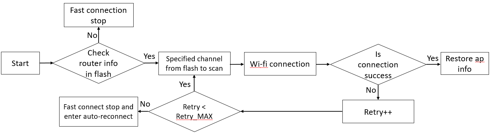

Implementation
~~~~~~~~~~~~~~

AP Information Storage
^^^^^^^^^^^^^^^^^^^^^^

User should implement a function to write AP information to Flash, just
like demo function write_fast_connect_data_to_flash() in the source file
wifi_fast_connect.c. In this function, you should reserve some space for
AP information, and write the AP information to the reserved space in a
pre-defined data format. The address of the function must be assigned to
the global variable p_store_fast_connect_info. After Wi-Fi connection is
successful, if p_store_fast_connect_info points to a valid address,
write_fast_connect_data_to_flash() will be called.

.. note :: The path of source codes is SDK/component/wifi/wifi_fast_connect/wifi_fast_connect.c.

Reconnection
^^^^^^^^^^^^

User can implement his own function to read AP information from Flash
and connect to AP, just like demo function wifi_do_fast_connect() in the
example code. The address of this function must be assigned to the
global variable p_wifi_do_fast_connect, which should be defined before
Wi-Fi initialization. After Wi-Fi is initialized, if
p_wifi_do_fast_connect points to a valid address, this function will be
called.

Fast Connection Data Erase
^^^^^^^^^^^^^^^^^^^^^^^^^^

User should implement his own function to erase fast connection data,
just like demo function Erase_Fastconnect_data() in the source code.

APIs
~~~~

================================== =========================================================================================
**API**                            **Introduction**
================================== =========================================================================================
<write_fast_connect_data_to_flash> Wi-Fi connection indication trigger this function to save current Wi-Fi profile in flash.
<wifi_do_fast_connect>             Read previous saved Wi-Fi profile in flash and execute connection.
================================== =========================================================================================

write_fast_connect_data_to_flash
^^^^^^^^^^^^^^^^^^^^^^^^^^^^^^^^

Wi-Fi connection indication trigger this function to save current Wi-Fi
profile in flash.

============= ============ ================
**Parameter** **Type**     **Introduction**
============= ============ ================
<offer_ip>    unsigned int DHCP offered IP.
<server_ip>   unsigned int DHCP server IP.
============= ============ ================

Return:

-  RTW_SUCCESS: Success.

-  RTW_ERROR: Failed.

.. note :: offer_ip and server_ip will be used only when CONFIG_FAST_DHCP is set to 1, they will be stored to Flash for fast DHCP. If CONFIG_FAST_DHCP is not configured to 1, offer_ip and server_ip are unaffected. Other Wi-Fi profiles will be directly got by API wifi_get_setting() and wifi_psk_info_get(), not depending on the input parameter of this function.

wifi_do_fast_connect
^^^^^^^^^^^^^^^^^^^^

Read previous saved Wi-Fi profile in flash and execute connection.

Parameter: None.

Return:

-  0: Success.

-  -1: Failed.

WPS APIs
--------

=========== ===========================
**API**     **Introduction**
=========== ===========================
<wps_start> Start WPS enrollee process.
<wps_stop>  Stop WPS enrollee process.
=========== ===========================

wps_start
~~~~~~~~~

Start WPS enrollee process.

============= ======== =======================================================================
**Parameter** **Type** **Introduction**
============= ======== =======================================================================
<wps_config>  u16      WPS configure method. Options are:
                      
                       -  WPS_CONFIG_DISPLAY
                      
                       -  WPS_CONFIG_KEYPAD
                      
                       -  WPS_CONFIG_PUSHBUTTON
<pin>         char *   PIN number. Can be set to NULL if using WPS_CONFIG_PUSHBUTTON.
<channel>     u8       Channel. Currently un-used, can be set to 0.
<ssid>        char *   Target network SSID. Can be set to NULL if no target network specified.
============= ======== =======================================================================

Return:

-  0: Success.

-  Otherwise: Failed.

-  Before invoking this function, the Wi-Fi should be enabled by calling
   wifi_on().

-  Make sure CONFIG_ENABLE_WPS is enabled in platform_opts.h. After
   calling wps_start(), the longest time of WPS is 120s. You can call
   wps_stop() to quit WPS.

wps_stop
~~~~~~~~

Stop WPS enrollee process.

Parameter: None.

Return: None.

.. note :: Make sure CONFIG_ENABLE_WPS is enabled in platform_opts.h.

Wi-Fi event callback function
-----------------------------

Register Wi-Fi event callback function
~~~~~~~~~~~~~~~~~~~~~~~~~~~~~~~~~~~~~~

The callback function is defined by user and need to be registered.

======================== =================================================
**API**                  **Introduction**
======================== =================================================
<wifi_reg_event_handler> Register callback function to the event listener.
======================== =================================================

=================== =================== =========================================================================
**Parameter**       **Type**            **Introduction**
=================== =================== =========================================================================
<event_cmds>        unsigned int        The event number indicated.
<handler_func>      rtw_event_handler_t The callback function which will receive and process the event.
<handler_user_data> void *              User specific data that will be passed directly to the callback function.
=================== =================== =========================================================================

Wi-Fi event introduction
~~~~~~~~~~~~~~~~~~~~~~~~

.. code-block:: c

    enum _WIFI_EVENT_INDICATE {
        /* common event */
        WIFI_EVENT_STA_ASSOC = 0,       //used in p2p, simple config, 11s, customer
        WIFI_EVENT_STA_DISASSOC,        //used in p2p, customer
        WIFI_EVENT_RX_MGNT,             //used in p2p, customer
        WIFI_EVENT_CONNECT,             //used in ipv6 example, p2p, wifi_manager example
        WIFI_EVENT_DISCONNECT,          //used in wifi_manager example, p2p, eap, atcmd……

        WIFI_EVENT_GROUP_KEY_CHANGED,
        WIFI_EVENT_RECONNECTION_FAIL,
        WIFI_EVENT_ICV_ERROR,
        WIFI_EVENT_CHALLENGE_FAIL,

        WIFI_EVENT_JOIN_STATUS,         //internally use for joinstatus indicate

        /* p2p event */
        WIFI_EVENT_P2P_SEND_ACTION_DONE = 15,

        /* wpa event */
        WIFI_EVENT_WPA_STA_WPS_START = 20,
        WIFI_EVENT_WPA_WPS_FINISH,
        WIFI_EVENT_WPA_EAPOL_START,
        WIFI_EVENT_WPA_EAPOL_RECVD,

        /* 11s event */
        WIFI_EVENT_11S_PATHSEL_GEN_RREQ = 59,
        WIFI_EVENT_11S_PATHSEL_GEN_RERR,
        WIFI_EVENT_11S_PATHSEL_RECV_RREQ,
        WIFI_EVENT_11S_PATHSEL_RECV_RREP,
        WIFI_EVENT_11S_PATHSEL_RECV_RERR,
        WIFI_EVENT_11S_PATHSEL_RECV_PANN,
        WIFI_EVENT_11S_PATHSEL_RECV_RANN,

        WIFI_EVENT_11S_PATHSEL_GEN_PREQ = 150,
        WIFI_EVENT_11S_PATHSEL_GEN_PERR,
        WIFI_EVENT_11S_PATHSEL_RECV_PREQ,
        WIFI_EVENT_11S_PATHSEL_RECV_PREP,
        WIFI_EVENT_11S_PATHSEL_RECV_PERR,
        WIFI_EVENT_11S_PATHSEL_RECV_GANN,

        /* csi rx done event */
        WIFI_EVENT_CSI_DONE = 160,

        WIFI_EVENT_MAX,
    };

WIFI_EVENT_STA_ASSOC
^^^^^^^^^^^^^^^^^^^^

Indicate client associated in AP mode

============= ======== ==================================
**Parameter** **Type** **Introduction**
============= ======== ==================================
<buf>         char *   Assoc Request Frame sent by client
<buf_len>     int      Size of Assoc Request Frame
<flags>       int      Unused
============= ======== ==================================

WIFI_EVENT_STA_DISASSOC
^^^^^^^^^^^^^^^^^^^^^^^

Indicate client disassociated in AP mode

============= ======== ===========================
**Parameter** **Type** **Introduction**
============= ======== ===========================
<buf>         char *   client Mac : 6 Bytes
                      
                       reason code : 2 Bytes
<buf_len>     int      Size of Assoc Request Frame
<flags>       int      Unused
============= ======== ===========================

Reason code :

.. code-block:: c

    #define WLAN_REASON_UNSPECIFIED                     1
    #define WLAN_REASON_PREV_AUTH_NOT_VALID             2
    #define WLAN_REASON_DEAUTH_LEAVING                  3
    #define WLAN_REASON_DISASSOC_DUE_TO_INACTIVITY      4
    #define WLAN_REASON_DISASSOC_AP_BUSY                5
    #define WLAN_REASON_CLASS2_FRAME_FROM_NONAUTH_STA   6
    #define WLAN_REASON_CLASS3_FRAME_FROM_NONASSOC_STA  7
    #define WLAN_REASON_DISASSOC_STA_HAS_LEFT           8
    #define WLAN_REASON_STA_REQ_ASSOC_WITHOUT_AUTH      9
    #define WLAN_REASON_MIC_FAILURE                     14
    #define WLAN_REASON_4WAY_HANDSHAKE_TIMEOUT          15
    #define WLAN_REASON_ACTIVE_ROAM                     65533
    #define WLAN_REASON_JOIN_WRONG_CHANNEL              65534
    #define WLAN_REASON_EXPIRATION_CHK                  65535

WIFI_EVENT_RX_MGNT
^^^^^^^^^^^^^^^^^^

Indicate management frame received. Need to call API
wifi_set_indicate_mgnt(1) to enable this event.

============= ======== ========================
**Parameter** **Type** **Introduction**
============= ======== ========================
<buf>         char *   Management Frame
<buf_len>     int      Size of Management Frame
<flags>       int      channel : 1 Byte
============= ======== ========================

WIFI_EVENT_CONNECT
^^^^^^^^^^^^^^^^^^

Indicate station connect to AP.

============= ======== ==================
**Parameter** **Type** **Introduction**
============= ======== ==================
<buf>         char *   AP BSSID : 6 Bytes
<buf_len>     int      6
<flags>       int      Unused
============= ======== ==================

WIFI_EVENT_DISCONNECT
^^^^^^^^^^^^^^^^^^^^^

Indicate station disconnect with AP.

============= ======== =====================
**Parameter** **Type** **Introduction**
============= ======== =====================
<buf>         char *   Null Mac : 6 Bytes
                      
                       reason code : 2 Bytes
<buf_len>     Int      8
<flags>       Int      Unused
============= ======== =====================

WIFI_EVENT_RECONNECTION_FAIL
^^^^^^^^^^^^^^^^^^^^^^^^^^^^

Indicate wifi reconnection failed

============= ======== ================================
**Parameter** **Type** **Introduction**
============= ======== ================================
<buf>         char *   "RECONNECTION FAILURE"
<buf_len>     Int      strlen of "RECONNECTION FAILURE"
<flags>       Int      Unused
============= ======== ================================

WIFI_EVENT_ICV_ERROR
^^^^^^^^^^^^^^^^^^^^

Indicate that the receiving packets has ICV error

============= ======== ====================
**Parameter** **Type** **Introduction**
============= ======== ====================
<buf>         char *   "ICV Eror"
<buf_len>     Int      strlen of "ICV Eror"
<flags>       Int      Unused
============= ======== ====================

WIFI_EVENT_CHALLENGE_FAIL
^^^^^^^^^^^^^^^^^^^^^^^^^

Indicate authentication failed because of challenge failure

============= ======== ===============================
**Parameter** **Type** **Introduction**
============= ======== ===============================
<buf>         char *   "Auth Challenge Fail"
<buf_len>     Int      strlen of "Auth Challenge Fail"
<flags>       Int      Unused
============= ======== ===============================

WIFI_EVENT_WPA_STA_WPS_START
^^^^^^^^^^^^^^^^^^^^^^^^^^^^

Indicate WPS process starting.

============= ======== ====================
**Parameter** **Type** **Introduction**
============= ======== ====================
<buf>         char *   Source Mac : 6 Bytes
<buf_len>     Int      6
<flags>       Int      Unused
============= ======== ====================

WIFI_EVENT_WPA_WPS_FINISH
^^^^^^^^^^^^^^^^^^^^^^^^^

Indicate WPS process finish

============= ======== ================
**Parameter** **Type** **Introduction**
============= ======== ================
<buf>         char *   NULL
<buf_len>     Int      0
<flags>       Int      Unused
============= ======== ================

WIFI_EVENT_WPA_EAPOL_START
^^^^^^^^^^^^^^^^^^^^^^^^^^

Indicate to send EAPOL_START packets in eap process

============= ======== ====================
**Parameter** **Type** **Introduction**
============= ======== ====================
<buf>         char *   Source Mac : 6 Bytes
<buf_len>     Int      6
<flags>       Int      Unused
============= ======== ====================

WIFI_EVENT_WPA_EAPOL_RECVD
^^^^^^^^^^^^^^^^^^^^^^^^^^

Indicate EAPOL frame received in wps/eap process

============= ======== ===================
**Parameter** **Type** **Introduction**
============= ======== ===================
<buf>         char *   Eapol frame
<buf_len>     Int      Size of Eapol frame
<flags>       Int      Unused
============= ======== ===================

Auto Reconnection
-----------------

This section illustrates the principle of auto connection and how to
enable use sdk.

Auto connection is used to reconnect with AP automatically after pro2
receive deauth or connection failure, the principle is to store the AP
information in wifi driver and reconnect to AP after connection failure.
Auto reconnection is full scan connection. Users can decide whether to
start auto reconnect/reconnect times/interval time, the standard SDK
Default is to enable this function.

APIs
~~~~

============================ =========================================
**API**                      **Introduction**
============================ =========================================
< wifi_config_autoreconnect> Set reconnection mode with configuration.
============================ =========================================

wifi_config_autoreconnect
^^^^^^^^^^^^^^^^^^^^^^^^^

User can set the auto-reconnect for sdk.

============= ============= ======================================================
**Parameter** **Type**      **Introduction**
============= ============= ======================================================
<mode>        unsigned char mode: Set 1/0 to enable/disable the reconnection mode.
<retry_times> unsigned char retry_times: The number of retry limit.
<timeout>     u16           timeout: The timeout value (in seconds)
============= ============= ======================================================

Return:

-  RTW_SUCCESS: Success.

-  RTW_ERROR: Failed.

Multiple AP with specified ssid or mesh selection
-------------------------------------------------

SSID select policy:
~~~~~~~~~~~~~~~~~~~

**Normal wifi connection** first scans the supported channels to search
for all candidate router with specified ssid, and finally compares the
AP RSSI and then selects the AP with the strongest signal as the target
ssid for connection.

CONNECTION SUGGESTION:
~~~~~~~~~~~~~~~~~~~~~~

According to fast connection and wi-fi resume, we can combine different
usage scenario, each has its own advantages and disadvantages. We will
explain the four cases in order. This combination classification table
of fast connection and wifi resume is as follows:

=========================== ======================== =====================
\                           **Without wi-fi resume** **With wi-fi resume**
=========================== ======================== =====================
**Disable Fast Connection** Situation A              Situation B
**Enable Fast Connection**  Situation C              Situation D
=========================== ======================== =====================

-  Situation A (Disable fast connection without wi-fi resume)

Products in this situation are usually long-term power supply products
and don’t require connection speed requirements. Instead, they need to
connect to the strongest RSSI router of the specified ssid every time
they are reconnected.

-  Situation B (Disable fast connection with wi-fi resume)

For customers with wi-fi resume, there is no need to reconnect to the
router. In order to connect to the strongest router of all channel every
time, they will cancel the use of fast connection (refer to the chapter
20.3). Use **normal wifi connect function** to perform a full-frequency
scan and then connect, so that you can connect to the router with the
strongest RSSI in the current environment every time you reconnect.

   (PS: **normal wifi connection** can refer to fATWC implementation in
   atcmd_wifi.c)

-  Situation C (Enable fast connection without wi-fi resume)

   For customers without wi-fi resume, the fast connection function will
   be enable in order to speed up the reconnection to the AP.

   Its advantage is that it can speed up the connection speed, because
   it only scans the single channel that exist in Flash, but it has the
   disadvantage that it only connects to the AP of a specified channel.
   Therefore, if the environment has relatively new node router in other
   channel, pro2 will not scan this channel and do connection.

-  Situation D (Enable fast connection with wi-fi resume)

   If the positioning of battery products is to pursue fast connection,
   then this will be the case. The disadvantage is that this product
   will only connect to a fixed channel router (because of the influence
   of fast connection). The advantage is that the connection time is
   reduce.

-  Scan regularly to find new nodes:

   Sometimes, Battery products are moving to different locations or the
   node router is set up, which may cause the connected AP to change
   from the router with the strongest signal to the weakest router.
   Therefore, in order to avoid this situation, it is recommend that the
   ODM regularly wake up 24 hours a day on the upper layer and perform a
   full scan to determine whether to change to connect to another AP.

Wifi Channel plan setting
-------------------------

Purpose:
~~~~~~~~

-  This part is to introduce the setup of channel plan

Channel plan setup:
~~~~~~~~~~~~~~~~~~~

-  Two ways are referred to manage the Channel Plan. The first one is
   configured by the efuse map (0xC8h) and the other software method is
   configured by setting channel plan value in wifi_conf.c. It’s noted
   that the priority of changing the channel plan in ram is higher than
   reading the efuse map 0xC8h.

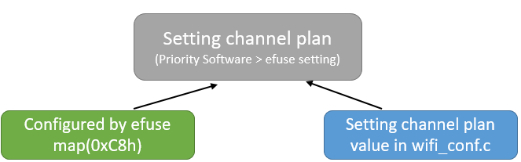

Channel plan configured by the efuse map:
^^^^^^^^^^^^^^^^^^^^^^^^^^^^^^^^^^^^^^^^^

-  The WLAN driver gets channel plan value from the address 0xC8 of the
   efuse map. If the user updates a new channel plan value in efuse map
   0xC8 and customer need to reboot device to enable the new value.

Channel plan table:
'''''''''''''''''''

-  Please refer to the document ”
   WS-200923-Willis-Efuse_Channel_Plan_new_define-R54.xlsx” to configure
   customer’s channel plan.

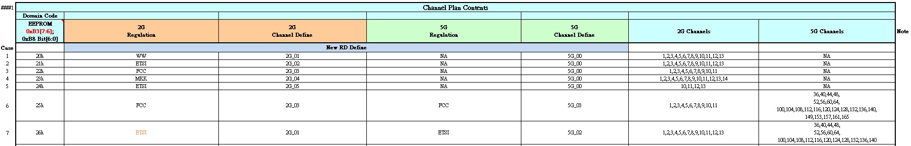

Write/Read efuse map:
'''''''''''''''''''''

-  Modify the efuse map 0xC8h in MP mode

-  Write/Read the efuse map MP commands

-  Example:

i.  #iwpriv config_set wmap,0xC8,79 // Write Channel plan 0x79 in efuse,
    regulation is 2G_MKK2 and 5G_MKK1

ii. #iwpriv config_get rmap,0xC8,1 // Read Channel Plan Value from efuse

Setup example:
''''''''''''''

-  According to WS-200923-Willis-Efuse_Channel_Plan_new_define-R54.xlsx,
   customer can write 0xC8=0x79h into efuse map.

-  2G_MKK2 and 5G_MKK1

i.  2GHz Mkk, channel 1 ~ 13

ii. 5GHz

a. W52: 36/40/48/48ch

b. W53: 52/56/60/64ch

c. W56: 100/104/108/112/116/120/124/128/132/136/140ch

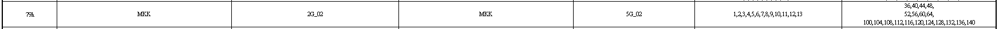

Channel plan configured by setting channel plan value for wifi_user_config.channel_plan in wifi_conf.c:
^^^^^^^^^^^^^^^^^^^^^^^^^^^^^^^^^^^^^^^^^^^^^^^^^^^^^^^^^^^^^^^^^^^^^^^^^^^^^^^^^^^^^^^^^^^^^^^^^^^^^^^

-  Customer can change the wifi_user_config.channel_plan to set channel
   plan but would not change the efuse map (0xC8h).

Channel plan table:
'''''''''''''''''''

-  Please refer to the document ”
   WS-200923-Willis-Efuse_Channel_Plan_new_define-R54.xlsx” to configure
   customer’s channel plan.

Set channel plan by software method:
''''''''''''''''''''''''''''''''''''

-  Change value: the parameter (wifi_user_config.channel_plan) is
   channel plan, so we can modify it to setup new channel plan.

-  It’s reminded to change the wifi_user_config.channel_plan when the
   device reboot every time, otherwise channel plan value will be efuse
   map value.

-  Modify the wifi_user_config.channel_plan value in
   wifi_set_user_config() [path:
   SDK\component\common\api\wifi\wifi_conf.c]

Set channel plan by software method example about channel plan 0x22h:
'''''''''''''''''''''''''''''''''''''''''''''''''''''''''''''''''''''

-  The wifi_user_config.channel_plan(\api\wifi\wifi_conf.c) default
   value is 0, and it will read from efuse map to set :

.. code-block:: c

    wifi_set_user_config(void)
    {
        wifi_user_config.channel_plan = 0; //0: default setting from efuse map
    }

-  Example: Channel plan: 0x22 about FCC 2.4GHz channel 1~11, no passive
   channels, no 5GHz.

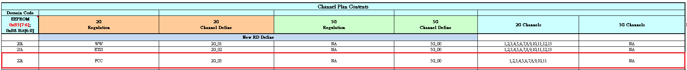

-  2.4GHz FCC setup example: Modify wifi_conf.c as below and
   channel_plan will work after wifi_on().

.. code-block:: c

    wifi_set_user_config(void)
    {
        wifi_user_config.channel_plan = 0x22;
    }

Read channel plan value:
^^^^^^^^^^^^^^^^^^^^^^^^

-  Method 1) Calling WIFI API in normal mode about
   wifi_get_channel_plan(uint8_t \* channel_plan)

-  Method 2) AT command in normal mode

i. ATWZ=get_drv_ability

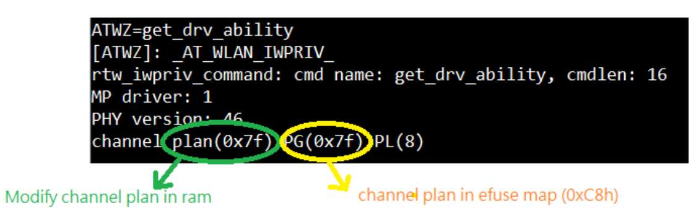

-  The setup priority of Channel plan: SW Modification
   (wifi_user_config.channel_plan) is higher than the efuse map (0xC8h)

Power by Rate and Power Limit Introduction
------------------------------------------

Introduction:
~~~~~~~~~~~~~

-  This part is to introduce the power by rate table and power limit
   table.

i.   In order to calculate the TX power, RF calibration is the essential
     procedure.

ii.  The Wi-Fi driver can get the expected TX power with various
     modulations and data rates according to power by rate table.

iii. To meet FCC/CE/MKK certification requirements, the power limit
     table can help to decide the final power index.

Power by rate and limit Introduction:
~~~~~~~~~~~~~~~~~~~~~~~~~~~~~~~~~~~~~

-  Customer can include rtw_opt_rf_para_rtl8735b.c file and compile the
   code.

-  In
   project/realtek_amebapro2_v0_example/GCC-RELEASE/application/application.cmake
   and do the following codes to include the file to compile

-  #wifi

-  list(
   ${sdk_root}/component/wifi/driver/src/core/option/rtw_opt_rf_para_rtl8735b.c
   )

Power By rate Table:
~~~~~~~~~~~~~~~~~~~~

-  Power by rate table.txt defines the Tx power by various data rate.
   The TX output power for “Base Rate” in Power by Rate table is the
   reference value.

-  The power by rate table(array_mp_8735b_phy_reg_pg) in The
   rtw_opt_rf_para_rtl8735b.c is the same as WIFI driver default value.

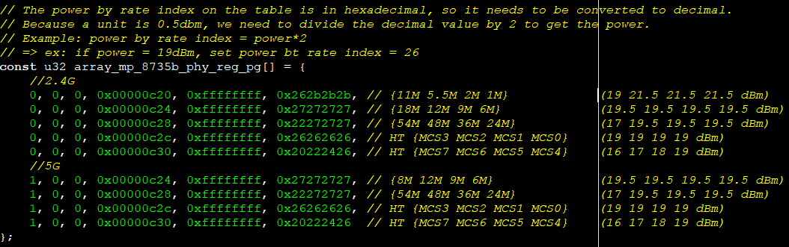

Power Limit Table:
~~~~~~~~~~~~~~~~~~

-  Power limit table.txt defines the maximum Tx power of different
   regions. Realtek default Regulation of power limit table
   (FCC/ETSI/MKK/…) corresponding calibration content(0xC8h) channel
   plan divide into 10 group :

==================================================================== ==========================
Channel Plan WS-200923-Willis-Efuse_Channel_Plan_new_define-R54.xlsx rtw_opt_rf_para_rtl8735b.c
                                                                    
                                                                     odm_pw_lmt_regulation_type
==================================================================== ==========================
FCC                                                                  PW_LMT_REGU_FCC
ETSI                                                                 PW_LMT_REGU_ETSI
MKK                                                                  PW_LMT_REGU_MKK
IC                                                                   PW_LMT_REGU_IC
KCC                                                                  PW_LMT_REGU_KCC
ACMA                                                                 PW_LMT_REGU_ACMA
CHILE                                                                PW_LMT_REGU_CHILE
MEX                                                                  PW_LMT_REGU_MEXICO
NCC                                                                  PW_LMT_REGU_NCC
WW                                                                   PW_LMT_REGU_ETSI
                                                                    
(The min of ETSI and MKK)                                            PW_LMT_REGU_MKK
==================================================================== ==========================

-  For the Enum definition of odm_pw_lmt_regulation_type in
   rtw_opt_rf_para_rtl8735b.c, please according to the Regulation
   supported by the channel plan in
   WS-200923-Willis-Efuse_Channel_Plan_new_define-R54.xlsx to add new
   regulation.

-  The power limit table(array_mp_8735b_txpwr_lmt) in the
   rtw_opt_rf_para_rtl8735b.c is the same as wifi driver default value

-  We have three registered default power limit tables (FCC/ETSI/MKK) as
   below.

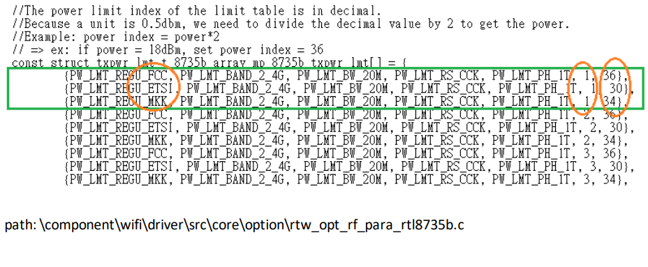

Add new Power Limit Table excluding the FCC/ETSI/MKK table:
~~~~~~~~~~~~~~~~~~~~~~~~~~~~~~~~~~~~~~~~~~~~~~~~~~~~~~~~~~~

-  For example channel_plan is 0x39h and this channel plan power limit
   table is NCC(PW_LMT_REGU_NCC) as below

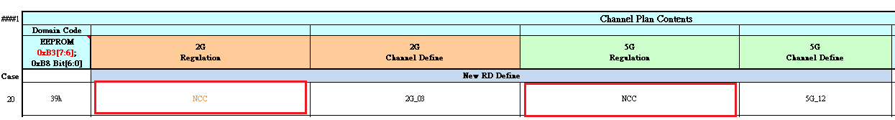

-  It is necessary to add new NCC and fill in the appropriate TX limit
   value for every channel and bandwidth and rate. The NCC and Tx limit
   value are circled in orange in the red box below. Regarding the TX
   limit value, customers will set this value when they go through the
   certification process and fill in the following array.

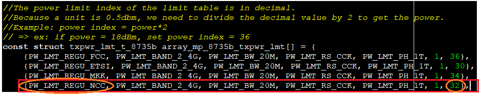

SRRC Regulation Introduction and setting:
~~~~~~~~~~~~~~~~~~~~~~~~~~~~~~~~~~~~~~~~~

-  The Ministry of Information Industry (MII) of China has mandated that
   all radio component products sold and used in China must obtain Radio
   Type Approval Certification. Hence the abbreviation is SRRC

-  Since the power limit used by SRRC is PW_LMT_REGU_CN but it isn’t
   defined in WS-200923-Willis-Efuse_Channel_Plan_new_define-R54.xlsx,
   the customer must set the country code in the wifi_on
   function(\component\wifi\api\wifi_conf.c) as shown below:

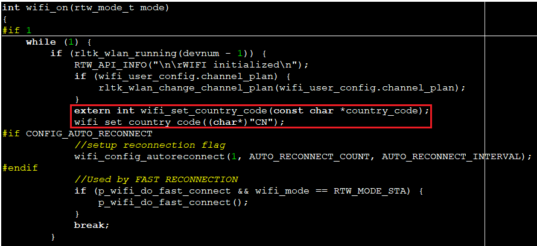

-  The wifi_set_country_code API will set the channel plan 0x48 and
   regulation is PW_LMT_REGU_CN. Customers can also modify or add the
   power limit size of PW_LMT_REGU_CN in rtw_opt_rf_para_rtl8735b.c.
   Therefore, the requirements of SRRC regulations can be met.

Wifi Adaptivity
---------------

Adaptivity Introduction:
~~~~~~~~~~~~~~~~~~~~~~~~

-  The adaptivity experiment is designed to determine the working
   performance of the device under test in the presence of interference
   between wireless channels.

Adaptivity Setup Guide:
~~~~~~~~~~~~~~~~~~~~~~~

-  Disable Fast connect and auto reconnect as below, because they
   sometimes make the test failed when testing in the certification LAB

i. platform_opts.h in \\SDK\\project\\realtek_amebapro2_v0_example\\inc

   #define ENABLE_FAST_CONNECT    0

ii. autoconf.h in \\SDK\\component\\common\\drivers\\wlan\\realtek\\include

   #define CONFIG_AUTO_RECONNECT 0

-  Enable Adaptivity: Modify API in wifi_conf.c wifi_set_user_config()
   to enable the adaptivity function.

.. code-block:: c

    wifi_set_user_config(void)
    {
    // adaptivity
        wifi_user_config.rtw_adaptivity_en = DISABLE;
        /*
         * 0 : RTW_ADAPTIVITY_MODE_NORMAL
         * 1: RTW_ADAPTIVITY_MODE_CARRIER_SENSE
         */
        wifi_user_config.rtw_adaptivity_mode = 0;
        wifi_user_config.rtw_adaptivity_th_l2h_ini = 0;
    }

    Default:    rtw_adaptivity_en   = DISABLE
    CE:     rtw_adaptivity_en   = ENABLE
            rtw_adaptivity_mode = RTW_ADAPTIVITY_MODE_NORMAL
    MKK:        rtw_adaptivity_en   = ENABLE
            rtw_adaptivity_mode = RTW_ADAPTIVITY_MODE_CARRIER_SENSE

Adaptivity Threshold Setting:
~~~~~~~~~~~~~~~~~~~~~~~~~~~~~

-  Customer can set wifi_user_config.rtw_adaptivity_th_l2h_ini in API in
   wifi_conf.c wifi_set_user_config() to set adaptivity threshold.

   i. RTW_ADAPTIVITY_NORMAL

      a. How to calculate EDCCA equation from rtw_adaptivity_th_l2h_ini
         as below and show the example

         1. EDCCA vaule = (rtw_adaptivity_th_l2h_ini – 110) dBM (except rtw_adaptivity_th_l2h_ini=0(In driver rtw_adaptivity_th_l2h_ini default is 45, so the EDCCA value is -65dbm)

         2. For example:

            rtw_adaptivity_th_l2h_ini = 55 (-55dBm[EDCCA value])

            rtw_adaptivity_th_l2h_ini = 50 (-60dBm[EDCCA value])

            rtw_adaptivity_th_l2h_ini = 45 (-65dBm[EDCCA value])

            rtw_adaptivity_th_l2h_ini = 42 (-68dBm[EDCCA value])

            rtw_adaptivity_th_l2h_ini = 40 (-70dBm[EDCCA value])

            rtw_adaptivity_th_l2h_ini = 35 (-75dBm[EDCCA value])

   ii. RTW_ADAPTIVITY_CARRIER_SENSE

      a. rtw_adaptivity_th_l2h_ini default value is 60 (-50dBm[EDCCA value]), and EDCCA equation as above.

Adaptivity Threshold Getting:
~~~~~~~~~~~~~~~~~~~~~~~~~~~~~

-  Customer can get adaptivity edcca by checking three parameters about
   wifi_user_config.rtw_adaptivity_th_l2h_ini and
   wifi_user_config.rtw_adaptivity_mode and
   wifi_user_config.rtw_adaptivity_th_l2h_ini.

.. code-block:: c

    int wifi_get_adaptivity_edcca_dbm(int* value){
        int ret = 0;
        if(wifi_user_config.rtw_adaptivity_en){
            if( wifi_user_config.rtw_adaptivity_mode == 0){
                //RTW_ADAPTIVITY_MODE_NORMAL
                if(wifi_user_config.rtw_adaptivity_th_l2h_ini==0){
                    *value = 45 - 110;
                }
                else{
                  *value = wifi_user_config.rtw_adaptivity_th_l2h_ini - 110;
                }
            }
            //RTW_ADAPTIVITY_MODE_CARRIER_SENSE
            if( wifi_user_config.rtw_adaptivity_mode == 1){
                if(wifi_user_config.rtw_adaptivity_th_l2h_ini==0){
                    *value = 60 - 110;
                }
                else {
                 *value = wifi_user_config.rtw_adaptivity_th_l2h_ini - 110;
                }
            }
            ret = 1;
        }
        return ret;
    }
