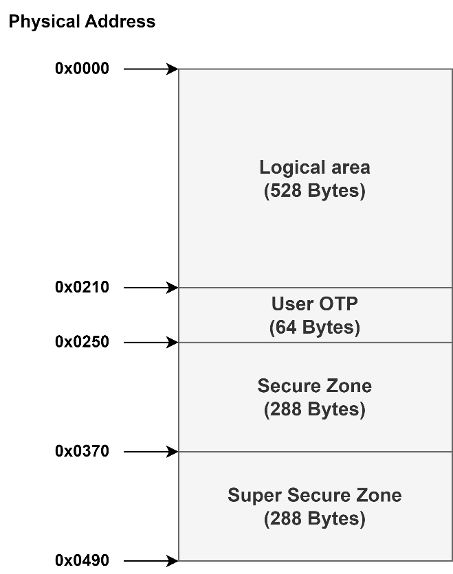

Peripheral
==========

.. contents::
  :local:
  :depth: 2

Flash spic QPI or QSPI setting
------------------------------

SDK bootloader sets the flash to QPI mode by default. Boot loader will
use SPIC_BIT_MODE_SETTING in hal_spic.h as the parameter of flash init.
Moreover, the default boot process flow can be overwritten by
implementing the spic_user_select () in
component\soc\8735b\misc\platform\user_boot.c. The spic_user_select ()
should set the \*pspic_bit_mode that will be loaded by bootloader. If
the SPIC_BIT_MODE_SETTING is SpicQpiMode, bootloader will init flash as
QPI mode. If the SPIC_BIT_MODE_SETTING is SpicQuadIOMode, bootloader
will init flash as QSPI mode. To apply spic_user_select (), it is
necessary to re-build bootloader.

.. code-block:: c

   //hal_spic.h
   #define SPIC_BIT_MODE_SETTING SpicQpiMode // Default for ram code using is qpi mode

.. code-block:: c

   //user_boot.c
   void spic_user_select(uint8_t *pspic_bit_mode)
   {
       *pspic_bit_mode = SPIC_BIT_MODE_SETTING;
   }

Aon watchdog
------------

Check reboot reason was AON WDT or not
~~~~~~~~~~~~~~~~~~~~~~~~~~~~~~~~~~~~~~

.. code-block:: c

    //wdt_api.h
    /**
    *  @brief   Check reboot reason was AON WDT or not
    *
    *  @param   None
    *  @retval  1:Reboot reason was AON WDT
    *       0:Reboot reason wasn't AON WDT
    */
    uint8_t watchdog_aon_reboot_check(void);

Clear AON WDT boot reason
~~~~~~~~~~~~~~~~~~~~~~~~~

User needs to call watchdog_aon_clear() to clear AON WDT boot reason.

.. code-block:: c

    //wdt_api.h
    /**
    *  @brief   Clear AON WDT boot reason
    *
    *  @param   None
    *  @retval  None
    */
    void watchdog_aon_clear(void);

One-time Programmable (OTP)
---------------------------

Introduction
~~~~~~~~~~~~

Antifuse one-time programmable (OTP) is the most secure embedded
non-volatile memory (eNVM). The default value is ’1’ and can only be
changed from ‘1’ to ‘0’.

OTP layout
~~~~~~~~~~

- Logical area : 0x0 ~ 0x20F , size: 528 bytes

-  User OTP : 0x210~0x24F , size: 64 bytes

-  Secure Zone : 0x250~0x36F , size: 288 bytes

-  Super Secure Zone : 0x370~0x48F , size: 288 bytes

Figure OTP layout

OTP Programming APIs
~~~~~~~~~~~~~~~~~~~~

======================== ============================
**API**                  **Introduction**
======================== ============================
<efuse_otp_read>         Read user's OTP content.
<efuse_otp_write>        Write user's content to OTP.
<efuse_crypto_key_get>   Read user crypto key.
<efuse_crypto_key_write> Write user crypto key.
======================== ============================

efuse_otp_read
^^^^^^^^^^^^^^

Read user's OTP content.

============= ======== ================================================
**Parameter** **Type** **Introduction**
============= ======== ================================================
<address>     u8       Specifies the offset of the programmed OTP.
<len>         u8       Specifies the data length of programmed data.
<buf>         u8 *     Specified the address to save the readback data.
============= ======== ================================================

Return:

-  0: Success.

-  -1: Failure.

efuse_otp_write
^^^^^^^^^^^^^^^

Write user's content to OTP.

============= ======== =============================================
**Parameter** **Type** **Introduction**
============= ======== =============================================
<address>     u8       Specifies the offset of the programmed OTP.
<len>         u8       Specifies the data length of programmed data.
<buf>         u8 *     Specified the data to be programmed.
============= ======== =============================================

Return:

-  0: Success.

-  -1: Failure.

efuse_crypto_key_get
^^^^^^^^^^^^^^^^^^^^

There are two 32-byte key slots in Secure Zone for user crypto use.
efuse_crypto_key_get() is used to read the user crypto key. For usage
methods, please refer to
component/example/secure_storage/example_secure_storage_s.c in the SDK.

============= ========== ===================================================================
**Parameter** **Type**   **Introduction**
============= ========== ===================================================================
< pkey>       uint8_t *  Pointer to the buffer used to get 32-byte key
< key_num>    uint8_t    Key index for the key slot to be read. The key index can be 0 or 1.
============= ========== ===================================================================

Return:

-  0: Success.

-  -1: Failure.

efuse_crypto_key_write
^^^^^^^^^^^^^^^^^^^^^^

There are two 32-byte key slots in Secure Zone for user crypto use.
efuse_crypto_key_write() is used to write the user crypto key. The write
protection for user crypto key can be enabled. For usage methods, please
refer to component/example/secure_storage/example_secure_storage_s.c in
the SDK.

============= ========== =========================================================================
**Parameter** **Type**   **Introduction**
============= ========== =========================================================================
< pkey>       uint8_t *  Pointer to the 32-byte key to be written.
< key_num>    uint8_t    Key index for the key slot to be written to. The key index can be 0 or 1.
< w_lock_en>  uint8_t    Specify if write lock enabled after key programming. 1 for enable.
============= ========== =========================================================================

Return:

-  0: Success.

-  -1: Failure.
