[AmebaPro2] Introduction for AmebaPro2 Flow
===========================================

AmebaPro2 architecture for sensor flow
---------------------------------------
..

   **AmebaPro2 support 2 way for sensor bringing up flow**

- Fast camera start flow support to get 1\ :sup:`st` video frame as soon
  as possible

..

   |image1|

- Normal camera flow is used as usually for general usage.

..

   |image2|

Sensor Configuration on AmebaPro2
-----------------------------------

..

   **AmebaPro2 uses a set concept for sensor & IQ control**

   |image3|

.. note :: **Normal camera driver & IQ is voe based**

  - **Version should be alignment.**

..

   **Sensor configuration file in AmebaPro2 is listed as below**

- project\\realtek_amebapro2_v0_example\\GCC-RELEASE\\mp\\amebapro2_sensor_set.json

  - Configuration for each driver set

- project\\realtek_amebapro2_v0_example\\GCC-RELEASE\\mp\\amebapro2_isp_iq.json

  - User can define which set index for FCS flow

- project\\realtek_amebapro2_v0_example\\inc\\sensor.h

  - Configuration for sensor control

- **amebapro2_sensor_set.json**

  - User can define how many driver set

    - It support at most 9 set with 1 dummy set

    - Dummy set (set 0) can’t be removed

- **sensor.h**

  - Configuration for sensor control

  - User can choose which index for driver set

- **amebapro2_isp_iq.json**

  - User could config FCS index (in necessary)

..

   |image4|

   **Path for driver related bin**

- component\\soc\\8735b\\fwlib\\rtl8735b\\lib\\source\\ram\\video\\voe_bin

..

   **Build Code flow**

- When user need to update file, it need to be put it in voe_bin

- Batch file would automatic copy file to link folder (during make
  stage)

  - project\\realtek_amebapro2_v0_example\\GCC-RELEASE\\build\\application

..

   **Version check**

- When load sensor & iq, we would show date & timestamp for each bin

..

   |image5|

   |image6|

   Version check

- When load sensor & iq, we would show date & timestamp for each bin

- Based on voe version in SDK, choose corresponding voe code base

..

   |image7|

Driver Code base
------------------

..

   **Code base for normal driver**

- voe1470

..

   **Code base for FCS driver**

- rtl8735_driver_code_fcs

..

   **IQ Bin**

- Please refer to IQ tuning guide

..

   |image8|

[Normal Driver] flow for adding sensor
----------------------------------------

..

   **Prepare for sensor driver bin**

- Based on VOE code base (version alignment)

..

   **Add a new sensor driver (if necessary)**

- Refer to
  「AmebaPro2_DriverGuide_IntroductionForPortingSensorDriver.pdf」

- Output sensor driver bin

- Copy sensor driver bin to sdk folder

..

   |image9|

- **Add new folder for new sensor driver**

  - Take sc2333 for example

  - Copy from same vendor sensor or same segment sensor

  - Folder Path: sensor\\smartsens\\sc2333\\

  - File Path: sensor\\smartsens\\sc2333\\sensor_sc2336_mipi.c

  - Open sensor driver, and replace the sensor name (sc2336 -> sc2333)

..

   |image10|

- **Modify configuration for VOE code base**

  - Check for new page for detail

    - \\sensor\\Makefile

- **Compile and check output bin**

  - Output folder: output\\sc2333.bin

..

   |image11|

- **Modify configuration for VOE code base**

  - \\sensor\\Makefile

    1) Add folder path

    2) Add sensor driver file name

    3) Add sensor to build

..

   |image12|

   |image13|

   |image14|

[FCS Driver] flow for adding sensor
-------------------------------------

..

   **Driver Code**

- Use following command to output FCS driver

- gcc -o fcs_g.exe gen_fcs_data.c

- ./fcs_g.exe

- Get fcs driver bin

|image15|

|image16|

|image17|

+--------+-------+--------+--------------------------------------------+
|        |       | Author | Release note                               |
| Date   |Version|        |                                            |
|        |       |        |                                            |
|        |       |        |                                            |
+========+=======+========+============================================+
| 2023   | 1.0   | Zako   | Draft version for customer release         |
| .04.11 |       | Wu     |                                            |
+--------+-------+--------+--------------------------------------------+
| 2023   | 1.1   | Zako   | Add description for voe code based         |
| .07.14 |       | Wu     | selection #P7                              |
|        |       |        |                                            |
|        |       |        | Modify updating sensor driver flow ( with  |
|        |       |        | voe.bin) #P9                               |
+--------+-------+--------+--------------------------------------------+
| 2024   | 1.2   | Kevin  | Update Normal Driver porting flow #P8~#P11 |
| .10.14 |       | Chuang |                                            |
+--------+-------+--------+--------------------------------------------+

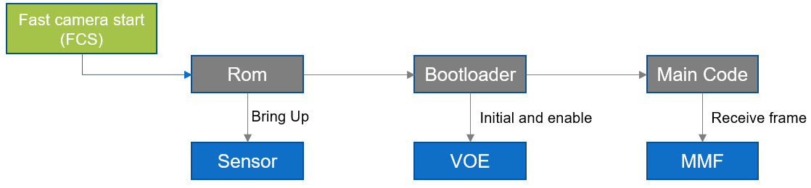
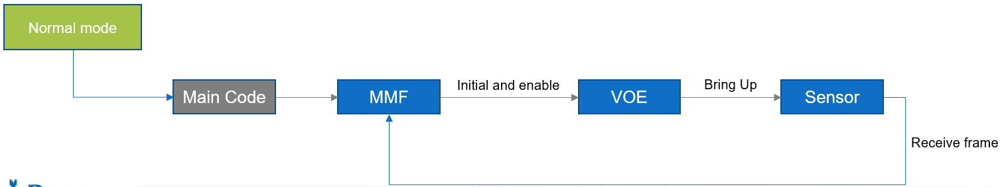
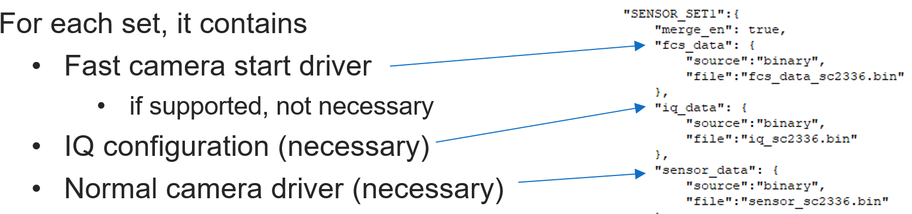
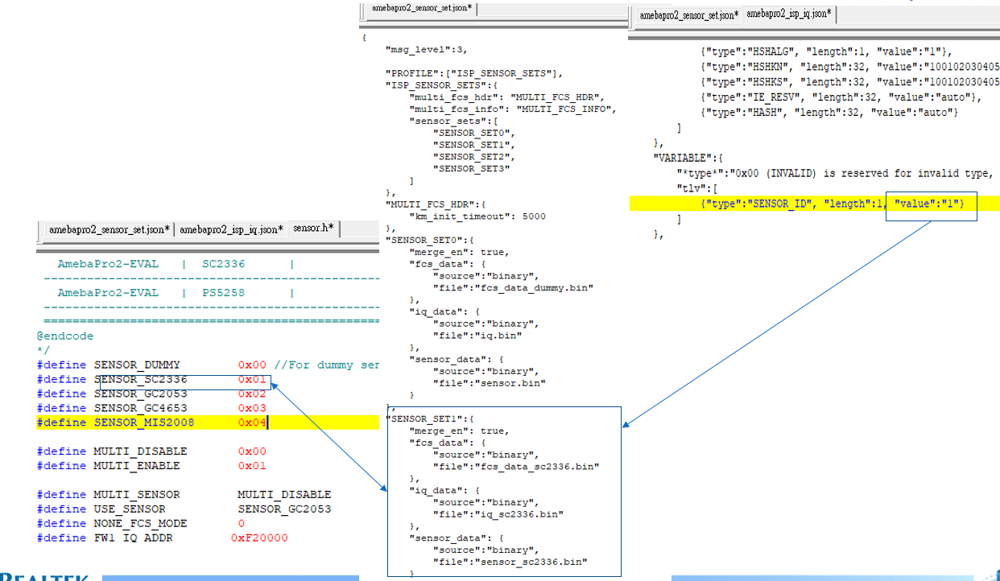
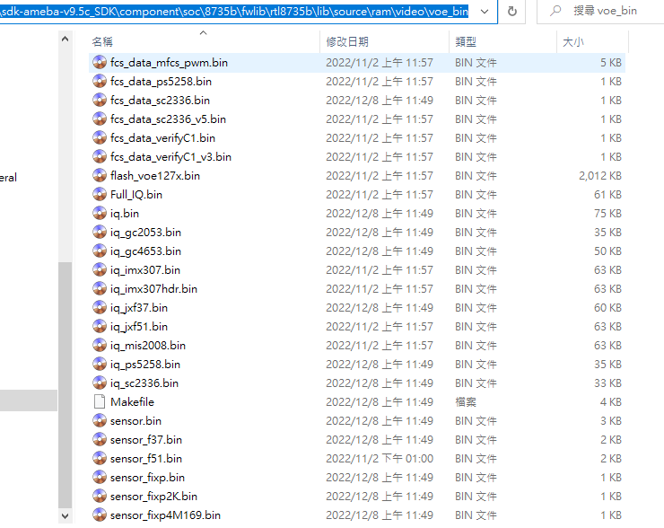
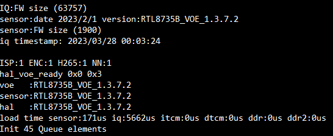
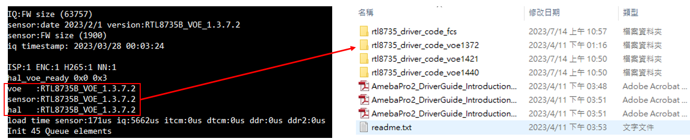
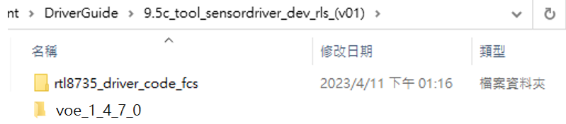
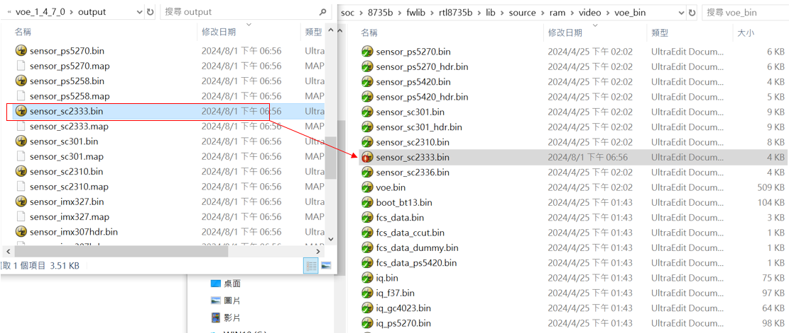
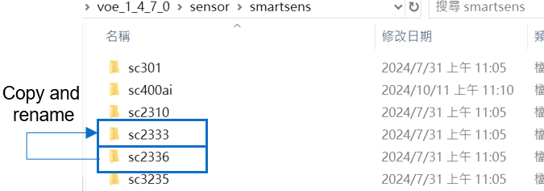
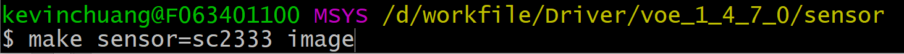
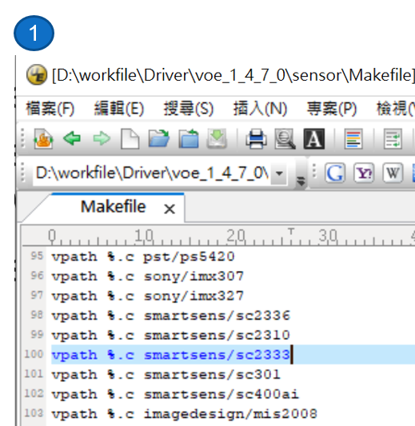
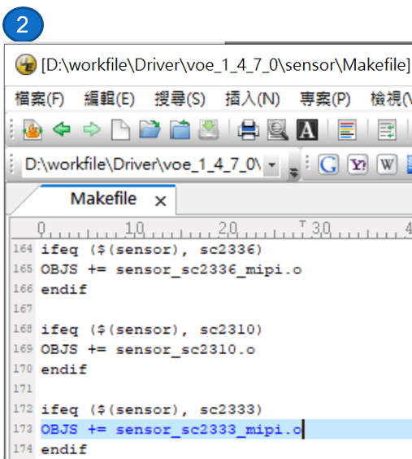
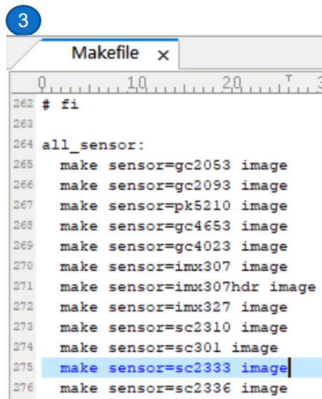
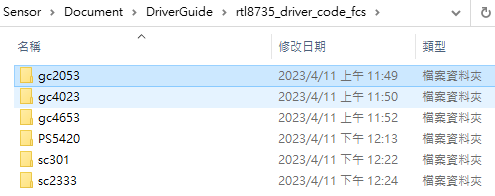
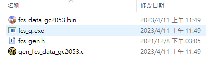
.. |image17| image:: ../../_static/user_manual/35_Introduction_For_AmebaPro2Flow/image17.png
   :width: 5.76806in
   :height: 0.94583in
