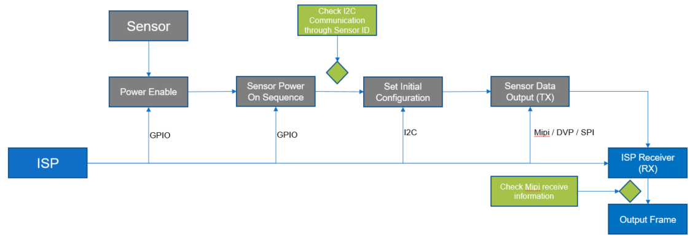
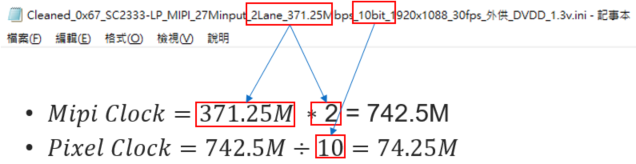
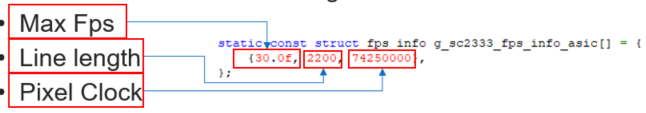
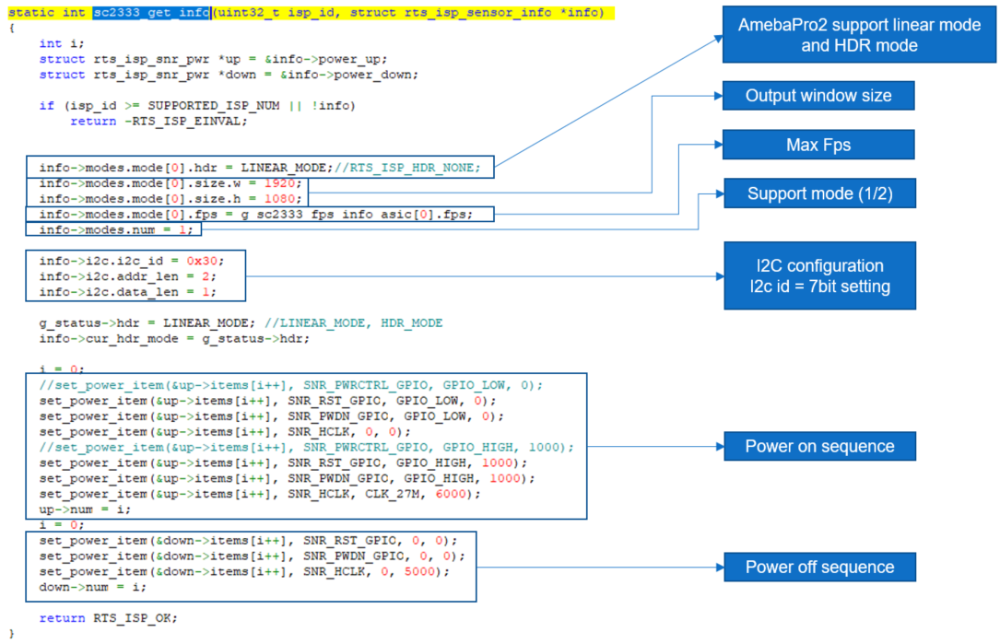
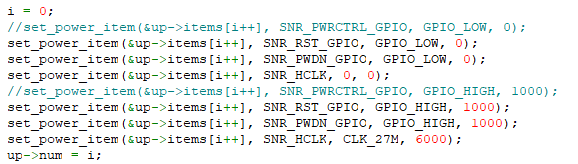
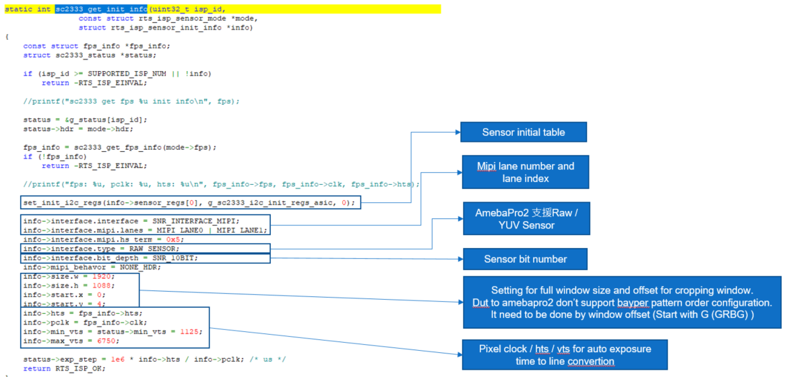
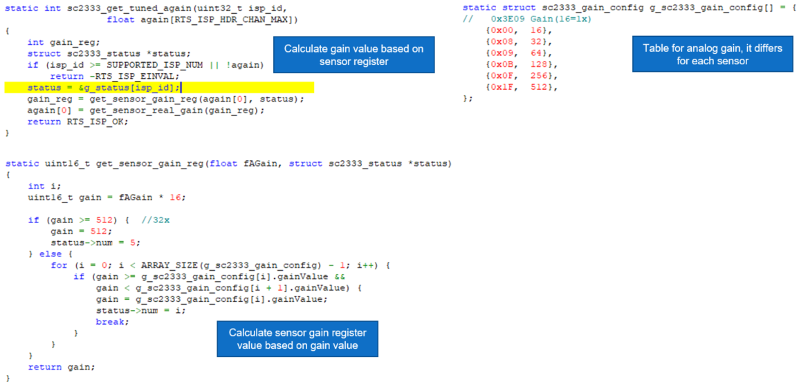
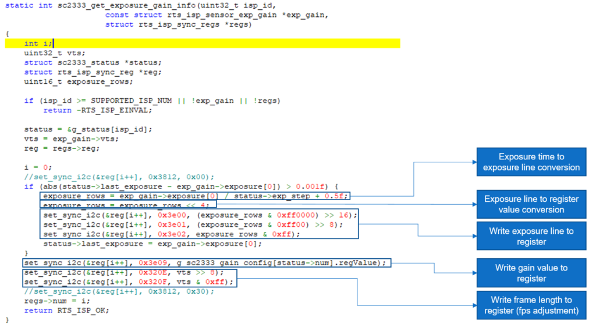
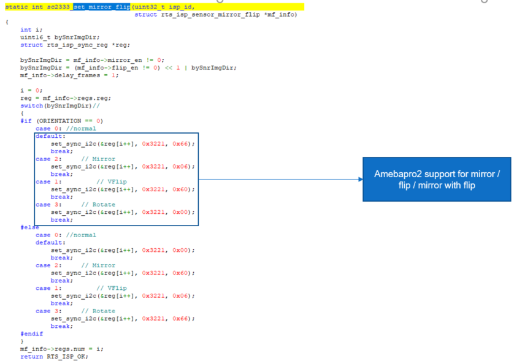
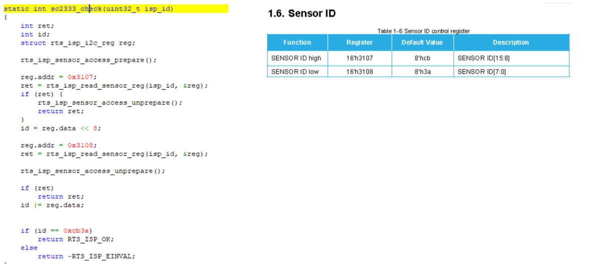

[AmebaPro2] Introduction for Porting Sensor Driver
==================================================

**General sensor bring up flow**
--------------------------------

..

   |image1|

**AmebaPro2 Driver architecture**
---------------------------------
..

   **Architecture (Take sc2333 for example)**

- rts_isp_sensor_ops sc2333_ops

  - Function pointer arrangement for each sensor driver

- sc2333_get_info

  - General function for power on / power off sequence with i2c setting

- sc2333_get_init_info

  - General function for RX configuration (mipi ,window setting)

- sc2333_get_tuned_again

  - General function to set sensor analog gain

- sc2333_get_tuned_dgain

  - No use in amebapro2

- sc2333_get_exposure_gain_info

  - Auto exposure function

- sc2333_set_mirror_flip

  - Function for Sensor orientation

- sc2333_check

  - Function to check sensor ID

**Function list**
------------------

..

   **Function: fps_info_asic**

   User need to set RX information based on initial setting

- Take sc2333 for example

..

   |image2|

- 2 lane with mipi clock 371.25M 10 bit

- AmebaPro2 need to set following 3 item for RX

..

   |image3|

- Another formula for compute Line length

..

   :math:`Line\ length = mipi\ clock*Lane \div bit \div frame\ length`
   :math:`\div` :math:`fps`

   = :math:`Pixel\ Clock \div frame\ length` :math:`\div` :math:`fps`

**Function: get_info**

   |image4|

- **Power on / off function**

..

   |image5|

- Parameter 0 = index (cascade one by one)

- Parameter 1 = GPIO (Reset / Pwdn / System Clock)

- Parameter 2 = value (High / low for GPIO, frequency for system clock)

- Parameter 3 = delay after this function (us)

..

   **Function: get_init_info**

   |image6|

   **Function: get_tuned_again**

   |image7|

   **Function: get_exposure_gain_info**

   |image8|

   **Function: set_mirror_flip**

   |image9|

   **Function: sc2333_check**

   |image10|

**Debug flow**
--------------

- **Check Driver Bin**

  - **By debug log**

- **Check Power on sequence**

  - **Check sensor id register through i2c**

- **Check Mipi RX**

  - **Here is the register from ISP for receiving information**

  - **Check MIPI frame/line/pixel**

    - **Read MIPI_DPHY_FRAME_CNT (0x403C_0198)**

    - **Read MIPI_DPHY_LINE_CNT (0x403C_019C)**

    - **Read MIPI_DPHY_PXI_CNT (0x403C_01A0)**

  - **Check Input frame count**

    - **Read SYS_FRAME_CNT(0x4030_0020)**

  - **Check Isp pipeline status**

    - **Read SYS_FRAME_IDLE (0x4030_0028)**

  - **Example: using Atcmd for check these information**

    - **ATIX=read32,address offset, length**

      - **Address base is 0x40000000**

    - **ATIX=read32,0xc0198,3**

+--------+-------+--------+--------------------------------------------+
|        |       | Author | Release note                               |
| Date   |Version|        |                                            |
|        |       |        |                                            |
|        |       |        |                                            |
+========+=======+========+============================================+
| 2023   | 1.0   | Zako   | Draft version for customer release         |
| .04.11 |       | Wu     |                                            |
+--------+-------+--------+--------------------------------------------+
| 2024   | 1.2   | Kevin  | Contact add #P5                            |
| .10.14 |       | Chuang |                                            |
+--------+-------+--------+--------------------------------------------+

