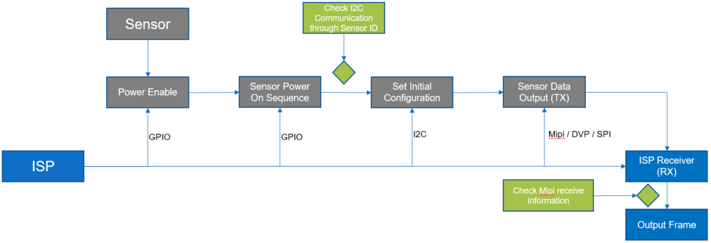
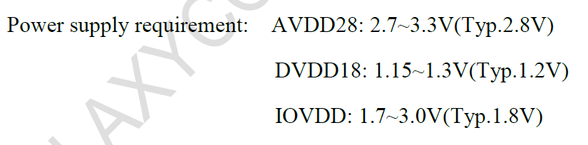
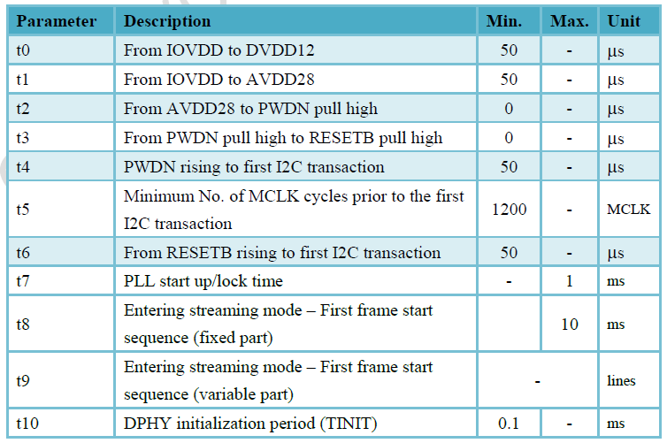
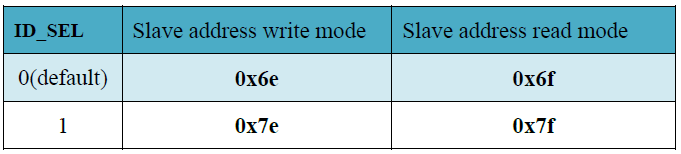
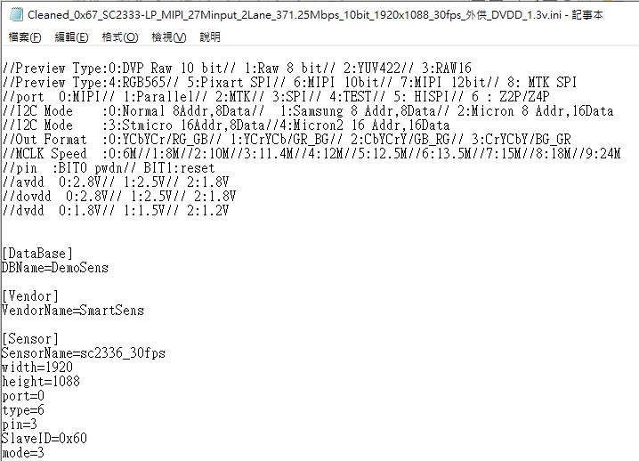
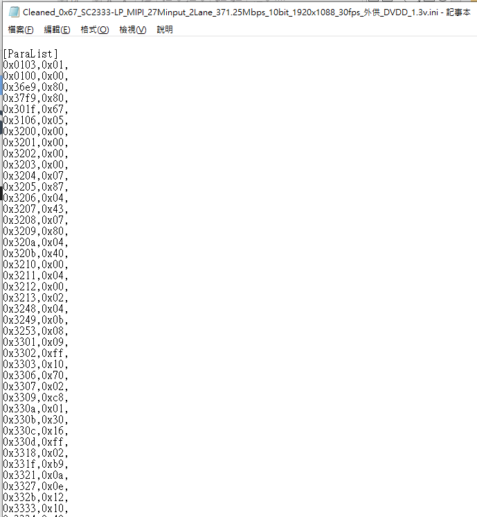
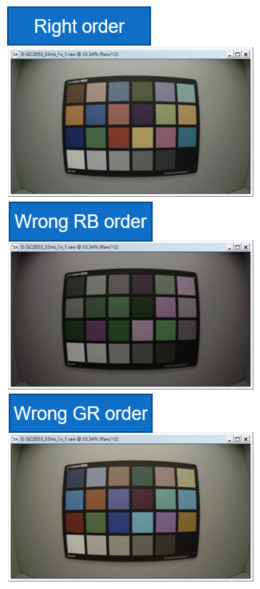

[AmebaPro2] Introduction for Sensor Bring up Flow
=================================================

General Sensor Bring Up Flow
----------------------------

..

   |image1|

   **Sensor Related Document from Vendor**

- Sensor Spec

- Initial Configuration

- Application Note

- Module design Guide

- Sensor Board

Sensor power on sequence
------------------------

..

   **Check Spec for following information**

- Take GC2053 for example

- Power Domain

  - Check Sensor AVDD / DVDD / DOVDD

..

   |image2|

- Power On sequence

  - Enable power

  - Set GPIO to control Reset & Pwdn Pin

  - Set MCLK (Refer to initial table)

  - Write sensor initial setting (through I2C)

    - Following Sensor Spec

- How to check 「Power on sequence」 is ready?

  - Check I2C communication through Sensor ID

..

   |image3|

- **Spec for Sensor**

  - MCLK

..

   |image4|

- It is general suggested to use 24 / 27 MHZ

- I2C

  - Slave Address

..

   |image5|

- I2C prototype

  - Address length 2/1 byte

  - Data length 2/1 byte

- Sensor ID

..

   |image6|

Set initial configuration
-------------------------

..

   **Initial configuration from Sensor Vendor**

- Take sc2333 for example

- Initial configuration from Vendor

  - Cleaned_0x67_SC2333-LP_MIPI_27Minput_2Lane_371.25Mbps_10bit_1920x1088_30fps_外供_DVDD_1.3v.ini

..

   |image7|

   |image8|

Set ISP RX configuration
------------------------

..

   **AmebaPro2 only support for mipi interface**

   **Check following information before RX configuration**

- Mipi lane number

- bit number for each pixel

- Mipi clock

- Frame rate

- Frame length (VTS) and Line length (HTS)

- Pixel clock

..

   **How to check 「RX Configuration」is ready?**

- **Check Mipi debug register for following information**

  - **Frame Count**

  - **Line Count**

  - **Pixel Count**

.. math:: Pixel\ Clock = Frame\ length\ *Line\ length\ *Fps

.. math:: Mipi\ clock = pixel\ clock\ *bit\ 

.. math:: Mipi\ clock\ per\ lane = \frac{pixel\ clock\ *bit}{lane\ number}

   **Window configuration**

- Adjust bayer pattern order for alignment between Sensor and ISP

  - RGGB / GRBG / GBRB / BGGR

- Pan tilt configuration

  - Take GC2053 for example

  - General window size = 1920 \* 1080

  - It is suggest that to get initial setting for at lest 4 for H and V

    - Get 1924 \* 1084 or 1928 \* 1088 window configuration

..

   |image9|

   **Configuration from Driver**

- **There are 3 item need to be configured by sensor Driver**

  - Auto exposure time configuration

    - Check sensor register how to set exposure time to exposure line

  - Auto exposure gain configuration

    - Check sensor register how to set sensor analog gain

  - Orientation configuration

    - Check sensor register

+--------+-------+--------+--------------------------------------------+
|        |       | Author | Release note                               |
| Date   |Version|        |                                            |
|        |       |        |                                            |
|        |       |        |                                            |
+========+=======+========+============================================+
| 2023   | 1.0   | Zako   | Draft version for customer release         |
| .04.11 |       | Wu     |                                            |
+--------+-------+--------+--------------------------------------------+
|        |       |        |                                            |
|        |       |        |                                            |
+--------+-------+--------+--------------------------------------------+

.. |image6| image:: ../../_static/user_manual/37_Introduction_For_Sensor_Bringup_Flow/image8.png
   :width: 5.76806in
   :height: 0.75764in

