Tuning Guide CHT
================

.. contents::
  :local:
  :depth: 2

|49e5b7885d682849526623f041bcf74f|

Document Version: v1.0

Release Date: 2025/05/12

COPYRIGHT
---------

©2021 **Realtek Semiconductor Corp**. All rights reserved. No part of
this document may be reproduced, transmitted, transcribed, stored in a
retrieval system, or translated into any language in any form or by any
means without the written permission of **Realtek Semiconductor Corp**.
**DISCLAIMER** provides this document "as is", without warranty of any
kind, neither expressed nor implied, including, but not limited to, the
particular purpose. Realtek may make improvements and/or changes in this
document or in the product described in this document at any time. This
document could include technical inaccuracies or typographical errors.
**TRADEMARKS** Realtek is a trademark, of **Realtek Semiconductor
Corporation**\ . Other names mentioned in this document are
trademarks/registered trademarks of their respective owners.This document is intended for the hardware and firmware
engineer's general information on the Realtek IP Camera IC. Though every
effort has been made to ensure that this document is current and
accurate, more information may have become available subsequent to the
production of this guide. In that event, please contact your Realtek
representative for additional information that may help in the
development process.

|0b0824664be62141aead42032b360397|

文件修訂紀錄
------------

+-----------+--------+---------------------------------------+---------+
| Revision  | Release|       Description                     | Author  |
|           |        |                                       |         |
|           | Date   |                                       |         |
+===========+========+=======================================+=========+
|           |        |                                       |         |
+-----------+--------+---------------------------------------+---------+

1.工具概述
----------

本章節介紹 **RealCam Pro**
圖像調試工具的基本資訊與啟用步驟，包含軟件安裝與致能的流程等。透過此章節內容可以成功執行
**RealCam Pro** 並開始圖像調試程序

1.1 軟硬件版本說明
^^^^^^^^^^^^^^^^^^

**RealCam Pro**
是專門針對圖像調試開發的輔助工具，在樣機連線成功後會自動判讀連機芯片，若判讀為
**Amebapro 2** 的芯片會顯示 **ISP Tuning
Pro**\ ，如下圖所示，代表晶片判讀成功，使用者可直接點選此選項來開啟 **圖像調試視窗**

|1e15d66adef047853a10f9f7c50073a6|

< Amebapro 2 的芯片版本 >

1.1.1 UVC FW的燒錄方式
""""""""""""""""""""""

下圖為RTK所提供之EVB開發板以及mini82開發板

|image1|

a. 在AmebaPro2 EVB使用jumper聯結J27 Pin並按下reset button進入燒錄模式
b. 同時按下AmebaPro2 mini82兩側的download mode button以及reset
   button即可進入燒錄模式
c. |image2|

進入燒錄模式

d. 使用PG tool工具燒錄FW
e. |image3|

在工具目錄下輸入CMD，進入命令程序

f. 輸入uartfwburn.exe -p comXX -f .\\filename.bin -b 1000000 –U
g. 藍色部分為對應的com port以及須燒錄的檔案名稱
h. |image4|

待進度條跑完後會出現download success

1.1.2 RealCam Pro 軟件安裝、啟用
""""""""""""""""""""""""""""""""

**RealCam Pro**
不需要額外的安裝程序，當拿到交付軟件時存放於電腦資料夾後，直接執行軟件執行檔
RealCam.exe 即可。

首次執行 **RealCam
Pro**\ 時，將產生一個 **Realcam_activation.bin**，請提交此檔案至我司技術人員窗口，待我司回復對應的SW
Key，貼上軟件啟用視窗即可完成軟件啟用，此致能程序在每一電腦上僅需執行一次。

2.界面功能介紹
--------------

本章節將針對 **RealCam Pro** 的介面、基本的操作功能與校正程序進行介紹

2.1節為 **RealCam Pro**
的入門介紹。包含主介面上各個區塊的功能介紹、標準連線樣機的流程以及如何開啟圖像調試視窗等

2.2節將介紹如何擷取樣機的影像資訊。包含影像串流如 UVC Streaming、Raw
Streaming，也提供了單幀影像的擷取步驟，如 Raw、JPG、BMP 等

2.3節是關於圖像調試參數導入。能將既有的調試參數導入並顯示在 **RealCam
Pro**
的圖像調適視窗上，當產品硬體規格與既有的調試參數有相通性時，能透過導入既有參數的方式，基於該組參數開始調整，此法能更快速地完成圖像調適流程

2.4節說明圖像調試參數導出，導出功能是將所調試的參數自 **RealCam Pro**
匯出，除了能進行不同調試參數的版本控制外，將導出的參數檔置入樣機內，使調試過的圖像參數不透過
**RealCam Pro** 實際作用於樣機上，藉以完成圖像調試

2.5節介紹各模塊的校正流程。不同相機模組間，其硬體差異將導致其不同的圖像特性。因此在開始圖像調試前，均須執行圖像校正流程。 **RealCam
Pro**
會根據影像訊號計算出模組的圖像資訊，依照操作流程匯入對應的圖像資訊即能完成校正流程。校正模塊包含:
BLC, RNR, LSC, AWB, CCM 等模塊

2.1 快速入門
^^^^^^^^^^^^

首先按照 **1.1.1 RealCam、RealCam Pro 軟件安裝、致能**，即可執行
**RealCam Pro** 進行如以下的快速入門。

**RealCam Pro**
執行主畫面如以下，除了標題列的名稱與版本序號之外，其餘主要區分為三個區域:

1) 工具列
2) 功能按鈕區，連線出圖時才會顯示
3) 串流/圖像 顯示區

|0c063f10b6bdb12aa4342616f824f4bb|\ 

< 圖像調試工具RealCam Pro的主畫面 >

連線樣機後如以下點選主畫面 工具列上的 Vendor\\ISP Tuning Pro
可進入圖像參數群組切換、以及圖像調試視窗，可參閱 **3. 圖像調試步驟**
進行

|18952795efc4249f391397c7719970cc|

< 參數群組切換視窗 >

|64800c5acd3149a8d9b80b5c68afc40d|

< 圖像調試視窗 >

|image5|

2.2 連線樣機 進行串流取像與IQ調試
^^^^^^^^^^^^^^^^^^^^^^^^^^^^^^^^^

**RealCam** 可支援 UVC 串流的樣機，連線後可透過即時串流進行 IQ 調試、IQ
參數導出與導入、圖像分析，若無需即時串流，仍然可以連線進行 IQ
調試、參數導出與導入。

UVC Streaming
"""""""""""""

   編譯所需的UVC FW，以及IQ參數檔說明

   請參閱我司文檔 **AmebaPro2_UVC_FW_compile.pdf**

一啟動 **RealCam Pro** ，若已接上 Amebapro 2
樣機，會自動顯示樣機的即時串流，可透過工具列 / Device
確認是否有正確識別到 Amebapro 2 樣機，當正確識別時會有 **USB UVC
CLASS**\ 字樣

|5cb482a58d6f7ee75aeed3b1e839c016|\

< 連接 Amebapro 2 時的工具列 /Device 頁面 >

RAW Streaming
"""""""""""""

RAW Streaming 是將 Sensor Bayer Data 輸出直接出流、略過 ISP
處理程序直接出流，可用來抓拍 RAW Data 藉此判斷 Sensor 雜訊大小、或者用做
BLC 校正的依據。

操作方式是當 UVC 串流下，點選 UI 圖示的 Vendor / RNR Calibration ，UVC
streaming 即會自動切換成 Raw streaming

< UVC Streaming 點選 RNR Calibration 功能 >

|72bef7d82bd7eb50a315c617d134efa1|

進入校正頁面後，即會在 **RealCam Pro** 串流/圖像顯示區出現 RAW Streaming
即時畫面如以下:

|ebeb861081840756ede36237f82dcf21| 

< RAW Streaming 串流/圖像顯示 >

Capture BMP or JPG
""""""""""""""""""

點選 **RealCam Pro**
功能按鈕區圖示來設定檔案儲存路徑、檔案格式，如以下操作:

< Capture BMP or JPG 操作 >

下方工具列點選板手圖形可進入video recording以及image capture設定

須注意如果要錄製video，Video format要選擇H264格式

|image6|

2.3 導入圖像參數 (燒錄 IQ Table 到樣機)
^^^^^^^^^^^^^^^^^^^^^^^^^^^^^^^^^^^^^^^

在 Amebapro 2 的芯片，IQ 參數以一個獨立的 bin 檔案存在。

完整的參數檔案 ( Completed IQ ) 本身包含不同曝光模式所調試的參數，比方說
Linear 與 HDR，各模式下則固定由兩個模式 ( Mode )
組成，比方說白天以及夜視。

每種模式下的 IQ 參數也可以是一個獨立檔案 ( Partial IQ
)，因此導入參數檔案可分為部分 ( Partial IQ ) 針對某個模式，簡單說
Complete IQ 包含多個 Partial IQ 並可由 SW API 來切換，曝光模式為 Linear
mode 時在白天模式下預設會調用 Group 0 的 Day，夜視模式則會切換到 Group 0
的 Night 這組參數，當曝光模式為 HDR mode 時則在白天模式預設會調用 Group
1 的 Day ，夜視模式為 Group 1 的 Night 。

.. note :: **AmebaPro2 的IQ.BIN以如下圖的方式存在，至多可以包含6組IQ Table，分別對應Linear以及HDR mode，每個mode裡包含3組IQ Table對應Day,Night, other mode， SDK內需要的是Complete IQ(Full IQ)，而不是單一的Partial IQ，請須注意完整的Full IQ必須加入header(記錄檔案大小資訊)**

|image7|

導入完整的參數檔案 ( Complete IQ )
""""""""""""""""""""""""""""""""""

|image8|

按照上圖步驟說明可以完成IQ參數的導入

導入某個模式的參數檔案 ( Partial IQ)
""""""""""""""""""""""""""""""""""""

|image9|

2.4 導出圖像參數
^^^^^^^^^^^^^^^^

在圖像參數調試完成且更新到IQ Table 之後，需要將參數由 **RealCam Pro**
導出，並且導入至樣機內對應的存放位置，完成後立即於樣機生效。

介面操作均使用 ISP Tuning Pro 圖像調試視窗，請在 **RealCam Pro**
主畫面上點選【Vendor】中的【ISP Tuning Pro】進入圖像調試視窗

|image10|

透過IQPackTool將Partial IQ合併為Complete IQ
"""""""""""""""""""""""""""""""""""""""""""

點擊執行檔會跳出如下圖介面，此工具可以將獨立的Partial
IQ合併為完整的Complete IQ，亦可以將Complete IQ拆解為獨立的Partial IQ

|image11|

拆解Complete IQ與合併Partial IQ
"""""""""""""""""""""""""""""""

|image12| 

按照下圖步驟導入Complete IQ，執行完畢後會將Complete IQ拆解為獨立的六組Partial IQ檔案，便可將參數導入RealCam查看，方便偵錯

反之，調整完的Partial IQ，也可以透過工具來合併成Complete IQ，操作步驟如下

|image13|

.. warning:: **須注意，合併完成的IQ.BIN如果放至SDK中編譯，一定要增加header資訊，也就是上圖(5)的步驟**

**而透過RealCam導入的Complete IQ則不需要增加header**

2.5 校正模塊
^^^^^^^^^^^^

進行校正程序時需要使用 **RealCam Pro**\ ，請先依照 1.1.1 **RealCam Pro**
軟件安裝、啟用完成操作後，再繼續以下。

BLC 校正

LSC 校正

AWB 校正

CCM 校正

以上詳細步驟參閱我司文檔 **AmebaPro2 IQ Tuning Manual_Calibration_Ver0.0.2_230712.pdf**

3.圖像調試步驟
--------------

點選 **RealCam Pro** 工具列上的 Vendor\\ISP Tuning Pro
可進入圖像調試視窗，圖像調試視窗的主界面如以下，並可區分為幾個區域:

|9360d58e2904730c338c9e463c6f4bdf|\ 

<圖像調試視窗的主界面>
介面顯示根據版本可能會有所不同

調試 **目錄區**: 以樹狀結構顯示著各個主要的調試項目，每個項目大致對應到
ISP 運作模塊

調試 **功能區**: 顯示參數讀出、寫入連線樣機，更新與提取暫存區 IQ Table…
等功能

在參數針對當下色溫與亮度調試完成後，需要更新到 IQ Table
對應的色溫、增益區間，以待最後的參數導出成 .bin 檔案

在調試功能區左半部的色溫 ( Color Temperature ) 相關功能如以下說明:

. Current: 顯示連線時 AWB 的即時色溫估算值，當 AWB 設為手動設置時不更新

. Index:
色溫區間，顯示當前色溫位於哪一組色溫區間，讓參數區的調試結果能夠更新到對應的色溫區間

. IN: 顯示進入色溫區間的閥值

. OUT: 顯示離開色溫區間的閥值

.. note :: 色溫 Index 對應的 IN / OUT 設定可透過 Index Manager 調整

在調試功能區左半部的增益 ( Gain ) 相關功能如以下說明:

. TH Based on: 增益設置的判斷基準選擇，可選擇 Gain 或 ETGain
兩者之一當作基準，相較於 Gain，ETGain 多了曝光時間 (Exposure Time)
的考量；其中 Gain 的單位為一倍增益 ( 1x )，ETGain 的單位為 0.1
毫秒乘上一倍增益 ( 0.1 ms \* 1x )

. Current: 顯示連線時，AE 的即時 Gain 增益或是 ETGain 增益數值，當AE
設為手動設置時不更新

. Index:
增益區間，顯示當前增益位於哪一組增益區間，讓參數區的調試結果能夠更新到對應的增益區間

. OUT: 增益區間相對應的分界點

增益的判斷基準及Index 對應的 OUT 設定可透過 Index Manager 調整

詳細步驟參閱我司文檔**AmebaPro2 IQ Tuning
Manual_Calibration_Ver0.0.2_230712.pdf*\* 的新增增益區間

3.1 BLC
^^^^^^^

BLC: Black Level Correction

Sensor
受到溫度與偏移電壓的影響產生所謂的暗電流，導致即使在沒有感光的情況下，仍有
Pixel Value 的產生，進而降低了整體畫質的對比、以及動態範圍。BLC
即是要校正暗電流導致Pixel Value 的平均數值Black
Level，減輕圖像中對比及動態範圍的影響。

此模塊參數可依照色溫 / 增益條件給予不同設定

BLC \\ General 參數說明
"""""""""""""""""""""""

|2730cf2ea4e6104a16101ee575c3809f|\ 

<圖像調試視窗的BLC\\ General 頁面>

1. BLC Enable Long Exposure Path

Enable 表示開啟 Linear mode 或是 HDR mode
長曝幀的暗電流校正功能，Disable 代表關閉

2. BLC Enable Short Exposure Path

Enable 表示開啟 HDR mode 短曝幀的暗電流校正功能，Disable 代表關閉，僅
HDR mode有作用

BLC \\ Long Exposure Path (Main Path) 參數說明
""""""""""""""""""""""""""""""""""""""""""""""

|e5af1c4eaaa552e5b90cafed7d23cb25|\ 

<圖像調試視窗的BLC \\ Long Exposure Path (Main Path) 頁面>

若 Sensor 設置是 RAW 10 bits 輸出，這裡的校正數值要乘以 4
來填入，比方說想要扣除 10 bits 的16 lsb 時，則需要填入 64 (16x4)

若 Sensor 設置是 RAW 12 bits 輸出，則此校正數值則是相對直覺的 1
倍對應，比方說想要扣除 12 bits 的 16 lsb 的話，只需要填入 16 即可

.. warning:: **在 2.5.1 BLC 校正 完成的BLC 校正數值，將會是已經可以直接填入的數值。**

(5) ~ (8) BLC Gain R、Gr、Gb、B: Bayer Domain 中 R、Gr、Gb、B Channel
的Re-Scale 增益

BLC \\ Short Exposure Path 參數說明
"""""""""""""""""""""""""""""""""""

|acff250b296320877b5214ddef94d0f6| 

<圖像調試視窗的BLC \\ Short Exposure Path 頁面>

同上節3.1.2說明

Sensor的電路本身會存在暗電流，導致在沒有光線照射的時候，圖元單位也有一定的輸出電壓，暗電流這個東西跟曝光時間和gain都有關係，不同的位置也是不一樣的。因此在gain增大的時候，電路的增益增大，暗電流也會增強，因此很多ISP會選擇在不同gain下減去不同的bl的值。

如多sensor輸出raw資料中附加的黑電平值，需要在ISP最前端去乾淨。如果不去乾淨，干擾資訊會影響後端ISP各模組的處理，尤其會導致AWB容易不准，出現畫面整體偏綠或者整體偏紅現象。

如下圖示例，BLC校正前後對比圖

|image14|

3.2 AE
^^^^^^

AE: Auto Exposure；自動曝光

根據設定的目標亮度以及相關參數設定，透過算法得到適當的曝光設置。AE
可使即便在場景變換或環境亮度變化的應用下，圖像輸出亮度仍能維持一致水準。

我們所看到的物體，其實是這個物體上反射出來的光並進入我們眼睛並在我們眼中成像。同理，相機要拍出照片，也需要接收這個反射光。人眼是可以通過瞳孔自動調節進光量的，而相機需要依賴我們專門的模組去控制相機進光量，通過對拍攝畫面環境光的測量，調整相機參數使得畫面正確曝光，進而採集的圖像亮度合適，避免過曝或過暗。

AE(Auto
Exposure)即自動曝光，自動曝光的是為了使感光器件獲得合適的曝光量，曝光量是指光線強度乘以光線到達sensor所作用的時間，曝光量以E表示，單位為Lux。自動曝光對相機的採集畫面至關重要，也是相機採集的重要流程之一。

AE示意圖(過曝，正確曝光，曝光不足)\ |image15|

|image17|\ |image18|\ |image16| 

透過分佈圖了解以上三張圖片亮度資訊差異，來決定正確的曝光

AE 工作流程示意圖

|image19|

AE \\ General & ManualExposure 參數說明
"""""""""""""""""""""""""""""""""""""""

|76669ae4dec3e3860b28d19559f587f2|\

<圖像調試視窗的AE \\ General & Manual Exposure 參數頁面>

(1) Bypass: ISP Auto Exposure 數位增益的模塊控制

Enable 表示關閉 ISP AE 模塊、不使用 ISP 增益，同時也會將 AE Auto/Manual
強制設置為 Manual Mode

Disable 表示使用 ISP AE 模塊、包含 ISP
增益，於正常自動曝光下皆使用此設置 (留意 AE Auto/Manual 是否正確設置)

(2) Auto/Manual: 自動 / 手動曝光的切換功能

Auto 表示自動曝光，於正常自動曝光下皆使用此設置

Manual 表示手動曝光，選擇手動曝光時，下方的 Exposure 跟 Gain
欄位中的數值才能設置

(3) Exposure:手動曝光時的曝光時間設定，單位為微秒 (**μs** )
(4) Gain:手動曝光時的增益設定，單位為倍 (1x)

AE \\AE Attribute參數說明
"""""""""""""""""""""""""

<圖像調試視窗的 AE \\ AE Attribute 參數頁面 - 1/2>

|image20|

(1) AE Weight: AE 會將畫面切分為 16x16個區塊，AE Weight 是用來設定總共
    256 個區塊的權重設定值，做對應區域的加權計算，產出亮度平均值 Y Mean

..

   常見之AE測光模式如下三種 :

a. 平均測光
b. 中央加權測光
c. 點測光

       |image23| \ |image22| \ |image21| 
           (a)       (b)        (c)

    (1) y_mean_target: y_mean的目標值
    (2) y_mean_target_l:y_mean_low_bound區間的下限值
    (3) y_mean_target_h:y_mean_high_bound區間的上限值

..

   AE Target的變化關係如下圖所示

   |image24|

(4) total_gain_max:允許 AE 收斂時使用的最大增益，16 表示 1 倍增益
(5) ae_enter_stable_th: 在非穩定狀態下，當 AE step
    在此閾值範圍內持續一定時間，進入穩定狀態
(6) ae_exit_stable_th: AE Search Trigger Gate，在穩定狀態下，當目前幀 Y
    Mean 與目標值的 Step 差異大於此參數設置時，離開穩定狀態
(7) dyn_fps_min: 動態降幀的最小幀率
(8) dyn_fps_setting: 動態降幀功能，TH 為 Gain
    的閾值設定，僅有此欄位可做調整，\**單位為一倍增益*\* ( 1x Gain )
    。當增益提高到達 TH 的條件時，FPS 會由前一個 Index
    對應的數值，降到當前 Index對應的數值。
(9) dyn_target_etgain: 根據 ETGain 動態降低 y_mean_target
    功能；使用情境通常為低光環境下降低 y_mean_target，能因而使用較低的
    Gain 避免雜訊過大

..

   **src_th為 ETGain 閾值設定，這邊的數值是dyn_target_etgain
   未開啟的條件數值，開啟之後Tool所看到的ETGain已是重新計算過後**

|image25|

<AE \\ Detail Adjustment頁面說明>

|image26|

|image27|

3.3. Over Exposed Protection
^^^^^^^^^^^^^^^^^^^^^^^^^^^^

Over Exposed Protection: 過曝區域溢色保護機制。

此模塊歸屬於 Texture 參數，可依照增益條件給予不同設定

Over Exposed Protection\\ General 參數說明
""""""""""""""""""""""""""""""""""""""""""

<圖像調試視窗的 Over Exposed Protection \\ General 參數頁面>

|image28|

Enable: Over Exposed Protection 功能開關

Enable 表示開啟Over Exposed Protection 功能，抑制過曝區域溢色現象Disable
表示關閉Over Exposed Protection 功能，不抑制過曝區域溢色現象

(1) Clip Mode: 直接將影像資料裁切到所設定的 bit 範圍 Non-Clipped:
    不對資料做裁切

..

.. warning:: **請使用預設14 bit，設定其他選項存出bin檔不會生效**

(2) Thd0: 定義非過曝度值，代表由多亮的像素亮度開始抑制亮度值增加
(3) Thd1: 定義過曝的亮度值，代表由多亮的像素亮度開始停止亮度值增加

|image29|

|image30|

3.4 LSC
^^^^^^^

LSC全稱是lens shading correction，鏡頭陰影校正。
Lens Shading指畫面四角由於入射光線不足形成的暗角，同時，由於不同頻率的光折射率差別，導致
color shading。因此，LSC主要解決luma shading( 亮度陰影)和 color shading
(色彩偏差)。

下圖為 LSC 的調整頁面，上半部區域為 LSC 的自動校正，於章節
2.5.2說明，下半部為針對已校正好的參數，再進行手動調整，本章節主要在說明下半部的使用方式。

校正前後對比圖

|image31|

此模塊的 Adjust Rate 參數可依照色溫增益條件給予不同設定

|cc8e7b1577d5befa95f94fee03cbc274|

(1) 為 NLSC 的 R、G、B curve，可手動直接修改 NLSC curve。

頁面右側的圖即為這三條 curve
的圖形化顯示，橫軸為與畫面中心的距離，縱軸為 curve value。

(2) 手動修改 MLSC 參數。

勾選 Block Enable，此時 **RealCam** 的畫面會將 MLSC 的區塊格線顯示出來。

|a8f821b7c179490ca1a9e75d424e8b41|

|129461df9568b2a7418a1f0e1dc90de0|

滑鼠點擊欲修改的區塊

|efc6841aeec272db02a3e93a10bb56cd|

按下介面中右上方的【Read】，讀取所選擇區塊的 MLSC 參數值。修改參數值

按下介面中右上方的【Write】，使參數生效。則可在畫面中看到效果。

|d9f83eb0063f3d39998143dad826419d|

(3) Adjust Rate 的精度是 1/32，32 即表示 Rate 為 1 倍，不會改變校正好的
    NLSC curve，但是會加成 NLSC 的幅度。

**Adjust Rate 越小，圖像四周亮度越低；Adjust Rate
越大，圖像四周亮度越高。**

3.5 Gamma
^^^^^^^^^

對 Sensor 來說，Input 與 Output
之間的關係是線性的。但人眼視覺於暗部的感知是較亮部來得更為敏感的，換句話說，暗部的變化是更容易被人眼所察覺。Gamma
即是用以處理 Sensor
端訊號與人眼感知之間的轉換關係，使得輸出的影像與人眼感知較為一致。

Gamma校正常用於圖像顯示裝置，如顯示器、投影機等。由於人眼對不同亮度的感知是非線性的，因此通過調整Gamma值，可以更好地模擬人眼的感知特性，提高圖像的視覺效果。此外，Gamma校正還廣泛應用於影像處理軟體、相機和影像處理演算法中，以實現圖像品質的提高。

|c3cd105481b998c720c80eea74b482f9|\ 

<圖像調試視窗的 Gamma 頁面>

(1) 圖形化顯示: 根據選擇的 Gamma Type 將 Input / Output
    的對應關係以圖形化顯示
(2) 參數: 表列出全部Gamma模塊的所有參數
(3) Gamma Type: 共有 RGB Gamma / Y Gamma / Y Global Curve 三個 ISP
    中的模塊可以調整

主要會使用的是 RGB Gamma 及 Y Global Curve，因此另外有 RGB Gamma + YGC /
RGB Gamma + System Gamma /Y Global Curve +System Gamma
三個組合模式可以選擇

(4) Adjust Mode: 有 Curve / Point / Gamma Value 三種調整模式可用

|c71ffcd001bc80405b5720a96187dc80|\ 

Curve: 左側圖形化顯示介面上會有4個控制點可以拖拉，拖拉時所有參數都會以近似線方式調整

|79971deeefa89ff0483b0cef213ba6fc|\ 

Point:左側圖形化顯示介面上會顯示所有參數的控制點可以拖拉，拖拉時只會調整到單一參數

|d04c108d241c1c8c7278952d73825f64|\ 

Gamma Value: 以標準 Gamma式(Output = Input ^ Coef)產生曲線；其中參數 Slope作用為控制暗處區域為線性變化，可避免暗處 Noise 增加過多，如不需使用則將Slope 設為 -1即可

(5) Undo: 回復到上一次調整
(6) Redo: 回復到 Undo 前的狀態
(7) Restore: 回復到最初始的狀態
(8) History: 參數群組記憶以供切換

以下兩組不同設定Gamma效果對比圖，左(高對比)，右(低對比)

|image32|\ |image33|

|image34|\ |image35|

3.6 DRC & DRE
^^^^^^^^^^^^^

DRC: Dynamic Range Compression; 動態範圍壓縮/增強 DRE: Dark Range
Enhancement

動態範圍壓縮是讓圖像能呈現寬動態範圍的程序

DRC & DRE\\General
""""""""""""""""""

|image36|\ 

<圖像調試視窗的 DRC&DRE\\General 頁面>

1. DRC Enable: Enable 表示開啟動態範圍壓縮/增強; Disable 表示關閉
2. Blend Ori
   Level:與原始圖像做比例混和的功能，可選擇自動計算混和的比例或是手動設定
3. 混和的比例；越靠近Ori代表混合的比例越低，使用越多成分的原始圖像

.. note :: **在DRC強度設定，不同分段(增益條件)盡量是一致性方向設計(隨增益增加而漸增或漸減)，避免亮度變化時有瞬間過亮或過暗狀態發生。**

|image37|

|image38|

3.7 WDR & Dehaze
^^^^^^^^^^^^^^^^

WDR: Wide Dynamic Range; 寬動態範圍

寬動態範圍的處理是針對高對比場景中，將暗處區域的亮度提高

AmebaPro2的WDR功能可使影像在高對比光影下依然保有出色影像品質。傳統攝影機無法在一張影像中擷取完整場景內容，而WDR功能在輸出一張相片時，會由ISP製作出較原環境明、暗兩張照片，再將兩張照片合成，讓過亮與過暗的地方都能看得比原本清楚

<圖像調試視窗的 WDR&Dehaze\\WDR 頁面>

|image39|

   WDR Level: 數值分布為 0~100數值越大，暗處區域提升的亮度越大

   如下圖示例，WDR Level的強度可以適當的增加畫面中暗部的亮度值

   |image40|

3.8 GbGr
^^^^^^^^

GbGr: GbGr Balance；GbGr 平衡調整

因為 Lens 和 Sensor
的某些特性不匹配，或模組的缺陷，由於半導體工藝和microlens
的原因（常見的如光電二極體的排列、CFA的不均勻性、鏡頭的`鍍膜
、放大器的問題等等），導致相鄰的Gr和Gb圖元差異較大的現象；導致在
Bayer Pattern 上原始 Gr 和 Gb
訊號的強度會有不一致的現象，最終在畫面上會形成網格狀或是直橫條紋的
Pattern，GbGr Balance 即是要緩減此現象的模塊。

|image41|

此模塊歸屬於 Texture 參數，可依照增益條件給予不同設定

<圖像調試視窗的GbGr Long Exposure (Linear) 參數頁面 - 1/2>

|image42|

(1) GbGr Balance Enable: 功能開關，Enable 表示啟動 GbGr
    平衡調整；Disable 表示關閉
(2) GbGr Balance Strength: GbGr 平衡整體強度控制，數值越大 GbGr
    平衡修正幅度越大

..

   **GbGr的判定條件以及靈敏度是固定的，用戶僅能決定作用的強度**

   |image43|

3.9 AWB
^^^^^^^

AWB: Auto White Balance；自動白平衡

透過合適的白平衡算法參數設置，可使得場景變換或環境光源變化的作用下，圖像輸出仍能維持與原本物體色調一致

AWB通過測量場景中的光源色溫來工作。它利用相機的sensor來檢測場景中的主要光源，並根據這些信息來調整圖像的色彩。以下是AWB的工作原理：

光源檢測：相機的sensor會測量場景中的主要光源，並確定其色溫。這可以通過分析光源發出的光譜來完成。

色溫校正：一旦相機確定了光源的色溫，它會調整圖像的色彩，以使白色看起來更加中性。這通常涉及到調整紅、綠、藍三個通道的增益，以消除色溫偏差。

圖像處理：相機會將校正後的圖像呈現出來，以確保白色在不同的光照條件下都看起來是白色，其他顏色也能保持準確。

|image44|

**AWB是ISP作用環節中，針對顏色處理重要的一環**

色彩準確性：AWB確保照片中的色彩準確反映了實際場景。如果色溫不正確，照片可能會呈現出不自然的色彩，影響觀看者的感知。

節省時間：使用AWB可以節省攝影者大量的時間，因為他們不需要在不同的光照條件下不斷手動調整相機設置。

創造性發揮：AWB使攝影者能夠更多地專注於構圖和創造性方面，而不必擔心色彩校正。

**不同色溫下的顏色參考**

|image45|

**在不同色溫下的色彩表現**

|image46|

AWB \\ General & Manual WB Attribute 參數說明
"""""""""""""""""""""""""""""""""""""""""""""

< 圖像調試視窗的AWB \\ General & Manual WB Attribute 參數頁面 >

|image47|

1. Bypass: ISP 的 AWB 模塊開關，Enable 表示關閉 AWB 模塊，不使用 ISP WB
   增益； Disable 表示使用 ISP WB 增益
2. Auto/Manual: 自動 / 手動白平衡的切換功能，Auto 表示自動白平衡；Manual
   表示手動白平衡，選擇手動白平衡時，以 R Gain / G Gain / B Gain
   欄位中的設定作為白平衡參數
3. R Gain: 手動白平衡時的 R 成份增益設定，單位為 1/256 倍
4. G Gain: 手動白平衡時的 G 成份增益設定，單位為 1/256 倍
5. B Gain: 手動白平衡時的 B 成份增益設定，單位為 1/256 倍

.. note :: **G Gain 絕大多數的情況下數值應維持為 256，調整時優先選擇 R Gain / B Gain 處理**

6. Detail Adjustment:點擊【Detail Adjustment】按鈕可彈出 AWB_Analyse
   視窗，在此視窗提供多組標準色溫點 ct_point 的校正值 (如下圖的綠色方點)
   調整、白平衡作用區的白區 white_area_point(如下圖左內側的紫色框)
   框選、白平衡作用區的灰區 gray_area_point (如下圖左外側的藍色框)
   的框選... 等。ISP
   針對影像作出數值分析後於下圖中的座落點，需要被白區與灰區框選到才會納入
   AWB 觸發與收斂運算，尤其以白區內的數值權重大於灰區

|064a8a50e5ae0100238309d750b2e242|\ 

<AWB_Analyse 視窗 >

. AWB_Analyse 視窗右上方顯示(示意如下圖) 的是 【Start 】、【Stop
】按鍵，點擊

【Start 】可即時更新顯示中的 AWB 各個區塊的統計數值資訊，點擊【Stop
】為不更新。

. AWB_Analyse 視窗右側第一個表格為 AWB
的運算結果數值，主要資訊為 **result_gain** 與估算出的色溫值
**color_temperature**

. AWB_Analyse
視窗右下方表格為白區與灰區參數調整表格，表格上方有參數設定方式選擇，點選
IQ Data 表示使用目前拖曳後顯示的設定，若點選 Param
表示使用表格內的參數作為設定

建議初次調整先使用Param 模式來調整表格內參數，當得出適當作用區大小並點擊

【Write 】按鈕生效後，若有進一步調整需要再切換到 IQ Data
模式，透過拖曳方式設定好 ct_point、white_area_point 、
gray_area_point，設定後同樣點擊【Write 】按鈕生效

intp_param: 可能需要在距離較遠的兩 ct_point 之間插入white_area_point/
gray_area_point 來區分用以計算，此參數與插入的 area_point
之間距離有關；值越小，插入的 area_point越密集，相應的 block 會增多

7. ct_setting: 標準色溫點 (ct_point) 的相關設定

依據不同種類的環境光源，可透過修改 Count of CT Points
的數值，調整要採用幾個標準色溫點

8.  ct_block_num:色溫區域塊個數；建議透過(1) Detail Adjustment 中 Param
    模式的 intp_param參數產生
9.  a: 色溫曲線 (ct_curve_fit_line) 的參數，唯讀參數
10. b: 色溫曲線 (ct_curve_fit_line) 的參數，唯讀參數
11. c: 色溫曲線 (ct_curve_fit_line) 的參數，唯讀參數
12. white_area_up:內部色溫區域 (white_area)
    的上方邊界點座標陣列，對應了Detail
    Adjustment中座標平面上從左到右的邊界點
13. white_area_down: 內部色溫區域 (white_area)
    的上方邊界點座標陣列，對應了Detail
    Adjustment中座標平面上從左到右的邊界點
14. gray_area_up: 外部色溫區域 (gray_area)
    的上方邊界點座標陣列，對應了Detail
    Adjustment中座標平面上從左到右的邊界點
15. gray_area_down: 外部色溫區域 (gray_area)
    的上方邊界點座標陣列，對應了Detail
    Adjustment中座標平面上從左到右的邊界點
16. normal_weight: AWB 溫 block 的權重，w_table 與 g_table分別是內部
    block (white_area)和外部 block (gray_area)的權重

**例:低色溫狀態下因為低色溫權重為0，AWB則不會參考低色溫資料去計算RB
gain，在低色溫的場景不進行AWB校正**

   |image48|\ |image49|

17. rg_bg_num_th: 判斷 AWB 是否進入 HOLD 狀態的閾值之一；當 AWB
    的色溫區域統計點個數小於該閾值時，代表畫面中白色及接近白色的區域不夠多，進入
    AWB穩定狀態，不再更新 AWB
18. min_bright_th: 判斷 AWB 是否進入 HOLD 狀態的閾值之一；當 AE
    統計後的畫面亮度小於該閾值時，代表環境亮度較低，AWB
    統計資訊可能變化幅度較大，進入 AWB穩定狀態，不再更新 AWB

3.10 AWB Gain Adjust
^^^^^^^^^^^^^^^^^^^^
AWB Gain Adjust: 自動白平衡增益調整

以經由白平衡算法計算得到的白平衡增益為基礎，可依據喜好調整畫面色調呈現。此模塊參數可依照色溫
/ 增益條件給予不同設定

|6f6b1721129b0d03b2c622bd124351ea|\ 

< 圖像調試視窗的AWB Gain Adjust參數頁面 >

(1) R Gain Adjust: R 成份增益調整設定

設定為 256 代表不對 R 成份增益做調整

調大會使 R 成分上升，畫面呈現偏紅；反之調小則使 R 成分下降，畫面呈現偏青

(2) B Gain Adjust: B成份增益調整設定

設定為 256 代表不對 B 成份增益做調整

調大會使 B 成分上升，畫面呈現偏藍；反之調小則使B 成分下降，畫面呈現偏黃

如下圖示例，增加B
Gain成分值，在AWB基礎上增加藍色成分，使色調看起來更加自然

|image50|

|image51|

AWB的調整多涉及觀念，經驗累積以及客戶個人喜好度等等因素影響，沒有絕對對與錯，建議多參考數位相機的各式場景AWB設定多操作，找出最適合客戶的參數以及設定，並進行大量的實拍驗證

3.11 FCR & MCR & UVS
^^^^^^^^^^^^^^^^^^^^

此模塊歸屬於 Texture 參數，可依照增益條件給予不同設定

3.11.1 FCR
""""""""""

FCR: False Color Reduction; 偽彩抑制

|2ea11651d66edccdb27ecbe769f97c31|\ 

<圖像調試視窗的 FCR 參數頁面>

(1) EEH Reduction Enable: Enable 表示啟動 EEH 模塊的偽彩抑制功能;
    Disable 則表示關閉
(2) EEH Reduction Strength: 越接近 Strong
    表示越強的色彩抑制，作用在圖像紋理邊緣區域

|image52|

(3) INTP Log Enable: Enable 表示啟動INTP 模塊的偽彩抑制功能; Disable
    則表示關閉
(4) INTP FCR Texture: 越接近 Strong
    表示越強的色彩抑制，作用在圖像紋理區域
(5) INTP FCR Flat: 越接近 Strong 表示越強的色彩抑制，作用在圖像平坦區域

3.11.2 UVS
""""""""""

UVS：UV Suppress；UV 顏色抑制

針對飽和度較低的 Color Noise，可透過 UVS
緩解，並可避免影響飽和度較高的區域

<圖像調試視窗的 UVS 參數頁面>

   |b8965bee784140d35c9b14229b007729|

(1) UVS Rate: 作用於小於 UVS thd0 區域的 UVS
    強度，數值越大強度越強；設到最高時，作用效果為灰階
(2) UVS thd0: UVS 第一個轉折點的閥值，小於此值的區域會作用 UVS Rate
    的強度；相當於下圖中(UV Color Tune 頁面)的內圈紅框
(3) UVS thd1: UVS 第二個轉折點的閥值，大於此值的區域不作用
    UVS；相當於下圖中(UV Color Tune 頁面)的外圈紅框
(4) UVS Slope: 唯讀參數

|image53|

- UVS thd0
  越大被影響的範圍越多，能消除更多偽色，但更多彩度被影響，如左上花瓣和右上的盒子。
- UVS thd0過大則影像變成灰階影像。

|image54|

3.12 UV Color Tune
^^^^^^^^^^^^^^^^^^

UV Color Tune：UV 顏色調整

針對單一色系做單獨的喜好調整，可避免影響其他顏色表現此模塊參數可依照色溫
/ 增益條件給予不同設定

<圖像調試視窗的 UV Color Tune 頁面>

|image55|

因參數較多，UV Color Tune 以圖形化介面方式呈現

UV Color Tune 會將 UV 平面切分為 16 個區域，共有 16
點可做控制(白點)，直接於圖形上對白點拖拉移動位置即可

白點往外拖動，會讓該區域的顏色飽和度增加

白點角度改變，會讓該區域顏色色相改變

Reset: 回覆到 UV Color Tune 無調整的狀態，不對顏色做任何改變

操作流程如下說明

|image56|

Get ROI/Release ROI: 按下Get
ROI時，RealCam的Preview畫面上會出現一個 **可拖動的紫色方框**，可拖動/調整方框至欲調整的顏色區域上。

按下Get ROI後，文字顯示會變為Release ROI，當調整完成後，按下Release
ROI會回復為Get ROI，可再進行下一顏色的調整。

|image57|

- Matting: 當為Release ROI(按下Get
  ROI)時，Matting按鍵才可使用按下，Matting後會將匡選的ROI區域顯示在Source
  Image區域，並於 UV平面上以**藍點**標示目前ROI的顏色位置。
- Matting功能為模擬顯示用，按下Tuning Pro右上方的"Write"後才會實際生效
  。

|image58|\ |image59|

前後對比差異圖

.. note :: **此一功能能夠對單一色塊做單獨的色彩校正，但色相的強制改變會對圖像產生破壞性的修正，建議盡量以CCM或是AWB等等改變色彩的方式進行色彩校正，UV Color Tune為輔助**

3.13 DPC 壞點補償
^^^^^^^^^^^^^^^^^

DPC: Defect Pixel Compensation

壞點補償的目的在於處理影像感測器的像素缺陷，透過算法運作將異常過亮以及異常過暗的像素補強，並且考量紋理、細節的保留程度，達到影像內容的完整性。

此模塊歸屬於 Texture 參數，可依照增益條件給予不同設定

DPC \\ Long Exposure Path (Main Path) 參數說明
""""""""""""""""""""""""""""""""""""""""""""""

|image60|\ 

<圖像調試視窗的 DPC \\ Long Exposure Path (Main Path) 頁面>

(1) DPC Enable: 功能開關，Enable 表示開啟、Disable 表示關閉
(2) DPC Type: 欲補償的壞點類型選擇，Single
    表示選用單一壞點補償模式、Multiple 表示選用連續壞點補償模式
(3) Process Type:
    偵測壞點的處理類別。Normal，表示一般處理模式，能偵測大部分的壞點。
    Keep Detail，具備較強的細節保留能力，但部分壞點分布無法成功偵測
(4) Write Back Mode: Enable 開啟會有較強的補點效果

..

   **Bright Defect Strength:
   亮壞點補償強度參數群，可區分在畫面暗處區域以及亮處區域各別的強度設定**

(5)  Dark Tone: 亮壞點位於暗處區域的補償強度，越接近 Strong
     則表示越容易判斷成壞點、補點強度越強
(6)  Bright Tone: 亮壞點位於亮處區域的補點強度，越接近 Strong
     則表示越容易判斷成壞點、補點強度越強
(7)  Reserve Texture: 保留補點區域的紋理、細節，越接近 As Less
     表示保持度越少、即補點強度越強
(8)  Dark Defect Strength:
     暗壞點補償強度參數群，可區分在畫面暗處區域以及亮處區域各別的強度設定
(9)  Dark Tone: 暗壞點位於暗處區域的補償強度，越接近 Strong
     則表示越容易判斷成壞點、補點強度越強
(10) Bright Tone: 暗壞點位於亮處區域的補點強度，越接近 Strong
     則表示越容易判斷成壞點、補點強度越強
(11) Reserve Texture: 保留補點區域的紋理、細節，越接近 As Less
     表示保持度越少、補點強度越強

..

   Dark/Bright Tone Boundary: 暗處區域與亮處區域的決定值

**AmebaPro2**\ 的DPC類型分為Single Defect以及Cluster Defect

Single Defect的類型可以處理如下圖類型的壞點

|image61|

Cluster Defect的類型可以處理如下圖類型的壞點(調適工具使用Multi
Defect處理)

|image62|

其餘類型則不做處理， **建議使用sensor自帶的DPC功能來處理，ISP為輔助**

使用Multi Defect來處理會損失大量細節

**AmebaPro2可以在不同亮度場景底下將亮度區分，建議可以在極低照度的環境光源底下再打開Multi
Defect**

|image63|

以上圖為例，比較DPC前後細節處(左:Disable DPC，右:Enable DPC)

|image64|

|image65|

|image66|

3.14 INTP
^^^^^^^^^

INTP: Color Interpolation; Demosaic 色彩內插; 去馬賽克

面對圖像感測器取像時的不完全色彩取樣，INTP
模塊能重建全彩圖像，其作用流程在判斷圖像各種特徵並予以分類，再根據不同類別進行相符合的色彩內插，達到紋理保留與噪聲抑制的全彩圖像

此模塊歸屬於 Texture 參數，可依照增益條件給予不同設定

INTP\\Denoise頁面
"""""""""""""""""

在 INTP\\Interpolation
依據檢出的各類特徵進行相符的內插之後，一個去噪模塊會依據 INTP\\Feature
Detection 計算出的 H/V Detection 特徵值，進行去噪

<圖像調試視窗的INTP\\Denoise頁面>

|83f4fc1907b691b1473634fe51025d4d|

(1) Denoise Enable: 去噪功能，Enable 表示啟動，Disable 表示關閉
(2) Denoise Debug Mode: Enable
    選取後能顯示去噪強度，越黑表示越強的Denoise Effect，越白表示越弱的
    Denoise Effect

.. warning:: **INTP\\Denoise 的最大去噪強度是固定的，端視以下三參數 (3) ~ (5)來決定去噪作用的區域**

(3) Blend LPF ConditionTH0:去噪強度的第一個轉折點，越接近 Strong
    表示越多區域能進行去噪處理; 越接近 Weak 表示越多區域保持內插後數值
(4) Blend LPF ConditionTH1: 去噪強度的第二個轉折點，越接近 Strong
    表示越多區域能進行去噪處理; 越接近 Weak 表示越多區域保持內插後數值
(5) Blend LPF ConditionSlope: 去噪強度的斜率，唯讀參數

..

   **TH0以及TH1決定Denoise的作用區域，透過debug
   mode來判斷作用區域，數值越靠近strong代表NR強度越強(黑色區域)**

   |image67|

3.15 Noise Reduction
^^^^^^^^^^^^^^^^^^^^

NR: Noise Reduction

去噪功能類型有時間域的 TNR (Temporal Noise Reduction) 以及空間域的 SNR
(Spatial Noise Reduction) 兩種。
作用範圍一般區分為圖像中的靜態區域與動態區域，靜態區域可套用
TNR、SNR，動態區域則套用 SNR。

此模塊歸屬於 Texture 參數，可依照增益條件給予不同設定

Before NR and After NR

|image68|

Noise Reduction\\General 頁面
"""""""""""""""""""""""""""""

去噪功能依據參數屬性分成 General、Motion Detection、Detail Extraction
三種參數類別，在圖像調試視窗的 2) 調試功能區
有書籤可以點選參數類別來切換參數頁面

|image69|

<圖像調試視窗的 NR\\General 參數頁面>

以下是去噪模塊 General 類別中，各參數的使用說明

(1) Static Scene TNR Strength: 作用在圖像中靜態區域的 TNR 強度，越接近
Strong 表示去噪強度越強。

   (2)~(5) Static Scene SNR Strength: 作用在圖像中靜態區域的 SNR
   強度，越接近 Strong 表示去噪強度越強。

**所有閥值越高表示越多紋理/噪點落入去噪區，即去噪強度越強。**

(6) ~ (9) Motion Scene SNR Strength: 作用在圖像中移動區域的 SNR
強度，越接近 Strong 表示去噪強度越強。

所有閥值越高表示越多紋理/噪點落入去噪區，即去噪強度越強。

   (10) 3DNR Strength: 在 3DNR
   模式選用下，靜態區域與動態區域經去噪作用後的輸出比例，越接近 Strong
   表示靜態區域的輸出比例越多、去除高頻噪聲的效果越強。

   不同強度參數對比參照圖

   |image70|

Noise Reduction\\Motion Detection 頁面
""""""""""""""""""""""""""""""""""""""

以下是去噪模塊 Motion 類別的參數頁面，以及各參數的使用說明

|6920467a6525b8d28109c78c0aa42d15| 

<圖像調試視窗的NR\\Motion 參數頁面>

   (1) Debug Mode:
   判斷幀間的圖像特徵來提供靜態、動態區域的分辨資訊，可幫助理解圖像中那些區域被判斷為靜態、動態區域。基本上選用
   overall、LP_all、HP_all 即可

   (2)~ (3) Low Freq Difference G_TH0, G_TH1:
   幀間判斷靜態、動態區域的低頻差異的閥值，以 Bayer G
   成分來分析。作用效果是越接近 High
   時，表示特徵成分與前幀相差的幅度越大時仍然被當作靜態區域，因而進行較多的
   TNR (也可以是 SNR 與 TNR 先後作用)

   (4) ~ (5) Low Freq Difference RB_TH0, RB_TH1:
   幀間判斷靜態、動態區域的低頻差異的閥值，以 Bayer R、B
   成分來分析。其作用效果跟同上述 (2) Low Freq Difference

   (6) ~ (7) Low Freq Difference Y_TH0, Y_TH1:
   幀間判斷靜態、動態區域的低頻差異的閥值，以亮度
   Y成分來分析。其作用效果跟同上述 (2) Low Freq Difference

   (8) ~ (9) High Freq Difference G_TH0, G_TH1:
   幀間判斷靜態、動態區域的高頻差異的閥值，以 Bayer G
   成分來分析。其作用效果跟同上述 (2) Low Freq Difference

MD對比效果圖

|image71|

**適度降低MD的作用區域和NR強度將不自然的拖影現象緩解，在噪點和動靜態場景間盡量做到平衡，此步驟需要不斷的fine
tune嘗試，在NR模塊之中相對耗時**

NR\\Detail Extraction 頁面
""""""""""""""""""""""""""

以下是去噪模塊 Detail Extraction 類別的參數頁面，以及各參數的使用說明

<圖像調試視窗的NR\\Detail Extraction頁面>

|image72|

(1) Debug Mode:
    提供幀內紋理資訊，幫助理解圖像中那些區域被判斷為平坦、紋理、邊緣區域，了解那些平坦區會經由
    Static Scene Flat Enable 而作用到 Static Scene SNR，那些邊緣區會經由
    Static Scene Edge Enable 而作用到 Static Scene SNR。
(2) Detail Extraction: 點選後彈出調試視窗，可設定紋理資訊的閥值、並調試
    Detail 數值大小， Detail 數值越小則套用越強的 Static Scene SNR。

|0797ab1491624b98c3f63f1be00a2a7a|

   (3)~(6) Spatial Frequency X0~X3: 設定紋理資訊的閥值，小於 X0
   定義為平坦區，大於 X1 且小於 X2 定義為紋理區，大於 X3 則定義為邊緣區

   (7)~(8) Detail Extraction: Y0~Y3 分別對應到 X0~X4 的 Detail
   數值大小，越接近 Detail 表示數值越大、越接近 Smooth
   則表示數值越小，Detail 數值越小表示套用越強的 Static Scene SNR。

圖示化視窗定義示意圖，方便使用者定義平坦區至邊緣區範圍

|image73| |image74|

3.16 Edge Enhance
^^^^^^^^^^^^^^^^^

紋理增強的目的在提取圖像中紋理的強度，達到銳利化、清晰度佳的視覺效果，其作用原理在判斷圖像中平坦與紋理區域，針對不同的特徵做不同程度的處理。依功能可區分為
General、Y Sharp、以及 Overshoot/Undershoot 三種類別。

此模塊歸屬於 Texture 參數，可依照增益條件給予不同設定

Before EE and After EE

|image75|

Edge Enhance\\General 頁面
""""""""""""""""""""""""""

以下是紋理增強模塊 General 類別的參數頁面，以及各參數的使用說明:

|image76|\ 

<圖像調試視窗的EEH\\General頁面>

(1) Edge Enhance Enable: 功能開關，Enable 表示開啟紋理增強功能，Disable
    表示關閉
(2) Y Mean Filter
    的第一個係數，能在提取紋理邊緣之前將雜訊去除，越平緩的係數變化能有越穩定的紋理提取效果，反之則提取紋理效果是越敏感。
(3) Y Mean Filter 的第二個係數
(4) Y Laplacian Filter
    的第一個係數，能提取出水平與垂直邊緣的紋理特徵，Filter 由三個參數
    para 0 ~
    2組成，越平緩的係數變化能有越粗的紋理提取效果，反之則提取紋理效果是越敏感。

Edge Enhance\\Y Sharp頁面
"""""""""""""""""""""""""

Y Sharp 的功能在將 Edge Detection
提取出的紋理做不同程度的強化，能夠根據紋理區域的亮度調整強度。

|5691a8470f9d35c9019ee29f8b985a72|\ 

<圖像調試視窗的EEH\\Y Sharp頁面>

(1) Sharp Edge Map Enable: Enable 表示開啟，Disable
    表示關閉。開啟後能顯示紋理銳化的強
    度、與作用區域，以灰階顯示在主視窗的串流/圖像顯示區，越黑表示越弱的
    Sharp Effect，越白表示越強的 Sharp Effect

(2)~(10) Yxx_th0:
紋理強化第一個轉折點的閥值，這十個參數代表不同亮度時的第一個轉折點閥值

(11) offset (th1 = th0 + offset): 紋理強化第一個轉折點與第二個轉折點間的
     offset。
(12) rate0: 特徵值小於第一個轉折點的銳化強度
(13) rate1:
     特徵值大於第二個轉折點的銳化強度，轉折點之間的強度則經由內插計算產生
(14) Y Sharp Draw Location Effect: 顯示 Distance Effect 的作用範圍
(15) Dist_thd0: 距離圖像中心小於這個數值，表示不做墊高 Y Sharp Effect
     th0 的值
(16) Dist_thd1: 距離圖像中心大於這個數值，表示採用 Dist_Max 的值來墊高 Y
     Sharp th0 (降低 sharp)
(17) Dist_Max: 設定降低 Y Sharp th0 (降低 sharp)
     的最大值，作用在距離圖像中心大於 Dist_thd1 的圖像位置，其他小於
     Dist_thd1 且 大於 Dist_thd0 的圖像區域，則根據 Dist_Max內插計算產出
(18) NR Sharp Strength: 保留
(19) Sharp Strength: 強度控制
(20) Y Sharp Effect Button: 彈出 Sharp Effect 的調整視窗

|image77|

使用Debug mode來定義EE作用範圍，讓作用區域更明顯

|image78|

我們怎麼樣能夠讓一張影像看起來更銳利呢?
最簡單的方式就是讓影像裡的”線條”更明顯。在一張影像裡，線條代表一個顏色突然變化的區域，因此要讓線條更為明顯的方式之一就是加強線條兩邊顏色的對比:
讓深的更深，淺的更淺。

**另外在使用銳利化時還要注意到以下幾項要點：
\多次少量的進行銳利化，一開始先以最少的量來修正我們所照照片中的模糊，接著進行顏色校正等工作，然後是創造性的銳利化工作，最後在根據你輸出的方式做銳利化的修正。
\如果影像中有很多雜訊，先進行雜訊處理，之後再進行銳利化，以免銳利化使雜訊更明顯。**

Over/UnderShoot頁面
"""""""""""""""""""

<圖像調試視窗的EEH\\OverShoot/UnderShoot頁面>

|bff0cd25c27d3b80c2747652207eefc7|

(1) Suppress Strength: 抑制紋理過度強化的鋸齒等效應，越接近 Strong
    表示越大幅度的抑制
(2) Suppress Strength Button: 點選會彈出調整視窗如以下:
    |9fc1ff8de3d3a3e6187bfd4de9b7eeeb|

Before overshoot suppress and after overshoot suppress

|image79|

3.17 Video Property
^^^^^^^^^^^^^^^^^^^

亮度 / 對比 / 飽和度等影像亮度 / 色彩特性調整

此模塊歸屬於 Texture 參數，可依照增益條件給予不同設定

|8ccfac62b9cb9604db636eba900862b5|\ 

<圖像調試視窗的Video Property 頁面>

(1) Brightness : 亮度調整

強度 0 代表不調整；強度 > 0 代表增亮影像；強度 < 0 代表降低影像亮度

(2) Contrast\\Level: 影像對比強度調整

強度 32 代表不調整；強度 > 32 代表增加影像對比；強度 < 32
代表降低影像對比

(3) Contrast\\Mean:對比調整亮度基準；對比處理會將與此基準的亮度差異放大

.. note :: **須注意當 Contrast\\Level 設定為32時，調整亮度基準不會有影像效果變化**

(4) Saturation: 影像飽和度調整

強度 64 代表不調整；強度 > 64 代表增加影像飽和度；強度 < 64
代表降低影像飽和度

亮度變化範例

|image80|

對比變化範例

|image81|

彩度變化範例

|image82|

3.18 CCM（色彩矩陣校正-Color Correction Matrix)
^^^^^^^^^^^^^^^^^^^^^^^^^^^^^^^^^^^^^^^^^^^^^^^

Sensor 的 RGB
分量對光譜的響應與人眼的不同，為了使圖像顯示的顏色與人眼接近，則需要色彩校正模塊對各種顏色進行還原，將顏色從Sensor
RGB空間變換到人眼的RGB空間，使圖像的效果符合人的主觀感受。

Before CCM and After CCM

   |image83|

 使用 sensor 抓拍到的 24 色卡場景下前 18
個色塊的實際顏色信息和其期望值，計算 3x3 的 CCM 矩陣。輸入顏色經 CCM
矩陣處理得到的顏色與其期望值差距越小，則 CCM 矩陣就越理想。

|image84|\ 

參閱我司文檔**AmebaPro2 IQ Tuning Manual_Calibration_Ver0.0.2_230712.pdf**所取得之各色溫下的校正數據，會顯示在調適視窗中

**此校正流程所產出之 CCM
為正常亮度所使用，在不同增益環境下，可基於校正結果再進一步調整飽和度與色相。**

(1) 點選【Vendor】內的【ISP Tuning Pro】進入圖像調試視窗，點選【Dynamic
    Control】，關閉【Global Dynamic Control】選項。
(2) 切換至【CCM】，將頁面中 CCM旁邊的【Base/Tuned】設為不勾選，可觀察到

..

   **【CCM】**\ 矩陣變成與【Final Result】內的相同。

(3) 調整下方【Saturation】介面，可看到陣列進行相對應的變化。
(4) 可透過勾選【Sync】使 U、V channel 同步調適，或可取消勾選讓 U、V
    channel 分別依照需求調整。

**CCM進階調適**

| 由於sensor的感光動態範圍和24色卡標準色有差異，並且圖像平均亮度也可能有差異。我們對標準色做亮度調整(乘法)和動態範圍調整(調對比度)，使之儘量符合當前這張圖像的平均亮度和動態範圍。換句話說，就是讓標準24色下方的6個黑白色塊，在變換後的亮度盡可能和當前輸出的圖像接近。
| 根據我司文檔**CCM校正步驟*\*，會根據最小色彩誤差資料ΔC來得出CCM的係數，當搜索範圍設置不合理，圖像飽和度偏低的時候，計算出來的ΔC會很小，實際效果卻很難看。
| 在不同色溫下，CCM的係數也有較大的差異，所以一般在ISP中存有多組CCM係數。在實際使用過程中，需要通過AWB計算出當前色溫，然後選擇合適的CCM係數，或者幾組CCM係數的線性組合。在low
  light
  Noise較大的情況下，有時還會減小CCM係數絕對值以降低Noise。AWB解決了sensor
  的R,G,B敏感度差異和色溫的影響，CCM則是糾正R,G,B感光之間的相互干擾，使圖像更接近於人眼視覺效果。

而在不同的客戶之間，更有著個人喜好度的問題，因此，CCM調適環節是**高度客製化**的，即使是相同的Sensor
+ Lens組合，在不同的客戶間也會有不同的參數差異。

其中，不少規模較大的客戶群會有自己的 **主客觀測試標準流程**，而在色彩還原度章節，有時就必須透過手動的微調CCM係數，來獲得更加合適的影像效果。下圖為標準24色卡，我們需要將第13個色塊(藍色)，來做優化，使其更接近標準色塊，透過圖形分析工具，可以得知其RGB值為(52,65,254)，而標準色卡中的標準值為(39,63,147)，我們可以透過CCM工具來調整其係數，使其接近標準色卡效果。

|image86|\ |image87|

Patch 13標準RGB值

|image85|

打開調適工具頁面，取消動態設定後可對CCM參數進行調整，將Base/Tuned方塊取消核選後，可觀察到

【CCM】矩陣變成與【Final Result】內的相同。

降低紅色分量，得到新的CCM係數如下

|image88|

RealCam提供CCM防呆機制，工具右側顯示三組係數總合是否為256，供調適者判斷當前中性色是否色偏

|image89|\ |image90|

Patch13的RGB如上圖顯示，R 分量從52 🡪 43

紅色整體飽和度下降

|image91|

4. 進階功能
-----------

本章節介紹 **RealCam Pro**
的進階功能，進階功能主要為基本圖像調適外的輔助功能，多應用於除錯或是特殊應用等

4.1 節為暫存器讀寫，可即時讀寫芯片或是傳感器的暫存器資料，為除錯的常用手段。暫存器詳細資訊並不公開，須透過支援窗口進行相關協助
4.2 節將介紹不同參數區間的管理方式。為了應變各種光源與場景，芯片提供動態圖像參數機制，可依據場景的照度與色溫切分出不同的圖像調試參數。當遇到不同場景參數無法獨立切分的情況時，可透過本節指引，適當地增加不同參數區間
4.3 節為如何透過**RealCam Pro**獲取Raw檔，當需取得Raw檔來做分析與除錯時，可透過本節指引來取得需要的Raw Data

4.1 暫存器讀寫
^^^^^^^^^^^^^^

連線樣機當下的暫存器讀寫，可了解芯片運作的即時設定，用來做進一步的分析與判斷。通常暫存器位址是未知不公開的，當有問題釐清必要時再依據支援窗口提供的位址來操作。

(1) 點選 **RealCam Pro** 主畫面 工具列上的 Analyze
(2) 於 Analyze下拉式選單中的 Reg Set Tool 即可開啟 暫存器讀寫視窗

|image92|

< 暫存器 讀寫視窗 >

|531fbdc6660886eeb34eca4b438ef395|

以上暫存器存取視窗可點選 Sensor 、 Controller 來切換讀寫目標是針對
Sensor 或是 ISP 芯片。

4.2 新增 IQ 參數區間
^^^^^^^^^^^^^^^^^^^^

請先詳閱 3.0 圖像調試步驟，先了解 IQ
參數在色溫區間以及增益區間的運作方式。

新增參數區間可以增加自適應參數的準確度，當某個場景需要特別準確調優時，可新增色溫與增益區間給該場景使用，其餘場景之間的參數則會依此做靜態切換與動態內插來形成，

|62fe57561ab6d407485b97b4bb2fec81|\ 

在 ISP Tuning Pro 視窗點選【Index
Manager】來開啟 Index Manager 視窗操作

**新增色溫區間**

(1) 點擊選取 Color Temp./Gain，而不是選取高溫邏輯的 High Temp
(2) 下拉選取 ISP 模塊，比方說 BLC
(3) 點選要新增區間的相鄰區間
(4) 點擊 【Add】，之後會以相鄰區間複製出新一組區間，新區間的 IN/OUT
    閥值、參數會先由複製或內插方式產生
(5) 點擊 【Save】來儲存新增後區間

|ad77fa7370b07fa4c49cbeb33a7e41c3|

(6) 新增後區間的 IN/OUT 閥值可以自行視場景修改
(7) 【Save】來儲存新增完成後的區間佈署

|263b8a463b2fd7d0323762d3eccaa4ca|

**新增增益區間**

(1) 點擊選取 Color Temp./Gain
(2) 下拉選取 ISP 模塊，比方說 BLC
(3) 先選擇要新增的增益區間位於哪一組色溫區間內，再點選要新增區間的相鄰區間
(4) 下拉選取要以 Gain 或是 ETGain 作為增益的閾值切換基準單位
(5) 點擊 【Add】，之後會以相鄰區間複製出新一組區間，新區間的 IN/OUT
    閥值、參數會先由複製或內插方式產生
(6) 點擊 【Save】來儲存新增後區間

|d0da14c5a463e55414792dffe49b10f3|

(7) 新增後區間的 OUT 閥值可以自行視場景修改
(8) 【Save】來儲存新增後區間

..

   |ae54c50398bc8ffc18d9e2646e0ebff7|

4.3 取得需要的Raw圖像
^^^^^^^^^^^^^^^^^^^^^

本章節將介紹如何透過RealCam取得Raw Data的方式

點擊工具頁面的【Analyze】【Color Distribution】，彈出色彩分析視窗

點擊【CaptureRaw】按鍵，即可拍攝當前環境下的Raw Data

**RealCam**\ 可以供使用者取得Before AE以及Before INTP兩個節點的Raw Data

|image93|

拍攝的Raw檔會以\*.cap的格式存在於工具資料夾根目錄中

|image94|

如需檢視拍攝的Raw檔，請下載免費軟體ImageJ，以下是介紹如何開啟.cap的Raw檔

打開ImageJ，File\\Import\\RAW... 開啟現有 .cap 的 Raw 檔，填入 16bits
位元深度、已知的寬高資訊， 128 offset to first image、並點選
Little-endian byte order，然後點擊【OK】即可開啟對應的Raw檔

|image95|

|image96|

5. 圖像調試範例
---------------

本章節內容彙整圖像調適範例，可作為初始調試的參考指引

5.1 節為整體的圖像調試流程，依照其流程能在建議的順序下完成模組校正並進行基礎主客觀的圖像調試

整體的圖像調試流程

圖像調試有很多相依性，不見得是 ISP
模塊的前後順序，此章節依據前後順序整理 1~12
調試模塊供參照，以免調試不夠精準或者反覆多次調試。

5.1 圖像調試流程區塊圖
^^^^^^^^^^^^^^^^^^^^^^

|c5cde072ff14d0aefb3ee7a1527f05d9|

(1) 流程概覽
(2) 流程順序說明

+------+---------------------------------------------------------------+
| 模塊 | 步驟說明                                                      |
+======+===============================================================+
| BLC  | 目的為修正影像感測器的基底值，根據感測器、PCB                 |
|      | 不同需重新校正，校正出的數值也可能依據增益不同。              |
+------+---------------------------------------------------------------+
| RNR  | 基於 BLC 校正                                                 |
|      | 結果，分析感測器在各增益值下的雜訊特性分布。根據感測器不同、  |
|      | PCB 改版等...情況皆需重新校正。                               |
+------+---------------------------------------------------------------+

+------+---------------------------------------------------------------+
| LSC  | 修正因鏡頭光學特性使感測器受光不均勻的現象，其補償信號將進入  |
|      | AE 統計資訊，需在 AE 調試前完成之。根據鏡頭不同需重新校正。   |
+======+===============================================================+
| AE   | BLC 與 LSC 會影響 AEC 統計資料，需做完上述校正模塊再進行 AEC  |
|      | 調試。                                                        |
+------+---------------------------------------------------------------+
| 增益 | AE 調                                                         |
| 區間 | 試後決定各照度環境下的收斂增益，基於此來設定增益區間，使後端  |
|      | ISP 模塊根據區間位置進行動態配置參數。                        |
+------+---------------------------------------------------------------+
| G    | 基於 AE 亮度在各增益區間調試                                  |
| amma | ，使畫面亮度呈現接近人眼感官。此步驟後完成影像亮度基礎調試。  |
+------+---------------------------------------------------------------+
| AWB  | 根據模組特性                                                  |
|      | 校正白平衡統計區域及環境色溫判斷曲線，於亮度模塊後開始進行。  |
+------+---------------------------------------------------------------+
| 色溫 | AWB                                                           |
| 區間 | 校正後將估測各光源下的色溫值，基於此來設定色溫區間，使後端    |
|      | ISP 模塊根據區間範圍進行動態配置參數。                        |
+------+---------------------------------------------------------------+
| CCM  | 基於色溫區間配置不同參數，使各色溫下顯色能獨立準確對應。      |
+------+---------------------------------------------------------------+
| UV   | 基礎調試不建議改動。該模塊基於 CCM 再針對特                   |
| tune | 定顏色進行色相、色度調整。到此步驟完成影像亮度、顏色基礎調試  |
+------+---------------------------------------------------------------+
| 編碼 | 編碼設定將影響影像細節紋理的呈現，因此開始 Texture            |
| 設定 | 調試前，需先進行設定。                                        |
+------+---------------------------------------------------------------+
| Tex  | 針對影像                                                      |
| ture | 紋理細節調試，建議基於影像亮度、顏色基礎調試的結果開始進行。  |
+------+---------------------------------------------------------------+

(3) 調試前準備

實驗器材準備

- 24-Patch Color checker - IQ 校正使用。

|image97|

- **色度/照度計** - 量測環境光源之實際色溫值(K)與照度值(Lux)所用。

|image98|

- |28a6fd7d955e0b6b2874a0a9a2f891be|\ |5c7315124c64d0b806d29f1f389f3788|
- 輝度箱或做為 diffuser 之均勻透光壓克力板材 - LSC 校正使用
- **對色燈箱** – 需可調控光源色溫

|image99|

- **標準景** – 建議為 D65 或 D50
  之可調亮度光源，且光照均勻分布。標準景內容建議包含:

  - 亮暗對比: 亮區、暗區
  - 各種紋理: 毛線、地板、草皮、文字...等
  - 解像力測試圖卡: Star chart、TV line chart
  - 移動物件: 固定軌跡之移動物(如下圖標準景人形模特以及滑軌設計)

|image100|

6. IQ/ISP 提問彙整
------------------

1. AE模塊的動態增益切換機制

   - AE的ETGain與Gain切換邏輯如何影響不同光照條件下的曝光穩定性？實際應用中如何避免頻繁切換導致的畫面閃爍？
   - 在極端對比環境下（如逆光），AE如何動態分配各亮度區的統計權重？

.. tip :: 大部分的IQ參數會做線性內插，所以在切換時不會有不連續問題，而部分參數沒有線性內插是直接離散切換的，那參數間的設定就不能太突兀。逆光景無法使用統計權重解決，除非是固定逆光區域。通常只會將中心權重加強(理論上影像重點區域)。逆光場景通常還是需要藉由histogram AE、或是WDR，或是HDR來解決。或根據客戶的應用場景(如車庫，門鈴，監控…等)去進行AE權重的設計配置

2. AWB校正的色溫區間劃分準則

   - 如何根據實際環境光源動態調整色溫區間的IN/OUT閥值？混合光源下的AWB穩定性如何提升？
   - 在低光場景下，自動曝光（AE）傾向拉高增益，但會導致自動白平衡（AWB）色溫誤判。如何制定增益/色溫的聯合優化策略？

.. tip :: 混合光源如果都落在色溫框內，那就只能取捨，調整色溫區塊的權重，來讓結果偏向喜好的色溫。低光下造成AWB誤判，通常是sensor有不線性的問題，一般來說可以藉由微調BLC得到改善。

3. LSC校正的光源均勻性要求

- 文件中建議使用DNP光源燈箱或壓克力板，但不同光源色溫（如D50與D65）對校正結果的影響有多大？如何驗證均勻性是否達標

.. tip :: RealCam可以針對不同色溫做LSC的校正，不同色溫區間會根據校正的結果做線性內插，

..

   詳細請參閱2.5章節及我司文檔 **AmebaPro2 IQ Tuning
   Manual_Calibration_Ver0.0.2_230712.pdf**

- LSC 驗證均勻性要看各家客戶的規格書而定

4. 環境溫度對ISP穩定性的影響

- 在高溫或低溫環境下，感測器暗電流與ISP處理是否會產生漂移？是否需要動態補償機制（如溫度感測回授調整BLC）？

.. tip :: 一般而言，在高溫的工作環境中的確會造成硬體發熱而產生出熱雜訊，因此BLC模塊中亦可根據不同的增益區間來動態調整BLC，但只限定於配置的增益區間中，Sensor因發熱所產生的熱雜訊，並不能透過ISP去偵測處理，ISP只針對對應的曝光區間設計降噪參數，除非能夠確認Sensor在高低溫環境下的曝光參數為固定的

5. 低光環境下的信噪比劣化

- 如何在極低照度下平衡Sensor增益（Analog/Digital
  Gain）與多幀降噪（3DNR）的參數，避免出現色度噪聲或運動拖影？

.. tip :: Noise Reduction – 該模塊為 Amebapro2 主要降噪模塊，會基於 RNR校正進行影像處理，調試說明請參考章節 3.16 Noise Reduction。

..

   該模塊由 SNR 及 3DNR 所組成，3DNR 具
   有多幀疊合特性，能完整地還原細節。但若畫面中存在相對移動物體，則會因幀間位置差異而錯誤疊合導致移動物拖影。

   模塊具有 Motion Detection 功能，將判定為移動物件的區塊以 SNR
   處理之。可透過 Debug Mode，將動靜物體予以分色來判斷閥值設定是否適當。

   參閱本文檔3.16章節 Noise Reduction

6. 高頻紋理區域的細節保留與降噪衝突

- 在NR處理中，如何區分隨機噪點與真實紋理（如毛髮、織物）以避免過度平滑化？

.. tip :: 透過觀察 INTP 中的 Denoise Debug Mode，發現有平坦區域中有部分點狀會被判定成綠色(非平坦區處理)，適度調高 TH0 / TH1讓平坦區域盡量落入黑色(平坦區處理)

..

   開啟 INTP 中的 Denoise Debug Mode

|image101|

|image102|

- 參考本文檔3.16.3章節的NR detail
  extraction定義邊緣紋理平坦區並配置適當強度

|image103|

配置適當的X0~X3參數來定義平坦，紋理以及邊緣區域，並對應配置欲套用的SNR強度

根據不同的亮度區間，分別定義出SNR強度以及作用區域配置

7. 調適工具突然沒辦法偵測UVCD串流，即使重啟設備也是一樣，該如何處置?

.. tip :: RTK會提供一個小程式，用以清除RealCam的緩存
   |image104|

   按下Delete按鈕即可清除

   |image105|

   清除完成顯示Finish

8. 使用IQPackTool產生的bin，build到FW裡，燒錄後無法連上UVC camera

.. tip :: 可參考AmebaPro2 FW_Tool_230105.pdf，需注意Realtek release 給客戶的IQ.bin檔會加上header，RealCam tool 使用的則是無header

9. 如何設定50Hz、60Hz的anti-flicker?

.. tip :: 可透過AT Command : ATIC=1,0x0018,value來設定，具體透過AT Command的方式以及命令列表請聯繫FAE窗口

.. |49e5b7885d682849526623f041bcf74f| image:: ../../_static/user_manual/24_tunungguide_CHT/image1.jpg
   :width: 6.83333in
   :height: 1.43439in

.. |1e15d66adef047853a10f9f7c50073a6| image:: ../../_static/user_manual/24_tunungguide_CHT/image3.png
   :width: 4.91232in
   :height: 3.1224in
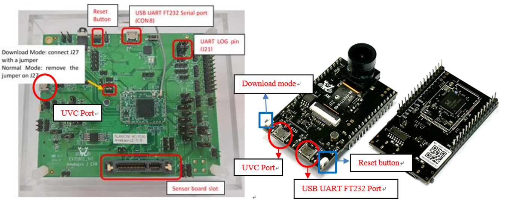
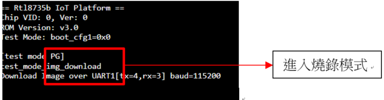
.. |image3| image:: ../../_static/user_manual/24_tunungguide_CHT/image6.png
   :width: 6.54094in
   :height: 1.95618in
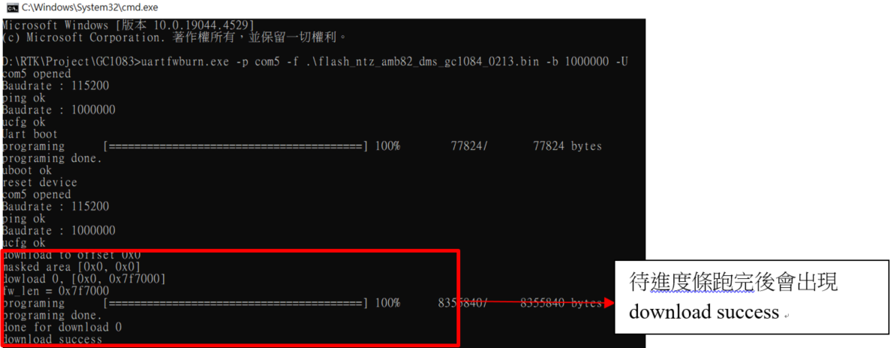
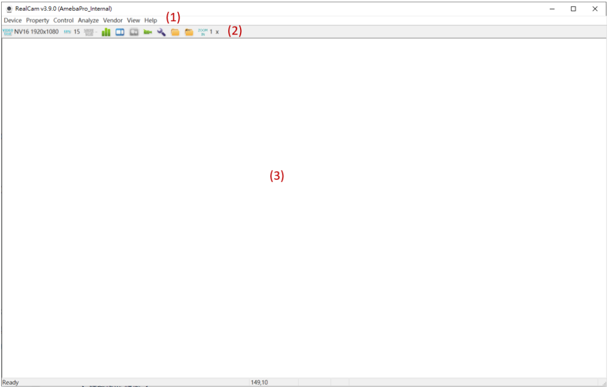
.. |18952795efc4249f391397c7719970cc| image:: ../../_static/user_manual/24_tunungguide_CHT/image3.png
   :width: 5.91232in
   :height: 3.5224in
.. |64800c5acd3149a8d9b80b5c68afc40d| image:: ../../_static/user_manual/24_tunungguide_CHT/image9.png
   :width: 3.99596in
   :height: 1.96344in
.. |image5| image:: ../../_static/user_manual/24_tunungguide_CHT/image10.png
   :width: 6.61045in
   :height: 2.83374in
.. |5cb482a58d6f7ee75aeed3b1e839c016| image:: ../../_static/user_manual/24_tunungguide_CHT/image11.jpg
   :width: 4.87139in
   :height: 3.26562in
.. |72bef7d82bd7eb50a315c617d134efa1| image:: ../../_static/user_manual/24_tunungguide_CHT/image12.jpg
   :width: 4.01761in
   :height: 2.68875in
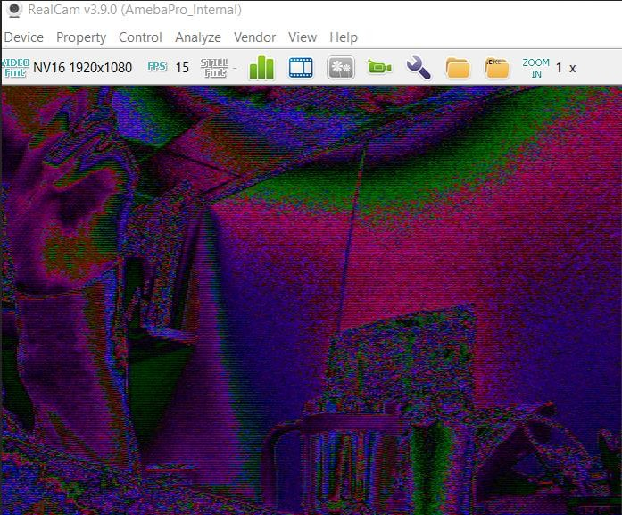
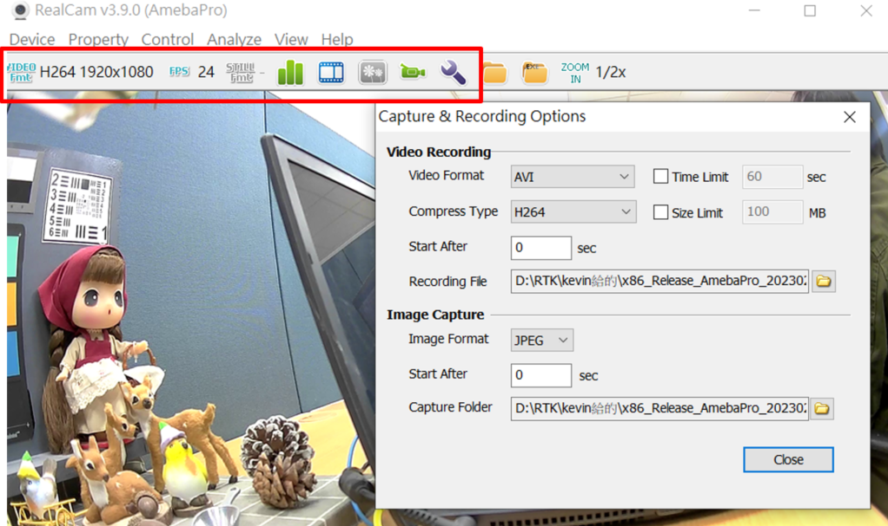
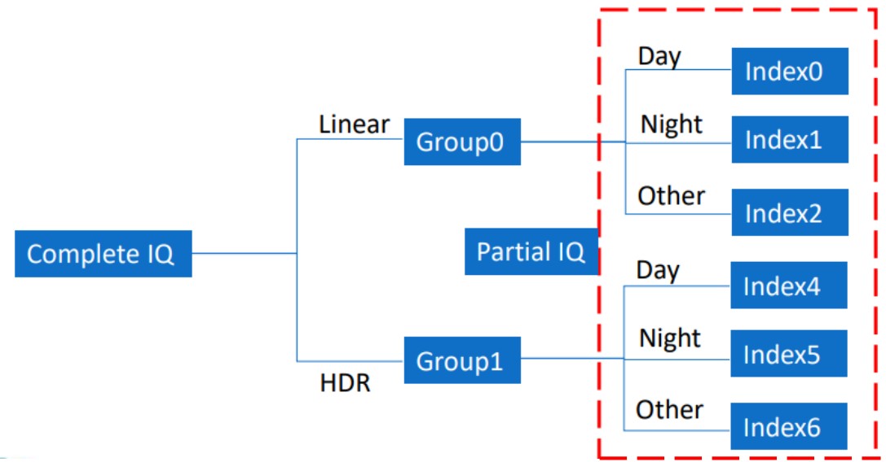
.. |image8| image:: ../../_static/user_manual/24_tunungguide_CHT/image16.png
   :width: 6.83333in
   :height: 3.54873in
.. |image9| image:: ../../_static/user_manual/24_tunungguide_CHT/image17.png
   :width: 6.83333in
   :height: 2.81302in
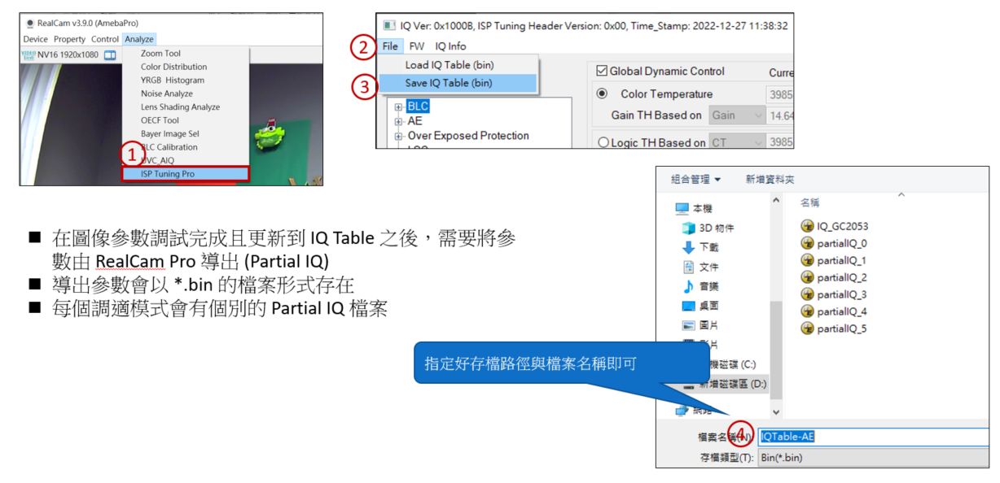
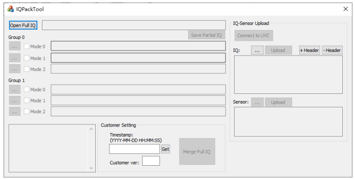
.. |image12| image:: ../../_static/user_manual/24_tunungguide_CHT/image20.png
   :width: 6.83333in
   :height: 3.20168in
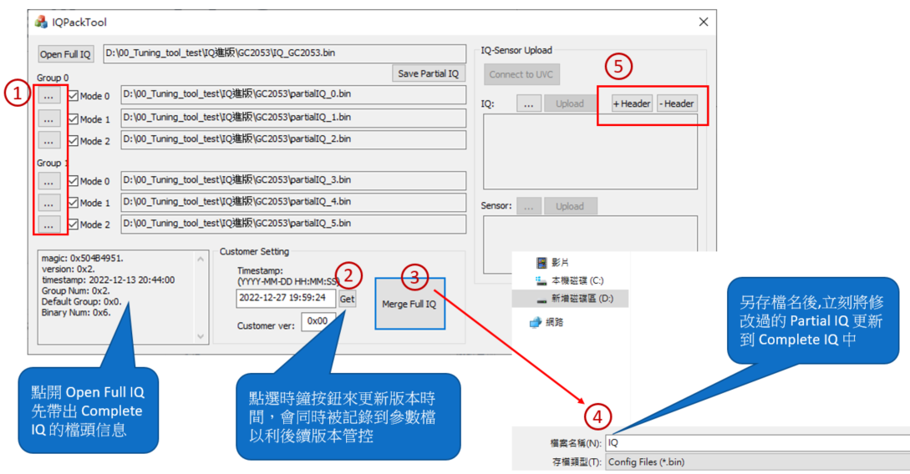
.. |9360d58e2904730c338c9e463c6f4bdf| image:: ../../_static/user_manual/24_tunungguide_CHT/image22.jpg
   :width: 6.80625in
   :height: 3.24653in
.. |2730cf2ea4e6104a16101ee575c3809f| image:: ../../_static/user_manual/24_tunungguide_CHT/image23.png
   :width: 6.19718in
   :height: 0.84in
.. |e5af1c4eaaa552e5b90cafed7d23cb25| image:: ../../_static/user_manual/24_tunungguide_CHT/image24.png
   :width: 6.62913in
   :height: 1.70229in
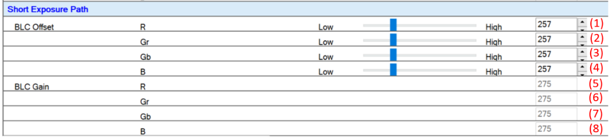
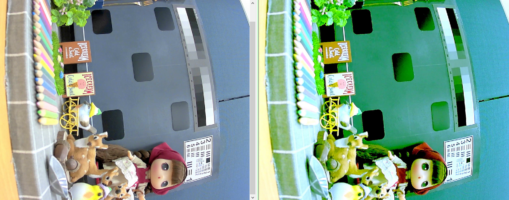
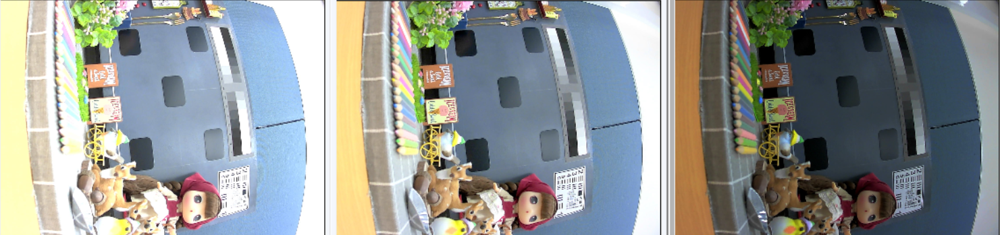
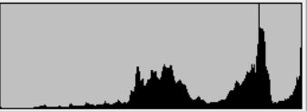
.. |image18| image:: ../../_static/user_manual/24_tunungguide_CHT/image29.png
   :width: 2.0625in
   :height: 0.79167in

.. |image19| image:: ../../_static/user_manual/24_tunungguide_CHT/image31.png
   :width: 2.59691in
   :height: 2.51447in
.. |76669ae4dec3e3860b28d19559f587f2| image:: ../../_static/user_manual/24_tunungguide_CHT/image32.png
   :width: 5.85019in
   :height: 1.40208in
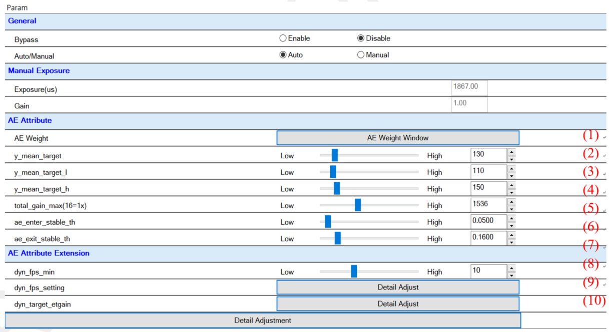
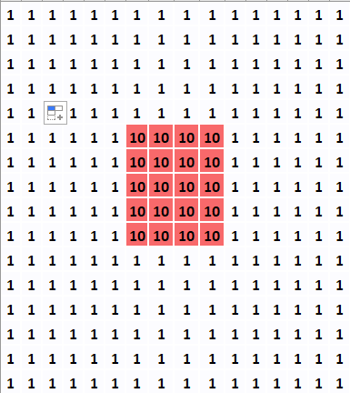
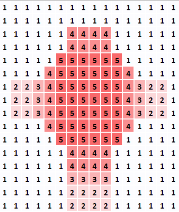
.. |image21| image:: ../../_static/user_manual/24_tunungguide_CHT/image36.png
   :width: 1.88056in
   :height: 1.73819in
.. |image24| image:: ../../_static/user_manual/24_tunungguide_CHT/image37.png
   :width: 6.83333in
   :height: 2.29739in
.. |image25| image:: ../../_static/user_manual/24_tunungguide_CHT/image38.png
   :width: 5.84306in
   :height: 4in
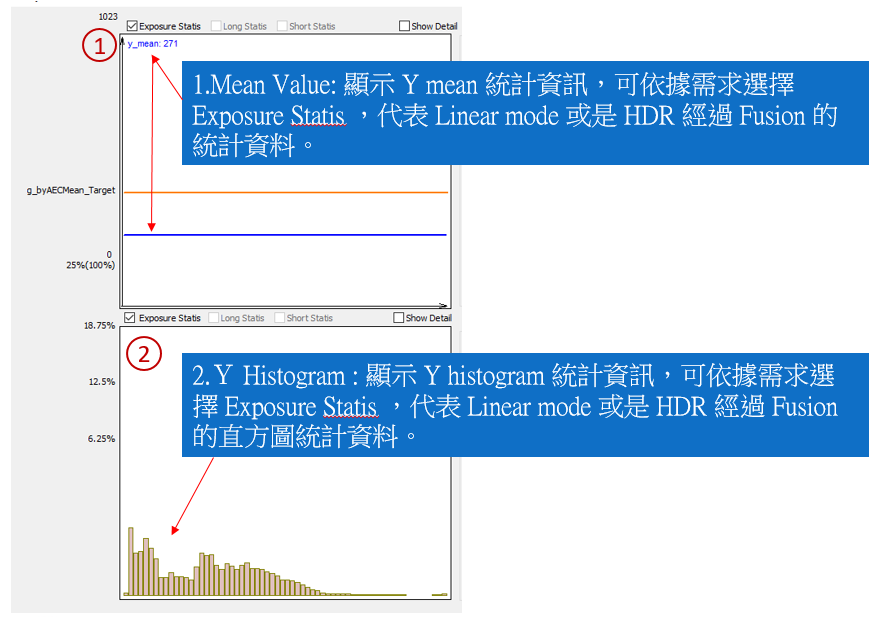
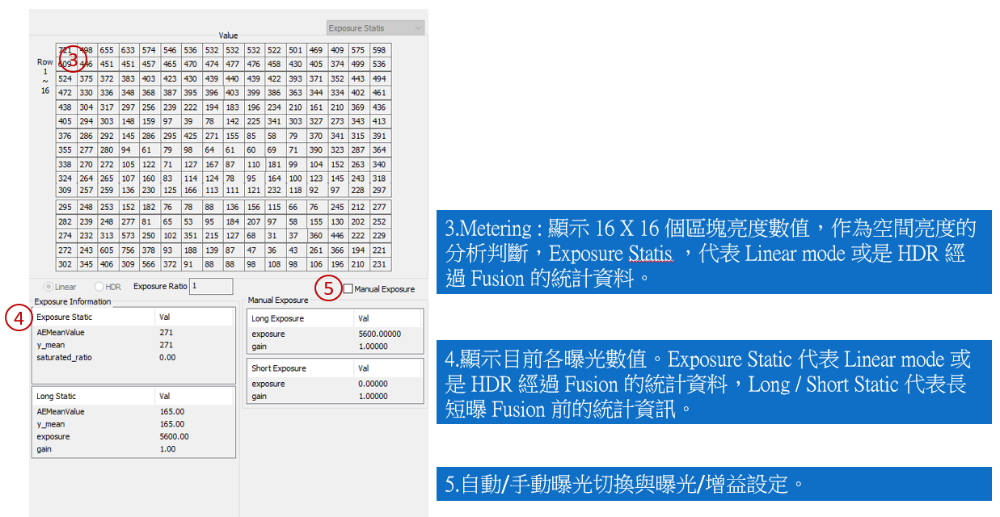
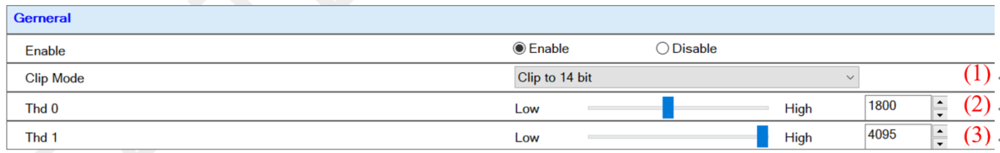
.. |image29| image:: ../../_static/user_manual/24_tunungguide_CHT/image42.png
   :width: 6.83333in
   :height: 3.22231in
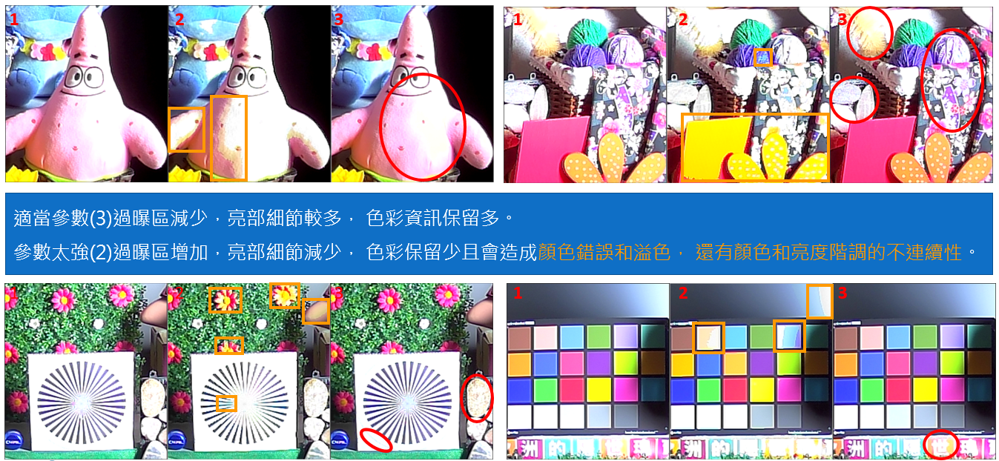
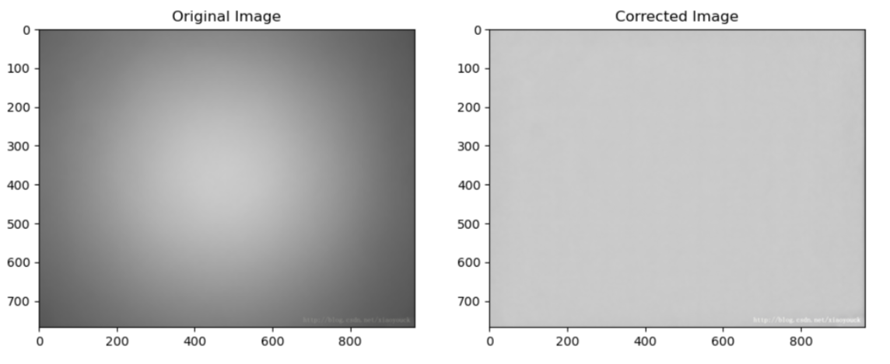
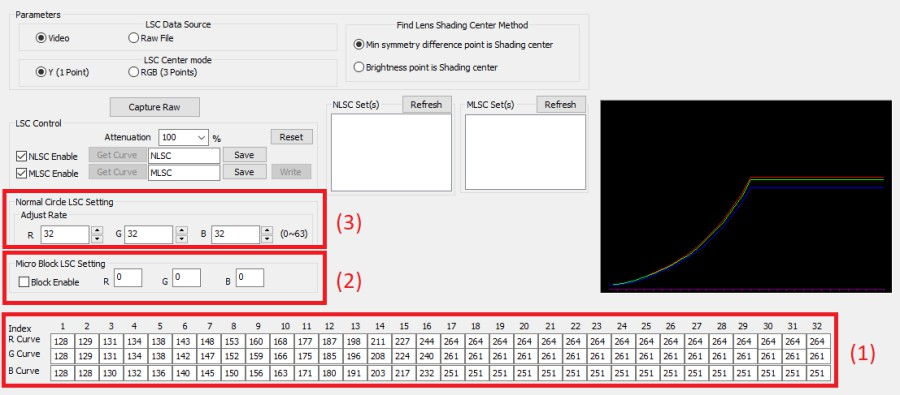
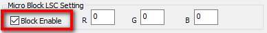
.. |129461df9568b2a7418a1f0e1dc90de0| image:: ../../_static/user_manual/24_tunungguide_CHT/image47.jpg
   :width: 4.26092in
   :height: 2.84846in
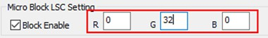
.. |d9f83eb0063f3d39998143dad826419d| image:: ../../_static/user_manual/24_tunungguide_CHT/image49.jpg
   :width: 3.11775in
   :height: 2.73377in
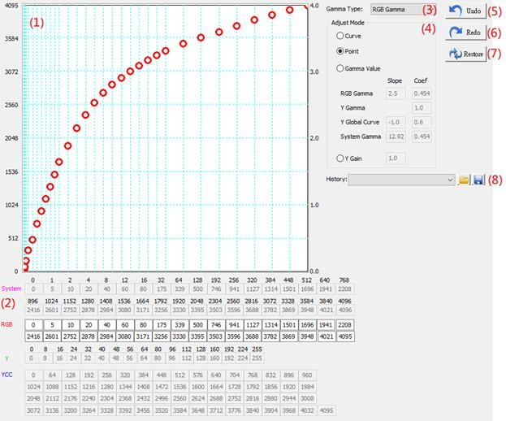
.. |c71ffcd001bc80405b5720a96187dc80| image:: ../../_static/user_manual/24_tunungguide_CHT/image51.jpg
   :width: 5.70377in
   :height: 3.07241in
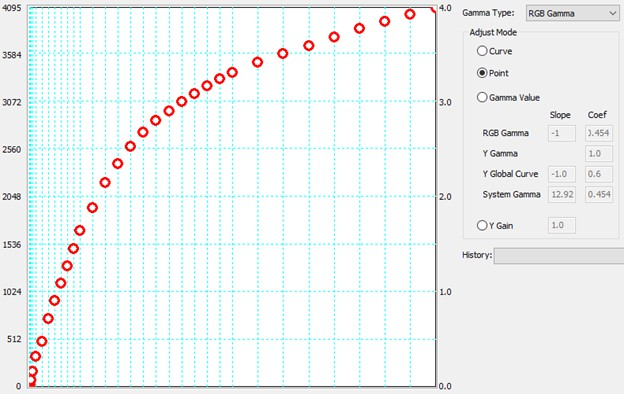
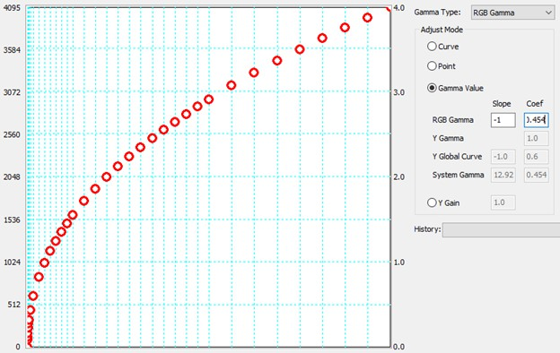
.. |image32| image:: ../../_static/user_manual/24_tunungguide_CHT/image54.png
   :width: 3.07048in
   :height: 2.13286in
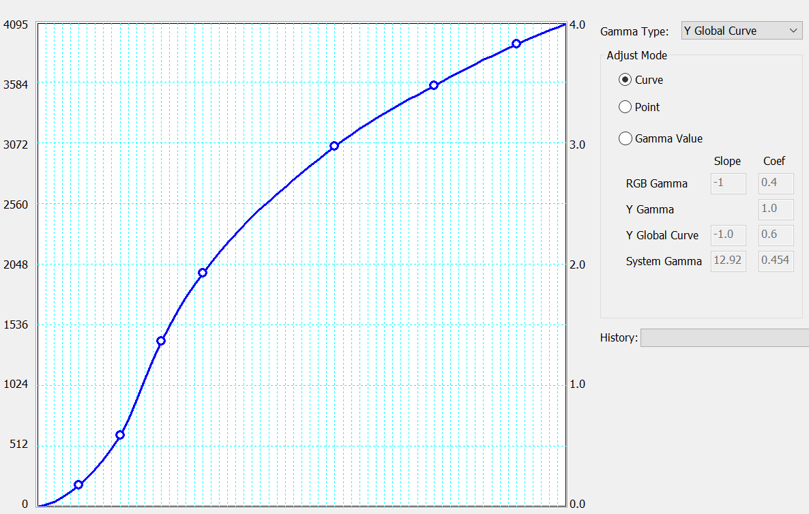
.. |image34| image:: ../../_static/user_manual/24_tunungguide_CHT/image56.png
   :width: 2.95117in
   :height: 1.61402in
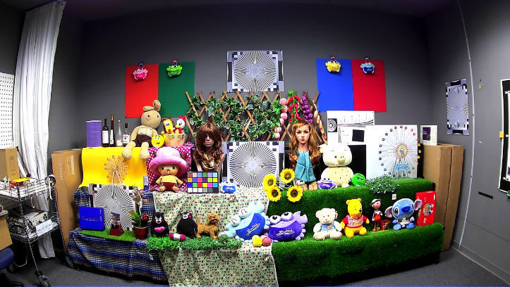
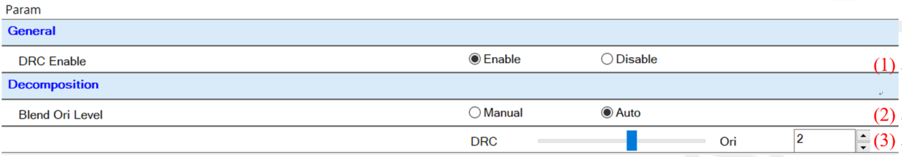
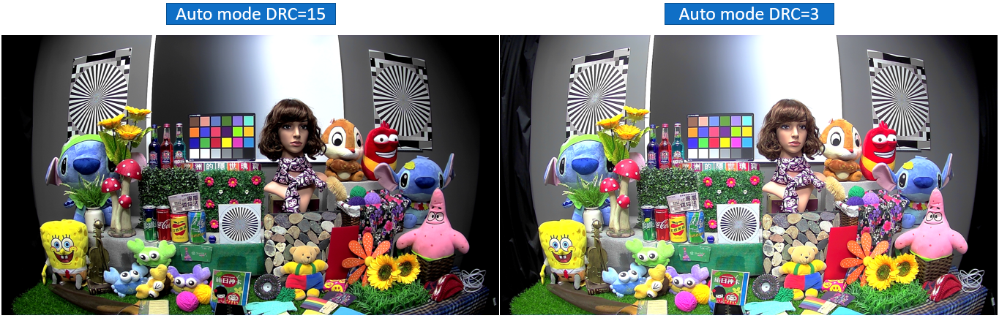
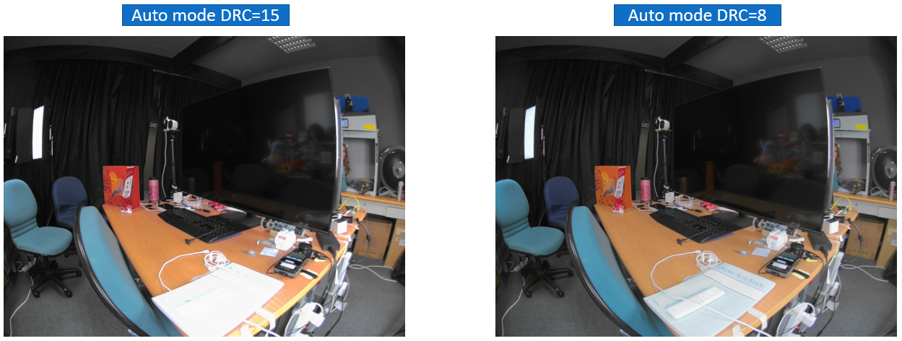
.. |image39| image:: ../../_static/user_manual/24_tunungguide_CHT/image61.png
   :width: 5.05606in
   :height: 0.3279in
.. |image40| image:: ../../_static/user_manual/24_tunungguide_CHT/image62.png
   :width: 5.61685in
   :height: 3.14375in
.. |image41| image:: ../../_static/user_manual/24_tunungguide_CHT/image63.png
   :width: 2.21839in
   :height: 1.9574in
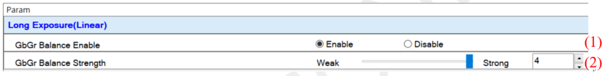
.. |image43| image:: ../../_static/user_manual/24_tunungguide_CHT/image65.png
   :width: 6.83333in
   :height: 2.99848in
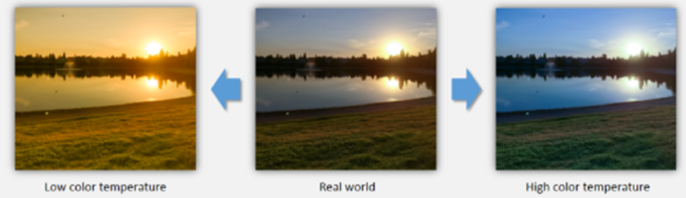
.. |image45| image:: ../../_static/user_manual/24_tunungguide_CHT/image67.png
   :width: 4.64988in
   :height: 2.8443in
.. |image46| image:: ../../_static/user_manual/24_tunungguide_CHT/image68.png
   :width: 6.53333in
   :height: 2.02271in
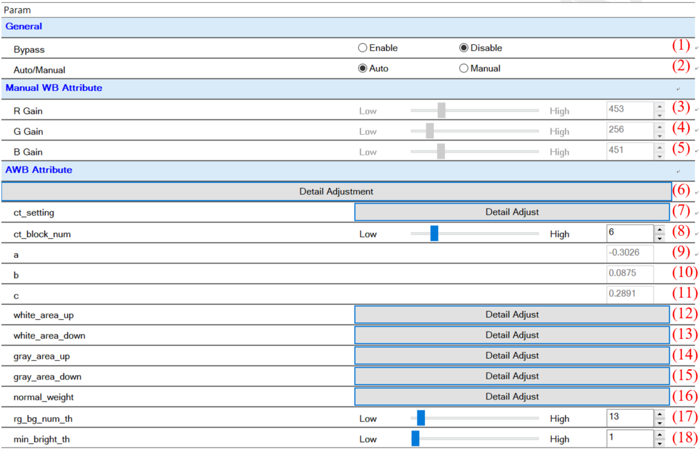
.. |064a8a50e5ae0100238309d750b2e242| image:: ../../_static/user_manual/24_tunungguide_CHT/image70.jpg
   :width: 5.06671in
   :height: 3.17324in
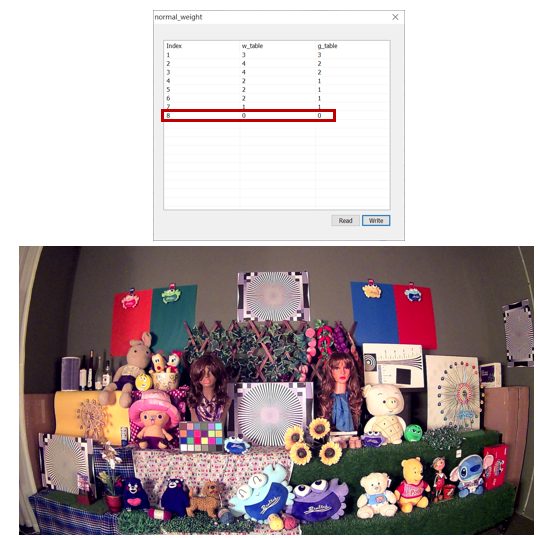
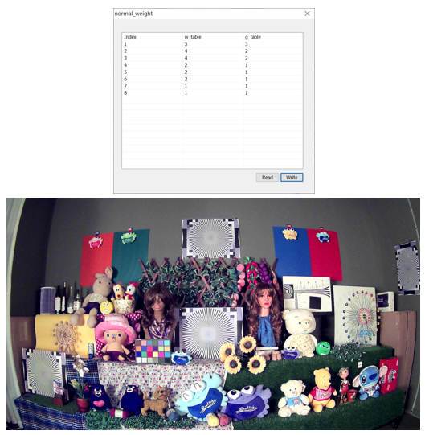
.. |6f6b1721129b0d03b2c622bd124351ea| image:: ../../_static/user_manual/24_tunungguide_CHT/image73.png
   :width: 5.96538in
   :height: 0.59501in
.. |image50| image:: ../../_static/user_manual/24_tunungguide_CHT/image74.png
   :width: 3.69553in
   :height: 3.25323in
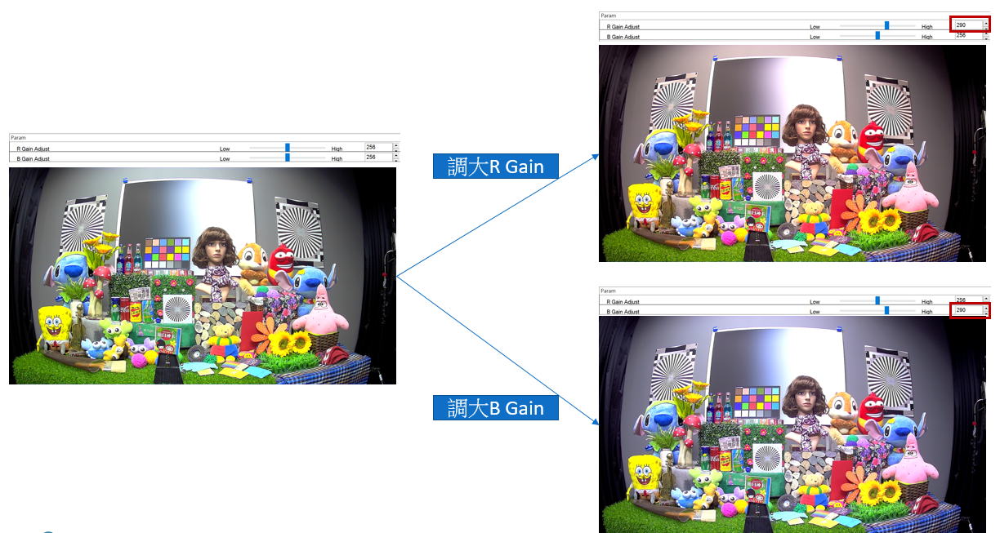
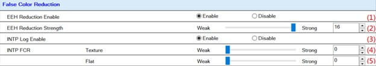
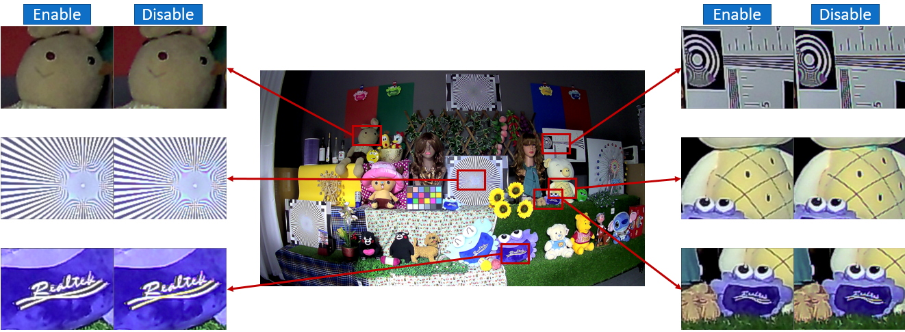
.. |b8965bee784140d35c9b14229b007729| image:: ../../_static/user_manual/24_tunungguide_CHT/image78.png
   :width: 5.91753in
   :height: 1.36125in
.. |image53| image:: ../../_static/user_manual/24_tunungguide_CHT/image79.png
   :width: 6.82837in
   :height: 3.50005in
.. |image54| image:: ../../_static/user_manual/24_tunungguide_CHT/image80.png
   :width: 6.83333in
   :height: 3.75542in
.. |image55| image:: ../../_static/user_manual/24_tunungguide_CHT/image81.png
   :width: 5.19068in
   :height: 3.02666in
.. |image56| image:: ../../_static/user_manual/24_tunungguide_CHT/image82.png
   :width: 6.83333in
   :height: 3.57045in
.. |image57| image:: ../../_static/user_manual/24_tunungguide_CHT/image83.png
   :width: 6.83333in
   :height: 2.46412in
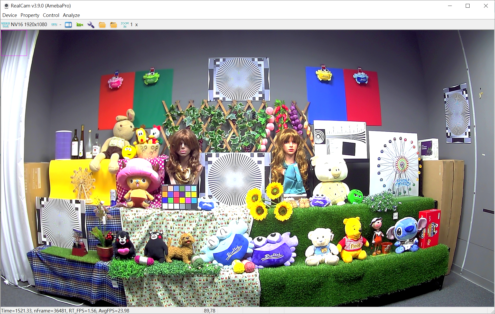
.. |image59| image:: ../../_static/user_manual/24_tunungguide_CHT/image85.png
   :width: 3.5844in
   :height: 2.17998in
  
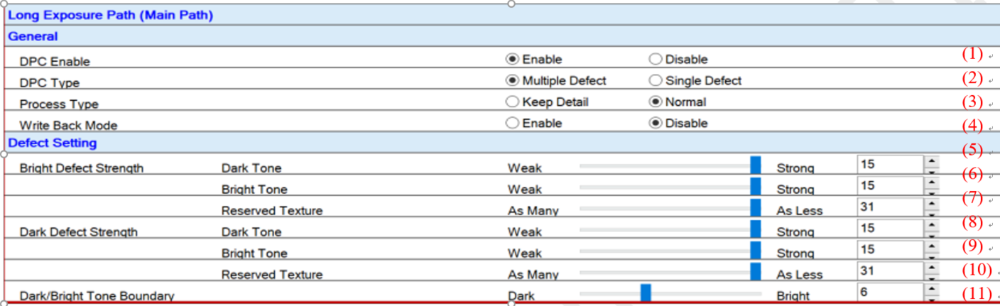
.. |image61| image:: ../../_static/user_manual/24_tunungguide_CHT/image87.png
   :width: 5.83333in
   :height: 1.15419in
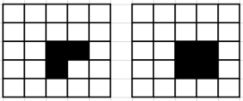
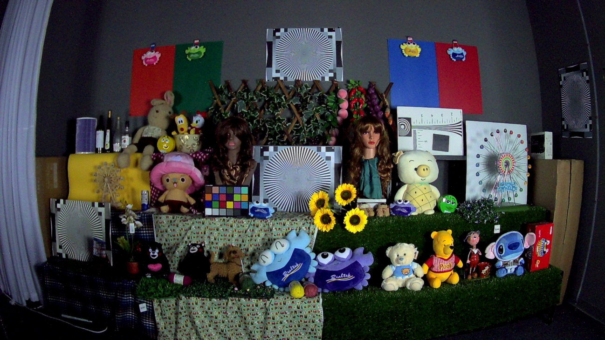
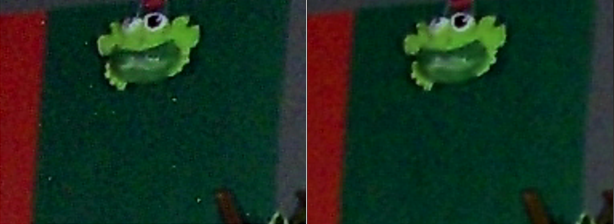
.. |image65| image:: ../../_static/user_manual/24_tunungguide_CHT/image91.png
   :width: 5.50016in
   :height: 2.28365in
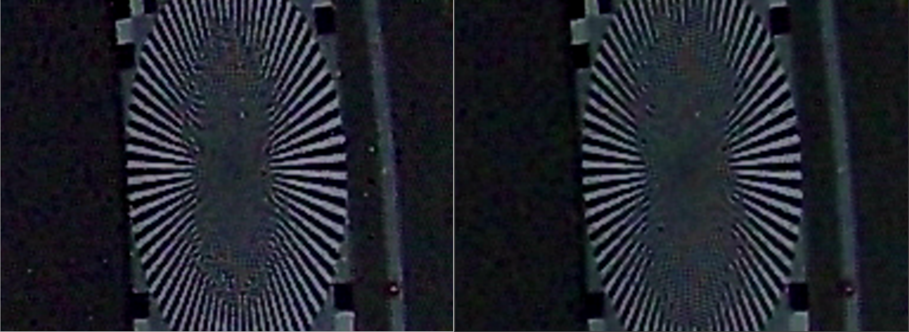
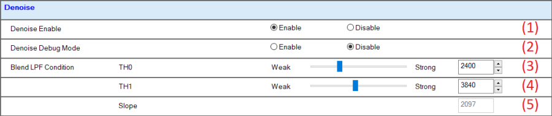
.. |image67| image:: ../../_static/user_manual/24_tunungguide_CHT/image94.png
   :width: 6.83333in
   :height: 2.80381in
.. |image68| image:: ../../_static/user_manual/24_tunungguide_CHT/image95.jpg
   :width: 6.83333in
   :height: 3.00524in
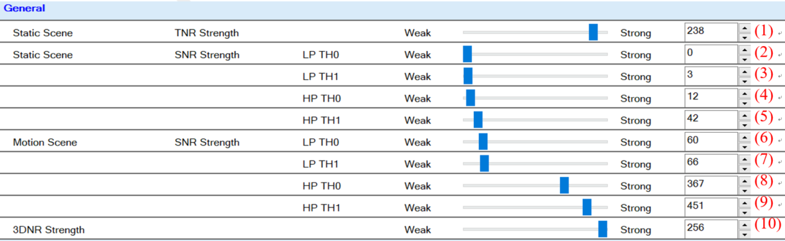
.. |image70| image:: ../../_static/user_manual/24_tunungguide_CHT/image97.png
   :width: 6.83333in
   :height: 2.94728in
.. |6920467a6525b8d28109c78c0aa42d15| image:: ../../_static/user_manual/24_tunungguide_CHT/image98.jpg
   :width: 6.832in
   :height: 2.01782in
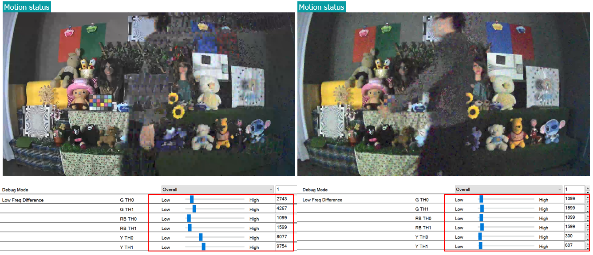
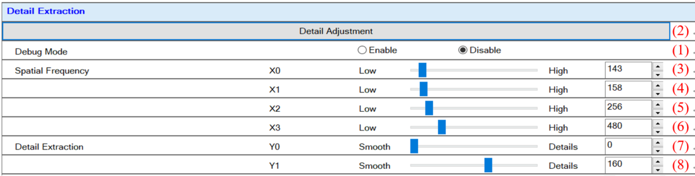
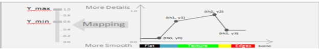
.. |image73| image:: ../../_static/user_manual/24_tunungguide_CHT/image102.png
   :width: 1.78819in
   :height: 2.2125in
.. |image74| image:: ../../_static/user_manual/24_tunungguide_CHT/image103.png
   :width: 3.8961in
   :height: 2.71717in
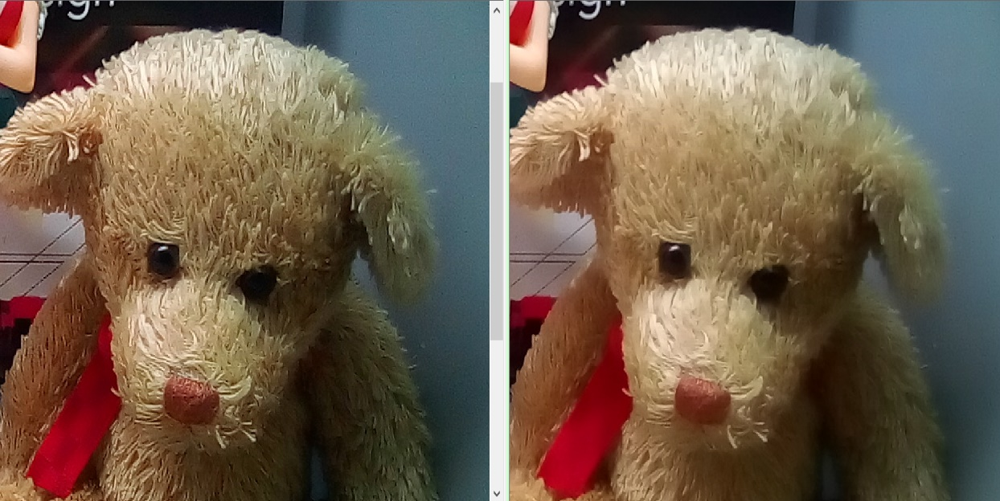
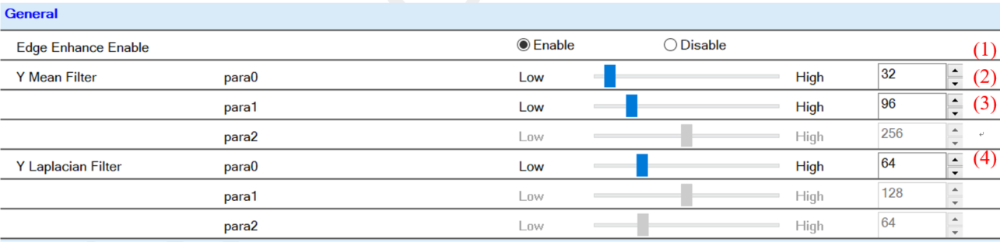
.. |5691a8470f9d35c9019ee29f8b985a72| image:: ../../_static/user_manual/24_tunungguide_CHT/image106.png
   :width: 6.83333in
   :height: 3.95799in
.. |image77| image:: ../../_static/user_manual/24_tunungguide_CHT/image107.png
   :width: 5.97681in
   :height: 3.73071in
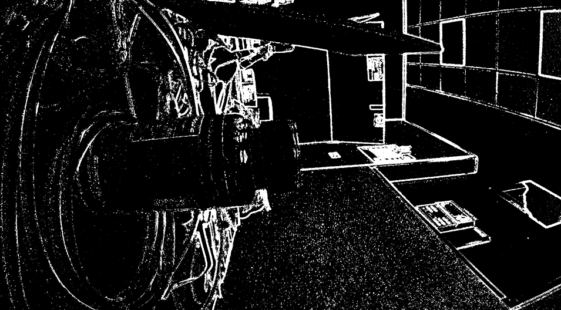
.. |bff0cd25c27d3b80c2747652207eefc7| image:: ../../_static/user_manual/24_tunungguide_CHT/image109.png
   :width: 5.42222in
   :height: 0.57083in
.. |9fc1ff8de3d3a3e6187bfd4de9b7eeeb| image:: ../../_static/user_manual/24_tunungguide_CHT/image110.png
   :width: 5.88264in
   :height: 1.51181in
.. |image79| image:: ../../_static/user_manual/24_tunungguide_CHT/image111.png
   :width: 6.83333in
   :height: 1.79736in
.. |8ccfac62b9cb9604db636eba900862b5| image:: ../../_static/user_manual/24_tunungguide_CHT/image112.png
   :width: 5.93542in
   :height: 1.06153in
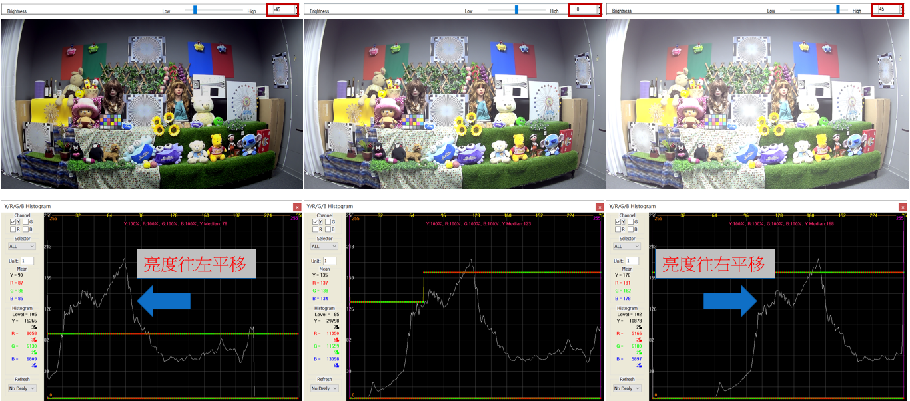
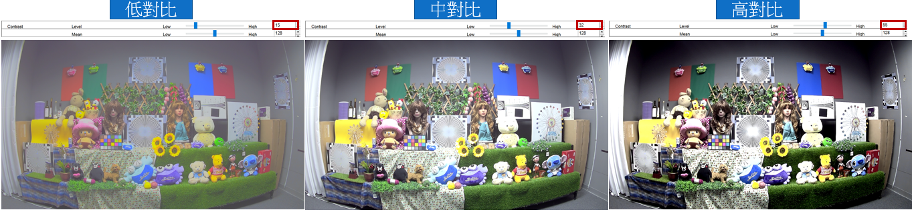
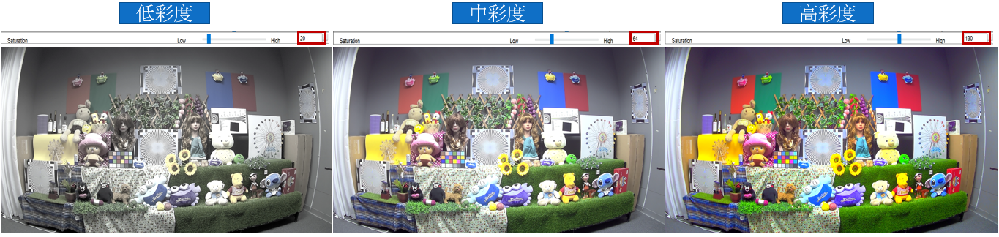
.. |image83| image:: ../../_static/user_manual/24_tunungguide_CHT/image116.png
   :width: 5.02316in
   :height: 1.49669in
.. |image84| image:: ../../_static/user_manual/24_tunungguide_CHT/image117.png
   :width: 6.82083in
   :height: 3.18056in
.. |image86| image:: ../../_static/user_manual/24_tunungguide_CHT/image118.png
   :width: 0.62639in
   :height: 0.8875in
.. |image87| image:: ../../_static/user_manual/24_tunungguide_CHT/image119.jpg
   :width: 4.67108in
   :height: 2.35051in

.. |image88| image:: ../../_static/user_manual/24_tunungguide_CHT/image121.png
   :width: 5.41319in
   :height: 1.35972in
.. |image89| image:: ../../_static/user_manual/24_tunungguide_CHT/image122.png
   :width: 3.03625in
   :height: 1.75208in
.. |image90| image:: ../../_static/user_manual/24_tunungguide_CHT/image123.png
   :width: 3.03194in
   :height: 1.74653in
.. |image91| image:: ../../_static/user_manual/24_tunungguide_CHT/image124.jpg
   :width: 5.83333in
   :height: 1.63314in
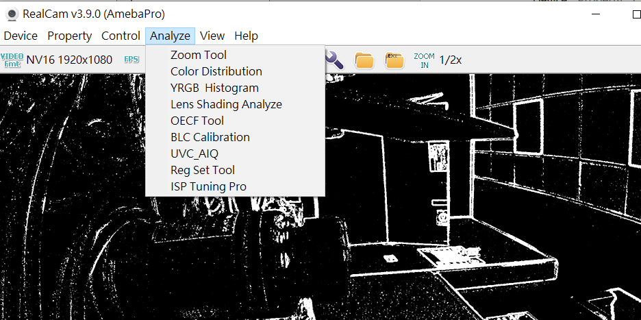
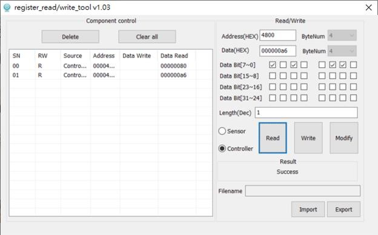
.. |62fe57561ab6d407485b97b4bb2fec81| image:: ../../_static/user_manual/24_tunungguide_CHT/image127.jpg
   :width: 5.86319in
   :height: 1.22778in
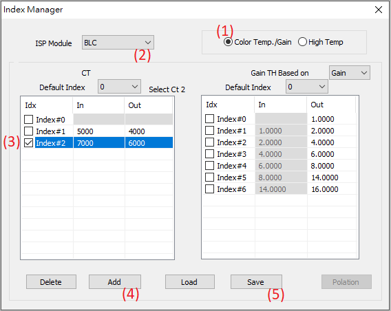
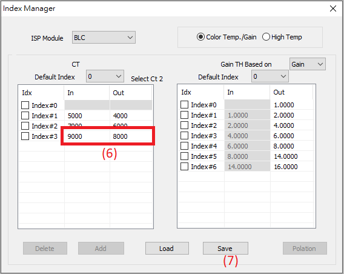
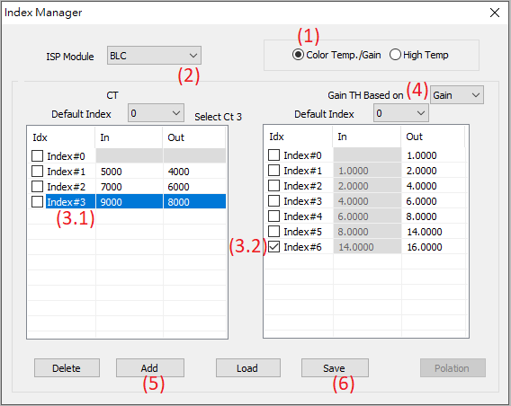
.. |ae54c50398bc8ffc18d9e2646e0ebff7| image:: ../../_static/user_manual/24_tunungguide_CHT/image131.png
   :width: 4.69952in
   :height: 3.38378in
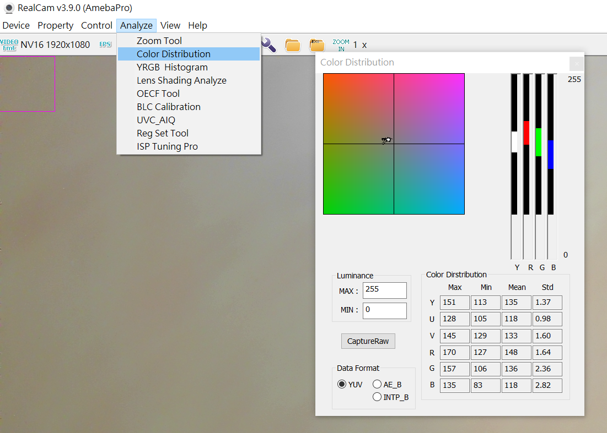
.. |image94| image:: ../../_static/user_manual/24_tunungguide_CHT/image133.png
   :width: 4.04667in
   :height: 2.12751in
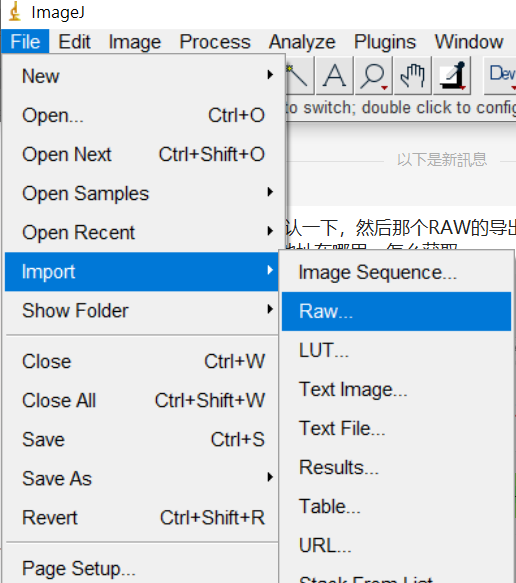
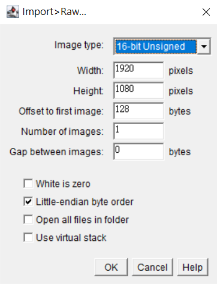
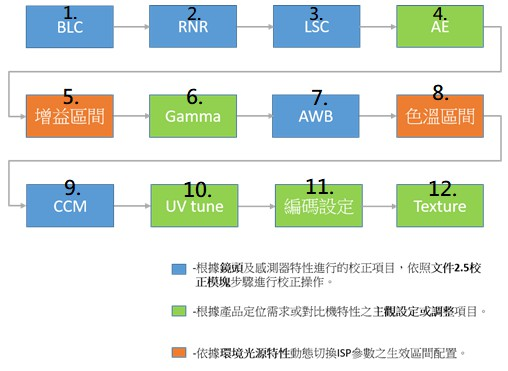
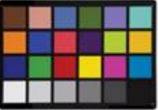
.. |image98| image:: ../../_static/user_manual/24_tunungguide_CHT/image138.png
   :width: 0.82478in
   :height: 1.79176in
.. |28a6fd7d955e0b6b2874a0a9a2f891be| image:: ../../_static/user_manual/24_tunungguide_CHT/image139.jpg
   :width: 2.21245in
   :height: 1.92712in
.. |5c7315124c64d0b806d29f1f389f3788| image:: ../../_static/user_manual/24_tunungguide_CHT/image140.jpg
   :width: 2.38705in
   :height: 1.9306in
.. |image99| image:: ../../_static/user_manual/24_tunungguide_CHT/image141.png
   :width: 2.80565in
   :height: 2.35646in
.. |image100| image:: ../../_static/user_manual/24_tunungguide_CHT/image142.png
   :width: 6.5859in
   :height: 3.73227in
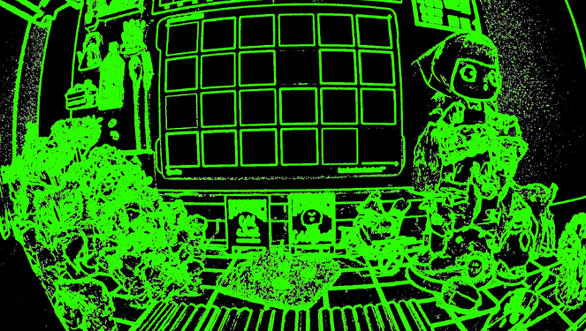
.. |image102| image:: ../../_static/user_manual/24_tunungguide_CHT/image144.png
   :width: 3.81443in
   :height: 2.05335in
.. |image103| image:: ../../_static/user_manual/24_tunungguide_CHT/image145.png
   :width: 3.972in
   :height: 2.33383in
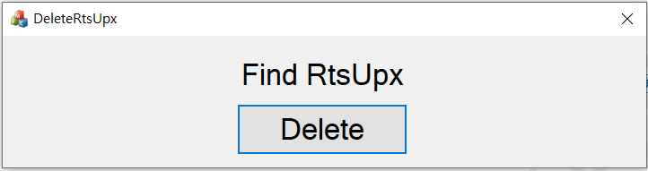
.. |image105| image:: ../../_static/user_manual/24_tunungguide_CHT/image147.png
   :width: 3.44127in
   :height: 1.03463in
