UVC FW Compiled for IQ Tuning CHT
=================================

1. **編譯環境準備**
-------------------

SDK的編譯環境, 和編譯方法說明如下:

 

安裝mingw with ASDK

 

1. 至\ https://www.msys2.org/ 下載msys64 並解壓至工作目錄　　

2. 下載並安裝cmake: https://cmake.org/download/

 

3. 於mingw 的bashrc中export cmake

 

a. 點擊msys2_shell.cmd打開mingw，修改完.bashrc後關掉在重新點擊msys2_shell.cmd完成export

 

b. 打開msys64-1210\\msys64\\home\\xxx\\.bashrc

 

c. 添加export PATH=/JLink:$PATH:/mingw64/bin:/c/Program/Files/CMake/bin

d. 取得對應的SDK 

|image1|

e. 確認SDK包中含有對應的Sensor driver

component\\soc\\8735b\\fwlib\\rtl8735b\\lib\\source\\ram\\video\\voe_bin
(以PS5270為例)

|image2|

f. 確認SDK包中含有對應的IQ.BIN(Full IQ)
component\\soc\\8735b\\fwlib\\rtl8735b\\lib\\source\\ram\\video\\voe_bin
(以PS5270為例)

- 編譯FW同時將IQ.BIN合入SDK中，SDK中的需要的IQ.BIN\ **只能是Full IQ**

|image3|

g. 確認對應的Sensor資訊以及開啟IQ tuning功能

- **Reference file**

  - project\\realtek_amebapro2_v0_example\\inc\\sensor.h

  - project\\realtek_amebapro2_v0_example\\inc\\platform_opts.h

|image4|
|image5|

2. **編譯IQ Tuning所需的FW**
----------------------------

a. 點擊開啟ASDK-msys2.exe

|image7|

b. 進入須編譯的sdk路徑

/project/realtek_amebapro2_v0_example/GCC-RELEASE

c. 創建build資料夾

mkdir build

d. 進入build資料夾

..

   |image8|

e. 輸入以下命令

cmake .. -G"Unix Makefiles" -DCMAKE_TOOLCHAIN_FILE=../toolchain_ci.cmake
-DEXAMPLE=media_uvcd

f. 執行完畢後輸入以下命令編譯

cmake --build . --target flash

|image9|

g. 在對應的資料夾中找到所需的UVC FW

|image10|

3. **燒錄UVC FW至設備中，打開RealCam檢測**
-------------------------------------------

下圖為RTK所提供之EVB開發板以及mini82開發板

|image6|

a. 在AmebaPro2 EVB使用jumper聯結J27 Pin並按下reset button進入燒錄模式

b. 同時按下AmebaPro2 mini82兩側的download mode button以及reset
   button即可進入燒錄模式

c. 使用PG tool燒錄FW

d. 輸入uartfwburn.exe -p comXX -f .\\filename.bin -b 1000000 –U

e. XX部分為對應的com port以及須燒錄的檔案名稱

f. 待進度條跑完後會出現download success

|image13|

g. 燒錄完成後重啟設備

開機時的log
file會顯示如圖示的資訊，供使用者確認sensor，iq以及VOE版本資訊

|image14|

4. **註冊RealCam需要的NV16以及NV12解碼batch**
---------------------------------------------

將RTK提供的NV16toYUV以及NV12toYUV兩個batch解壓後，將註冊檔複製到
C:\\Windows 目錄下,並用系統管理員身分執行註冊

|image16|

5. **打開RealCam檢測**
----------------------

開啟usb uvc class，確認調適工具可以出圖
|image17|

開啟調適頁面

|image19|

6. **導入圖像參數(燒錄 IQ 參數到樣機)**
---------------------------------------

..

   在 Amebapro 2 的芯片，IQ 參數以一個獨立的 bin 檔案存在。

   Full IQ : 本身包含不同曝光模式所調試的參數，各模式下則由三個模式 (
   Mode ) ，共6張IQ table 組成。

   Partial IQ:每種模式下的 IQ 參數也可以是一個獨立檔案，也可導入Partial
   IQ。

   將分別調適好的partial IQ打包成完整的full IQ請參閱RTK文件\ **AmebaPro2
   FW_Tool_230105.pdf**

|image22|

**導出圖像參數**

- 在圖像參數調試完成且更新到 IQ Table 之後，需要將參 數由 RealCam Pro
  導出 (Partial IQ)

- 導出參數會以 \*.bin (binary)的檔案型式存在

- 每個調適模式會有個別的 Partial IQ 檔案

|image11|

**使用RealCam燒錄IQ.BIN**

- RealCam工具自帶燒錄IQ.BIN功能，可燒錄完整的Full IQ以及單獨的Partial IQ

|image12|

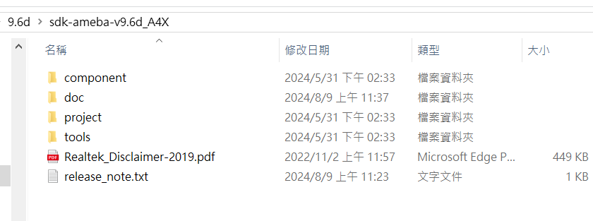
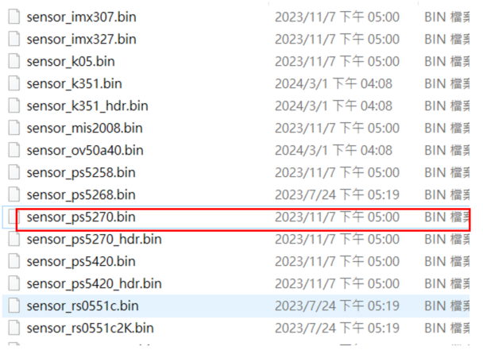
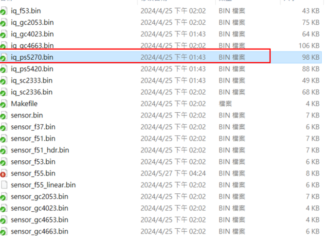
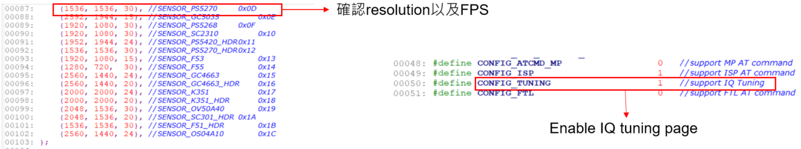
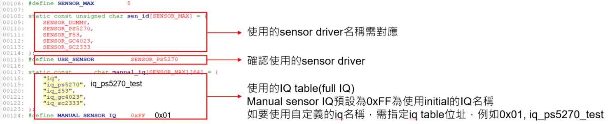
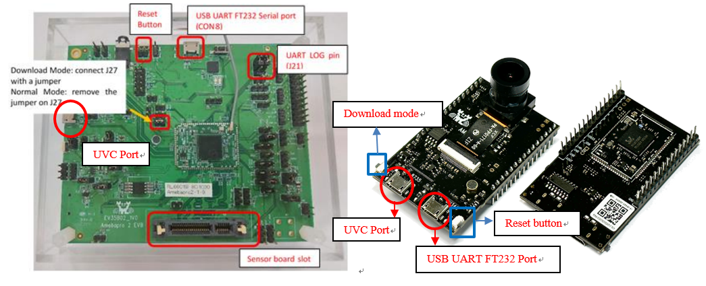
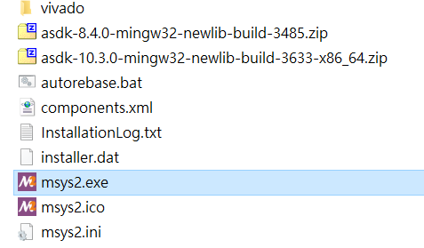
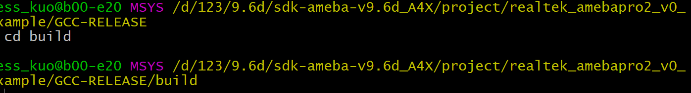
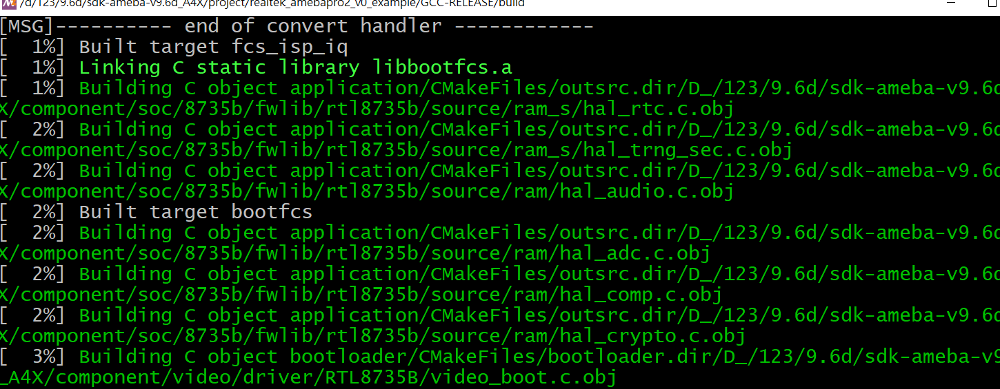
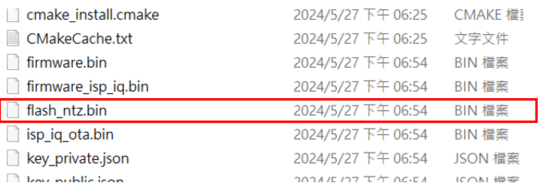
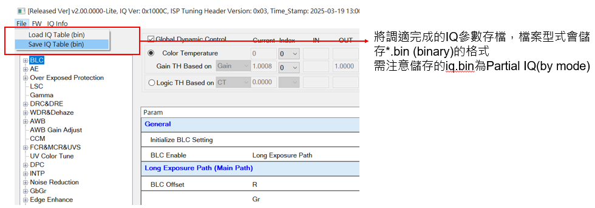
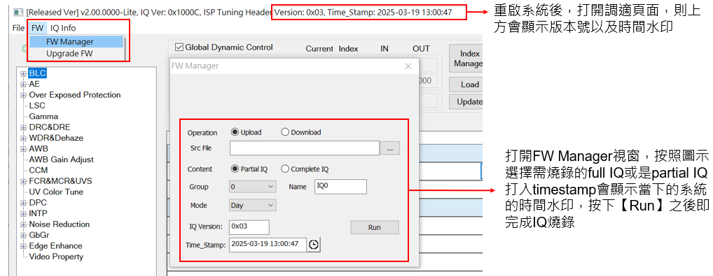
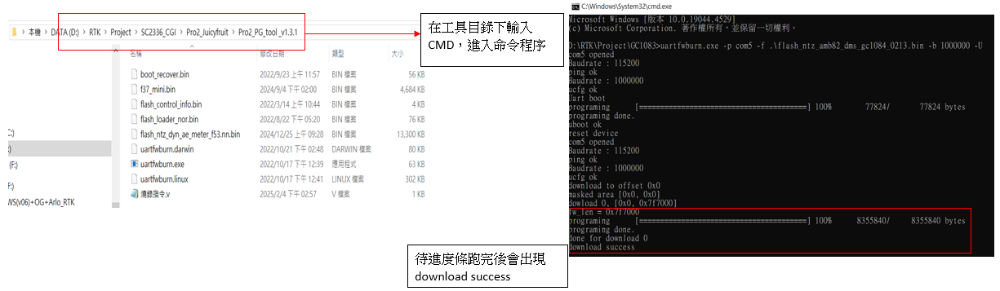
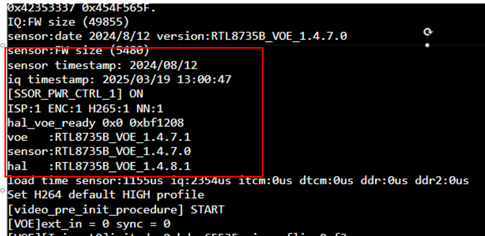
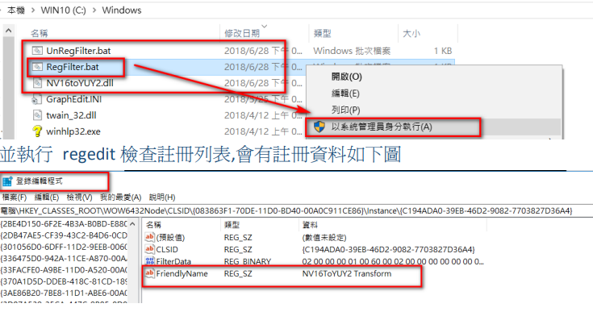
.. |image17| image:: ../../_static/user_manual/26_UVC_FW_compile/image17.png
   :width: 4.86806in
   :height: 2.0375in
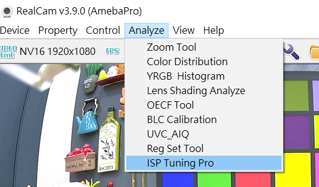
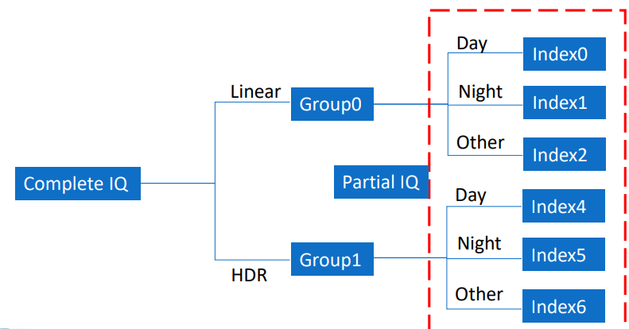