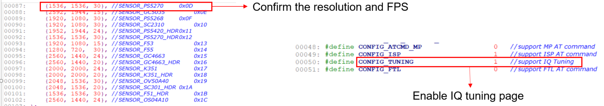
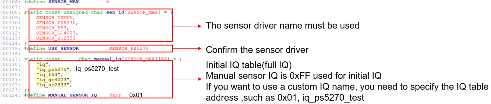
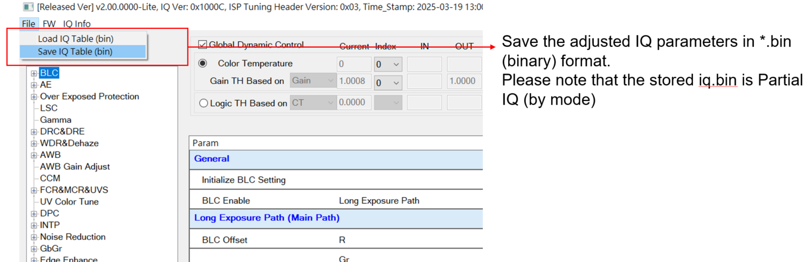
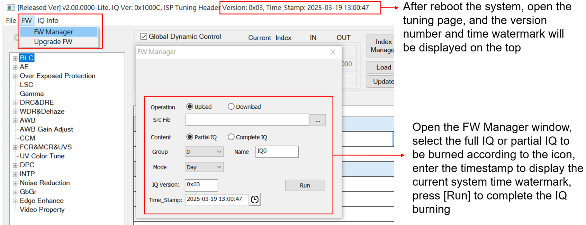
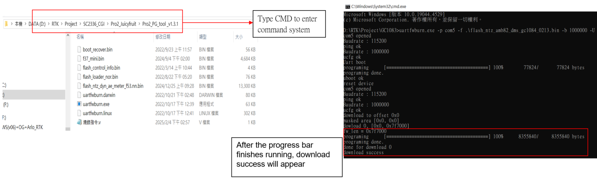

UVC FW Compiled for IQ Tuning ENG
=================================

1. **Compilation environment preparation**
------------------------------------------

The SDK compilation environment and method are as follows:
Install mingw with ASDK

1. https://www.msys2.org/ to download msys64 and un-zip it

2. Download and install cmake: https://cmake.org/download/

3. Export cmake in mingw's bashrc

a. Click msys2_shell.cmd to open mingw, modify the .bashrc and reclick the msys2_shell.cmd to export

b. open msys64-1210\\msys64\\home\\xxx\\.bashrc

c. Add the export PATH=/JLink:$PATH:/mingw64/bin:/c/Program/Files/CMake/bin

d. Get the SDK from RTK 

|image1|

e. Make sure the Sensor driver that you need in SDK

component\\soc\\8735b\\fwlib\\rtl8735b\\lib\\source\\ram\\video\\voe_bin
(example:PS5270)

|image2|

f. Make sure the IQ.BIN(Full IQ) that you need in SDK
component\\soc\\8735b\\fwlib\\rtl8735b\\lib\\source\\ram\\video\\voe_bin
(example:PS5270)

- Compile FW and merge IQ.BIN into SDK. The required IQ.BIN in SDK\  must be **Full IQ** 

|image3|

g. Confirm the corresponding Sensor information and enable the IQ tuning function

- **Reference file**

  - project\\realtek_amebapro2_v0_example\\inc\\sensor.h

  - project\\realtek_amebapro2_v0_example\\inc\\platform_opts.h

|image4|
|image5|

2. **Compile the firmware required for IQ Tuning**
---------------------------------------------------

a. Click the ASDK-msys2.exe

|image7|

b. Enter the SDK path to be compiled

/project/realtek_amebapro2_v0_example/GCC-RELEASE

c. Create the build folder

mkdir build

d. Enter the build folder

..

   |image8|

e. Type the following command

cmake .. -G"Unix Makefiles" -DCMAKE_TOOLCHAIN_FILE=../toolchain_ci.cmake
-DEXAMPLE=media_uvcd

f.After the execution is complete, enter the following command to compile

cmake --build . --target flash

|image9|

g. Find the required UVC FW in the folder

|image10|

3. **Burn UVC FW into the device and turn on RealCam for detection**
---------------------------------------------------------------------

The following figure shows the EVB development board and mini82 development board provided by RTK

|image6|

a. Use a jumper to connect J27 Pin on AmebaPro2 EVB and press the reset button to enter the burning mode

b. Press the download mode button and reset button on both sides of AmebaPro2 mini82 at the same time
   to enter the burning mode

c. Use PG tool to burn FW

d. Type input uartfwburn.exe -p comXX -f .\\filename.bin -b 1000000 -U

e. The XX part is the com port and the file name

f. After the progress bar finishes running, download success will appear

|image13|

g. Restart the device after the burning is complete

The log file at startup will be display information as shown in the figure, allowing users to confirm sensor, iq and VOE version information

|image14|

4. **Register the NV16 and NV12 decoding batch required by RealCam**
--------------------------------------------------------------------

After decompressing the two batches of NV16toYUV and NV12toYUV provided by RTK, copy the registration files to
C:\\Windows directory and register as a system administrator

|image16|

5. **Turn on RealCam for detection**
------------------------------------

Enable USB UVC class and confirm that the tuning tool can output images
|image17|

Turn on the tuning page

|image19|

6. **Import IQ parameters (burn IQ parameters to device)**
----------------------------------------------------------

..

   In the Amebapro 2 chip, the IQ parameters exist in a bin file.

   Full IQ : It contains the parameters adjusted by different exposure modes, each mode consists of three modes, consisting of 6 IQ tables in total.

   Partial IQ: The IQ parameters in each mode can also be an independent file, which can also be imported into Partial IQ.

   Package the separately adjusted partial IQ into a complete full IQ. Please refer to the RTK file **AmebaPro2
   FW_Tool_230105.pdf**

|image22|

**Export IQ parameters**

- After the image parameters are tuned and updated to the IQ Table, the IQ parameters need to be transferred from RealCam Pro to
  Export(Partial IQ)

- The exported parameters will be saved in the file format of \*.bin (binary)

- Each tuning mode will have its own Partial IQ file

|image11|

**Use RealCam to burn IQ.BIN**

- The RealCam tool has a built-in IQ.BIN function, which can burn the complete Full IQ and the separate Partial IQ

|image12|

.. |image1| image:: ../../_static/user_manual/26_UVC_FW_compile/image1.png
   :width: 5.76806in
   :height: 2.14931in
.. |image2| image:: ../../_static/user_manual/26_UVC_FW_compile/image2.png
   :width: 5.76806in
   :height: 2.60833in
.. |image3| image:: ../../_static/user_manual/26_UVC_FW_compile/image3.png
   :width: 5.2871in
   :height: 2.60755in

.. |image6| image:: ../../_static/user_manual/26_UVC_FW_compile/image12.png
   :width: 6.76806in
   :height: 2.64583in
.. |image7| image:: ../../_static/user_manual/26_UVC_FW_compile/image7.png
   :width: 5.76806in
   :height: 1.98125in
.. |image8| image:: ../../_static/user_manual/26_UVC_FW_compile/image8.png
   :width: 6.76806in
   :height: 1.53681in
.. |image9| image:: ../../_static/user_manual/26_UVC_FW_compile/image9.png
   :width: 5.76806in
   :height: 2.35069in
.. |image10| image:: ../../_static/user_manual/26_UVC_FW_compile/image10.png
   :width: 5.76806in
   :height: 1.51875in

.. |image14| image:: ../../_static/user_manual/26_UVC_FW_compile/image14.png
   :width: 5.16806in
   :height: 2.0375in
.. |image16| image:: ../../_static/user_manual/26_UVC_FW_compile/image16.png
   :width: 6.86806in
   :height: 3.0375in
.. |image17| image:: ../../_static/user_manual/26_UVC_FW_compile/image17.png
   :width: 4.86806in
   :height: 2.0375in
.. |image19| image:: ../../_static/user_manual/26_UVC_FW_compile/image19.png
   :width: 4.86806in
   :height: 2.0375in
.. |image22| image:: ../../_static/user_manual/26_UVC_FW_compile/image22.png
   :width: 6.86806in
   :height: 3.5375in