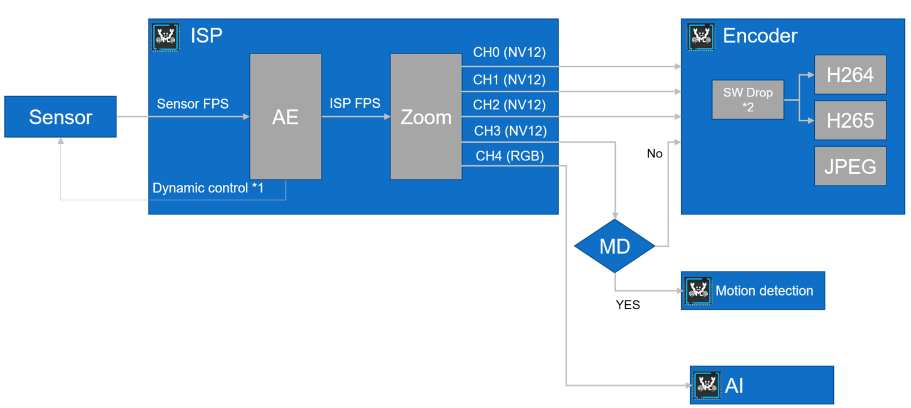
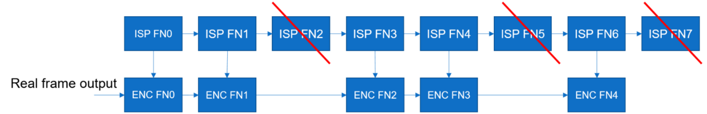
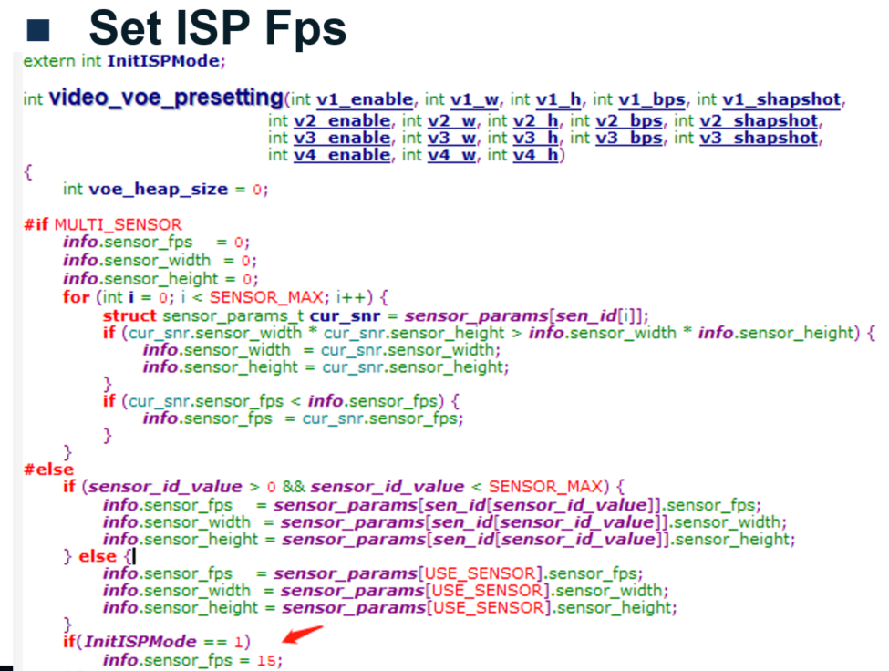
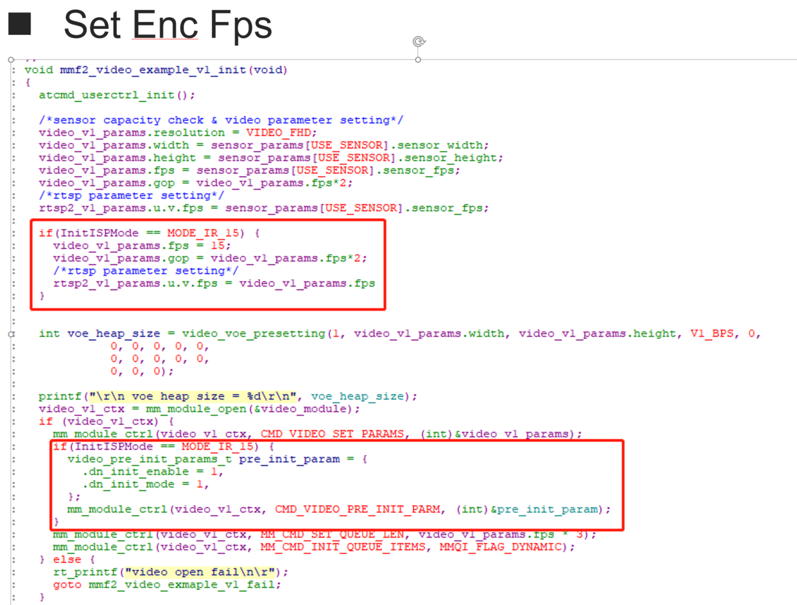
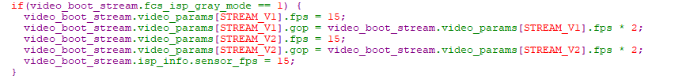
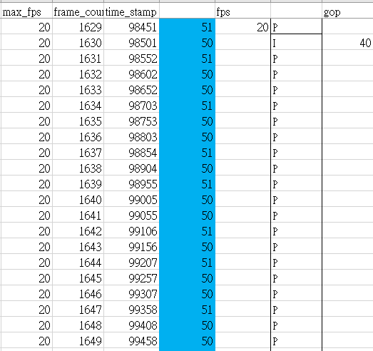
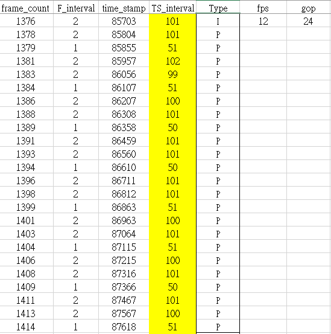
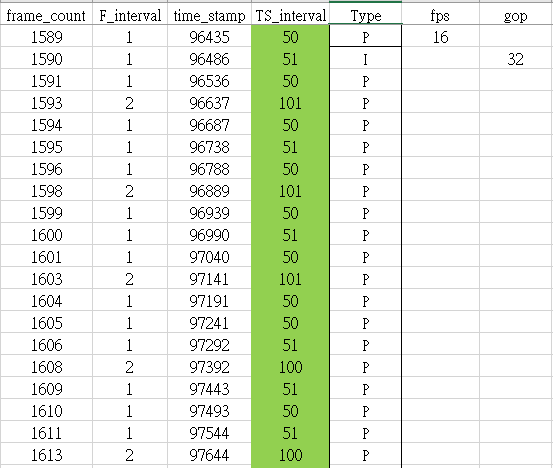

Introduction for FPS setting
============================

**FPS flow during AmebaPro2**
-----------------------------

\*1 ISP fps

-Max & Min fps should be set when ISP initialize

-Default: System set max fps, and IQ set min fps

-AE could dynamic adjust fps by environment luminance

-User could adjust max & min fps through ISP API during mode changing

\*2 Channel fps

-When channel is open, user need to set channel fps

-Then we will calculate drop ratio (by channel) based on ISP Max fps and
channel fps

|image1|

**FPS configuration**
---------------------

- **AmebaPro2 need to configure 2 kind of fps for each channel (fps)**

  - ISP FPS & Channel FPS

- **ISP Fps (sensor frame will input to ISP directly)**

  - For all channels, they share the same ISP Fps

    - Generally, ISP fps will be set when 1\ :sup:`st` channel open

      - Max fps is decided by user setting

      - Min fps is decided by IQ binary

    - ISP Max fps could be updated in following case

      - When new channel opens

        - VOE will check whether it is larger than current ISP fps or
          not. If Yes, update ISP fps.

      - Through ISP API (isp_set_max_fps)

    - ISP Min fps could be updated in following case

      - Switching IQ table

      - Through ISP API (isp_set_min_fps)

  - Auto exposure function would dynamic adjust fps by environment
    luminance

    - Max exposure time would be limited by frame time ( 1 / ISP fps)

- **Channel Fps**

  - For each channel, user need to define channel fps

    - Channel fps will be set when channel open

      - Based on ISP fps & Channel fps, VOE will calculate drop ratio
        for each channel

      - Maximum ratio would be 1 (which means that all frame will direct
        bypass to encoder)

      - Support ISP fps = 30, and channel fps = 12, drop ratio would be
        (30-12) / 30

        - Which means that Encoder would drop 3 frame in every 5 frame

  - For mode change (RGB <-> IR)

    - User need to change both ISP & channel fps to achieve target fps &
      image quality

    - RTK has provide integration function call

      - Ref to: mmf2_video_example_v1_day_night_change_init()

**Drop frame mechanism**
------------------------

- **Stream open at ISP fps = 24, and channel fps = 15 (which means drop
  ratio = (24-15) / 24)**

  - For each ISP Frame, time interval would be 1/24s = 41.6ms

  - Based on drop ratio, we choose 8 frame as a group, and then drop 3
    frame

..

   |image2|

- Real frame time interval from encoder between FN0->FN1 & FN2->FN3 =
  41.6ms

- Real frame time interval from encoder between FN1->FN2 & FN3->FN4 &
  FN5->FN6 = 83.2ms

- Advantage:

  - flexible for fps control

- Disadvantage:

  - non-regular for time interval

  - Non-best quality at low light condition (max exposure time loss from
    1/15 -> 1/24, about 1.6x)

**How to sync fps for isp & channel (Normal Mode)**
---------------------------------------------------

- **Reference file**

  - project\\realtek_amebapro2_v0_example\\src\\mmfv2_video_example\\mmf2_video_example_v1_init.c

  - component\\media\\mmfv2\\module_video.c

  - Default (Day Mode): use setting in sensor.h configuration

    - IR Mode need to change fps to 15

|image3|

|image4|

**How to sync fps for isp & channel (Fcs Mode)**
------------------------------------------------

- **Reference file**

  - component\\video\\driver\\RTL8735B\\video_user_boot.c

  - Default (Day Mode): use setting in sensor.h configuration

    - IR Mode need to change fps to 15

|image5|

**Debug method**
----------------

- **Dump timestamp in call back function for each channel**

- **Use metadata function to insert debug information in h264/h254**

  - Contain following information

    - Frame count (output from ISP)

    - Time Stamp of each frame

**Case analysis – (1)**
-----------------------

- **Testing video and metadata**

|image6|\ |image7|

- Keep ISP fps = 20 and switch channel fps from 20 / 16 / 12

- Then we analyze frame count and time stamp in different fps condition

  - Manually add column for frame count & time stamp interval based on
    csv file

- 20 fps

- No frame drop during encoder

|image8|

**Case analysis – (2)**
-----------------------

- **12 fps ( 12 / 20)**

  - Three frame as an group (drop 2 frame in every 5 frame)

|image9|

16 fps (16 / 20)

Three frame as an group (drop 1 frame in every 5 frame)

|image10|

When frame drop by encoder, frame count would skip also

.. |image6| image:: ../../_static/user_manual/28_Introduction_For_Fps_Setting/image6.wmf
   :width: 1in
   :height: 0.84375in
.. |image7| image:: ../../_static/user_manual/28_Introduction_For_Fps_Setting/image7.emf
   :width: 1.57292in
   :height: 0.5625in

