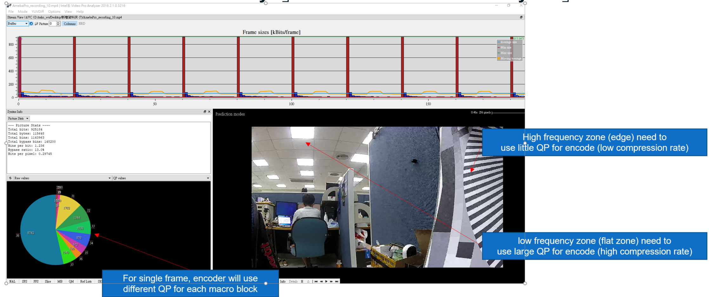
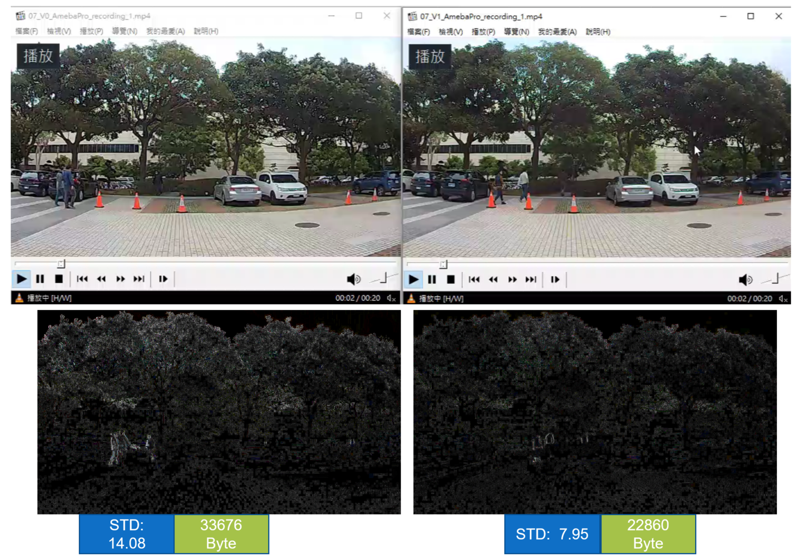

Introduction for Encoder Configuration
======================================

**How to analyze Video Encoder information**
--------------------------------------------

- **Use 「Elecard StreamEye」 or 「 Intel Video Pro Analyzer 」**

|image1|

**Encoder parameter – (1)**
---------------------------

- **Target BPS**

  - [User define] rate control algorithm will use GOP as unit to
    calculate target QP

- **Target QP**

  - Auto calculate by rate control algorithm

- **Fps & GOP**

  - [User define] decide how many frame per second (FPS) and group of
    picture (GOP)

- **QP range**

  - [User define] decide range for max QP and min QP in single frame
    (same for I/P frame)

  - Default setting: 20

- **Max QP & Min QP**

  - [User define] decide range of max QP and min QP in single frame (I/P
    frame could use different range)

- **QP offset of I frame**

  - [User define] Target QP of I frame could be adjusted by offset with
    previous P frame

**Encoder parameter – (2)**
---------------------------

- **How to decide QP in each frame**

  - First I frame

    - Rate control algorithm would use conservative method to predict
      target QP

    - To prevent size of first I frame to exceed whole size of GOP

    - Target QP (supposed 34) with QP range parameter (supposed 20) will
      decide QP range [24, 44]

    - Real QP range will be clamped by user definition (supposed 20,
      42), so real QP range is [24, 42]

  - P frame

    - Rate control algorithm would base on target QP in previous frame

    - How to calculate target QP

      - Frame size is decided by BPS (1M) / GOP (20) / FPS (20)

      - If first I Frame size = 600KB, size for each P frame is (1M –
        600KB) / (20-1)

    - Rate control would use remaining size to calculate Target QP

    - Target QP (supposed 34) with QP range (supposed 20) will decide QP
      range [24, 44]

    - Real QP range will be clamped by user definition (supposed 20,
      42), so real QP range is [24, 42]

    - If there is no remaining size, rate control will use max QP to
      encoder remaining frame

  - I frame

    - Could use user define offset for target QP (default -5)

    - We want to contain more detail in key frame

**Encoder parameter – (3)**
---------------------------

- **Encode method**

  - CBR ( BPS first)

    - No limitation for Max QP & Min QP

    - In general case, auto rate control won’t use max QP as target QP

    - In most complicated case, auto rate control would be max QP as
      target QP

      - It may have chance that encoder already use max QP to compress
        but real BPS is larger than target BPS

  - VBR ( Quality first)

    - With limitation for Min QP & Max QP

    - In general case, auto rate control may not use max QP as target QP

    - In most complicated case, auto rate control would be max QP as
      target QP

      - Due to limited QP, so real BPS would be far larger than target

**Encoder parameter – (4)**
---------------------------

- **In current configuration, how could we improve larger BPS issue**

  - Add dynamic adjustment with statistic function for specific time
    interval (supposed 2 second)

    - If size of time interval is larger than upper bound

      - [adjust Max QP] Target size = current size / 2 ^ (offset / 6)

      - [adjust FPS & GOP]

        - Suppose original FPS & GOP is 20, could adjust with following
          stage [20, 16, 12]

        - Need to sync with I/P frame ratio to predict BPS improvement
          after adjustment

  - Reduce edge enhancement through IQ configuration

    - In most complicated scene, it would reduce 30% of frame size

    - Update current IQ setting (Table 0) / Add new IQ setting (Table 2)

      - Only change setting in specific condition (outdoor scene)

      - Reference index in ISP: Exposure time \* gain (ET Gain)

        - Outdoor scene: Exposure time < flicker time (50hz: 10ms /
          60hz: 8.3ms)

  - Provide edge statistic function to detect whether it is high
    frequency scene

**Ref result (IQ)**
-------------------

|image2|

