Calibration flow for Fcs mode
=============================

**Fast camera start (Fcs)**
---------------------------

- **Amebapro2 support specific flow to get first frame as soon as
  possible**

  - Concept:

    - Use ALS (Ambient light sensor) to get roughly initial value

    - Pro2 bring up sensor & isp asap with quick convergence flow

  - Time to first frame (T2FF) is generally less than 200ms

  - Time to available first frame (T2AFF) is generally less than 300ms

  - Both of SW & HW should be specific designed for FCS flow

    - HW Architecture for FCS mode (P4)

    - SW Architecture for Fcs mode (P5)

**HW Architecture for FCS mode**
--------------------------------

|image1|

Wake up from PIR flow

1) PIR trigger MCU (wake up from GPIO)

2) MCU enable ALS (start for ALS convergence)

3) MCU trigger AmebaPro2 (wake up from GPIO)

4) Pro2 bring up sensor at rom code stage

5) Pro2 communicate with MCU to get ALS information at bootloader stage

6) Pro2 use lookup table (LUT) to get initial value (Exposure time &
   gain)

7) Pro2 enable Fcs flow at bootloader stage

8) Pro2 enter application code (main code stage) and get video or
   snapshot

**SW Architecture for FCS mode**
--------------------------------

- **SW related function for FCS flow**

  - Fcs sensor driver (used at rom code stage)

  - IQ configuration (used at bootloader stage & main code stage)

    - Customer could check SDK for FCS AVL (sensor.h)

  - Lookup table (used at bootloader stage)

    - video_user_boot.c

    - Need to calibrate for ALS & ISP information (AE & AWB)

      - Pre-define for look-up table (LUT)

    - Sample code

      - #define USE_FCS_LOOKUPTABLE_SAMPLE

      - Get ALS_value through SPI / UART with MCU

|image2|

|image3|

**Calibration flow (Auto Exposure) – (1)**
------------------------------------------

|image4|

|image5|

**Calibration flow (Auto Exposure) – (2)**
------------------------------------------

- **Test flow**

  1. Set environment

  2. Adjust strength of luminance source

     1. 1\ :sup:`st` step adjust luminance strength to Max level

     2. Next step could be 1/2 ~ 2/3 of previous step

  3. Check ALS & ISP information for LUT

     1. Customer should implement ALS and read function

     2. Check P11 for ISP command (AE)

  4. Repeat 2 & 3 until finish LUT

|image6|

**Calibration flow (Auto White balance) – (1)**
-----------------------------------------------

|image7|

|image8|

**Calibration flow (Auto White balance) – (2)**
-----------------------------------------------

- **Test flow**

  1. Set environment

  2. Adjust color temperature to D65 & check ISP information for LUT

  3. Adjust color temperature to D50 & check ISP information for LUT

  4. Adjust color temperature to TL84 / CWF & check ISP information for
     LUT

  5. Check P12 for ISP command (AWB)

|image9|

**Calibration result**

|image10|

**ISP command (AE)**
--------------------

- **How to enable ISP AT-Command**

  - Default ISP command is enabled in SDK configuration

  - Check platform_opts.h for define flag

|image11|

- **Set Power frequency (50hz / 60hz)**

  - Ref: isp_get_power_line_freq

  - ATIC=1,0x18,value (value = 0 (off), 1 (50hz), 2 (60hz), 3 (Auto –
    default)

- **Get Exposure time (AE)**

  - Ref: isp_get_exposure_time

  - ATIC =0, 0x11

- **Get Exposure gain (AE)**

  - Ref: isp_get_ae_gain

  - ATIC=0,0x13

|image12|

- **Get Color temperature (AWB)**

  - Ref: isp_get_wb_temperature

  - ATIC=0,0x1A

- **Get White balance R-Gain (AWB)**

  - Ref: isp_get_red_balance

  - ATIC=0,0x0E

- **Get White balance B-Gain (AWB)**

  - Ref: isp_get_blue_balance

  - ATIC=0,0x0F

|image13|

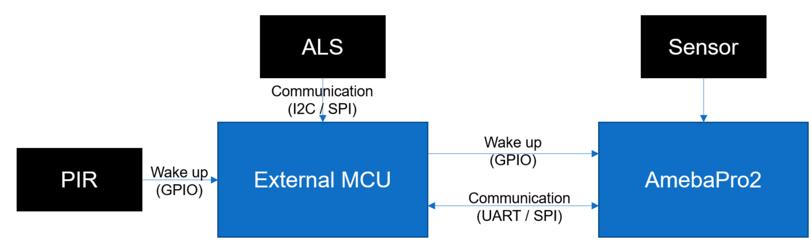
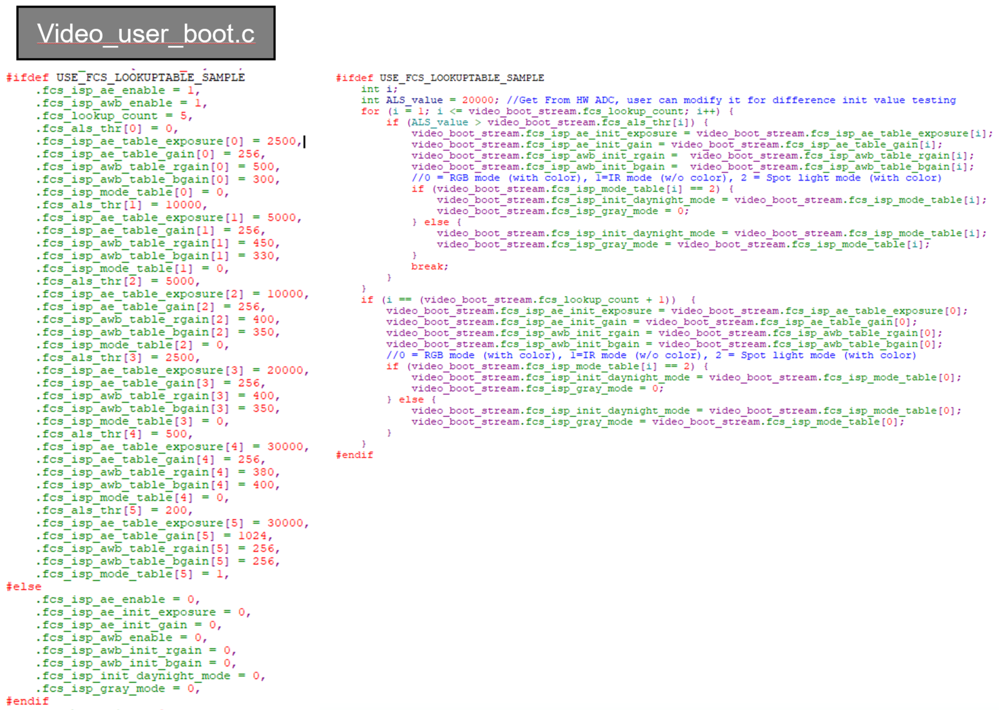
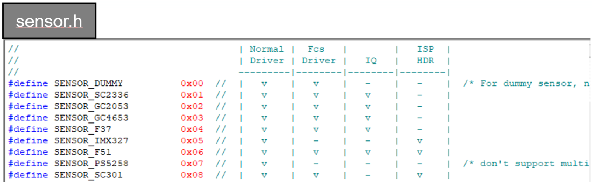
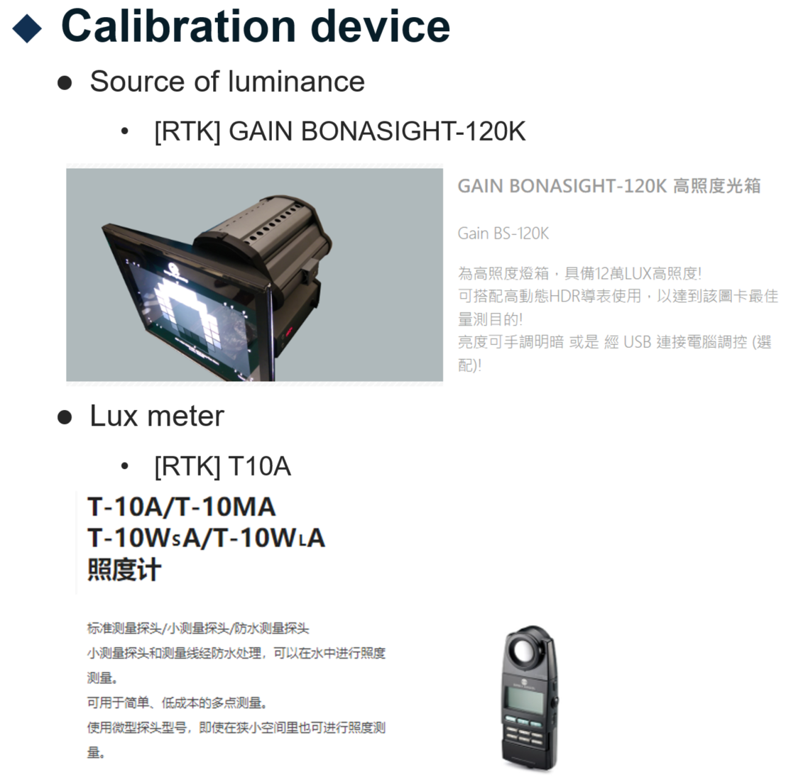
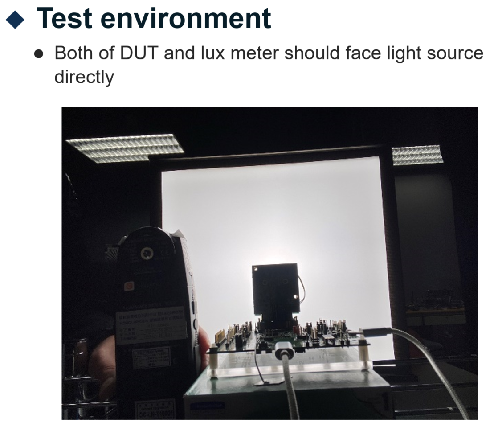
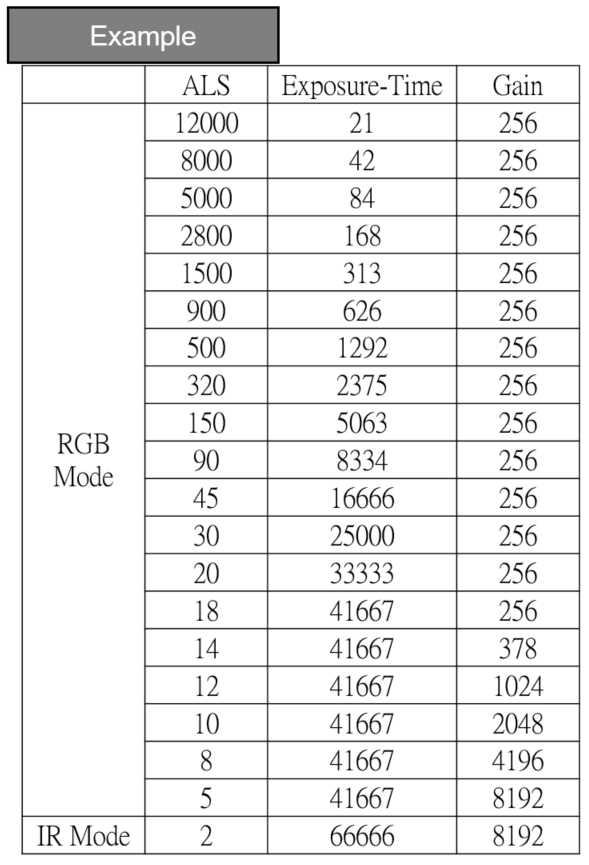
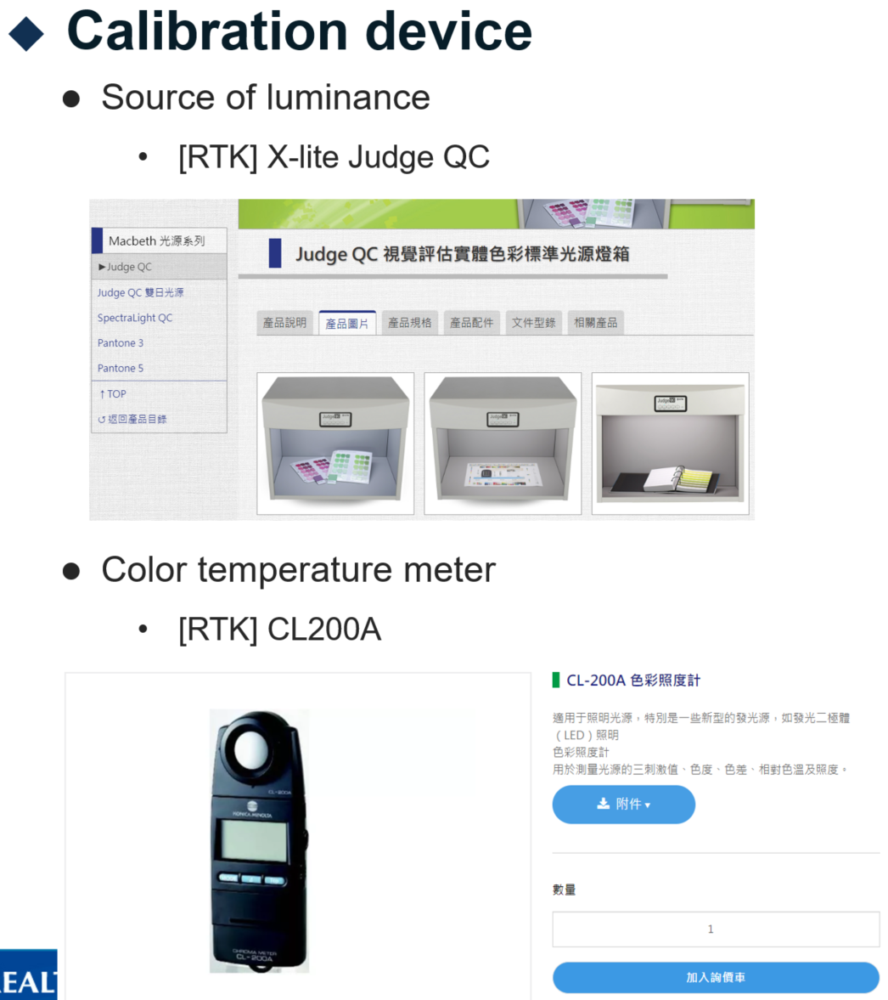
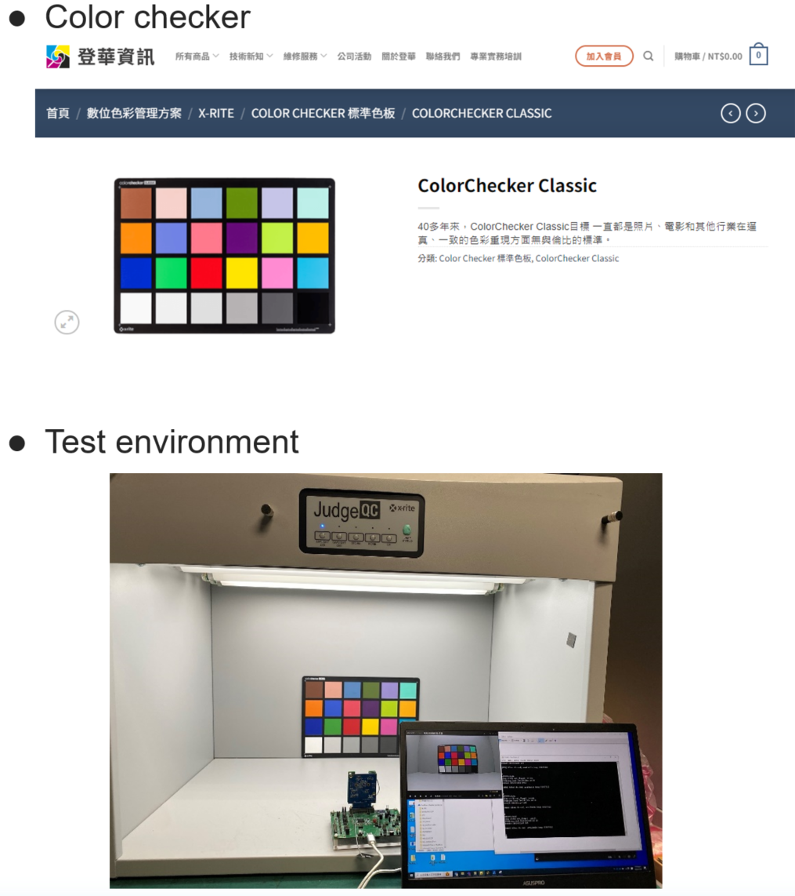
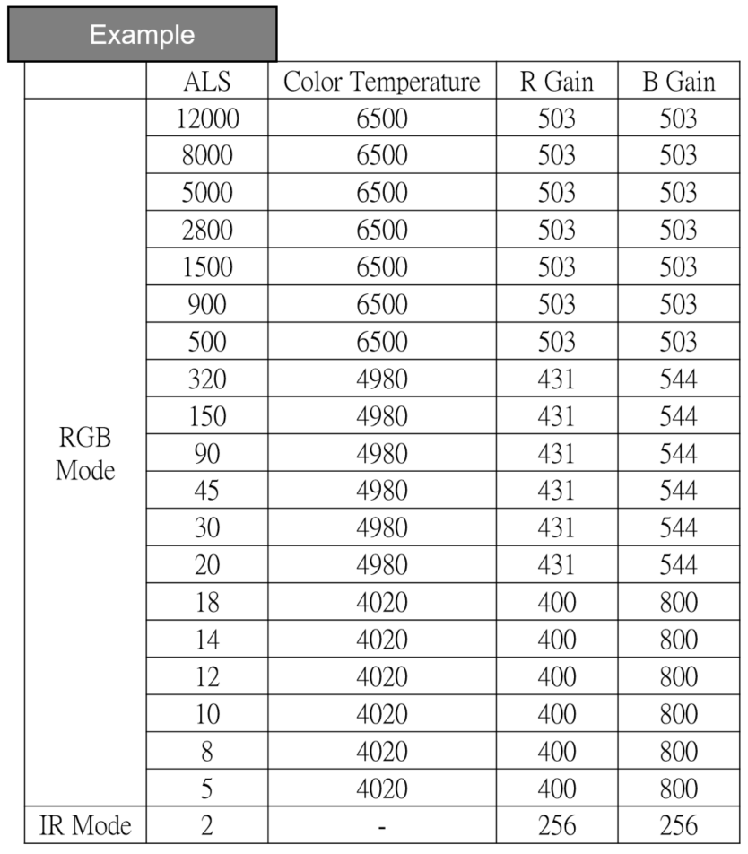
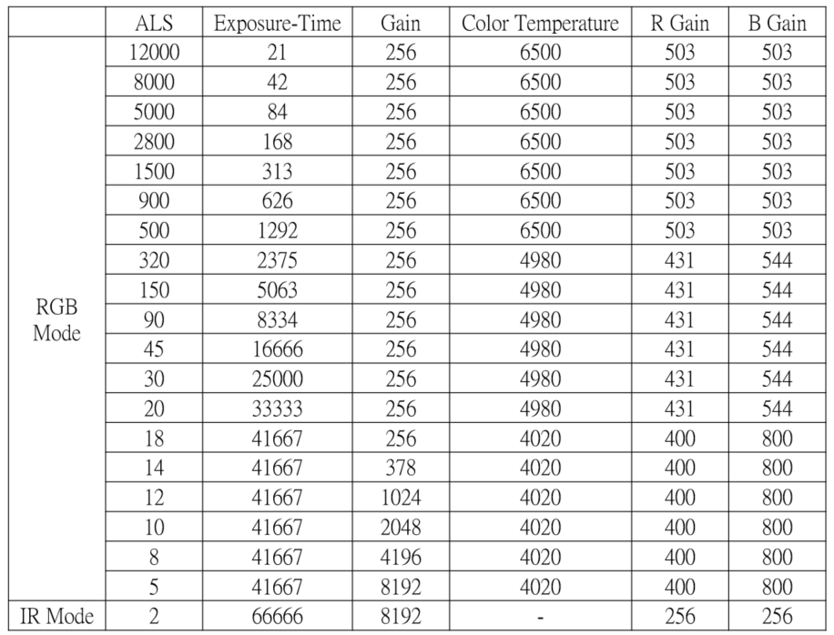
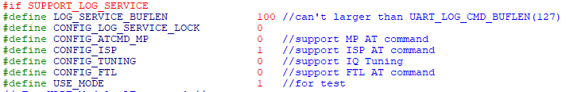
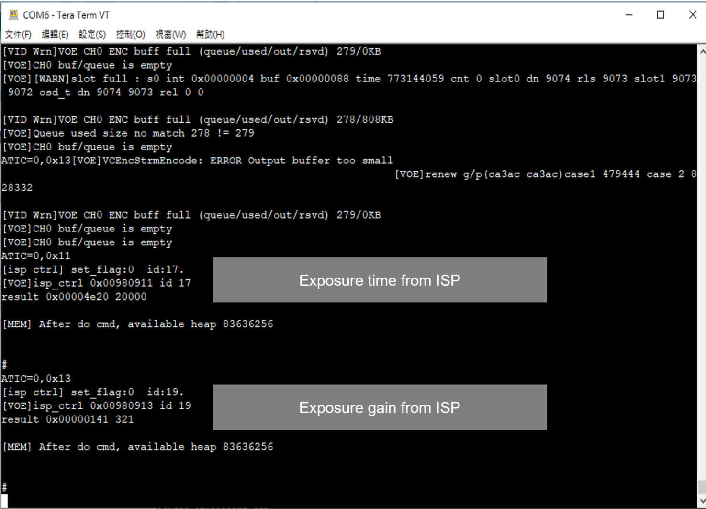
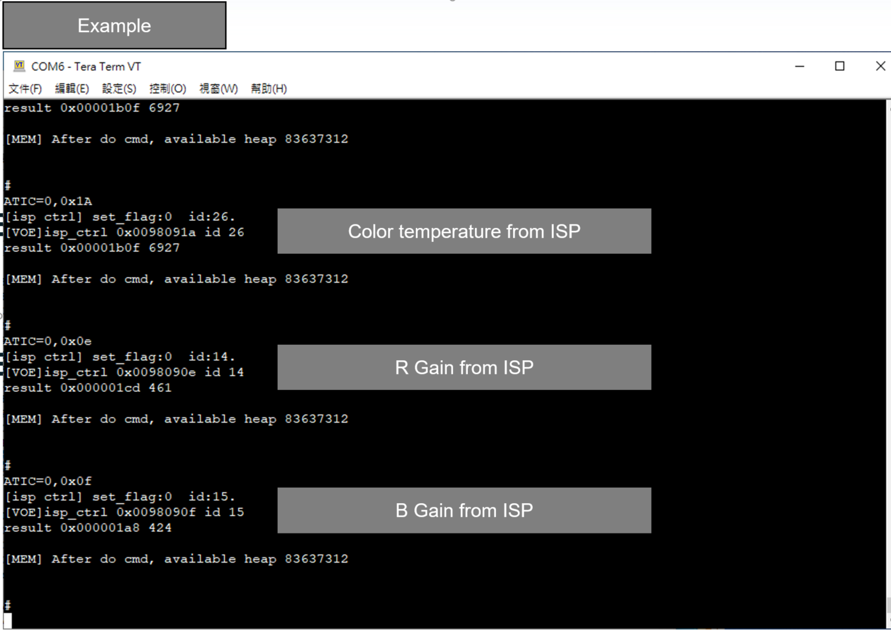
