[AmebaPro2] Introduction for Switch flow(Day / Night mode)
==========================================================

EVK of AmebaPro2
----------------

\*ALS = abbreviation for「ambient light sensor」, used to detect
environment brightness

\*IR-LED = un-visible light, compensate for low light condition

\*IR-CUT = control cover glass (remove IR light or not)

|image1|

- Pin define for IR control

  - IR-CUT: single GPIO

  - IR-LED: PWM

|image2|

- Initialization for IR control

  - Pin assignment

    - Ref to 「ir_cut.h」 and 「ir_ctrl.h」

  - Initialization and enable function

    - Ref to 「ir_cut.c」 and 「ir_cut.c」

- How to enable IR control

- Ref to 「Platform_opts.h」

|image3|

Ref to 「Video_example_media_framework.c」

|image4|

- Pin define for HW-ALS control

  - Through sensor board interface

  - HW-ALS: i2c type

|image5|

|image6|

- Initialization for HW-ALS control

  - Pin assignment

    - Ref to 「Ambient_light_sensor.h」

  - Initialization and enable function

    - Ref to 「Ambient_light_sensor.c」

- How to enable HW-ALS control

- Ref to 「Atcmd_isp.c」

..

   |image7|

   |image8|

- Command: ATIR=init

- Should notice that not to initialize IR control twice

General flow of day/night mode switch
-------------------------------------

- Switch to 「Day Mode」

  - Disable IR LED

  - Keep IR Filter

  - Set ISP to Day Mode Parameter

  - Set ISP to Color Mode

|image9|

- Switch to 「Night Mode」

  - Set ISP to Gray Mode

  - Remove IR Filter

  - Enable IR LED

  - Set ISP to IR Mode Parameter

|image10|

- Refer to 「mmf2_video_example_v1_day_night_change_init.c」

  - This example shows how to set 「IR control」 / 「 ISP 」 / 「 Motion
    detection 」 configuration during mode switch

  - Switch between both mode without reference to ALS value

General flow of day/night mode switch

**Criteria for changing mode**

- Criteria to switch between 「Day mode」 and 「Night mode」

  - Refer to Ambient light sensor data

  - HW

    - Through i2c / spi to communicate with sensor

      - RTK EVK use I2C type HW-ALS

    - Detect for luminance strength

      - Same trends to environment luminance

  - SW

    - Through ISP information

    - Detection for luminance strength, compensate for it

      - Opposite from trends to environment luminance

+-----------------------+-----------------------+-----------------------+
|                       | **Bright scene**      | **Dark scene**        |
+=======================+=======================+=======================+
| HW ALS value          | ↑                     | ↓                     |
+-----------------------+-----------------------+-----------------------+
| SW ALS value          | ↓                     | ↑                     |
+-----------------------+-----------------------+-----------------------+

|image11|

How to use 「HW-ALS 」to active mode change flow
------------------------------------------------

**How to active 「HW-ALS」**

- Use video example to apply streaming

  - Ex: mmf2_video_example_v1_init()

- Reference code

  - Atcmd_isp.c

    - ATIR=service

|image12|

- Should initialize IR control before apply sensor_service

- Reference code

..

   sensor_service.c

   Select ALS_Type

   |image13|

   HW-ALS setting

   threshold for mode switch

   |image14|

   Reference control flow

   「sensor_thread」

How to use 「SW-ALS 」to active mode change flow
------------------------------------------------

**How to active 「SW-ALS」**

- Use video example to apply streaming

  - Ex: mmf2_video_example_v1_init()

- Reference code

  - Atcmd_isp.c

    - ATIR=service

..

   |image15|

- Should initialize IR control before apply sensor_service

- Reference code

..

   sensor_service.c

   Select ALS_Type

|image16|

SW-ALS setting

|image17|

Reference control flow

「sensor_thread」

How to Get SW-ALS Value
-----------------------

- Based on ISP AE Statistic Information

  - Exposure Time

    - isp_get_exposure_time()

  - Gain

    - isp_get_ae_gain()

  - These information both are based on IQ configuration such as AE
    metering, AE target and stable flow

  - For Example

  - 10ms Exposure time with 5xGain (Bright condition)

    - ALS Value = 100 \* 5 = 500

  - 60ms Exposure time with 33.75xGain (Dark condition)

    - ALS Value = 600 \* 33.75 = 20250

  - Refer to ISP_Get_ETGAIN()

**How to active SW-ALS in amebaPro2**

- Debug command

  - ATIR=getlight

    - Get sw-lux value

  - ATIR=als_ver

    - Get SW-ALS algorithm version

  - ATIR=dbg_als,level (level = 0 ~ 3)

    - Enable debug log in als algorithm

  - ATIR=dbg_ss,level (level = 0 ~ 1)

    - Enable debug log in sensor service thread

      - 1: print ALS value & stable information

Introduction for SW-ALS parameter
---------------------------------

- ALS THR from RGB Mode to IR Mode

  - Thr_Color_to_Gray

- ALS THR from IR Mode to RGB Mode

  - Thr_Gray_to_Color

- Color ratio to check whether visible light is enough

  - Thr_Color_Ratio

    - This value will be lower when visible light is enough

    - Full IR LED: more close to 256

    - Strong visible light: lower than 192

  - Mask with Thr_Valid_Block

    - Adjust for detection ROI and valid block

|image18|

|image19|

- Default parameter (For Circle ring IR LED replacement)

  - Center counting with maximum detection block = 13

  - Valid Block = 6

|image20|

|image21|

For IR LED is replaced in bottom of the DUT

Detection in top of frame with maximum block = 12

Valid Block = 6

|image22|

|image23|

SW_ALS Tuning
--------------

- Test Condition

  - Target: 18% gray wall

  - Distance: 3m

  - Measurement: 3m from camera module

  - Set Environment Luminance to Dark Level (EX: 3 lux)

  - @Day Mode

  - THR_COLOR_TO_GRAY

- Set Environment Luminance to Bright Level (Ex: 8 lux)

  - @IR Mode

  - THR_GRAY_TO_COLOR

|image24|

- Use ALS debug mode

  - ATIR=dbg_als,2

  - In most case default value would be available

  - Case 1: No visible light with IR LED

  - Case 2: few visible light with IR LED

    - check some ref value is lower than Thr_Color_Ratio

  - Case 3: Enough visible light with IR LED

    - Fit switch criteria and change mode to RGB

|image25|

+------------+-------------+---------+---------------------------------------+
| **Date**   | **Version** | **A     | **Release note**                      |
|            |             | uthor** |                                       |
+============+=============+=========+=======================================+
| 2023.04.14 | 1.0         | Zako Wu | Draft version for customer release    |
|            |             |         |                                       |
+------------+-------------+---------+---------------------------------------+
| 2023.06.27 | 2.0         | Zako Wu | Update ALS algorithm for version 2.0  |
|            |             |         |                                       |
+------------+-------------+---------+---------------------------------------+
| 2024.10.30 | 2.1         | Zako    | Add flow to active sw-als             |
|            |             |         |                                       |
+------------+-------------+---------+---------------------------------------+
|            |             |         |                                       |
+------------+-------------+---------+---------------------------------------+

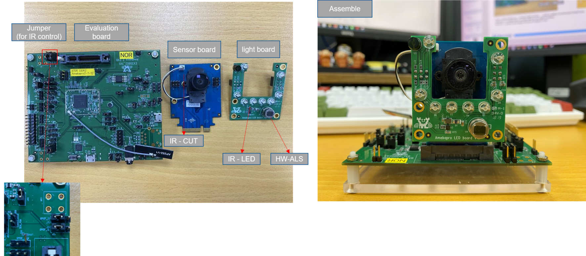
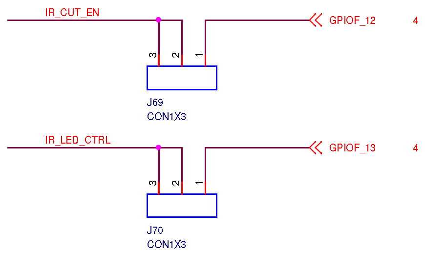
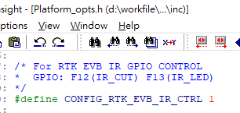
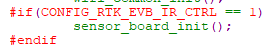
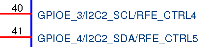
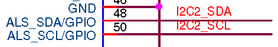
.. |image7| image:: ../../_static/user_manual/33_IQ_Advance_SW_ALS_FlowIntroduction/image7.png
   :width: 1.96875in
   :height: 0.34375in
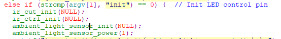
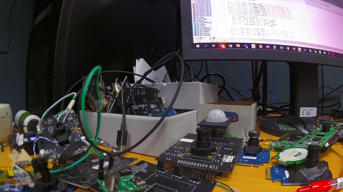
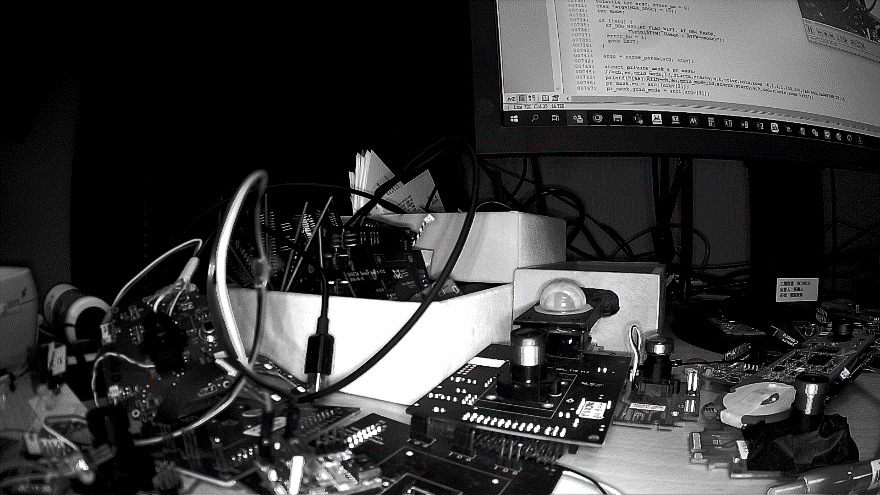
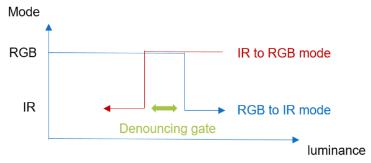
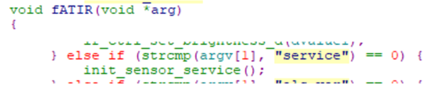
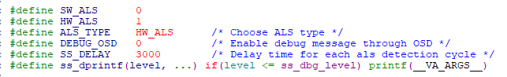
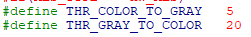
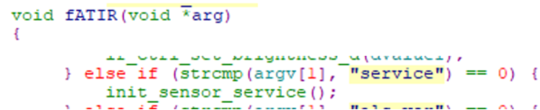
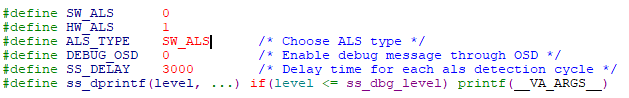
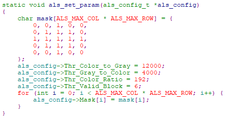
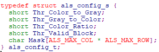
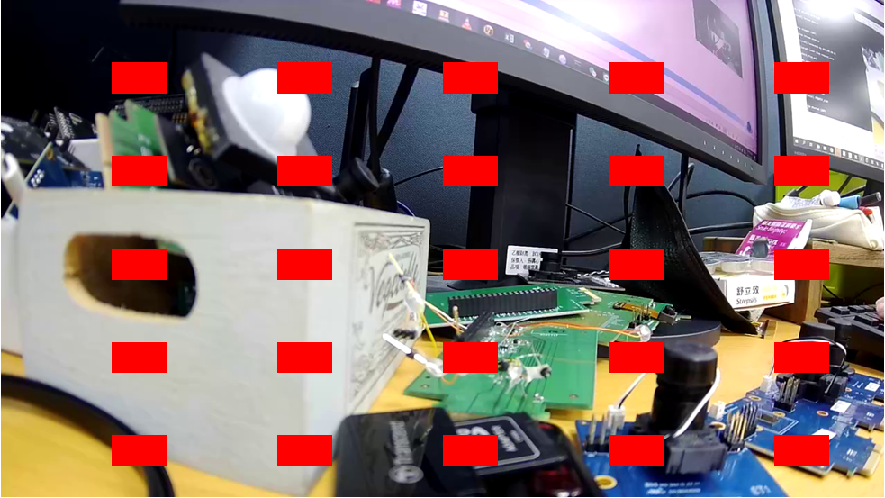
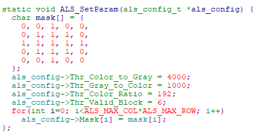

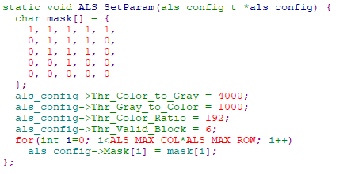
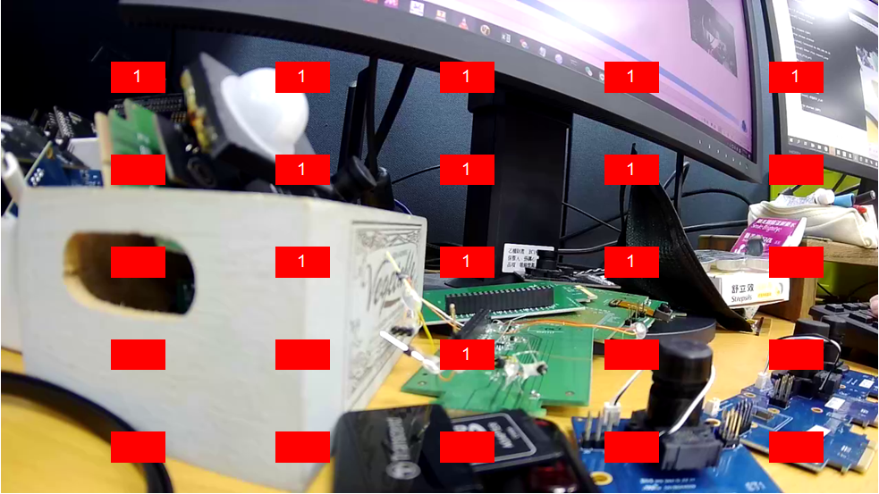
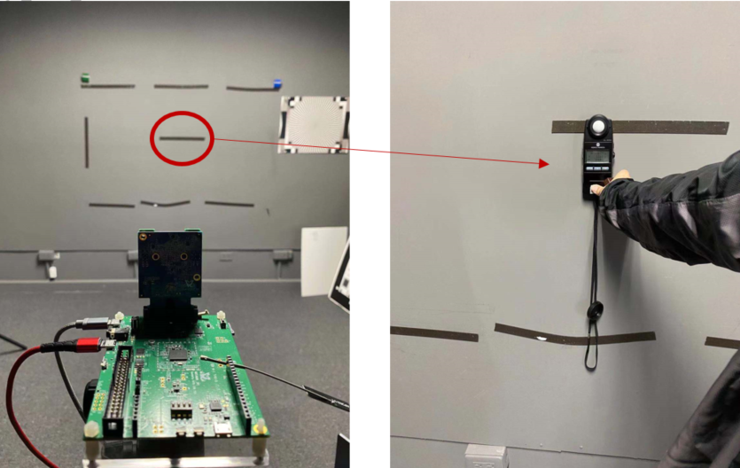
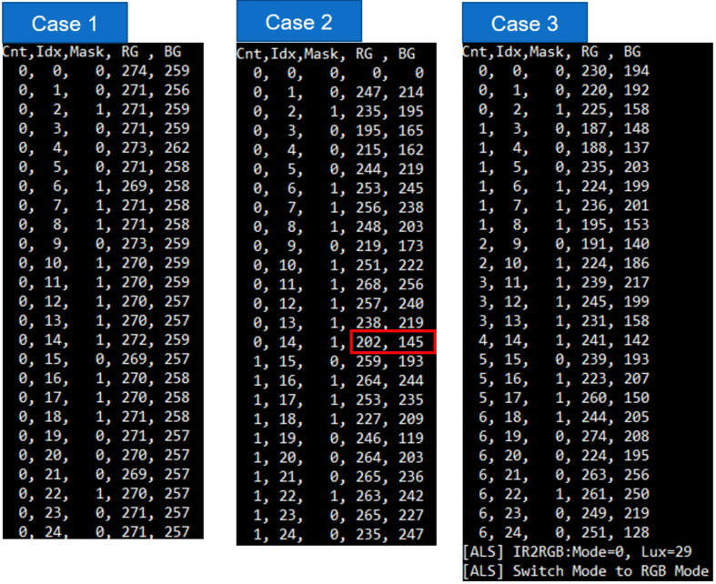
