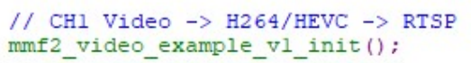
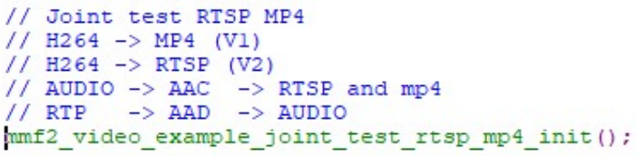
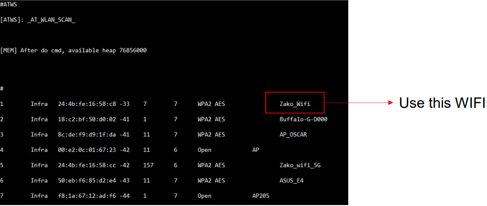
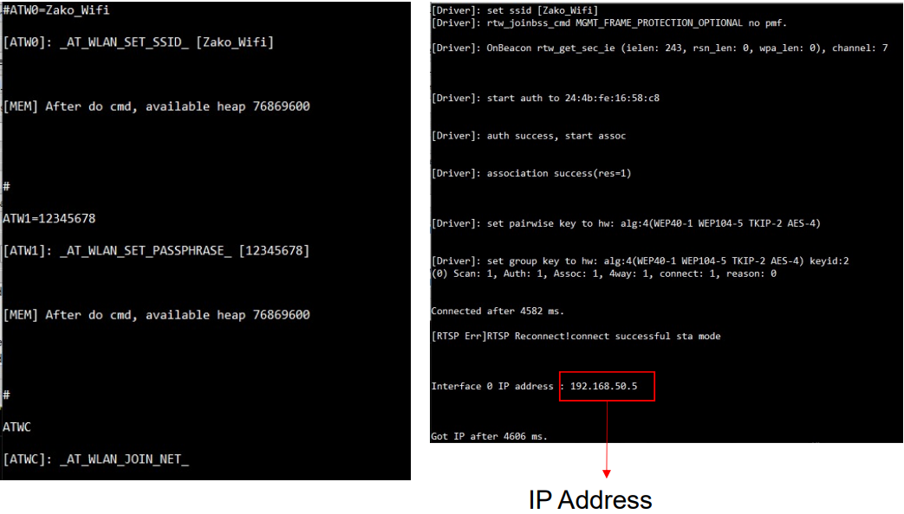
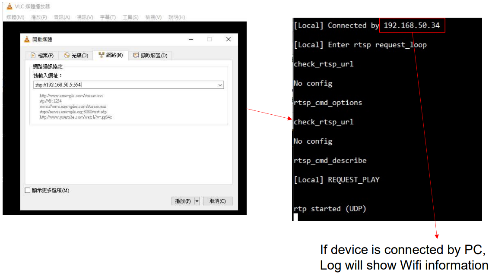
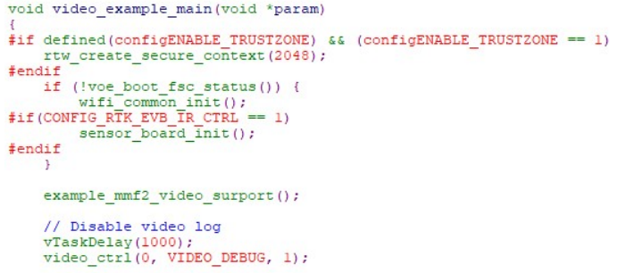
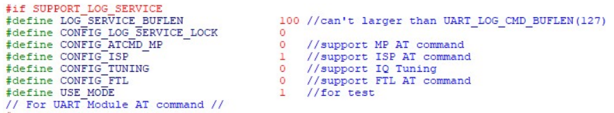
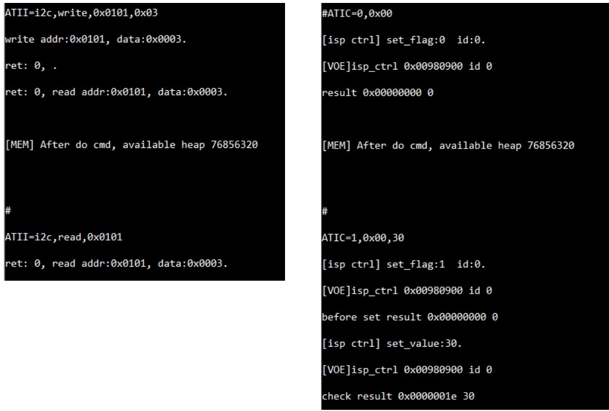
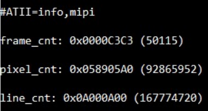

Introduction for Quick guide with ISP debug information
=======================================================

How to Build Wifi / SD Card Example Code
----------------------------------------

- Command

	- cmake .. -G"Unix Makefiles"-DCMAKE_TOOLCHAIN_FILE=../toolchain_ci.cmake -DVIDEO_EXAMPLE=ON

	- cmake --build . --target flash -j 4

- Entry point

	- Refer to project\\realtek_amebapro2_v0_example\\src\\mmfv2_video_example\\video_example_media_framework.c

	- example_mmf2_video_surport()

- Video example selection

	- Through Wifi

|image1|

	- Through Wifi & SD card recording

|image2|

	- Can choose only one of video example

Connect to Device through Wifi
------------------------------

- Connect by PC

	- Desktop: should use Ethernet connected to same AP router

	- Laptop: should use Wifi connected to same AP router

- ATWS (WIFI scan)

|image3|

- Set Wifi SSID

	- ATW0=Zako_Wifi

- Set Wifi Password

	- ATW1=12345678

- Connection

	- ATWC

- Dis-connection

	- ATWD

..

   |image4|

- Through VLC Player

|image5|

Debug information
-----------------

- Enable VOE log

|image6|

- Enable AT command

	- Refer to project\\realtek_amebapro2_v0_example\\inc\\ platform_opts.h

..

   |image7|

	- Enable CONFIG_ISP

- Command

	- Refer to component\\at_cmd\\atcmd_isp.c

- I2C

..

   • ATII=i2c,read,addr

   • ATII=i2c,write,addr,value

- ISP Control

..

   • ATIC=0,V4l2

   • ATIC=1,V4l2,value

- Memory access

..

   • ATIX=read32,addr,length

   • ATIX=writw,addr,length,value

- FPS

..

   • ATII=fps,show

   • ATII=fps,hide

|image8|

- MIPI RX information

	- ATII=info,mipi

..

   |image9|
   
+------------+-------------+---------+---------------------------------------+
| **Date**   | **Version** | **A     | **Release note**                      |
|            |             | uthor** |                                       |
+============+=============+=========+=======================================+
| 2024.09.02 | 1.0         | Zako Wu | Draft version for customer release    |
|            |             |         |                                       |
+------------+-------------+---------+---------------------------------------+

