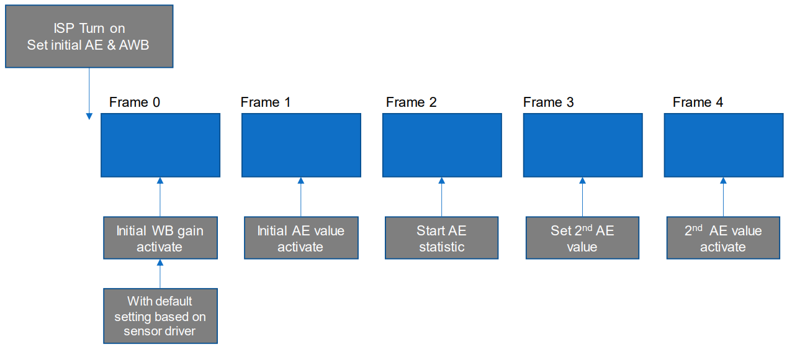
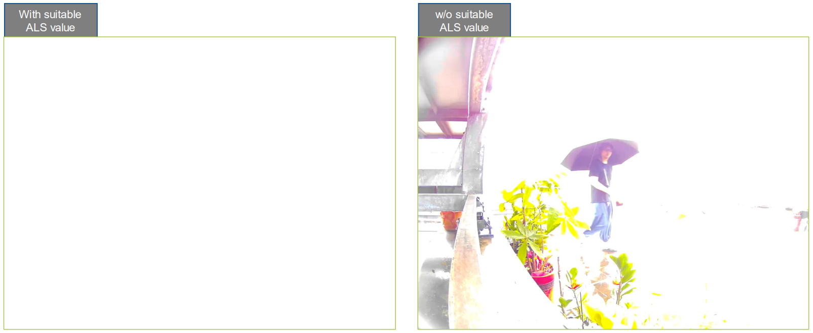
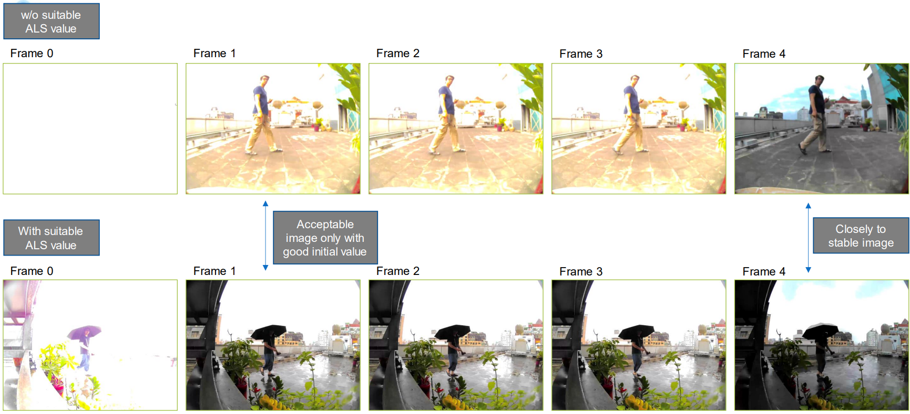

AmebaPro2_FastCameraStart_AE_AWB_Flow
=====================================

◼ Fast camera start (FCS) flow
------------------------------

Basic concept for AmebaPro2 Fcs flow
^^^^^^^^^^^^^^^^^^^^^^^^^^^^^^^^^^^^

• Bring Up Sensor at rom code (before ISP turn on) to reduce bring up time

• Reference initial value is based on Ambient light sensor

	• Which can provide approximate luminance to real scene

	• Need to guess color temperature

	• FOV of ambient light sensor would be not same as lens with cmos sensor

• Use fast auto exposure (AE) and fast auto white balance (AWB) method to improve convergence time

	• Use one step method for each convergence until reaching target

	• Both for AE & AWB

ISP mechanism limitation
^^^^^^^^^^^^^^^^^^^^^^^^

• Take a one-step approach to reach AE & AWB target

• Without adopt advanced statistic flow

   • Such as dynamic ae adjustment by histogram, preference for WB gain,auto WDR level adjustment…

   • Even with suitable initial value, it would also see some image quality adjustment

   • But with good image quality also

|image1|

◼ Real scene comparison
-----------------------

|image2|

|image3|

◼ Suggestion method
-------------------

◼ Refer to ALS value to set initial AE & AWB value

   • It is suggested that use frame 1 as first frame (drop 1 frame)

   ◼ Due to FOV of ALS isn’t perfect same as lens FOV

   • If lens fov is too larger than ALS, it is suggested that use frame 4 as first frame (drop 4 frame)

   • Let fast AE mechanism to do at least 1 convergence

