[AmebaPro2] Meta Analyzer Tool User Manual
==========================================

1. Tool Operation.
------------------

|image1|

|image2|

|image3|

|image4|

2. User Data and Script Introduction.
-------------------------------------

|image5|

|image6|

|image7|

|image8|

|image9|

|image10|

|image11|

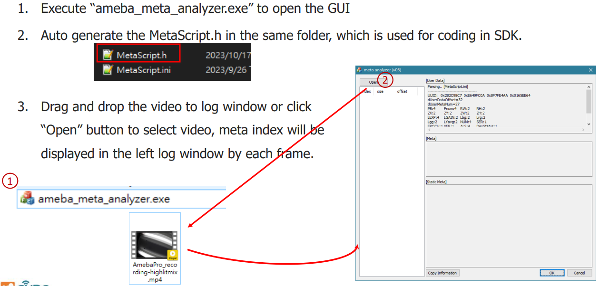
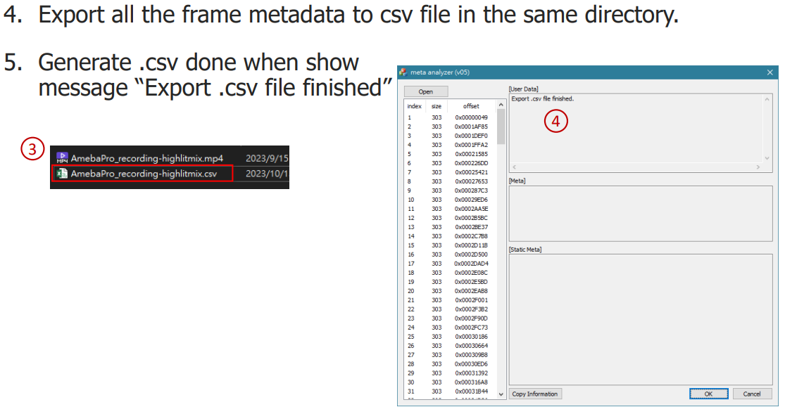
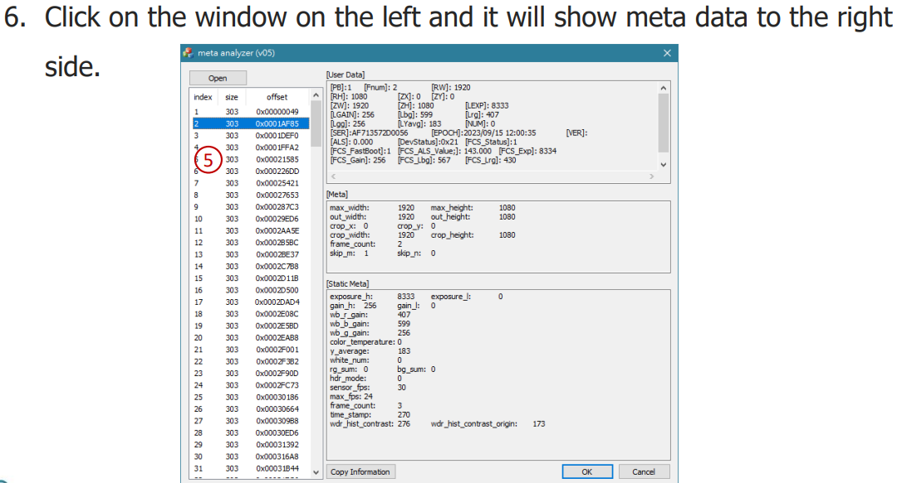
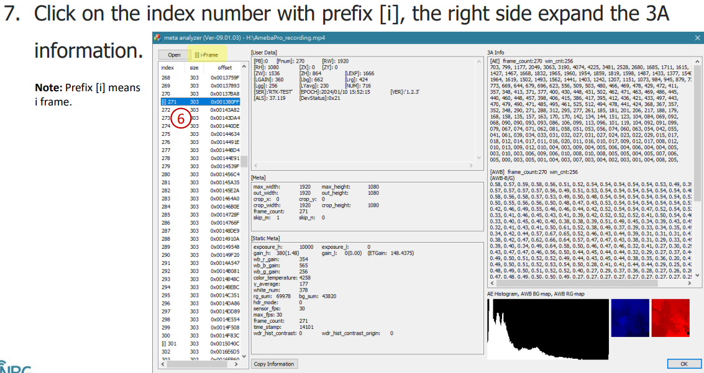
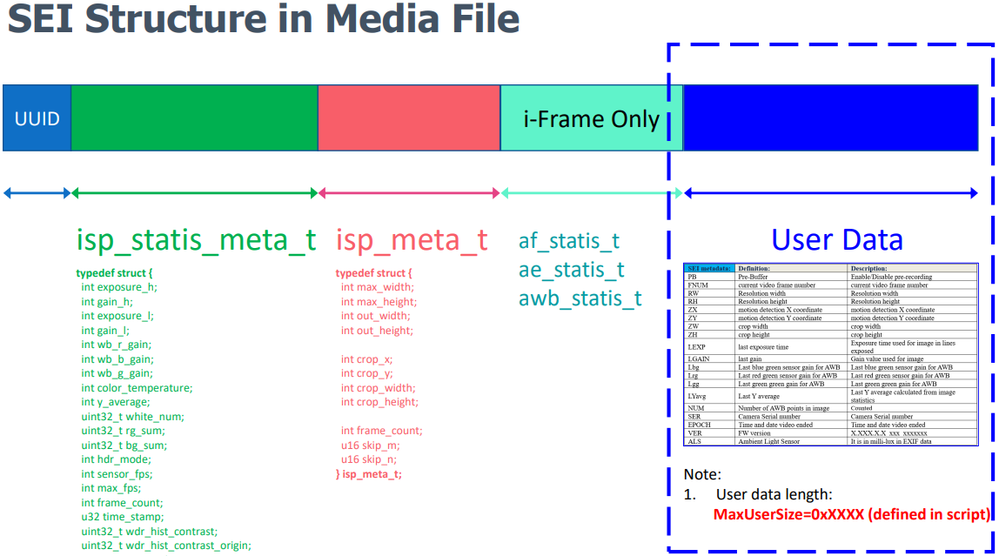
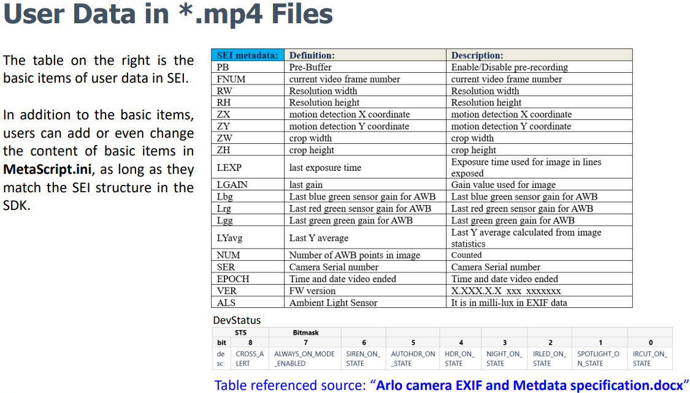
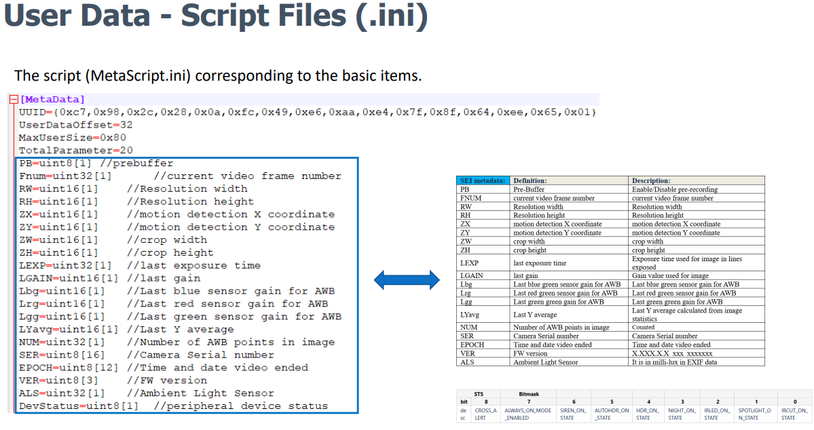
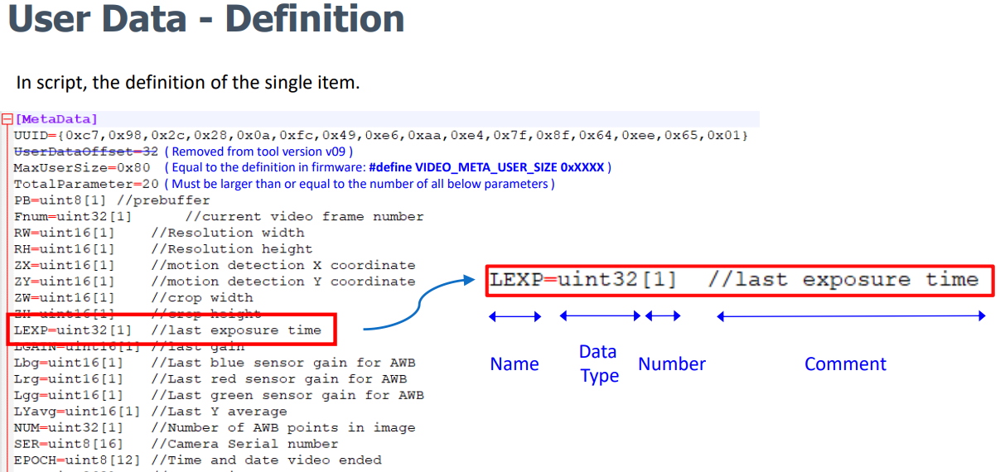
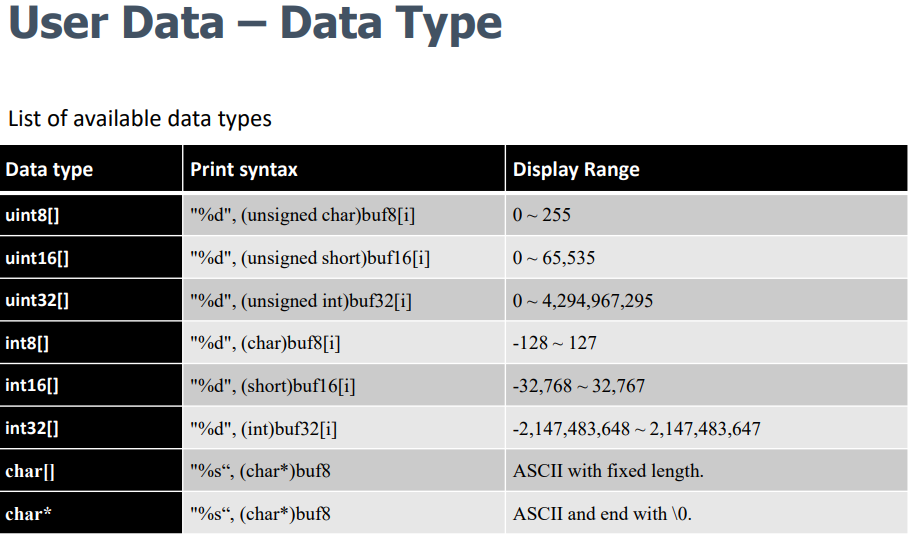
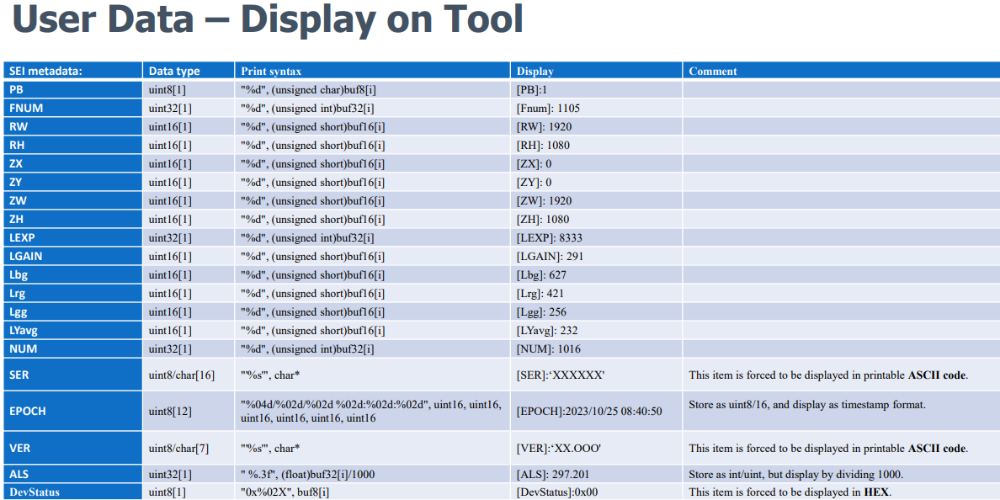
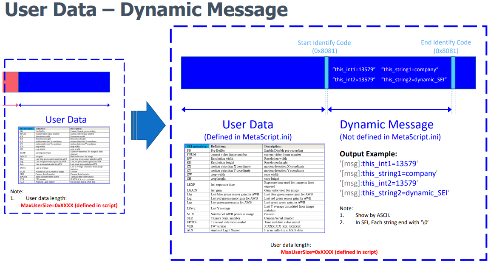
