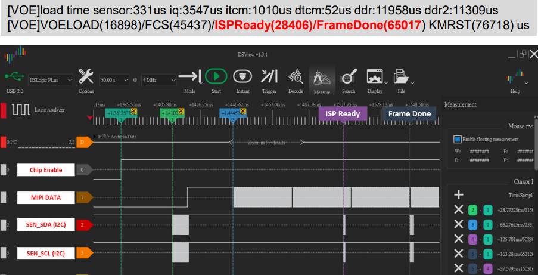
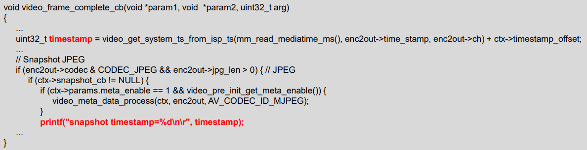
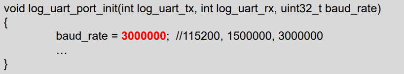
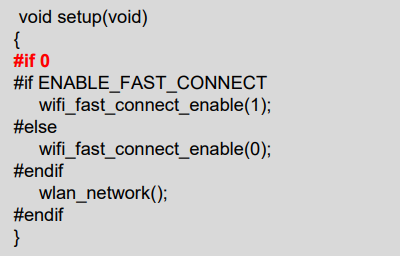
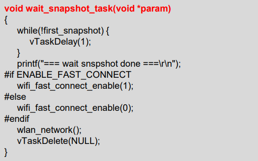
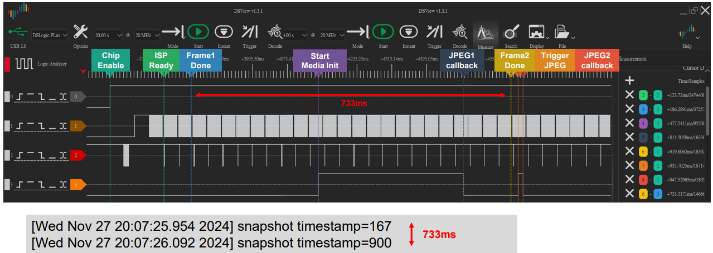
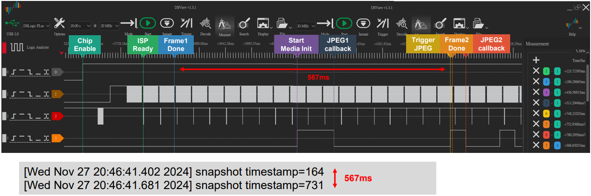
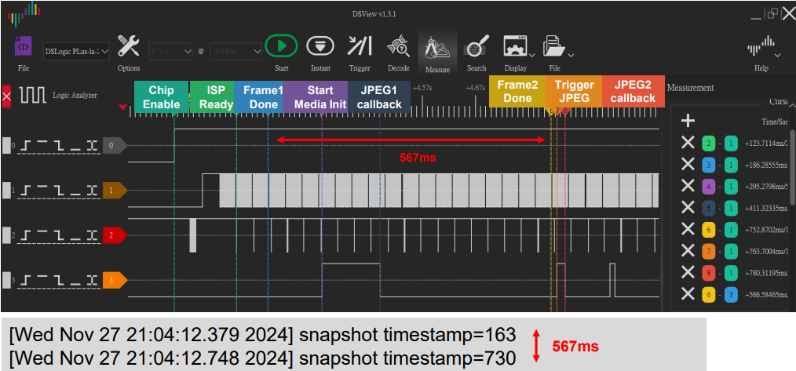

FCS Time Measure
================

FCS Time for First Frame
------------------------

 Disable the boot loader log

 At present, the default rom and bootloader will print the message, you
can close the log message by the below API, and speed up the time to
enter the main, please reference the follow API. After the below
procedure that it need to do the power reset procedure.

|image1|

 Measure time through GPIO pin

 Please use the scope to get the signal of Chip_Enable, MIPI_D0, and
I2C_SDA, and the measurement points of these are as follows.

 The first frame after the ISP ready is the first output frame of
amebapro2, so user can measure the time between the Chip_Enable and the
first frame to get the time to first frame. The result of measurement is
as bellow.

|image2|

FCS Time for first Frame: Video Timestamp

 In FCS mode, the images are stored in the VOE queue, and after
entering main code, the images are taken out from the VOE queue for use.

 Thus, the video timestamp will differ from the actual acquisition
time.

 Obtain actual video timestamp in
“component\\media\\mmfv2\\module_video.c”

|image3|

Shorten Time for first Frame
----------------------------

 The system is busy just after booting up, so the actual time to deal
with the images stored in FCS mode will be later.

 To reduce the time between FCS and media initialization, several
strategies can be employed.

1. Adjust the baud rate to speed up log printing

2. Delay the activation of the WiFi initialization after the first
snapshot is obtained.

Shorten Time for first Frame: Adjust Baud Rate

 Adjust the baud rate to speed up log printing

 Modify in “project\\realtek_amebapro2_v0_example\\src\\main.c”

|image4|

Shorten Time for first Frame: Delay WIFI activation

 Disable origin WIFI initialization in setup function

 Modify in “project\\realtek_amebapro2_v0_example\\src\\main.c”

|image5|

 Delay WIFI activation. For example, add a task to wait for the first
snapshot, then do WIFI activation.

|image6|

FCS with baud rate 11520

 First frame done to first JPEG callback takes 625 ms

 From timestamp, get first frame done to second frame done takes 733ms

|image7|

FCS with baud rate 3M

 First frame done to first JPEG callback takes 325 ms

 From timestamp, get first frame done to second frame done takes 567ms

|image8|

FCS with baud rate 3M & delay WIFI

 frame done to first JPEG callback takes 225 ms

 From timestamp, get first frame done to second frame done takes 567ms

|image9|

.. |image1| image:: ../../_static/user_manual/40_IQ_Advance_fcs_time_measure/image1.png
   :width: 5.76806in
   :height: 0.69514in

