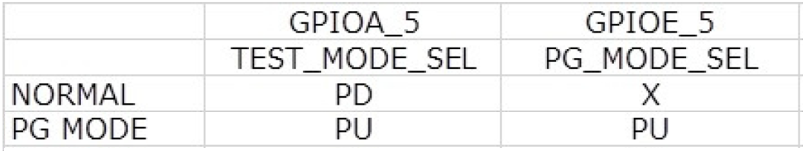
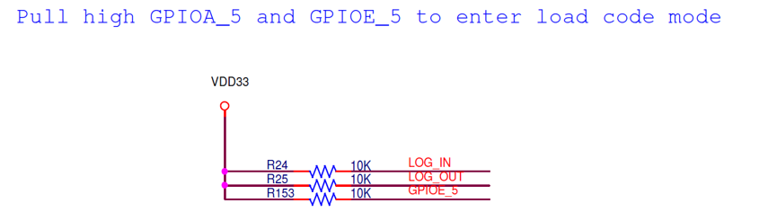
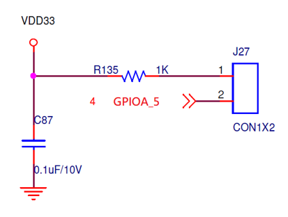

Load by UART
================

.. contents::
  :local:
  :depth: 2

Amebapro 2 allow to load code by UART port which are dedicated as GPIOF_3 and GPIOF_4. 

Below is the boot strap setting.

Suggest pull high GPIOA_5 via 1k ohms to enter load code mode

