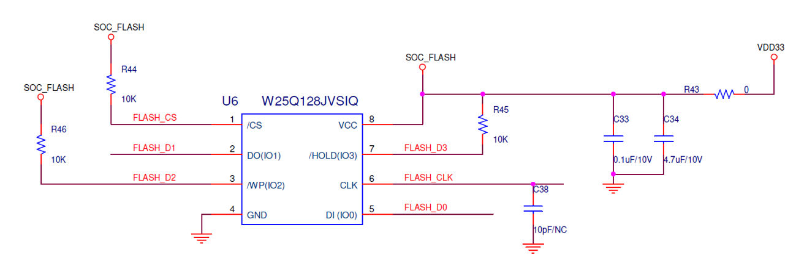

Flash
=======================

.. contents::
  :local:
  :depth: 2

For Flash application, please refer below.

Pull high WP, CS, HOLD via 10k ohms as below plot

Add 4.7uF cap near flash power as close as possible.

Reserve RC filter on FLASH CLK

